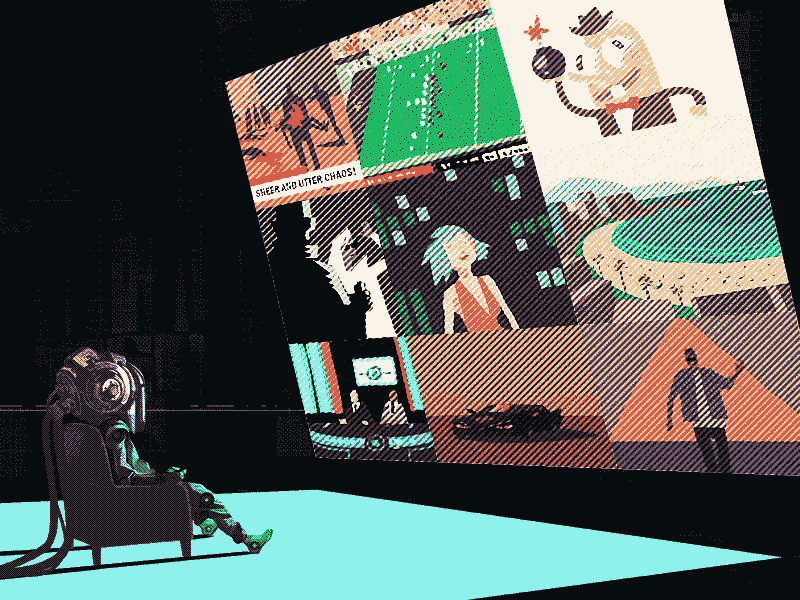

# 我厌倦了为企业家提供的商品化内容。这是我开始看的。

> 原文：<https://medium.com/hackernoon/i-got-tired-of-commoditized-content-for-entrepreneurs-heres-what-i-started-watching-instead-afe7e0cbb72d>

## 12 个优秀的企业家 YouTube 频道。没有蒂姆·费里斯，加里·维纳查克或马克·库班。保证。

# 博客署名:[Yoav Anaki](https://blog.yalabot.com/@yoavanaki)([Yoav Anaki](https://medium.com/u/57fba24c0695?source=post_page-----afe7e0cbb72d--------------------------------))

在[雅拉](https://medium.com/u/ef27c8d25b5d?source=post_page-----afe7e0cbb72d--------------------------------)工作

最初发表于[亚拉](https://medium.com/u/ef27c8d25b5d?source=post_page-----afe7e0cbb72d--------------------------------)

Illustration by [Lovely Creatures](https://dribbble.com/shots/2439052-Information-Overload)

我不是那种消费典型的企业家精神垃圾邮件的人。每当我听到蒂姆·菲利斯、加里·维纳查克或马克·库班的名字时，我都会退缩，不是因为这些人不聪明，而是因为与他们名字相关的内容已经变得如此商品化，与我完全无关。

面向企业家的内容往往被简化为重复老生常谈的口号和习惯改善技巧。不听话的企业家是一群聪明的人，他们需要聪明的洞察力。他们希望接触有趣的想法，改变他们对世界的看法，让他们因发现的感觉而眩晕。

正是这种不听话的企业家，我们想在这篇博客中与之交流。那种欣赏怪异，感觉被典型的“改变我生活的 10 个习惯”文章贬低的人。喜欢复杂胜过轻松，喜欢探索胜过舒适区。

总体而言，YouTube 是一个相当大众化的平台，偏离常规并不容易。这里有一些我真正喜欢的 YouTube 频道，我想你可能也喜欢。

# 创业公司

## y 组合子

对马克·扎克伯格等人的采访，世界顶级创业顾问的办公时间和创业会议的视频——这是一个由 Y Combinator 广泛网络支持的 YouTube 频道。

Y Combinator
我们每年两次向大量初创公司(最近有 105 家)投入少量资金(12 万美元)。创业公司 move…www.youtube.com

## 如何开始创业

顶级初创公司创始人就如何创业提出的直截了当、切实可行的现实建议，就像一门在线课程。

[如何创业
如何创业上传视频 2 年 agowww.youtube.com](https://www.youtube.com/channel/UCxIJaCMEptJjxmmQgGFsnCg)

## 科斯拉投资公司

科斯拉是世界上最好的风险投资基金之一，他们的 YouTube 频道充满了对其投资组合公司的精彩采访。

## 正在进行的工作

Basecamp 的创始人兼首席执行官 Jason Fried 和 Highrise 的首席执行官 Nathan Kontny 的超级真实的每日谈话。

[工作进展
base camp(base camp . com)创始人兼首席执行官杰森·弗里德，Highrise (highrisehq.com)首席执行官内森·孔特尼，talk…www.youtube.com](https://www.youtube.com/channel/UCDvHTqzl1H6j9JKHiQZn4Cw)

如果你喜欢正在进行的工作，可以看看内森的个人博客，里面有关于建造他的创业公司[高层](https://highrisehq.com)的内容。

内森·肯特尼
大家好，我是内森·肯特尼。我分享一些奇怪的故事，以及它们是如何与科学、市场营销、心理学以及 all…www.youtube.com 科技相交叉的

# 商业

世界上一些最好的商学院都有自己的 YouTube 频道，播放面试和课程。值得一👀。

## 斯坦福商学院

## 哥伦比亚商学院

## 伯克利哈斯商学院

# 讲故事

## 书呆子

Nerdwriter 制作了深入的视频，探索电影、音乐和媒体中不同的讲故事方面和技巧。这很吸引人，而且视频制作得非常好。

Nerdwriter 是一个每周一次的视频文章系列，向 work.www.youtube.com 提出想法

## 微小物理学

这个频道用 1 分钟的手绘动画解释了复杂的物理概念。很高兴看到每个想法都可以归结为一个 1 分钟的幽默 youtube 视频。

# 设计和开发

## 流量

一个相对鲜为人知的渠道，在一个非常知名的空间:设计师谈。在 Flux 中，Ran Segall 用 vlog 格式分享了他的设计经验，非常棒。

[Flux
Flux 是设计师兼企业家 Ran Segall 的个人 vlog。在节目中我分享了我的旅程，奋斗 and…www.youtube.com](https://www.youtube.com/channel/UCN7dywl5wDxTu1RM3eJ_h9Q)

## 开发提示

对于非开发人员来说，以开发为中心的 youtube 频道并不多。DevTips 是一个罕见的发现:超级简单，但超级深入的关于编程的教程。

## TED 演讲

你可能知道 TED 演讲:聪明人分享有趣想法的视频。以下是一些与商业和企业家精神直接相关的想法。

# 博客署名:[Yoav Anaki](https://blog.yalabot.com/@yoavanaki)([Yoav Anaki](https://medium.com/u/57fba24c0695?source=post_page-----afe7e0cbb72d--------------------------------))

在[亚拉](https://medium.com/u/ef27c8d25b5d?source=post_page-----afe7e0cbb72d--------------------------------)工作

我们即将举办的一些聚会:

[**衡量你的产品设计成功—5 月 20 日—孟加拉鲁鲁**](https://goo.gl/leWujG')

[**人工智能研讨会—5 月 27 日—德里**](http://www.hellomeets.com/artificial-intelligence-workshop-codingblocks/)

[**创业招聘活动—5 月 28 日—德里**](https://goo.gl/zH3OAy)