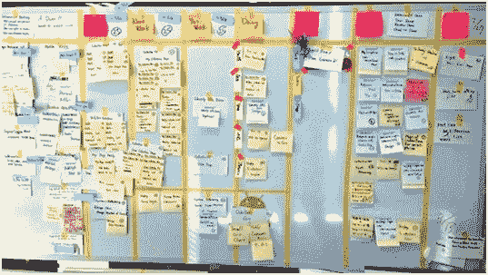

# “我讨厌看板…”

> 原文：<https://medium.com/hackernoon/i-hate-kanban-2c3abb235915>

徘徊在会议厅里，我无意中听到…

> 是啊。看板烂透了。我讨厌它！什么都没改变…

暂时忘记你可以用看板建模任何东西(它是“方式”不可知的)…

我最近被一些东西迷住了。当被赋予可视化工作和明确工作协议的途径时，许多组织会犹豫不决。为什么？为什么我们会选择*而不是*持续改进？如果给我们一个选择，为什么我们会采用最复杂和繁重的流程(并雇佣大量的项目经理)，却对可视化工作犹豫不决？

例如，通过在看板板上可视化工作，您能够可视化…

*   宠物河马项目和快速通道。旁门左道的工作要求。维护/维护已交付功能的成本
*   瓶颈。这带来了关于技能、资源、员工敬业度(或缺乏敬业度)、纪律、产出等各种问题。
*   我们需要资源的地方和我们希望雇佣资源的地方之间的区别
*   我们做的事情是为了团结，但是我们不好意思承认
*   永久过度利用以及业务和流量之间的差异
*   英雄主义，以及英雄主义的阴暗面(错误、返工、耗尽精力)
*   什么是真正的完成？更重要的是…谁拥有它？谁定义的？
*   我们不想承认或声称的依赖是不存在的。“我们只是有时依靠他们*”。*“现在已经完全自动化了，就像我们承诺的那样”
*   估计提前期/周期时间与实际提前期/周期时间之间的差值
*   完成工作实际需要什么…返工、来来回回、蜂拥而至等等。
*   多任务处理的成本与我们积极响应的愿望
*   复杂性增加的影响。没有人愿意承认他们的所作所为正在减慢整艘船的速度

这种不安是有道理的。

把镜子照回一个组织是痛苦的。它很快暴露了各种各样的人类问题。正是这些人性问题阻碍了变革。

你最终会一遍又一遍地回到同样的“问题”上。有*永远*不够的资源。总是有争夺资源的竞争。局部优化和全局优化之间总是存在矛盾。我们是人:我们承诺过多，渴望取悦他人，成为各种认知偏见的受害者。所以，在这个范围的两端，你有两种心态:

*   工作可以是低调的、证据驱动的、安全的、人道的、理智诚实的追求，或者
*   工作是一场与人性弱点的斗争……一场受控的政治列车事故，我们可以利用它来获取利润

…然后是该范围内的一系列变化。你很快就会发现，受控的变革往往是一场心态之战。这变成了一场争夺谁将拥有这一变化并为之邀功的斗争。看板是一块空白的石板。这是一个简单的工具…可以用来建模任何东西。但这也是一个导火索:

> 你知道我们工作过度了。每个人都能看出来。我们抱怨过，但被告知我们只需要处理。让它可见对我们有什么好处？
> 
> 我不想把行动工作写在黑板上。因为这样的话，它将被微观管理，我们将需要解释一切
> 
> 大卫没有尽自己的职责。但我不想成为说出这种话的人。另外，管理层已经对我们失去了希望。他们正在我们周围进行那个绝密项目。
> 
> 如果我们大惊小怪，我们将永远得不到资源。

因此，我最近一直在问自己:我们如何才能创造足够安全的环境，使持续改进成为可能？我们怎样才能让一个简单的工作视觉化变得不那么危险。想法？请在评论中回复

> [黑客中午](http://bit.ly/Hackernoon)是黑客如何开始他们的下午。我们是 [@AMI](http://bit.ly/atAMIatAMI) 家庭的一员。我们现在[接受投稿](http://bit.ly/hackernoonsubmission)，并乐意[讨论广告&赞助](mailto:partners@amipublications.com)机会。
> 
> 如果你喜欢这个故事，我们推荐你阅读我们的[最新科技故事](http://bit.ly/hackernoonlatestt)和[趋势科技故事](https://hackernoon.com/trending)。直到下一次，不要把世界的现实想当然！

