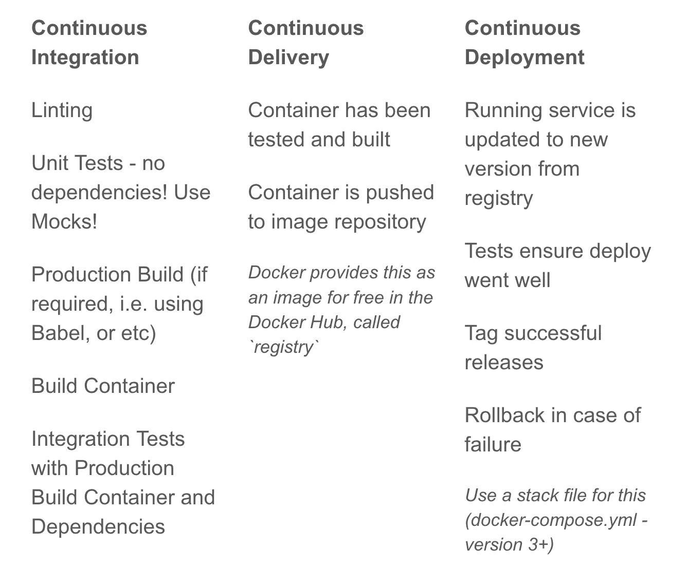

# 我要向你坦白…我向师父承诺。

> 原文：<https://medium.com/hackernoon/i-have-a-confession-to-make-i-commit-to-master-6a804f334beb>


我曾经鼓吹 Git Flow 来保持我的代码可发布、可回滚，并保持一个干净的历史。但现在不是了——现在，糟糕的代码不会进入我的代码库。

这是因为我有一个强大的持续部署管道。

有了这个管道，我和我的团队成员可以直接向 master 提交。

我能听到干草叉已经被磨尖了。“千万不要委身于师父！”

我知道，我知道，我以前也说过同样的话。"你需要有分支来保持你的代码有条理，并且能够检查它！"但是，谁想这么做呢？自动化它！

想象一下。您所做的每一次提交都会被忽略，小错误会被自动修复，您的代码会被彻底测试，并且您的覆盖率阈值会被强制执行。该过程在一个全新的容器中完成，确保不会忘记任何全局依赖项。然后，对完成的容器执行测试，以证明*将*与依赖项(如数据库、消息队列和其他任何服务)正确集成(集成测试)。如果一切顺利，代码被成功地推送到 GitHub，在那里我的持续部署服务器获取代码并完成工作。

如果它能投入使用，我肯定它能起作用。经过了很好的检验。

我敢肯定，此时你会想“听起来工作量很大”。

幸运的是，我花了几个月的时间反复试验，现在我想向你展示我每天用来自信地投入`master`的过程和技巧。到这篇文章结束时，你将拥有构建你自己的生产优化的 Dockerized 持续集成过程所需的所有技能，并通过利用 Docker Compose 和 Docker 多阶段构建在每次提交时运行它。

`master`部署起来总是安全的。

注意:如果你是 Node.js 工程师，你很幸运！示例适用于节点。对于其他人来说，概念和技术是相同的。您应该能够推断出该过程对于您选择的语言应该如何工作。

但是首先，简单介绍一下持续部署的不同阶段。

## 持续集成、持续交付和持续部署

这些术语经常互换使用，但这是不正确的。在下面的图表中，我定义了哪些任务适合哪些领域。



一段时间以来，我一直提倡将 docker-compose builder 模式用于持续集成管道。然而，随着 Docker 多阶段构建的出现，现在更容易获得更小、更高效的容器。

Docker 本质上是一个你的代码运行的隔离环境。就像配置服务器一样，您可以配置 docker 容器。大多数流行的框架和软件都有 Docker Hub 提供的版本。似乎我们如何使用节点，我们需要一个运行`node`的环境。我们将以此开始我们的文档。

```
# DockerfileFROM node:9-alpine AS build
```

请注意`AS`指令。这表明这不是 Dockerfile 文件的最后阶段。稍后，我们可以将这个阶段中的工件放入我们的最终容器中。我们继续吧。

为了简化起见，假设我们使用的库需要 node-gyp 来正确安装依赖项，因为它需要为您运行的操作系统编译本机`c++`二进制文件。在大多数情况下你不需要这个，但是一些流行的库，比如`redis`需要它。

```
# Dockerfile continued# optionally install gyp tools
RUN apk add --update --no-cache \
    python \
    make \
    g++
```

这可能是 T4 环境中最复杂的了。

不到一年前，我会告诉您构建这个映像并将其推送到 Docker 注册表中，作为其他`node-gyp`相关构建的基础映像，事实上，我做到了。然而，随着 Docker 多阶段构建的出现，额外的步骤不再是必要的。事实上，我要说的是，由于保持多张图片更新的要求，它不再被推荐。相反，让我们继续我们的管道，并利用多阶段构建来生产我们的构建。首先，我们需要定义我们的管道在应用程序的上下文中是什么。

## 定义管道

同样，为了有一个真实的例子，我假设我们使用 babel 作为预处理器，eslint 作为 linter，jest 作为测试工具。然而，管道将只通过调用 npm 脚本来运行，所以替换您正在使用的工具应该很容易，比如 TypeScript 等。

下面是使用这些工具的 package.json 文件的示例`scripts`部分:

```
// package.json"scripts": {
  "start": "nodemon src/index.js --watch src node_modules --exec babel-node",
  "build": "babel src -d dist",
  "serve": "node dist/index.js",
  "lint": "eslint src __tests__",
  "lint:fix": "eslint --fix src __tests__",
  "test": "NODE_ENV=test jest --config jest.json --coverage",
  "test:staging": "jest --config jest.staging.json --runInBand",
  "test:watch": "NODE_ENV=test jest --config jest.json --watch --coverage",
}
```

在我们的 CI 流程中，我们希望涵盖林挺、测试和构建我们的应用程序，以及构建容器，并使用我们的阶段测试来测试容器。通过继续我们的 cover 文件，我们可以涵盖除了 staging 测试之外的所有内容，staging 测试需要构建的容器作为输入。

```
# Dockerfile continued ADD . /src
WORKDIR /src
RUN npm install
RUN npm run lint
RUN npm run test
RUN npm run build
RUN npm prune --production
```

因此，我们将我们的源代码`ADD`到容器中，到一个名为`/src`的文件夹，然后将我们的`WORKDIR`改变到现在包含我们代码的那个`/src`目录。接下来，我们简单地运行适当的`npm`脚本到`install`依赖项、`lint`我们的代码、`test`我们的代码，用`build`编译我们的代码，然后用`npm prune --production`删除 devDependencies。

在我们继续之前，我想多谈一点测试步骤，因为我们使用了`--coverage`标志，所以它也被建立来测量覆盖率。我们还传入了一个`jest.json`文件作为配置文件。这是定义覆盖阈值的地方。

```
// jest.json{
  "testEnvironment": "node",
  "modulePaths": [
    "src",
    "/node_modules/"
  ],
  "coverageThreshold": {
    "global": {
      "branches": 100,
      "functions": 100,
      "lines": 100,
      "statements": 100
    }
  },
  "collectCoverageFrom" : [
    "src/**/*.js"
  ]
}
```

如果您想保持 90%的覆盖率，您可以将每个标记为`100`的选项减少到`90`。如果没有达到覆盖率阈值，测试将会失败。

如果你想像我一样自动格式化你的代码，这里有[。eslintrc 文件我将](https://gist.github.com/patrickleet/052610cc90e58942a10175d3af324e7a)与 ESLint 一起使用。而且，只是为了让你的生活更轻松，[。babelrc 文件我用](https://gist.github.com/patrickleet/9492c7da1e3594f3eb8aff1b1efbd61a)，带 Babel。

## 构建的第二阶段

到目前为止，我们的 docker 文件从一个新的 Node 环境开始，在 Alpine linux 上，有选择地安装 node-gyp 工具，然后添加、链接、测试和编译我们的代码，最后删除开发依赖。我们剩下的是生产构建所需的所有工件。不幸的是，到目前为止，我们所需要的工具变得更加臃肿。我们将使用多阶段构建，使用`COPY --from=build`，仅将我们需要的工件复制到我们最终生产化的容器中。

```
# Dockerfile continuedFROM node:9-alpine# install curl for healthcheck
RUN apk add --update --no-cache curlENV PORT=3000
EXPOSE $PORTENV DIR=/usr/src/service
WORKDIR $DIR# Copy files from build stage
COPY --from=build /src/package.json package.json
COPY --from=build /src/package-lock.json package-lock.json
COPY --from=build /src/node_modules node_modules
COPY --from=build /src/dist distHEALTHCHECK --interval=5s \
            --timeout=5s \
            --retries=6 \
            CMD curl -fs [http://localhost:$PORT/_health](http://localhost:$PORT/_health) || exit 1CMD ["node", "dist/index.js"]
```

这就完成了我们的文档。在我的例子中，最终的大小是一个 28MB 的容器，其中有我的产品`node_modules`，和我的`dist`文件夹，其中有 babel 编译的 javascript 源代码。要运行，只需使用 vanilla `node`。我还定义了一个健康检查，Docker Swarm 这样的调度器可以使用它来确保容器是健康的。`curl`这可能不是最有效的健康检查，但却是一个很好的起点。

这里有一个完整的 dock 文件，可以满足您所有的复制和粘贴需求！

```
FROM node:9-alpine AS build# install gyp tools
RUN apk add --update --no-cache \
        python \
        make \
        g++ADD . /src
WORKDIR /src
RUN npm install
RUN npm run lint
RUN npm run test
RUN npm run build
RUN npm prune --productionFROM node:9-alpine
RUN apk add --update --no-cache curlENV PORT=3000
EXPOSE $PORTENV DIR=/usr/src/service
WORKDIR $DIRCOPY --from=build /src/package.json package.json
COPY --from=build /src/package-lock.json package-lock.json
COPY --from=build /src/node_modules node_modules
COPY --from=build /src/dist distHEALTHCHECK --interval=5s \
            --timeout=5s \
            --retries=6 \
            CMD curl -fs [http://localhost:$PORT/_health](http://localhost:$PORT/_health) || exit 1CMD ["node", "dist/index.js"]
```

现在，简单地运行:

```
docker image build -t your-image-name .
```

将负责我们 80%的 CI 渠道。下一步是测试容器及其集成。

## 集成测试

对于集成测试，我们需要运行其他软件，如数据库、消息队列或我们系统中的其他服务，并测试它们是否能一起工作——它们是否集成。因为这个任务需要同时运行多个图像，我们将使用适合这类任务的`docker-compose`。

同样，我试图坚持现实，而不是简化的例子，这里是我用来测试基于 CQRS 和事件源的架构中更复杂的微服务的 docker-compose 文件，它依赖于`redis`、`mongodb`和`rabbitmq`。

```
version: '2'services: staging-deps:
    image: your-image-name
    environment:
      - NODE_ENV=production
      - PORT=3000
      - RABBITMQ_URL=amqp://rabbitmq:5672
      - REDIS_HOST=redis
      - REDIS_PORT=6379
      - MONGO_URL=mongodb://mongo:27017/inventory
      - DEBUG=servicebus*
    networks:
      - default
    depends_on:
      - redis
      - rabbitmq
      - mongo rabbitmq:
    image: rabbitmq:3.6-management
    ports:
      - 15672:15672
    hostname: rabbitmq
    networks:
      - default redis:
    image: redis
    networks:
      - default mongo:
    image: mongo
    ports:
      - 27017:27017
    networks:
      - default staging:
    image: node:8-alpine
    volumes:
      - .:/usr/src/service
    working_dir: /usr/src/service
    networks:
      - default
    environment:
      - apiUrl=[http://staging-deps:3000](http://staging-deps:3000)
      - RABBITMQ_URL=amqp://rabbitmq:5672
      - REDIS_HOST=redis
      - REDIS_PORT=6379
      - MONGO_URL=mongodb://mongo:27017/inventory
      - DEBUG=$DEBUG
    command: npm run test:staging clean:
    extends:
      service: staging
    command: rm -rf node_modules install:
    extends: 
      service: staging
    command: npm run install
```

特别注意`staging-deps`和`staging`服务。

`staging-deps`正在运行之前运行的`docker image build`命令生成的图像。这是通过将`image:`设置为我们在 build 命令中用`-t`设置的标签来实现的。我们传递给它一堆环境变量，让我们的服务知道如何连接到我们网络中运行的不同容器，这就是`default`网络。每个 docker-compose 文件都可以定义网络，并且默认有一个`default`网络。Docker 还通过其软件定义网络(sdn)处理服务发现，因此主机名将解析为网络上同名容器的 IP 地址。例如，`MONGO_URL=mongodb://mongo:27017/inventory`中的`mongo`将解析到 SDN 中的 mongo 容器。最后，`depends_on`将告诉 docker 在调出集装箱时首先启动所依赖的集装箱。

`staging`是一个基于`node`的容器，使用`volumes`指令将我们的源代码装入其中。集成测试将从此容器中运行。

此外，还有两个“服务”我们也将作为脚本运行:`clean`和`install`。`clean`为了确保我们使用正确版本的`node_modules`,我们似乎可以在我们的主机操作系统(如 Mac)和 Alpine Linux(我们的容器基于这两种操作系统)上进行切换。

首先，我们将提出依赖关系:

```
docker-compose -f docker-compose.staging.yml up -d staging-deps
```

根据您的服务是否考虑重试连接，您可能希望首先简单地启动某些容器，并在它们准备就绪时休眠。或者，像`wait-for-it.sh`这样的脚本可以通过 shell 脚本来完成。

一旦您的依赖项启动并运行，您将需要运行阶段测试。我们已经将代码装载到容器中，但是还没有在上面安装 npm 依赖项。运行以下命令来安装 linux 容器的依赖项，然后运行分段测试。

```
docker-compose -f docker-compose.staging.yml run --rm install
docker-compose -f docker-compose.staging.yml run --rm staging
```

如果您的集成/试运行测试通过，您将有信心继续进行交付和部署阶段！但是首先，让我们自动运行我们的管道，这样我们就可以在每次提交时运行它。

## 自动化管道

首先，让我们创建一个`Makefile`。我们的目标是能够运行`make ci`来运行整个 CI 流程。

```
ci:
  make docker-build \
     clean \
     install \
     staging \
     staging-downdocker-build:
  docker build -t your-image-name .clean:
  docker-compose -f docker-compose.staging.yml run --rm cleaninstall:
  docker-compose -f docker-compose.staging.yml run --rm installstaging:  
  docker-compose -f docker-compose.staging.yml up -d staging-deps
  docker-compose -f docker-compose.staging.yml run --rm stagingstaging-down:
  docker-compose -f docker-compose.staging.yml down
```

## 每次提交时运行

我在本地运行每个提交，使用一个名为`husky`的 npm 包，并再次在我的 CI 服务器上运行，它通常是 Jenkins 2.0 管道。

要在本地运行，让我们通过运行以下命令将`husky`安装到我们的 devDependencies 中

```
npm i --save-dev husky
```

Husky 让安装和运行 git 挂钩变得超级简单。只需打开您的`package.json`，添加以下两个脚本:

```
"scripts": {
  // ...
  "precommit": "npm run lint:fix && npm run test",
  "prepush": "make ci"
},
```

现在，在每次提交时，在每个开发人员的机器上，husky 将修复所有可以自动修复的林挺错误，并运行单元测试。我们的测试被配置为具有 100%的覆盖率，因此如果有任何测试没有通过，或者没有达到覆盖率阈值，提交将被阻塞。此外，在每次尝试推送时，我们定义的整个 CI 流程都将运行。这对于捕获可能已经本地安装但没有保存到 package.json 的任何 dep 非常有用，并确保在生产中托管的操作系统中运行时一切都通过，以及测试使用阶段测试构建的容器。

## 结论

此时，您已经拥有了在每次提交时运行完整的 Dockerized 持续集成过程所需的一切，并且防止了坏代码进入您的代码库。但这远不是旅程的终点。关注我，获取更多类似主题的帖子！

至于接下来的步骤:

*   **改进持续集成** 从这一点出发，根据您的需求进行定制。如果你正在开发一个应用程序，那么用 Selenium 或者它的一种风格来运行端到端测试可能是有意义的。如果这是一个高负荷的网站，增加压力测试的管道。像这样的任何类型的测试都属于集成阶段。
*   **连续交付**
    一旦你正在构建生产化的 docker 容器，不把它们放在注册表中就太可惜了。有为此付费的解决方案，和自我托管的注册表的。什么最适合你取决于你的情况。我通常只是在 Docker Hub 上支付私人回购，然后就收工了。
*   **持续部署** 这才是神奇真正开始发生的地方。当您在每次提交给 master 时都充分测试了部署自己的生产优化容器时，这才是真正的禅。尤其是考虑到现代微服务架构。通常，我们会添加新的服务来添加新的功能，而不是一个分支，从而使您更少地错过分支。对于持续部署服务器，我更喜欢蓝海的 Jenkins 2.0 管道。允许每个产品的工程师定义他们自己的 CD 管道，Docker 堆栈文件允许开发者定义他们的服务如何在生产中运行。CD 进程还可能涉及更新代理，如 HAProxy 或 nginx。
*   **试生产** 这就是*指挥者*的作用。这些工具包括 Docker Swarm、Kubernetes 和 Mesos。它的工作方式与您现在使用的计算机上的调度程序非常相似，调度您的计算机上运行的进程并分配资源。相反，它们在一个机器集群中调度和保留资源，让您像控制一个机器一样控制它们。

> 有兴趣听听我的 DevOps 之旅，没有无用的 AWS 认证？现在就在 HackerNoon 上阅读。

非常感谢你的阅读！如果你觉得这个帖子有帮助，请击碎那个按钮并分享！

请务必关注我，获取更多相关主题的帖子！:)

—

**Changelog
11/21/2017，晚上 9:11**
“重构”了引言和结论，以解决评论和问题，并提高清晰度。