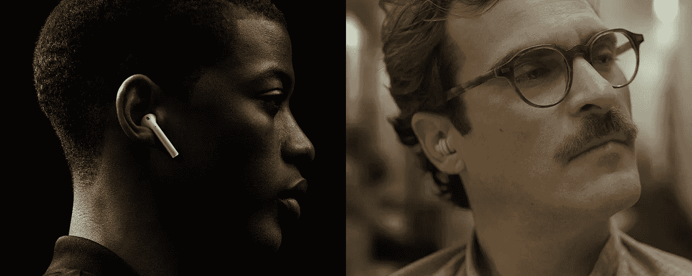
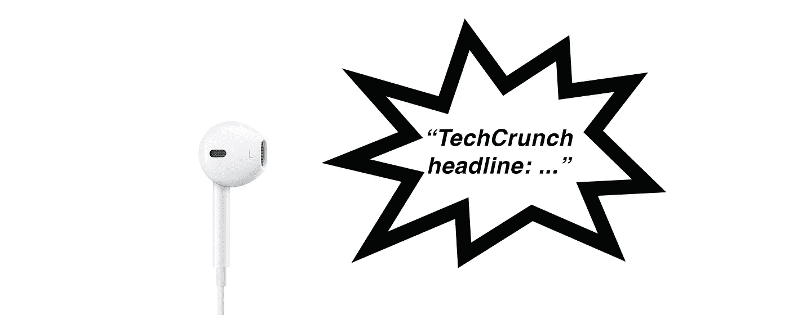

# 我听到了未来

> 原文：<https://medium.com/hackernoon/i-have-heard-the-future-9ace2121c94>

## 而且听起来很像 AirPods

我用了 6 个月的时间把我的 iPhone 变成了一个“音频通知收音机”，它让我相信 AirPods 一样的设备是未来的可穿戴设备。稍后，我将首先介绍一些背景知识。

媒体的发展受到消费它们的硬件的影响。由于我们使用和携带的许多显示器，视觉媒体(文本、图像和视频)几乎完全占据了主导地位。

视觉媒体可以很快被消费掉，但是它们经常需要大量的注意力，很多时候，还需要昂贵的“上下文切换”。

一个人必须对一个视觉内容投入大量的注意力，以决定它是否重要到足以在某个特定的时刻被消费掉。

推送通知就是一个完美的例子。检查来自你的伴侣或朋友的重要 WhatsApp 通知需要同样的注意力，就像检查提醒你使用你已经忘记的应用程序的通知一样。显然，这些通知并不是平等创建的，它们的优先级相差很大，但是在您检查它们时，它们仍然会获得相同的资源分配。

对于音频，它的工作方式有点不同。人类有能力过滤和优先处理来自多个来源的音频信息，甚至在它们之间切换(参见[鸡尾酒会效应](https://en.wikipedia.org/wiki/Cocktail_party_effect))。我发现自己很多次都是在完成一项重要任务后，才回复和我说话的人。我们的大脑能够处理音频信息，对其进行优先排序，并将其存储起来以备将来执行。

因此，几个月前，我决定做一个小实验，看看这些天生的能力是否可以用来更有效地消费信息和保护我们的注意力。

# 6 个月，带音频通知

对于这个小项目，我选择关注两个巨大的注意力流失点:新闻和消息。

我对新闻的想法是，检查我是否可以在音频中吸收和过滤信息，而不必查看提要或通知。

有了消息，我只想用语音消息向“免提通信”更近一步，看看感觉如何。

另外，在过去的几年里，我更专注于[产品](https://hackernoon.com/tagged/product)方面，但我仍然很喜欢在业余时间编写兼职项目。这是一个完美的场合，所以在这里。

为了能够“听到”通知，我使用了一个不错的小技巧。我将默认的 iOS 通知声音替换为通知文本的语音版本(由合成语音朗读)。就这样，我可以开始听到我的通知。

然后内容来了。我的朋友 Shay Erlichmen 决定帮助我构建服务器部分，它将从 RSS 提要中获取标题，合成并向 iOS 设备发送音频推送通知。对于消息传递部分，服务器将做同样的事情，除了它将只传递来自用户语音消息的音频。很快，一切都运转起来了。看看下面的视频听起来怎么样。

在使用这款应用 6 个月后，以下是发生的事情，按照兴趣的递增顺序排列:

*   大约一个月后，我停止使用信息部分。尽管如此，不用碰手机就能听到新信息也是一种真正的享受。只是打开我的手机记录回复信息变得很烦人；这种“非免提”功能感觉很糟糕。虽然这将很快成为过去的问题，但以后会有更多的讨论。
*   **当你独自在寂静的办公室工作到很晚的时候，一个自动开始说话的设备会吓到你。这个问题可以通过淡入声音或播放简短的进入音来轻松解决**
*   要改掉每次收到通知就本能地看手机的习惯并不容易。但是当我最终设法，**只有当我真正有兴趣阅读我刚刚听到的新闻，并且当我真正有时间阅读**时，我才能够看它
*   当我边跑步边听音乐时，我并不介意新闻通知融入其中。其实很多时候，我只是想告诉我不存在的助手，“多读我吧”
*   当我想要安静的时候，我只需要摘下耳塞就可以了…简单
*   **我不止一次在公共场所大声通知，每个人都能听到的时候，我都很尴尬。**当我没有插上耳塞或者忘记打开静音模式时，就会出现这种情况
*   **不用打开订阅源，我就能感受到世界上正在发生的事情，至少在表面标题层面上是这样；有点像在收音机里听到新闻**
*   我完全忽略了那些我不感兴趣的通知，或者是在不恰当的时间收到的通知。我甚至订阅了 TMZ 的极端测试。我一点也不担心我不关心的内容，因为如果它代表更重要的东西，它会被我的大脑自然过滤掉。它留在幕后。
    这可能是最有趣也是最令人惊讶的一点

# 主:音频-从:显示

这个小项目证实了音频是一种很好的吸收短信息的轻量级方式，对我们的注意力干扰最小。

在过去的几年里，语音已经成为一种更可靠的输入，最终可以将我们从显示器的束缚中解放出来。

基于以上所述，我们可以创建一种新的有效的方式来消费输入信息:音频优先，按需显示。

“推送”的信息将首先以音频形式进入，并通过我们天生的认知过滤器，而不是随意“窃取”我们的注意力。

如果推送的信息需要视觉上的关注，它可以被声音召唤到正在使用的显示器上。使用显示器是一项昂贵的任务，只能由用户在“拉”的基础上启动。

音频和语音将成为“主人”，显示器将成为“奴隶”，目的是有意识地帮助我们消费“更昂贵的媒体”。

# 苹果无线耳机

AirPods to rule them all

无线耳塞，结合强大的人工智能助手(如 AirPods + Siri)，是可以帮助我们重获移动自由和控制注意力的设备。

> "最终，无线耳塞可能是我们唯一需要的可穿戴设备."

我坚信无线耳塞是未来的可穿戴设备，将被用来控制其他设备。

当他们能够连接到我们周围的每一个显示器时(哦，等等…苹果…)，我们只需告诉我们的人工智能助手将视觉内容传输给他们…

最终，无线耳塞可能是我们唯一需要的可穿戴设备。

回头见。

> [黑客中午](http://bit.ly/Hackernoon)是黑客如何开始他们的下午。我们是 [@AMI](http://bit.ly/atAMIatAMI) 家庭的一员。我们现在[接受投稿](http://bit.ly/hackernoonsubmission)，并乐意[讨论广告&赞助](mailto:partners@amipublications.com)机会。
> 
> 如果你喜欢这个故事，我们推荐你阅读我们的[最新科技故事](http://bit.ly/hackernoonlatestt)和[趋势科技故事](https://hackernoon.com/trending)。直到下一次，不要把世界的现实想当然！

