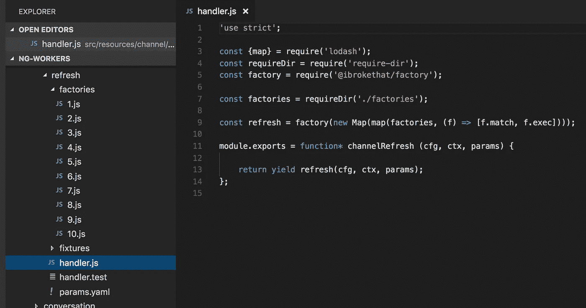
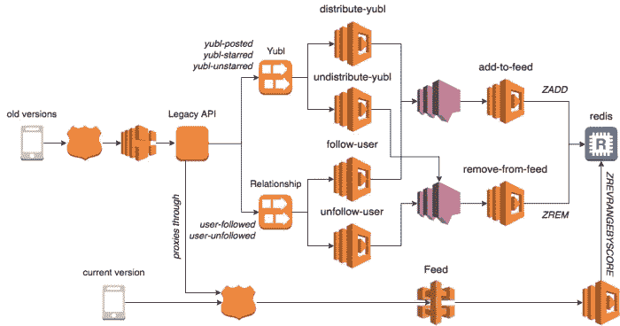

# 我在为一家鲜为人知的初创公司 Yubl 工作期间，见过《权力的游戏》中的每个角色

> 原文：<https://medium.com/hackernoon/i-have-met-every-character-from-game-of-thrones-all-while-working-for-a-little-known-startup-4f7ed872fd55>

## 这是一个关于一位首席技术官如何将公司带到生死存亡的边缘，而另一位首席技术官几乎拯救了公司的故事

我已经在这个帖子上坐了一段时间了——我不确定这是不是一个其他人会觉得有趣或有用的故事。但在与 Jeff Meyerson 在 [Software Engineering Daily](https://softwareengineeringdaily.com/2017/08/04/serverless-startup-with-yan-cui/) 播客上交谈后，我意识到其他工程师和潜在创始人可以从 Yubl 的经历中学到很多东西，并避免犯同样的错误。

 [## 使用崔琰的无服务器启动

### http://traffic . libsyn . com/sedaily/server lessburningmonk . MP 3 podcast:在新窗口中播放|筹集 18 美元后下载…

softwareengineeringdaily.com](https://softwareengineeringdaily.com/2017/08/04/serverless-startup-with-yan-cui/) 

另外，我向《黑客新闻》提交的一篇关于我们在 Yubl 上了解到的关于 AWS Lambda 的事情的文章不久前也获得了一些关注。正如你从评论中看到的，一些读者试图推断 Yubl 关闭与我们决定使用 AWS Lambda 之间的因果关系。

在场的任何人都知道事实并非如此，尽管我之前提到过 Yubl 关闭的[背景，但这个故事需要完整讲述，才能让人理解那艘燃烧的沉船，以及我们是如何接近拯救它的。如果其中一位投资者将他口头同意的投资进行到底，事情可能会变得非常不同，那些参与者将获得他们应得的赞誉，因为他们在短时间内扭转了局面。](http://theburningmonk.com/2016/11/yubl-a-sad-end-to-a-wonderful-journey/)

但是，唉，没有童话般的结局。相反，我们有一个警示故事，一个首席技术官如何将一家资金雄厚的初创公司带到生存的边缘，而另一个首席技术官如何通过无情、果断的招聘和解雇(几乎)扭转局面。为了保护相关人员，我将用深受喜爱的电视剧中的人物来讲述这个故事。

**免责声明** : *我于 2016 年 4 月加入 Yubl，因此在第一任 CTO 统治期间我不在场，那个时代的故事是那些在那里并活着讲述故事的人的第一手陈述。*

# 序言(约 2013 年 8 月)

一群刚毕业的大学生被安排到一个房间里，为一家新的创业公司出谋划策。经过一些市场研究和头脑风暴，一个新的社交网络应用程序的想法诞生了——在这个应用程序中，用户可以通过帖子中的互动按钮与你的帖子进行互动，而不是通过元操作(喜欢、转发等)。).

这个想法被推销给私人投资者，(不小数量的)投资被筹集，很快一个商业实体围绕这个想法形成。

这款应用将被称为 **YUBL** ，或者，**Y**o**U**r social**B**ubb**L**e

# 小手指时代(2014 年至 2015 年 8 月)

*Petyr“小指头”Baelish* 凭借其出色的履历加入公司，担任咨询 CTO。理论上，*培提尔·贝里席*看起来非常适合这家年轻、雄心勃勃、资金充足的初创公司，它希望挑战该领域的老牌巨头——脸书*、 *Instagram* 和 *Twitter。**

这不是一个小壮举。

幸运的是，我们现在在伦敦市中心有一个豪华的办公室，培提尔·贝里席组建了一个精英营销团队来帮助我们应对这些大公司！唯一的问题是，我们还没有产品…

工程团队可能位于很远的地方(有一次工程团队在不同的大楼里！)从“产品人员”中分离出来，这样他们就可以专注于做他们最擅长的事情。培提尔·贝里席将充当团队之间的桥梁，定期向投资者提供状态更新，让他们知道一切都在正轨上。

需求以一份 300 页的文档的形式传递给工程团队，这份文档是由构思了公司成立理念的同样热切的年轻头脑精心制作的。

与此同时，工程团队争先恐后地构建越来越多的功能。

*   我们需要一个类似 Twitter 的时间轴功能。检查。
*   用户应该能够关注/取消关注其他用户。检查。
*   用户可以按名字和/或姓氏搜索其他用户。检查。
*   我们需要一个建议用户功能来推荐你关注的人。检查。
*   我们需要一个附近的用户功能来显示您附近的用户，让您关注。检查。

这样的例子不胜枚举。

在一片兴奋声中，我们还与各种外包商签订了合同:

*   一家在我们的平台上调节内容的公司(每月区区 1 万英镑！)
*   一家公司为我们提供合同 PHP 开发人员开发一个 CRM/CMS 系统
*   MixPanel 的长期合同，每月 3k
*   …

18 个月过去了。

工程团队以外的人还没有见过这个产品。尽管所有来自培提尔·贝里席的报道都称我们进展良好，正在步入正轨，但投资者已经开始厌倦了。

然而，所有的工程师也在唱同一个调子。如果培提尔·贝里席和他的工程师是可信的，那么一切都是美好的，对吗？

主要投资人之一，*杰奥·莫尔蒙*(原*总司令*)确实设法从勤奋诚实的质量工程师*波德瑞克·派恩*那里找到了他所寻求的真相。

根据*杰奥*和*波德瑞克*告诉我的，对话是这样进行的。

Jeor :“那么告诉我，我们到底在做什么？”

波德瑞克:“我们被耍了”

波德瑞克:“不，那不是真的。我们真的真的被骗了！!"

*波德瑞克*:“这个应用不可测试，什么都不管用！开发人员对修复 bug 一点也不感兴趣，当我把 bug 带给服务器团队时，他们只会责怪客户端，当我把 bug 带给客户端团队时，客户端团队只会责怪服务器，没有人想找到真正的问题。”

这听起来让我难以置信，我从来没有在一个地方工作过，那里的开发人员只是不停地推卸责任，而不承担他们工作的任何所有权！然而，当我和人们谈论培提尔·贝里席统治期间发生的事情时，这是一个反复出现的主题——不信任、无能、傲慢以及对彼此完全的不尊重和敌意。

Node.js 的两名工程师会禁止其他服务器开发人员查看他们正在编写的代码。后来发现，他们花了几个月的时间构建自己的框架，通过 RabbitMQ 进行发布订阅。更糟糕的是，他们一起创造的系统是如此复杂，他们没有办法调试和理解它。

有多糟糕？好吧，你自己看吧…

这里，RabbitMQ 消息的处理程序将决定由名为`1`、`2`、`3`、`4`等的哪个模块来处理消息，给每个模块一个机会对消息运行谓词函数。模块必须这样命名的原因是为了加强优先级。

称它为最糟糕的、过度设计的、考虑不周的垃圾是对垃圾的侮辱。我见过糟糕的代码，但这是小菜一碟。

Try figuring out what happens when the handler receives a message from RabbitMQ…

然而，有问题的功能对于保留至关重要——当你发布一条新内容时，它应该由后台工作人员分发给你的关注者。QA 团队有一个它应该如何工作的详细规范和一套测试用例，系统没有通过大多数测试用例。

在与产品团队协商了解该特性应该如何工作之后，我们从头开始重新实现了该特性。返工花了 2 周多一点的时间，大部分工作由一个开发人员完成。重新实现的特性通过了 QA 团队的所有测试案例。

The feature was rewritten using services AWS offers out of the box, was far simpler, and was covered by a suite of automated tests that were created with the help of the QA and product team.

创业公司的文化源于创始人和管理团队，从提供的证据来看，人们必须质疑*艾瑞斯·坦格利安*(当时的首席执行官)和*培提尔·贝里席*的领导能力，特别是他们将具有如此破坏性品质的工程师引入公司的决定。这些害群之马也是花了大价钱买来的，即使以今天的市场标准来看，它们的日租金也相当高。

被他所听到的激怒了，Jeor 立即采取了行动。几天之内,*培提尔·贝里席*和*伊里斯·坦格利安*都消失了。

培提尔·贝里席以一种壮观而公开的方式被解雇，而随着杰奥·莫尔蒙接任首席执行官*伊里斯·坦格利安*被轻轻地推到一边。

贝里席的亲密盟友很快离开了公司，随着贝里席的离开，现在出现了一个需要填补的权力真空。

艾德慕·徒利成为新的工程主管。

我们后来会发现培提尔·贝里席的一些有问题的雇佣，这让人们对他的诚信产生了疑问:

*   Pycelle ，一个测试员在速成班后成为了合同 Scrum 大师(嗯，技术上来说，他是有证书的),在工资单上呆了两个月，每天惊人的 900 英镑。当丹妮莉丝询问他的角色时，他公开承认他什么也没做。至少他很诚实。
*   Jaqen H'ghar ，一名服务器工程师，据称他用 C++编写了“整个”后端系统，尽管他从未在办公室，也没有人看到任何证据表明这个后端系统在任何地方以任何形式存在。我们有的是一张 6 万美元的发票。在*培提尔·贝里席*分享的电子邮件线索中(为了证明*贾根*事实上受雇于 Yubl ),是两人之间的对话，其中*贝里席*正在指导*贾根*如何让他的发票看起来更可信。我不相信贾根曾经得到过那 6 万英镑。

# 埃德蒙时代(约 2015 年 9 月至 2016 年 1 月)

如果说培提尔·贝里席的统治因可疑的交易和缺乏明显的成果而受损，那么艾德慕的统治就是绝望和无能的化身，带来了毁灭性的后果。

我所听到的关于艾德慕的一切都描绘了一个好人、一个好工程师和一个真心想成为所有人朋友的人。虽然他是一个完美的队友，但他缺乏领导者必备的关键技能——知道何时说不。

从我的经验来看，所有与我共事过的优秀领导者都能够软硬兼施，使用适当的工具来激励/推动团队完成工作。这些也是我在加入的任何公司的领导团队中寻找的品质。

T42:阿历克斯·弗格森爵士也许是一个最著名的例子，他能够毫不费力地将两种方法结合起来，并根据球员和情况加以运用。

埃德蒙德为自己辩护，这是他第一次处于尴尬的境地，由于前政权的失败，他承受着巨大的压力，必须立即交出 T2。投资者已经花了数百万美元，却没有看到任何回报，他们想马上看到结果。

鉴于工程团队所处的位置，以及刚刚发生的剧变，这是不可能的，合理的做法是向*杰奥·莫尔蒙*解释情况，并要求相应地修改计划。Jeor 是一个非常通情达理的人，也是一个成功的商人，如果艾德慕清楚地表达了他们当时所处的困境，他会理解的。

不幸的是，对他来说，对整个 Yubl 来说，他做了一件他不该做的事——他答应了。

他的计划？雇佣更多的开发者。

对于招聘人员和承包商来说，这一定像是一个提前的圣诞节礼物。这里有一个创业公司，有一个好主意和很多钱，不顾一切，愿意支付高于市场的价格，让人们一桶一桶地进来…

在这种招聘热潮的高峰期，Yubl 每个移动平台有 15 名移动开发人员——总共有 30 名移动开发人员！他们都是昂贵的承包商。

但是等等！为什么*艾德慕*会这么做？我们知道在软件项目的后期让更多的人参与进来只会减慢项目的进度，我们从 1975 年就已经知道了这一点，这要归功于[神话中的人月](https://www.amazon.co.uk/Mythical-Man-month-Essays-Software-Engineering/dp/0201835959/)。具有讽刺意味的是，当后来面对*丹妮莉丝*，*艾德慕*会用*神秘的人月*作为论据来支持他的决定，即引入一大批开发人员来帮助完成项目…

在解雇了一名首席技术官并花费大量资金引进所有这些承包商后， *Jeor* 期望看到进展。然而，好消息来之不易，在持续缺乏进展(特别是考虑到投资和支持)后，很明显事情必须再次改变。

新任首席技术官是丹妮莉丝·坦格利安。

# **丹妮莉丝时代(2016 年 1 月至 2016 年 11 月)**

用他自己的话说，*丹妮莉丝*是个不容忍 bullsh*ters 的男人(我知道我知道，*丹妮莉丝*是电视剧里的女人)。

在工作的最初几天，丹妮莉丝面试了技术团队的每个人，并解雇了大多数新雇佣的承包商。此外，也清除了一些害群之马，他们不是暴徒，就是破坏势力。

仅仅几天后，技术团队的规模就减少了近一半，减少的沟通开销使剩下的人能够更好地专注于为发布做好准备。

除了裁员，*丹妮莉丝*还充当了 [**坏主意终结者**](https://www.infoq.com/presentations/product-management-bad-ideas) 。他与产品团队进行了讨论，将发布特性集削减到一个更易于管理的水平。当时，应用程序中的基本功能仍然几乎不起作用，但工程师们花了很多时间开发新功能，如 VOIP。

 [## 坏主意终结者

### Melissa Perri 介绍了如何在坏的产品创意进入市场之前将其摧毁，同时实现业务目标和…

www.infoq.com](https://www.infoq.com/presentations/product-management-bad-ideas) 

一个小小的奇迹是，*丹妮莉丝*在接任首席技术官的 7 周内成功推出了这款应用。在被搁置了两年多之后，大多数人都失去了希望。首席执行官甚至给丹妮莉丝提供了重新开始的选择，如果他认为这艘船无法挽救的话。

但是事情还是不太妙。

这个应用程序仍然有问题。

移动平台并不具备同等的功能。

后端基础架构不会扩展。

我们只剩下 2 名服务器开发人员(*艾德慕*在试图解雇*丹妮莉丝*失败后辞职)。由于与他们的代理机构的合同限制，仍然有一些有问题的角色。

丹妮莉丝需要重建服务器团队，他需要实干家，他可以信任的人。

我是通过一个共同的朋友介绍给丹妮莉丝的，我有他需要的技能，他可以给我提供我追求的新挑战。我加入后不久，他以前公司认识并信任的其他几个人也跟着加入。

接下来的 6 个月是从产品和工程的角度对公司进行改造的紧张时期。我为我和我的团队在如此短的时间内完成的工作感到非常自豪，我们的努力不应该得到令人失望的结局。

我已经在[软件工程日报](https://softwareengineeringdaily.com/2017/08/04/serverless-startup-with-yan-cui/)播客和各种[讲座](https://www.youtube.com/watch?v=s4L5wjFlFzA)上讨论了我们的工作，并且我已经[在我的博客上分享了](http://theburningmonk.com/yubls-road-to-serverless-architecture/)我们的许多心得。

AWS 的人对我们的工作印象非常深刻，当公司突然关闭时，他们正在写一份关于我们的案例研究。

 [## Yubl 的无服务器架构之路

### theburningmonk 服务器架构师开发者@ Yubl。我喜欢 C#，F#，Erlang，Go，Dart，Elm，PostSharp，偶尔还有 dabs…

theburningmonk.com](http://theburningmonk.com/yubls-road-to-serverless-architecture/) 

到最后，我们已经吸引了近 100 万安装用户，并有大约 20 万 MAU。与我们交谈的风险投资基金表示，在 6 个月后，我们比其他社交网络走得更远，但在没有看到 12 个月的实时数据之前，他们不会介入。

# 尾声(2016 年 11 月至今)

自从 Yubl 倒闭后，我们都各奔东西了。我最大的失望是服务器团队(在*丹妮莉丝*时代聚集在一起的那个)已经被解散了。在我们一起工作的短暂时间里，我们已经建立了良好的关系，我们作为一个团队工作得非常有效率。

我们试图作为一个团队呆在一起，但我们追求的途径都没有成功。在和几家公司谈过之后——到目前为止，我对一个好的初创公司是什么样子以及我希望在什么样的环境中工作有了更好的认识——我决定回到移动游戏行业，并加入了 Space Ape Games。

从所有好的方面来看，Space Ape Games 都是一家非常奇怪的公司——它无视科技公司的许多规范，在其他公司做得不好的地方做了许多好事。在我的面试过程中，我与创始人的交谈给我留下了深刻的印象——他们对公司有着清晰的愿景，并清楚地定义了公司的文化，每一位员工都是为此而被聘用的。该公司的使命宣言定期明确传达，创始人与公司其他人沟通的方式非常透明和诚实。

毫不奇怪，Supercell 在与全球 100 多家游戏工作室沟通后，决定[收购太空猿游戏](https://venturebeat.com/2017/05/23/supercell-acquires-62-of-londons-space-ape-games-for-55-8-million/)。这两家公司在组织结构和小型自主游戏团队的运作方式上有很多相似之处。

 [## Supercell 以 5580 万美元收购伦敦太空猿游戏公司 62%的股份

### 《部落冲突》制造商 Supercell 以 5580 万美元收购了总部位于伦敦的太空猿游戏公司 62%的股份。交易是…

venturebeat.com](https://venturebeat.com/2017/05/23/supercell-acquires-62-of-londons-space-ape-games-for-55-8-million/) 

我目前正在开发一个秘密的新 IP，我现在还不能谈论它，但是希望它能通过我们的创意渠道继续发展，并在不久的将来成为公开游戏！