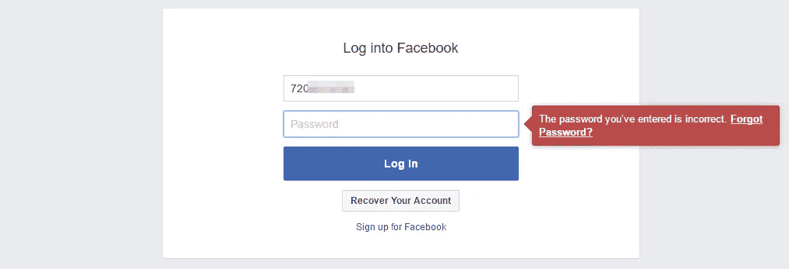
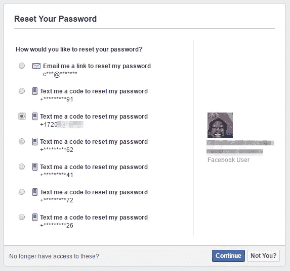
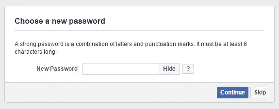
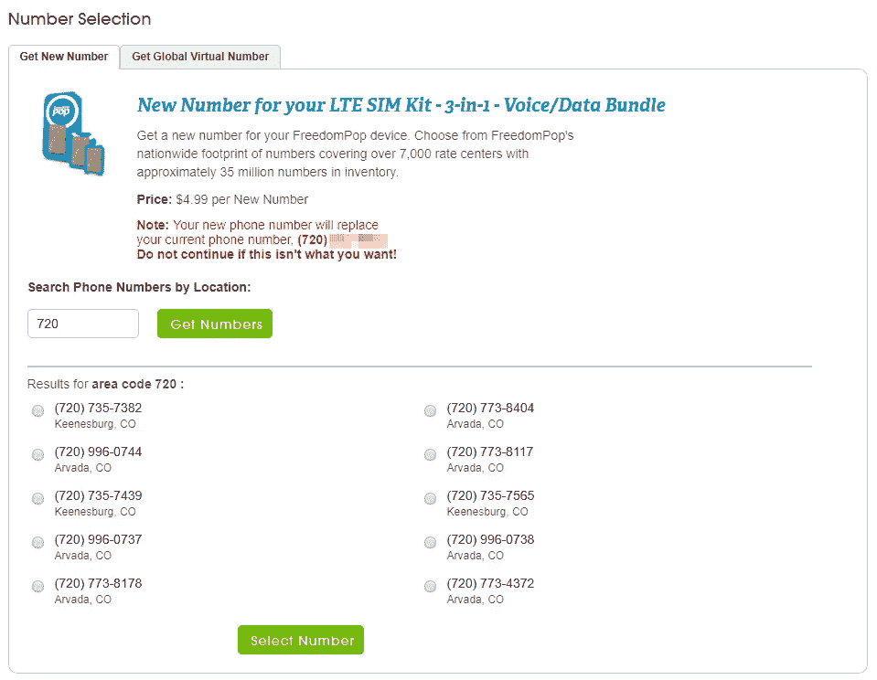

# 我用一个他们无法修复的漏洞黑了几个脸书账户。

> 原文：<https://medium.com/hackernoon/i-kinda-hacked-a-few-facebook-accounts-using-a-vulnerability-they-wont-fix-2f5669794f79>

我这样做的时候并不认识这个人，没有接触过他们的东西，也没有和他们有任何身体上的接触。这里的问题是脸书如何使用电话号码。

你看，脸书允许你在你的账户上添加电话号码，这可能是为了让你的朋友知道除了 WhatsApp、Messenger、Snapchat、Hangouts 之外，他们如何联系你。

但是脸书也允许你使用电话号码作为恢复选项，就像电子邮件地址一样。事实上，它鼓励你这样做，每隔一段时间就让你面对它。

很好，除了脸书从不鼓励你更新联系信息。这不仅仅是一个朋友因为你没有回复他们发给你不再拥有的电话号码的短信而生气的机会。你的账户游戏可以结束了。

# 我是如何发现的

我从一家名为 FreedomPop 的 VoIP 电话运营商那里得到了一个非常上镜的电话号码。我想把这个号码转移到谷歌语音。不幸的是，谷歌语音不能从固定电话号码接入，而网络电话号码几乎就是固定电话号码。为了实现这个目标，我注册了 T-Mobile 的预付费计划。计划是把我的号码从 FreedomPop 移植到 T-Mobile，然后从 T-Mobile 移植到 Google Voice。

我的 T-Mobile SIM 卡到了，我把它插到了手机里。当我查看 SIM 卡附带的激活说明时，我收到了两条短信。第一条是我不认识的人发来的，第二条是脸书在你有一段时间没有登录时发来的短信……只是我还没有把这个电话号码添加到脸书。

我很好奇。我知道脸书默认允许人们用你的电话号码找到你的账户，所以我在搜索栏里输入号码，看看会出现什么。单一账户。我在 Chrome 浏览器的匿名标签中打开了脸书，试图用电话号码作为用户名和一个假密码登录。

当然没用。于是我点击了*忘记了你的密码。*

那是我搜索的时候看到的账号。恢复选项与完全可见[直到我审查它]的电话号码是我输入的一个。脸书给我发了个密码，我输入密码，然后就登录了。

原来如此。我可以修改密码，把这个人锁在他的账户之外，就因为他忘记删除一个旧号码。或者我可以友好地点击*跳过*，这样他就永远不会知道我登录了他的账户。

# 为什么这很重要

好吧，我不需要向你解释你的账户被黑是不理想的。但是，正如一位朋友告诉我的，谁在乎呢？你不能选择你的目标。就像在街上捡到一把房子钥匙，可以把你传送到它的房子里，让你进去。很好，除了你不能用那把钥匙闯进比如说你前任的房子。

那么，有人随机获取你的旧电话号码并[侵入](https://hackernoon.com/tagged/hacking)你的账户的可能性有多大？

## 几率可能比你想象的要高。

好吧，回到我愚蠢的电话号码移植的故事。这一切都是用我激活 SIM 卡时分配给我的电话号码 T-Mobile 完成的。在 FreedomPop 的端口开通后，我的 T-Mobile 号码变成了 FreedomPop 的电话号码，所以我失去了旧号码，也无法访问那个人的脸书账户。我的 FreedomPop 帐户现在已经没有电话号码了，所以他们让我从列表中选一个新的。我照做了。

**这个新号码也属于一个脸书账户。**

没错。我想我是一个检查有点混蛋，但我检查了，果然我能够登录到另一个脸书帐户，再次没有痕迹。**这是连续两个账户，我甚至没有尝试**。还因为我一直买新的 SIM 卡，一直换号码(出于正当理由，我保证！)，我总是以我可以登录的新脸书账户结束。不知道为什么我要检查，但我做了。

好吧，所以有另一个人碰巧检查他们的新电话号码，看看他们是否能窃取碰巧是你的脸书账户的可能性是相当低的。但是像我这样随机好奇的人不是黑账号的人，黑客和骗子才是。相信我，盗取账户可以赚很多钱。

## 如果我不是这么好的一个人，我怎么能通过劫持脸书的账户每天赚几百美元呢

我的 VoIP 运营商 FreedomPop 允许我随时更换号码，只要我每次支付 5 美元。当我这样做时，FreedomPop 会给我一大串数字供我选择:

我要做的就是试着用这些号码中的每一个匿名登录脸书。一旦我找到一个与账户匹配的电话号码，我只需购买该号码，等待我的手机更新其号码，然后使用前面描述的方法登录脸书。

一旦我有了账户，就有很多可能性。人们总是在黑市上购买脸书账户，甚至在 Reddit 这样的公共场所。或者我可以给这个账户的朋友发信息要钱，就像这个可能赚了几千的骗局一样。

当然，如果这个账户仍然被频繁使用，我可能不想让这个人知道。没关系。所有脸书账户都有一个管理脸书广告的综合账户，我见过这些账户(不包括账户的其他部分)要价 50-100 美元。

另一种可能性是附加一个脸书应用程序(因为说真的，谁会检查和清理它们),它将使用我被劫持的帐户来喜欢页面和帖子，评论，给企业虚假评论等。和**都来自看起来真实的账户，因为它们*是*真实的，这将使它们对购买我的服务的人更有价值(如果我提供服务的话)**。说到脸书应用，还记得你用脸书登录的那些网站和应用吗？因为你太懒了，没有注册账户。是的，这些现在也可以被黑客攻击了。

我的观点是:你的脸书账户是一个价值不菲的宝库。我不是一个过于聪明的孩子。假设[有 2.14 亿人在美国使用脸书](https://www.statista.com/statistics/398136/us-facebook-user-age-groups/)，每 100 人中只有 1 人的账户中有一个不活跃的电话号码(这是我刚刚编造的数字)，每个账户售价为 50 美元**，你看到的是 1.07 亿美元的资金池**。这还只是出售账户的收入。当你把每个账户的骗局或潜在风险包括在内时，美元价值会更高。我向你保证，有人已经闻到了钱的味道，发现了这一点，并在徘徊追逐帐户，他们可以转售。在某个时候，如果你的帐户上有一个过时的电话号码，其中一个帐户将会是你的。所以嗯是的，修好它。

# 您可以做什么:

1.  立即删除你所有在线帐户的旧电话号码和电子邮件地址，包括脸书。
2.  [获得关于脸书未识别登录的警报](https://www.facebook.com/help/162968940433354)。
3.  见鬼，[设置两步认证](https://www.facebook.com/settings?tab=security&section=two_fac_auth&view)，为什么任何人都可以只用一件事就登录你的账户？
4.  抛弃脸书的垃圾桶之火，转向一个良好的社交网络，比如乳齿象。

# 脸书不会解决这个问题吗？

是的，我向[https://www.facebook.com/whitehat](https://www.facebook.com/whitehat)提交了一份报告，这是我得到的回复:

> 嗨，詹姆斯，
> 
> 有些情况下，电话号码过期后会提供给原所有者以外的其他人。例如，如果一个号码有了新主人，他们用它登录脸书，这可能会触发脸书密码重置。如果该号码仍然与用户的脸书账户相关联，现在拥有该号码的人就可以接管该账户。
> 
> 虽然这是一个问题，但对于 bug bounty 程序来说，这并不是一个 bug。脸书无法控制重新发放电话号码的电信提供商，也无法控制拥有与不再注册的脸书账户相关的电话号码的用户。
> 
> 谢谢，
> 
> 兰迪
> 安全

我从中得到的是“是的，这有点糟糕，但这不是我们的责任，所以我们要忽略它，好吗？”

我还联系了一个在脸书工作的熟人，他们提交了一份内部传票，但不能告诉我结果会是什么。

这两个请求都是在三个月前提交的，问题仍然存在，所以我真的认为脸书不在乎。

我希望通过发表这篇文章，也许会有足够多的人向脸书施压，要求其修补这个漏洞。

# 好吧，但是你希望脸书做什么？

哎呀。也许在我最初发表这篇文章的时候，把它包括进来会更好。有一个非常简单的解决办法。

> 不要让用户仅使用登录时使用的相同方法来恢复帐户。

如果他们想在使用电子邮件地址登录后进行恢复，请让他们使用另一个电子邮件地址或电话号码进行恢复。电话号码也是如此。仅这一点就能阻止这种利用。见鬼，即使只是要求用户识别至少一种其他恢复方法也可能一样有效。

此外，脸书应该:

1.  不允许用户在不强制重置密码的情况下恢复帐户。用户*必须*知道这种事情何时发生。
2.  出于同样的原因，当密码被重置时，向每一个附加的电子邮件地址和电话号码发送通知。
3.  每当用户添加新的电话号码或电子邮件地址时，询问用户是否要删除旧的电话号码或电子邮件地址。
4.  修复可疑恢复尝试检测系统一位发言人告诉 [*寄存器*](https://www.theregister.co.uk/2017/07/17/facebook_login_security) 脸书有，因为还没抓到我。

如果你喜欢这个故事，可以考虑在 Twitter 上关注我，我在 Twitter 上发布各种可能与信息安全无关的事情。