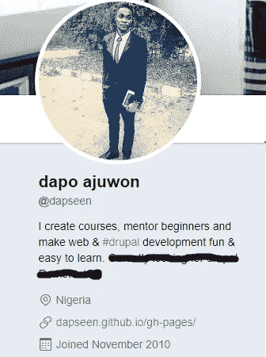

# 我知道 HTML，CSS 和 JS，现在下一步是什么？

> 原文：<https://medium.com/hackernoon/i-know-html-css-and-js-now-whats-next-e6fd113a5ad3>

每当我培训完年轻的 web 开发人员，我经常被问到这个问题，那么，下一步是什么？。如果你期待一种关于接下来该学什么的 2017 年职业道路，恐怕，我不能在这里告诉你。

请继续读下去，在文章的结尾你会明白为什么我不需要强迫你接受一些[编程](https://hackernoon.com/tagged/programming)咒语。

## TL；速度三角形定位法(dead reckoning)

**我对离开训练营的小戴夫的建议**

## 打造自己的品牌

让你自己上网，告诉人们你是一名开发者，然而，蜥蜴脑会告诉你，你还没有完全成型，**但假装它，直到你成功**。

## 属于一个社区。

与你所在领域的顶级开发者接触，找到他，在 github 上阅读他的代码库，让他在社交媒体上发帖，让他感受到你。

## 增值，工作，金钱，名声都会追你。

## 缩小你的技能范围。

## 致力于随时快速地学习

## 树立你的信心

# 整篇文章…让我们开始吧，你准备好了吗？

现在你已经学完了 HTML、CSS 和 JAVASCRIPT 的基础知识，你可以用你的技能创造一些很酷的东西，这篇文章将告诉你接下来会发生什么，以及如何加快你的职业发展。

如果你正在读这篇文章，我相信你正在从事全职编程工作，因为

> 在接下来的 5 年里，你不能做什么，我会建议你停下来，三思而后行

# 打造自己的品牌。

拥有一个个人主页来突出你的技能是很重要的，如果你没有足够的现金来购买托管计划，一个免费的 github 页面就足够了。告诉世界你所知道的一点点，是的！那个小东西，在那里陈述它。

> 由于你处于持续学习的状态，所以你可以随时更新。

去吧，把你所有的社交媒体账号改成能告诉人们你在做什么的东西，这是亲爱的品牌的一部分。最重要的是，必须拥有以下社交媒体账户

[推特](https://twitter.com/dapseen)

[脸书](https://www.facebook.com/dapo.ajuwon.developer/)

[github](http://github.com/dapseen)

[领英](https://www.linkedin.com/in/dapseen/)

[堆栈溢出](https://stackoverflow.com)

meetup

# 属于一个团体

没有一个开发者是孤岛，不要只是归属，而是努力成为一个活跃的成员，在社交媒体上关注你所在领域的顶级开发者，让他们感受到你的存在，让他们听到你的声音，保持活跃，这样你就可以规划你的职业道路。

# 增值，放松，别担心，钱和名气会追你的。

如果你查看我的 [facebook](https://www.facebook.com/dapseen) 、 [twitter](https://twitter.com/dapseen) 和 [IG](https://www.instagram.com/dapseen/) 时间表，我一直在宣扬增加价值，我看到了好处，这就是为什么我告诉你这样做。

> 社会别无选择，只能给有价值的人发工资

I started a free training on whatsApp, just to add value

教你知道的那点小事，它会让你成为一个更好的人。

写一些你知道的小事，它会让你成为你所在领域的权威。

> 以给予为乐，不期望得到，是的！不要期望。当你期待的时候，你希望，当它失败的时候，你变得崩溃。

简而言之，拥有一个博客，[用 medium](/) 开始一个，写下你在这里学到的东西，分享它，告诉人们并标记你所在领域的顶尖人物。很快你就会成为权威、金钱和工作的追逐者

# 缩小你的技能范围

不同的图书馆，框架约你出去，我不会建议你去和他们约会，也不会告诉你不要接他们的电话。然而，最好是成为专家，而不是多面手。

我从约翰·桑梅兹先生的博客中了解到这一点。如果我被控谋杀，我会聘请一个通才律师还是犯罪学专家？

在这个过程中选择不同的技能是没问题的，但是要集中精力，让人们了解你，因为有一件事，要做 T 型学习。

# 致力于快速学习

说真的，随着许多开源项目和公司采用不同的堆栈。

大多数招聘广告都谈到可以学习新框架的开发人员，为了快速学习，不要跳过基础知识，你必须了解他们，这将帮助你变得更好。

此外，我会建议你的实习生或志愿者，如果他们不愿意付费，告诉他们你会免费做，这将形成你，也告诉你的叔叔或阿姨，你可以通过为他们建立一个网站来帮助他们推广他们的品牌。

> 不要跑去升级工作并开始投标项目，我不会建议你现在这样做，重要的是你从你周围的人开始，如果你打破了东西，它可以很容易地修复。

# 最后，建立你的自信

你可能会有自卑感，但你也可以通过不断告诉自己你是谁并总是庆祝小胜利来克服它。

我希望你已经得到了一些东西，请点击下面的任何社交媒体图标来分享。

KIndly share.