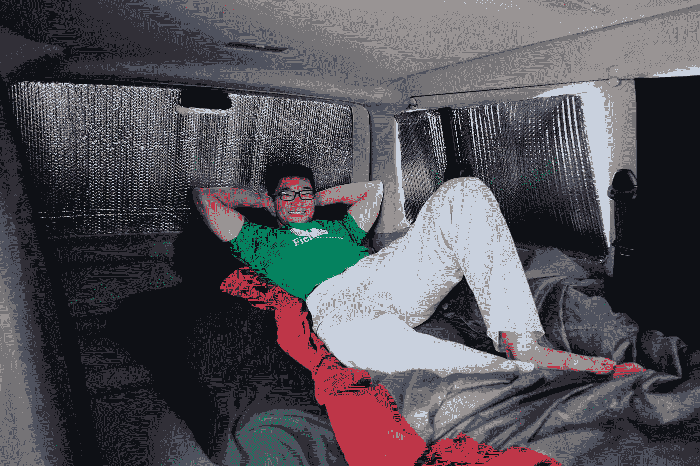
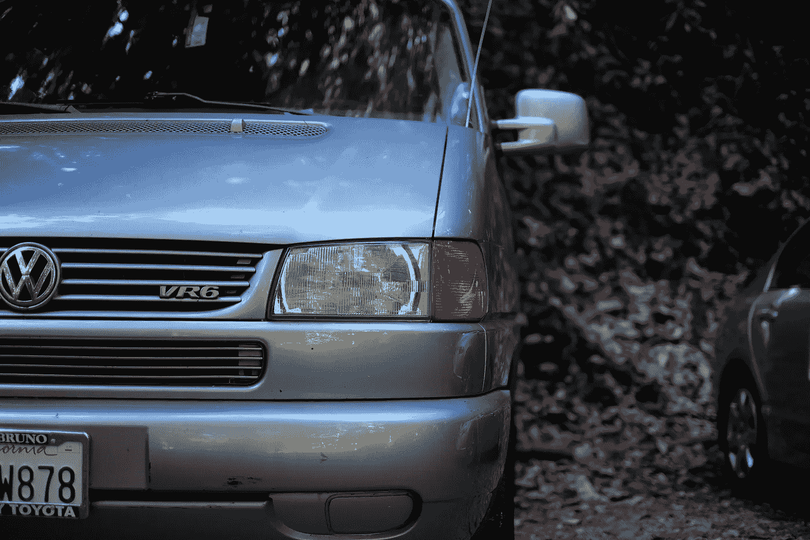
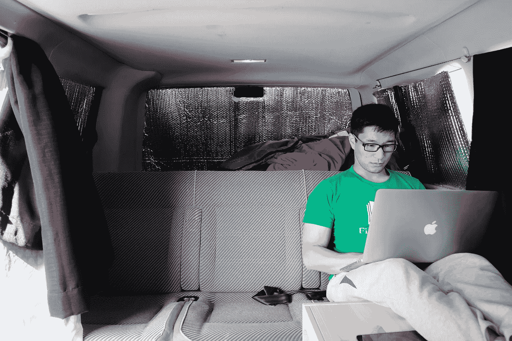
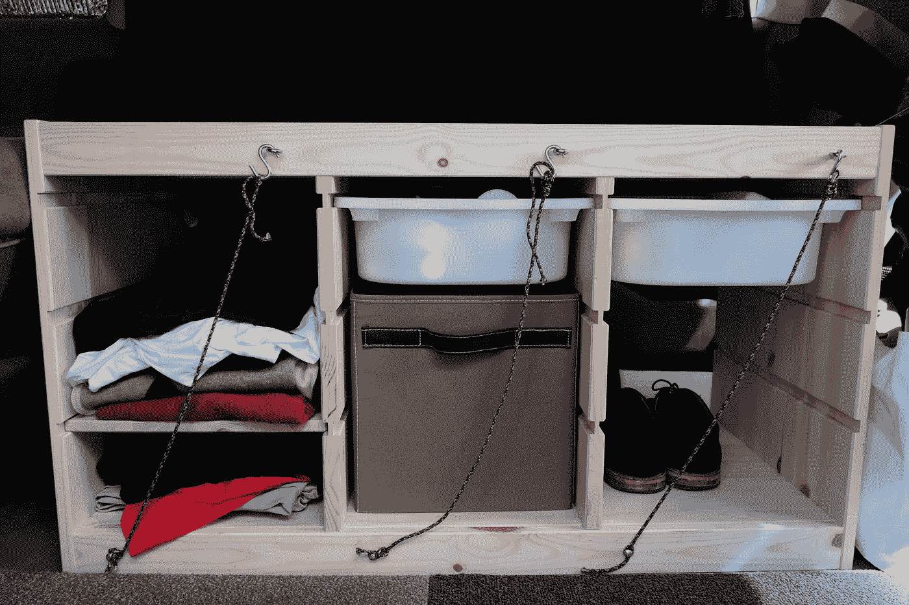

# 我住在我的货车里

> 原文：<https://medium.com/hackernoon/i-live-in-my-van-4d45157eb601>

It’s been a year since I moved into my van

起初，我对自己的生活方式有点害羞。大多数第一次听到它的人会扬起眉毛问“什么？”其他问题接踵而至。现在，我更习惯了，或者说变得更容易了，因为我认识的大多数人都知道我的生活方式。

在上一个时代的时间里，通常的工作和生活规范发生了很大的变化。有些人会试图摆脱这个技术超载的世界，想要脱离电网生活，有些人会利用这一点尝试新事物，比如住在货车里，或者在 T2 旅行，带着一个包环游世界。

社交生活的这种转变和我对新事物的兴趣让我用所有的现金买了一辆 1999 年的大众欧洲面包车，并搬进去。

VW Eurovan 1999

当我告诉别人我的生活方式时，他们通常会问这些问题:

*   **你在哪里洗澡？这是大多数人问的第一个问题。这让我觉得洁身自好是人生的头等大事。洗澡很容易。因为我在当地的健身房锻炼，我通常每天早上在那里洗澡。**
*   你去哪里上厕所？说实话，工作中的大部分时间。或者根据我在哪里过夜，早上我会去最近的洗手间。我有个尿壶以防万一。我开始的时候用，但是最近没那么多了。大概我的身体现在已经习惯了。按计划行事会让事情变得更容易。从没遇到过紧急情况。
*   **饭呢？虽然我有一个旅行锅和一个燃气烤架，但我几乎停止了烹饪。也许我会偶尔做个汤。我通常在办公室吃早餐，因为我们有一个小厨房。午餐，总是一顿体面的饭，通常来自当地。有时候我会把剩下的当晚餐。下午 6 点以后我吃得不多，可能会吃点零食。**
*   **舒适度如何？你累了吗？**也许我过度陈述了，但我比以前住公寓时睡得更好，即使是现在，有时我在朋友家过夜也是如此。我只有几个晚上天气温暖，睡觉不太舒服。但是，嘿，我住在海湾地区，那里的大多数公寓甚至没有空调，所以不能抱怨太多。
*   那么，你为什么要这么做呢？我可以列出许多理由。一个主要的原因是，我想走出我的舒适区。另一个问题是花 1000 多美元买一个睡觉的地方是不合理的，再加上通勤...我花很多时间在工作上，在家的时间不多。我们都知道海湾这里的住房有多疯狂。但是花更多的时间和自己在一起，弄清楚我喜欢做什么，培养和实践我的简约主义生活方式，拥有更少，体验更多，最后为我想做的欧洲旅行做准备是我的主要动机。

Behind my laptop while waiting for laundry

我的一天通常从早上 5:00 开始，严格的作息有助于减少决策。谁喜欢决策疲劳，对吧？

吃过早饭后，我直接开始工作。这是我一天中最有效率的时候。一旦我完成了我想要完成的某项任务，我就会去健身房锻炼，通常是在早上 8 点左右。我回来工作，吃第二份早餐，然后一直工作到午餐。我关掉大脑一个小时，花时间和同事在一起，玩 Smash Bros。午餐时间对我来说是一个没有罪恶感的时间。我回到工作岗位，在下午 3 点左右休息一会儿，喝杯咖啡。我尽量在下午 5 点完成工作，剩下的时间留给自己。这包括学习，练习我的吉他，马头琴或者只是偶尔见见朋友。无论我做什么，我都会试着在晚上 9 点开始准备就寝时间，并在晚上 1 点睡觉。

当我开始的时候，我认为并想象自己会更频繁地旅行。尤其是在周末。但是我想我只是喜欢花更多的时间在电脑上。

在经历了起起落落的过去一年里，我从未回顾过去，也没有为自己的选择后悔。那一刻我很幸运，我周围的一切都让我有可能成功。能够装下我的整个生活一辆货车为我打开了许多东西。

*特别感谢鼓励我这么做的亲爱的朋友。*

*如果你喜欢你读过的东西，请到我的* [*角落*](http://batjaa.com) *来。*

 [## 我住在我的货车里

### 自从我搬进我的房子已经一年了，起初我对我的生活方式有点害羞…

batjaa.com](http://batjaa.com/index.php/2016/07/16/i-live-in-my-van-2/) 

> [黑客中午](http://bit.ly/Hackernoon)是黑客如何开始他们的下午。我们是 AMI 家庭的一员。我们现在[接受投稿](http://bit.ly/hackernoonsubmission)并乐意[讨论广告&赞助](mailto:partners@amipublications.com)机会。
> 
> 如果你喜欢这个故事，我们推荐你阅读我们的[最新科技故事](http://bit.ly/hackernoonlatestt)和[趋势科技故事](https://hackernoon.com/trending)。直到下一次，不要把世界的现实想当然！

