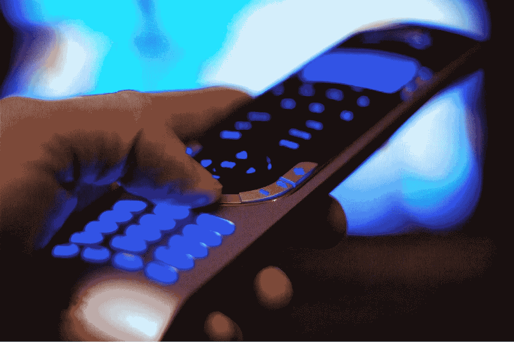

# 现实生活有重播按钮吗？

> 原文：<https://medium.com/hackernoon/i-m-a-bit-of-a-tv-addict-c8a861db68eb>

我有点电视迷。我还没有正式开始 12 个步骤中的任何一个。我最终需要的步骤是打破电视(和网飞、Hulu、亚马逊 Prime 等)的黑洞和死亡螺旋。)必然成为。

更糟糕的是，我已经和我的 DVR 建立了一种不健康的关系，它记录了我最喜欢的所有节目，从《生活大爆炸》到《海军罪案调查处》等等。我从来不看电视直播。我记录一切，我喜欢，喜欢，喜欢我可以跳过广告的事实。

另一个我似乎离不开的功能是重放按钮。你知道吗，它会向后跳 6 秒钟，看看刚刚发生了什么。我怀疑它最初是为体育运动开发的，所以你可以有自己的即时回放。然而，我会看一个我梦寐以求的节目，休息一会儿思考工作或其他事情，然后意识到我错过了谢尔顿刚刚对伦纳德说的话，那句话在《生活大爆炸》中引起了哄堂大笑。没问题，只需点击“重放”按钮，我就可以听到我刚刚错过的内容。

我已经变得有点依赖那个重播按钮了。我要么在厨房里做东西，错过了一个场景中的关键台词，要么我在以其他方式进行多任务处理(可能是检查脸书的更新)，然后不停地点击重播按钮，看看我错过了什么。

有一天，我在车里听 NPR 的广播，当一辆雷克萨斯挡住我的路时，我不得不迅速转向远离另一辆车，以免在钢铁般的地狱中丧生。当一切再次安全上路时，我意识到我错过了收音机里说的话，我发现自己伸手去按收音机上并不存在的重播键。我很难过。很高兴我还活着，而不是在一个着火的残骸里。很遗憾，我不能重播新闻报道了。

或者，还有一次，在现实生活中，走在街上，我以为看到了已经过去的东西，想按下重播键看看错过了什么，但是没有。

我认为这是我过度依赖科技的一个迹象。我发现我忽略了当下，因为我已经习惯了按下重播键。

人生没有重播键。一旦经历发生了，它就消失了。提醒自己在一天的活动中要时刻保持警惕。

你遇到过这种情况吗？在评论里说说你的故事吧。

*联系我:* [*脸书*](http://facebook.briangreenberg.net/)*|*[*LinkedIn*](http://linkedin.briangreenberg.net/)*|*[*Twitter*](http://twitter.briangreenberg.net/)*|*[*博客*](https://blog.briangreenberg.net/)*|*[*Google+*](http://plus.briangreenberg.net/)*|*[*媒体*](/@brian.greenberg)

#精彩瞬间

> [黑客中午](http://bit.ly/Hackernoon)是黑客如何开始他们的下午。我们是 [@AMI](http://bit.ly/atAMIatAMI) 家庭的一员。我们现在[接受投稿](http://bit.ly/hackernoonsubmission)并乐意[讨论广告&赞助](mailto:partners@amipublications.com)机会。
> 
> 如果你喜欢这个故事，我们推荐你阅读我们的[最新科技故事](http://bit.ly/hackernoonlatestt)和[趋势科技故事](https://hackernoon.com/trending)。直到下一次，不要把世界的现实想当然！

