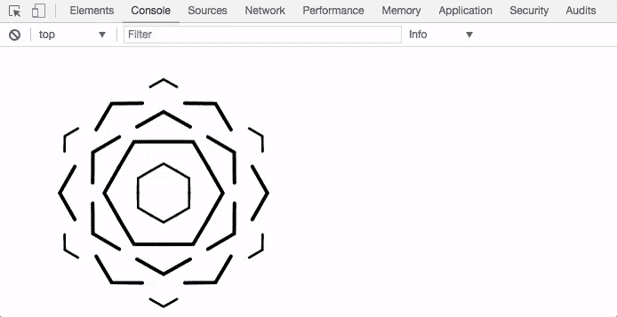
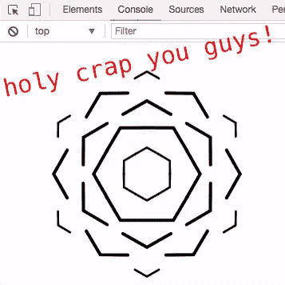

# 我有了一个发现:浏览器控制台中的 SVG 和 SVG 动画都是可以的！

> 原文：<https://medium.com/hackernoon/i-made-a-discovery-svg-and-svg-animations-in-the-js-console-are-doable-6c367c95726a>

我想尽快写下这个，因为我很好奇是否有人以前做过这种事情。也因为我对此感到兴奋。

通过一系列的事故、测试、研究等，我发现可以使用 SVG 图像作为控制台消息。不仅如此，你还可以制作动画。我要说的是:

Proof of concept showing SVG animation in the JS console (Chrome and Safari). The actual animation was not mine, however. That was [pulled from CSS Tricks](https://css-tricks.com/guide-svg-animations-smil/).

当我发现这一点时，我大吃一惊。有人以前见过这种事情吗？如果有，在哪里？超级好奇想看看有人用这个做了什么(如果有的话)。我想不出有什么超级实用的应用程序可以做到这一点——只是玩玩有点意思。

不耐烦？想看看代码吗？嘿我明白了。这里有一个直接链接:【https://codepen.io/erikwoods/pen/wewPaO】T2

# 我想分享一下我是怎么做到的！

我想分享，希望其他人可以探索，看看还有什么是可能的，我们可以互相学习。首先，你必须意识到:我正处于这一发现的早期阶段。我不知道我是在做傻事还是遗漏了什么明显的东西。所以温柔点，好吗？

我想我看到了一些限制和怪癖:

*   似乎不可能有 HTML 元素在里面(显示图像或创建链接或其他东西)
*   [CSS](https://hackernoon.com/tagged/css) 可以用于样式化，但是有几个属性被忽略了——比如 Chrome/Safari 中的*height*(Firefox 也可以)
*   CSS 关键帧动画似乎是一个禁忌
*   CSS 转换可以工作(如果我没记错的话)，但是尝试用它做一些有用的事情——我做不到——这不像你可以针对特定的元素或者使用伪选择器(据我所知)
*   使用 svg 作为背景图片完全可行，但仅限于 Chrome 和 Safari(据我所知)
*   使用 base64 图像也可以
*   Safari 想要重复 svg 背景图像，即使您使用了*不重复*
*   如果你的图片中包含了文本信息，你必须使用填充(或者换行符)把它从背景中“定位”出来。)
*   如果您包含的文本消息中也有一个 URL，那么除了第一个实例之外，svg 图像还会显示在 URL 的正前方(几乎就像它再次引入了您的所有样式)
*   [SMIL 动画](https://en.wikipedia.org/wiki/Synchronized_Multimedia_Integration_Language#SMIL.2BSVG)作品！但是这有限制吗？我还不知道！我尝试了几种不同的方法，它们都有效！
*   当你测试 SMIL [动画](https://hackernoon.com/tagged/animation)时，你不能总是简单地刷新页面来查看你的改变——有时你必须关闭并重新打开开发工具([cmd+option+i] for macOS)

下面是我为了达到截图中的效果而写的非常非常乱的 JS:

[https://codepen.io/erikwoods/pen/wewPaO](https://codepen.io/erikwoods/pen/wewPaO)

在这种情况下， *%c* 后面的空格被用来“修复”当你使用*左填充:100%* 时 Safari 想要重复背景的事实。我使用*字体大小*来帮助调整显示区域的大小，因为*高度*似乎不起作用(即使我使用*显示*和*宽度*)。

你觉得怎么样？是不是很牛逼？我疯了吗？这是不是以前做过而我只是落后了？请在评论中告诉我。:)

You can ignore this image — it’s just for the thumbnail. :p

# 以下是一些其他有趣的事情:

*   Quicken Loans 现在正在招聘——我们需要很多不同类型的人。查看我们的职业页面！或者，如果我在现实生活中认识你，打电话给我，让我介绍你。而且肯定查[火箭抵押](https://rocket.quickenloans.com/?refer=erikwoods%40quickenloans.com&qls=TMR_12345678.0123456789)。
*   目前正在为 Xbox One 播放[质量效果:仙女座](https://en.wikipedia.org/wiki/Mass_Effect:_Andromeda)。
*   目前正在听腐烂基督的[仪式](https://open.spotify.com/album/4N5BHS8X27bX5wMqVCk83x)。

> [黑客中午](http://bit.ly/Hackernoon)是黑客如何开始他们的下午。我们是这个家庭的一员。我们现在[接受投稿](http://bit.ly/hackernoonsubmission)并乐意[讨论广告&赞助](mailto:partners@amipublications.com)机会。
> 
> 如果你喜欢这个故事，我们推荐你阅读我们的[最新科技故事](http://bit.ly/hackernoonlatestt)和[趋势科技故事](https://hackernoon.com/trending)。直到下一次，不要把世界的现实想当然！

