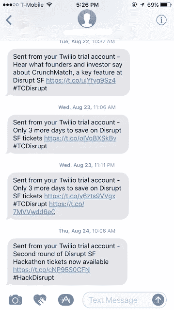

# 我黑进了 TechCrunch 的黑客马拉松

> 原文：<https://medium.com/hackernoon/i-made-a-hack-to-get-in-techcrunchs-hackathon-9806bfbbd793>

一个朋友最近告诉我，TechCrunch 的黑客马拉松即将举行。我显然很兴奋，想加入，但是他突然告诉我，票不到 15 分钟就卖完了。哇哦！好消息是票是分批发放的。

那太好了，也许下次当他们在推特上宣布时我会有所准备。通知的事情可能会有帮助，对不对？他们一发微博我就知道了。当然，但也不尽然，我讨厌手机上频繁的通知和每 20-25 分钟发一次的 TechCrunch 推特。我不能容忍。

好吧，既然我想去参加黑客马拉松，我只需要做点什么就可以了。是时候打开 Python 了！

只是想着怎么办，好像真的很简单。我的黑客需要知道 [@techcrunch](https://twitter.com/techcrunch) 的每条新推文。然后它需要想办法知道那是不是我关心的推文。最后，请尽快通知我有关推文的情况。所以这看起来相当简单，只是还需要关心一些小事情，比如保持它运行不受干扰(免费！)并丢弃已经看过的推文。

这个计划看起来不错，让我们看看如何把它组织起来。我真的很喜欢小项目的 Python，因为它允许快速启动和运行。图书馆的丰富也没有坏处。首先，我们需要在 Techcrunch 发布推文后立即获取它们。虽然我们可以直接使用 [Twitter API](https://dev.twitter.com/rest/public) ，但是 Python 有一个很棒的库叫做 [Tweepy](http://www.tweepy.org/) ，它是 Twitter API 的包装器。当然，你仍然需要在 [twitter apps](https://apps.twitter.com/) 上创建一个应用，并获得 OAuth 密钥。

很好，仅仅几行代码第一部分就已经完成了。每次运行这个脚本，我们都可以从 techcrunch 获得最近的推文。现在进入下一步。

只要浏览一下 TechCrunch 的推文，我们就可以看到他们使用#hackdisrupt 来发布所有与黑客马拉松相关的推文。所以我们就把有我们感兴趣的词的推文过滤掉吧。

好了，现在我们开始工作了。我们有我们感兴趣的推文。如果 tweet 中有这些关键字，脚本会打印出来。我们确保 tweet 文本是小写的，并与关键字进行比较。

继续，现在我需要关于这条推文的通知。这里有很多选择，比如电子邮件或脸书消息。我想让它给我发一条短信，这样至少我不用依赖互联网来获得通知。

我们可以为此使用 [Twilio](https://www.twilio.com/) API。他们确实有一个[试用账户](https://www.twilio.com/try-twilio)，注册这个账户非常简单，只需申请一个试用电话号码，你就可以用这个号码向你的真实手机发送短信。让我们整合 Twilio，确保代码无限期运行，并丢弃我们已经看到的推文。

所以现在，每当 Techcrunch 在推特上发布关于黑客马拉松的消息时，我们都会收到一条短信。不过还有一件事，我不能在我的个人电脑上全天候运行。我们需要在某个地方举办。又有很多选择——亚马逊 AWS、数字海洋、Heroku 等。我决定用 Heroku 因为它很容易安装，而且可以帮你完成所有的繁重工作。我们只需要 3 个文件来配置 Heroku。

1.  Procfile —我们希望运行脚本的命令和我们希望的进程类型。这将只包含"*worker:python<script _ name>。py*
2.  requirements . txt—Heroku 可以下载所需的库。*tweepy = = 3 . 5 . 0
    twilio = = 6 . 5 . 1*
3.  runtime.txt —脚本所需的运行时和版本。" *python-2.7.13"*

最后一步是在 Heroku 上创建一个[新应用](https://dashboard.heroku.com/new-app)，下载其 CLI 并在项目目录中运行以下命令进行部署。

> $ heroku 登录
> $ git 初始化
> $ heroku git:remote-a<heroku _ app _ name>
> $ git 添加。
> $ git commit -am "我们要去参加黑客马拉松"
> $ git push heroku master
> $ heroku PS:scale worker = 1
> $ heroku logs

结果呢？

*就是这样！感谢你的阅读，如果你来参加黑客马拉松，来打个招呼，让我知道你喜欢/不喜欢这篇文章的什么。*