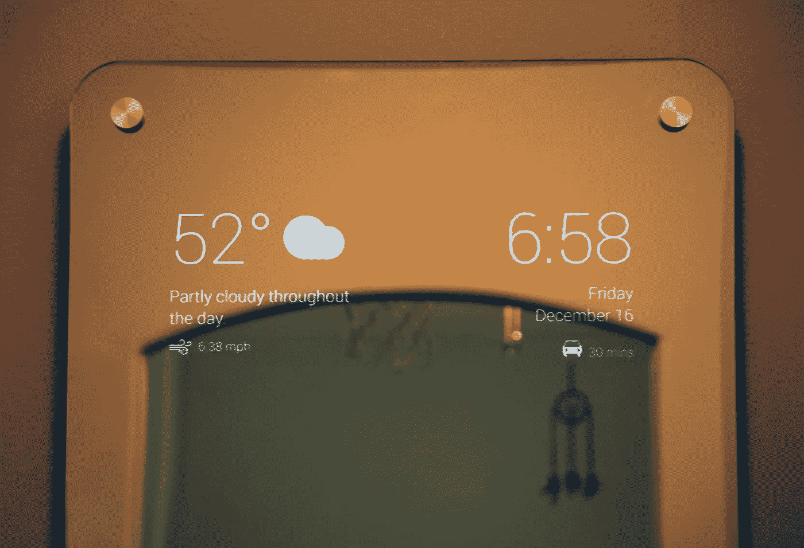
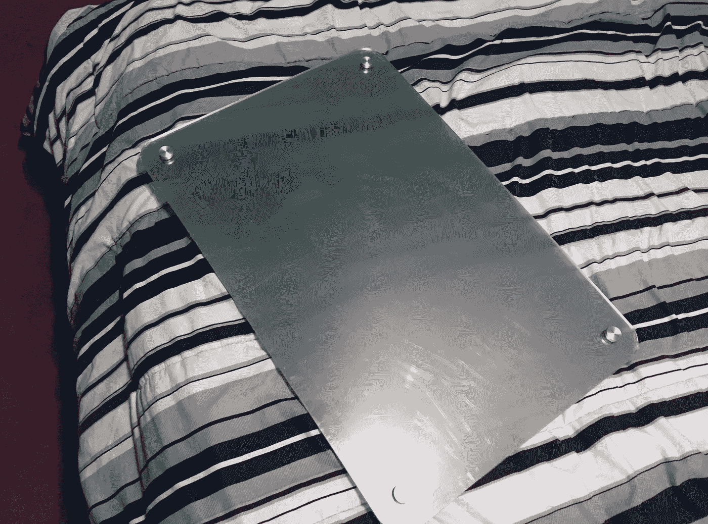
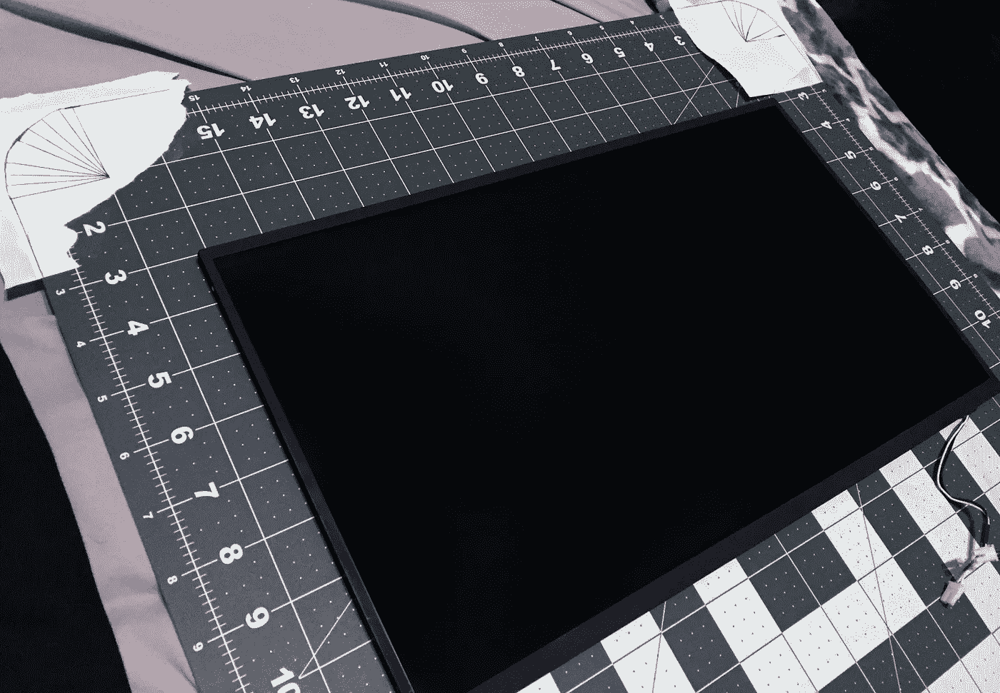
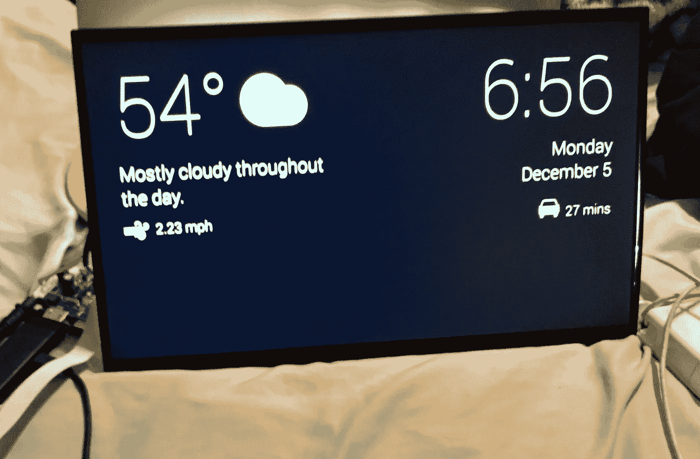
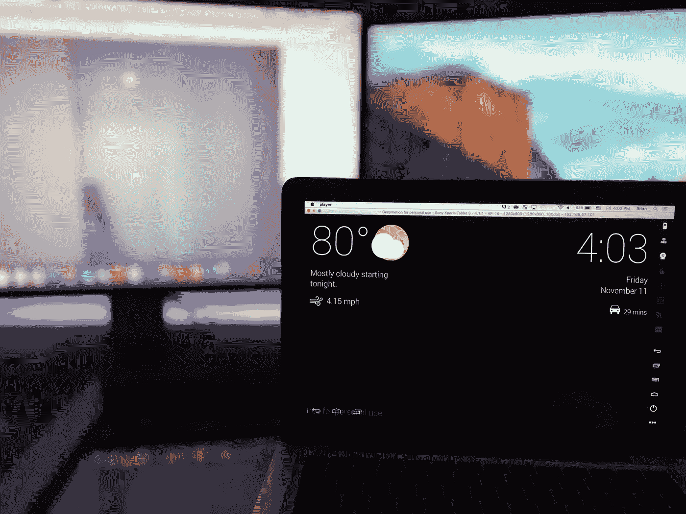
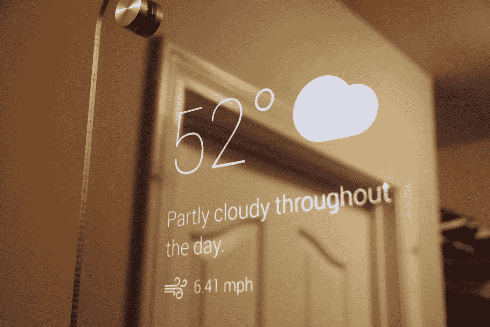
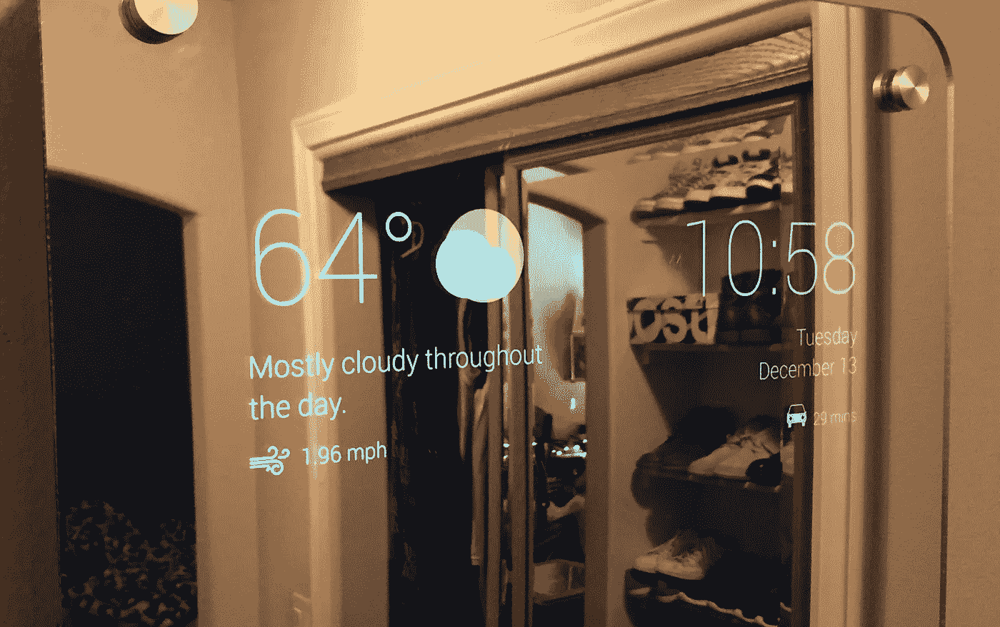
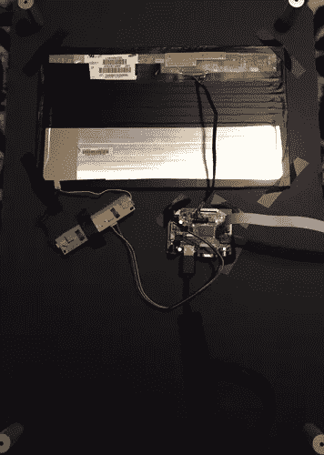
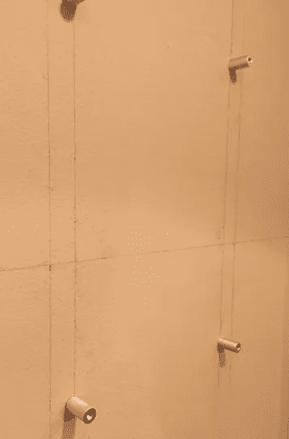
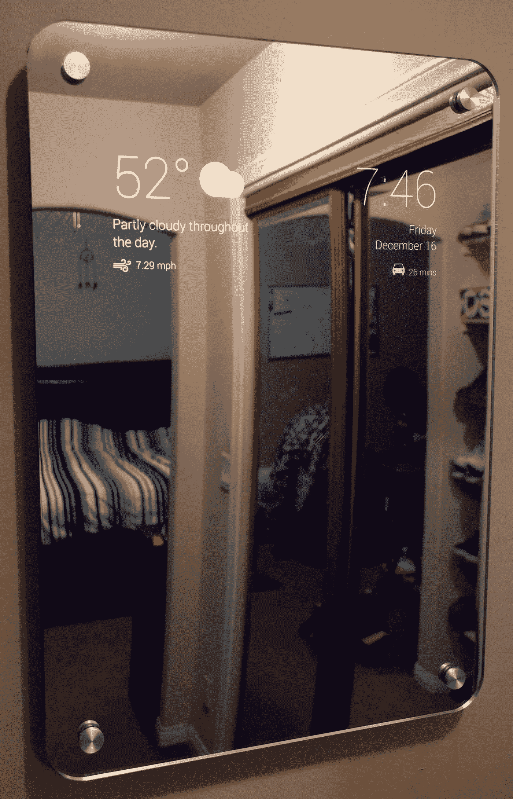

# 我给自己做了一面智能镜子

> 原文：<https://medium.com/hackernoon/i-made-myself-a-smart-mirror-50e56966c478>

Credit: [Max Braun](https://medium.com/u/8f868a9e8f17?source=post_page-----50e56966c478--------------------------------) for UI

我听说有人做这些镜子已经有一段时间了，但从来没有想过为自己做一个。直到最近，我才意识到拥有一辆车对我有好处。我经常发现自己早上跑得很晚，事实证明这面镜子对我非常有价值。它能在我出门前迅速为我提供所需的信息。

镜子的左侧显示天气以及当天天气预报的简要说明。下面是风速。右边是时间和日期，后面是通勤到我的大学所花的时间。计算通勤时间时，要考虑到路线上的实时交通状况。

## 零件

‣ **二向镜**

由于我的大学预算有限，我选择了我能找到的最便宜的镜子:双向丙烯酸[镜](http://www.tapplastics.com/product/plastics/cut_to_size_plastic/two_way_mirrored_acrylic/558)。我想要一个无框的外观，所以我在镜子的每个角落钻了一个洞，并用铝[支架](https://mbs-standoffs.com/glass-standoffs.html)把它安装在我的墙上。

我在亚马逊上找到的最便宜的价格。

‣ **班长**

我从放在身边的一台坏掉的笔记本电脑中抢救出了这台显示器。快速的易贝搜索找到了合适的[控制器板](http://www.ebay.com/itm/180979602491?_trksid=p2060353.m2749.l2649&ssPageName=STRK%3AMEBIDX%3AIT)与之配合使用。

‣ **亚马逊火电视棒**

这部分会根据个人喜好有所不同。对我来说，显示信息最简单的方法是使用亚马逊 Fire 电视棒。另一种流行的做法是用覆盆子酱。

> 如果你对这条路线感兴趣，youtube 上有很多很棒的教程，讲述如何用树莓 Pi 和一个名为[魔镜](https://magicmirror.builders/)的应用程序来做类似的事情。

我希望能够定制我的镜像布局和小部件，所以我使用 React Native 为它开发了我自己的 android 应用程序。

我使用谷歌的距离矩阵 API 来获取通勤旅行时间。

为了检索天气更新，我使用了[黑暗天空 API](https://darksky.net/dev/) 。

‣ **有用/可选用品**

我把一块黑色泡沫海报板剪成我的镜子的形状，并为显示器留出一个空间。这使得双向镜具有黑化的一面，并起到普通镜的作用。镜子和电路板被支座夹在一起。

我用一些结实的胶带把显示器固定在板上。

我发现用电胶带遮住显示器的前边缘和背面有助于减少漏光量。

正确地在墙上做标记很重要，尤其是使用支座时。有一个关卡来帮助我是非常有用的。慢慢来，一定要量两遍。

## 下一步是什么

在不久的将来，我计划集成一个运动传感器，只有当它检测到有人走过时才打开监视器。我还计划添加 Alexa 集成。

材料方面，下次我会用玻璃而不是丙烯酸。我注意到走便宜的路线和使用丙烯酸导致它在某些角度有一个有趣的镜子类型的效果。我相信这是因为镜子稍微弯曲了。

总的来说，这是一个有趣的项目，证明是有用的，而我只花了大约 200 美元来建造。

> [黑客中午](http://bit.ly/Hackernoon)是黑客如何开始他们的下午。我们是 [@AMI](http://bit.ly/atAMIatAMI) 家庭的一员。我们现在[接受投稿](http://bit.ly/hackernoonsubmission)并乐意[讨论广告&赞助](mailto:partners@amipublications.com)机会。
> 
> 如果你喜欢这个故事，我们推荐你阅读我们的[最新科技故事](http://bit.ly/hackernoonlatestt)和[趋势科技故事](https://hackernoon.com/trending)。直到下一次，不要把世界的现实想当然！

[https://upscri.be/hackernoon/](https://upscri.be/hackernoon/)