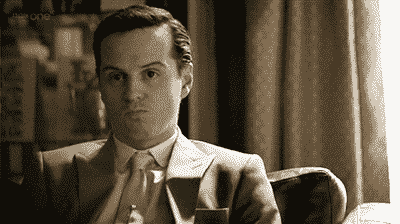
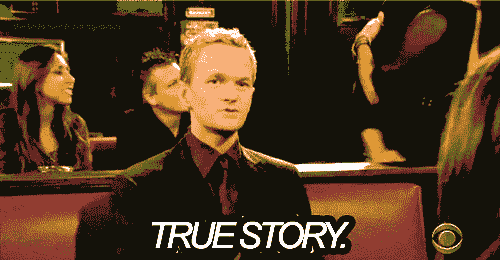
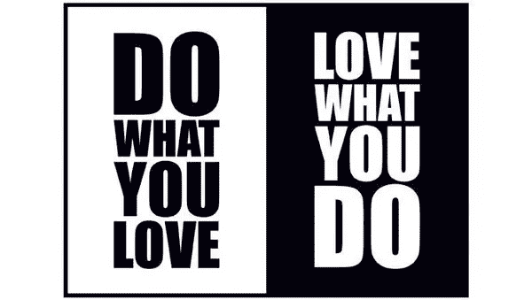

# 我从不讨厌我的工作。然而，我辞职了。又来了！

> 原文：<https://medium.com/hackernoon/i-never-hated-my-job-yet-i-quit-again-d8e1b349afd>

## 企业家精神

## 如果你以前听过这句话，请打断我——“我创办 XXX 是因为我讨厌我的工作，我想做 XXX”。或者“我讨厌我的工作。我该如何开始创业/创业？”

我从来没有真正理解这些论点。他们可能有他们自己的优点，我不确定。但我就是看不出来。实际上每次我听到这个，我脑子里唯一的想法就是—

> 什么？？

你自己创业，或者你想创业，这很好。但这和你讨厌自己的工作有什么关系呢？更重要的是，你为什么会得到一份你讨厌的工作？如果你讨厌你的工作，为什么不找一份你喜欢的工作呢？

有没有可能你并不讨厌你的工作，而是讨厌你每天都在做的事情？你还在想你这辈子想做什么？你想如何让事情向前发展。你擅长什么，对什么有热情，什么给了你快乐温暖感觉？有没有可能你还在学排骨？

# 我一直热爱我所做的事情

我热爱我的工作！他们中的每一个人。嗯，除了两份——我的第一份工作，还有一份是我两个半月后跳槽去的地方。就第一份工作而言，我做了大量的研究工作。这很有趣，但并不充实。当我这样做的时候，我真的找不到内心深处的满足感。所以，工作 10 个月后，我辞职了。我唯一不喜欢的另一份工作是在交易欧洲美元期货的时候。市场是惊人的，你为公司损失了很多钱，你也赚了一些钱，但最终，取决于你公司的 DNA，你可能会觉得你只是在走过场。每一个。单身。日。当然，你工资很高。非常好。但是，这就够了吗？我觉得不是，所以我离开了。

除了他们，我热爱我在职业生涯中所做的一切。我喜欢为电子商务巨头构思和执行小型和大型营销策略。我喜欢为一本科技杂志管理品牌。我喜欢处理社交游戏网络的盈利策略。

最近，我爱上了为一家通信和协作公司处理业务流程。(*是的，喜欢懈怠。*)

我从负责其中一个产品的营销开始，逐渐转向为另一个产品建立整个销售团队、流程和战略。公司需要我做什么我就做什么——营销人员、公关人员、内容作者、销售助理、销售主管。随便啦。我们逐渐将团队规模扩大到一个相当大的数字，但我喜欢它的每一天。

我仍然和以前公司的人保持联系。在我的团队中工作的了不起的人。我雇的那个人。我们不仅仅是社交。我们谈论工作，当他们感到困难时，他们征求我的意见。他们知道他们可以这样做，因为他们知道我会帮助他们。他们知道我热爱我所做的事情，我离开的原因与我对他们、工作或日程的感觉无关。我离开是为了开始我相信的事情。一些吸引我的东西。我觉得我可以用不同的方式做事情，那种感觉——像做爱一样令人兴奋。

# 我甚至喜欢离开我热爱的工作——除了旅行什么也不做

我放下工作，去欧洲和东南亚旅行。一年半左右。连续 18 个月——没有工作，所有的腿。不停地旅行和旅行。我没有这样做，因为我讨厌我的工作，需要放松。我这么做是因为我想体验一下。我这么做是因为我想这么做。我不想等太久才感觉好。感觉不错，我就做了。

现在，抛开我所做的一切——冒着听起来很傲慢的危险——我在大多数方面都很棒，但在某些方面我很糟糕或者很天真。这没关系。我发现了我所缺少的东西，并解决了它。

我很擅长我的工作，因为我做我喜欢做的事情，所以每天都很有趣。我是否与我的团队成员、首席执行官和其他团队有分歧？当然了。谁不会呢。但这都是过程的一部分。一切都太神奇了。我喜欢认为我很擅长我所做的事情，其中一个主要原因是因为我总是做我认为我喜欢做的事情。不仅仅是角色。团队。团队的愿景。高级管理层。他们对待事物的方式。所有的东西都必须放在一起。因此，我的新经验不断堆积在我以前的学习之上，它们形成了一个相当有凝聚力的纽带——使我的基础更加牢固。

# 那我为什么要辞职自己创业呢？

我开始是因为我看到了我觉得我可以解决的问题。我看到了一个巨大的机会，一个等待被填补的空白。我开始是因为我可以看到我是尝试修复它的合适人选——在这里留下凹痕，在那里砍掉一些东西。

> 我开始是因为我想做“更多”我喜欢做的事情，而不是因为我已经不喜欢我正在做的事情。

我的朋友们，这很重要。

热爱你所做的事情，或者试着找一个你想去的地方。尤其是如果你想有一天自己开始的话。

联系很容易。我可以在 [Twitter](http://twitter.com/@abyshake) 、[、](http://facebook.com/abyshake)、 [Quora、](http://bit.ly/abyshake)、 [LinkedIn](http://in.linkedin.com/in/abyshake) 上找到我。我写在媒体上，但我猜你已经知道了。我也有一个[邮件](mailto:mail@abyshake.com)账号。:-)

玩得开心！我们聊聊吧。人类、机器人——对我来说真的没什么区别。

> [黑客中午](http://bit.ly/Hackernoon)是黑客如何开始他们的下午。我们是阿妹家庭的一员。我们现在[接受投稿](http://bit.ly/hackernoonsubmission)并乐意[讨论广告&赞助](mailto:partners@amipublications.com)机会。
> 
> 如果你喜欢这个故事，我们推荐你阅读我们的[最新科技故事](http://bit.ly/hackernoonlatestt)和[趋势科技故事](https://hackernoon.com/trending)。直到下一次，不要把世界的现实想当然！

