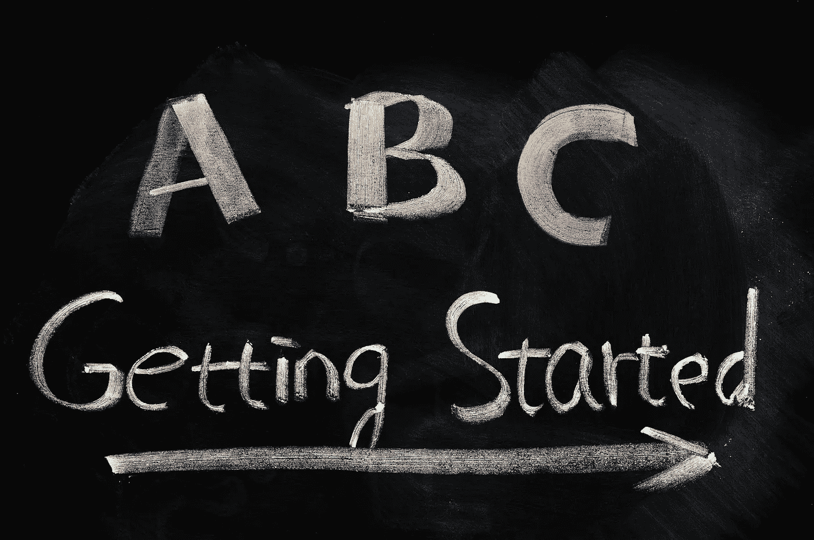

# 我筹集了一笔风险投资/天使基金，现在怎么办？

> 原文：<https://medium.com/hackernoon/i-raised-a-venture-capital-angel-fund-so-now-what-72b56187af39>

Ready to Invest — Where do I Go From Here?

你刚刚募集了一个小基金，或者最近成为了天使投资人，太棒了！你现在做什么？

如果你像我一样，那么你不是一个机构支持的大型基金，你不是一个已经知道内幕的创始人，你只是一个背后有一个小基金的人，你想开始寻找、审查和执行一些交易。

你所读到的大型基金，吹嘘 100:1 的投资与交易比率，谈论他们的独角兽退出，以及他们如何为他们的投资组合公司增加价值。你听说过获得最好的交易是多么的残酷，但是你的战争基金无法与一些大基金相比。当我第一次开始时，这也吓到了我。

据我所见，天使/种子阶段的投资世界相当学院化。如果方法正确，你可以参与任何交易。在过去一年左右的时间里，我学到了足够多的危险，我希望这能给一个新的投资者指出一点正确的方向。

# **1)学习时间**

我在[的另一篇博文](https://hackernoon.com/7-lessons-learned-in-my-first-year-as-a-venture-capital-fund-manager-d8dec9172cf1#.nkj9ocdgk)中提到过这一点，开始学习真的很重要。你不可能知道你不知道的，但是你可以开始识别未知，这是我每天的重点。

上拉面盈利的这篇[史诗般的博客，意识到你没有读什么，你应该读什么，然后把那些博客和时事通讯加入到你的日常生活中。](http://www.ramenprofitable.co/what-do-elite-venture-investors-read-every-morning/?utm_campaign=Mattermark%20Daily%20PR&utm_content=39062901&utm_medium=social&utm_source=twitter)

 [## 精英风险投资人每天早上读什么？

### 几周前，我写了一个帖子，展示了 20 分钟 VC 上的嘉宾最推荐的书籍，非常棒…

www.ramenprofitable.co](http://www.ramenprofitable.co/what-do-elite-venture-investors-read-every-morning/?utm_campaign=Mattermark%20Daily%20PR&utm_content=39062901&utm_medium=social&utm_source=twitter) 

也去听听由蒂姆·费里斯[主持的](https://en.wikipedia.org/wiki/Tim_Ferriss)[彼得·泰尔](https://en.wikipedia.org/wiki/Peter_Thiel)的采访:

 [## 蒂姆·费里斯秀:采访亿万富翁投资者和公司创始人彼得·泰尔

### “自由在于大胆。”——罗伯特·弗罗斯特这一集的嘉宾是不可思议的彼得·泰尔。彼得是一个连载…

蒂姆.博客](http://tim.blog/2014/09/09/peter-thiel/) 

听听每周发布的[20 分钟 VC](http://www.thetwentyminutevc.com/) 播客。涵盖的主题将帮助你开始识别我上面提到的未知。哈里的许多剧集都是对第一次担任基金经理的人的采访。对我们这些新来者来说，这些片段是黄金。

 [## 二十分钟风险投资——风险投资、启动资金、推介

### 蒂姆被许多其他风投称为“硅谷最健康的人”，著名的科技出版物甚至写道…

www.thetwentyminutevc.com](http://www.thetwentyminutevc.com/) 

# 2)写一篇(或几篇)论文

我看到所有这些大基金，他们有严格的投资政策，但不是那些东西。这很好，但作为第一次投资者，我并不是一成不变的，所以我制定了各种“路标”。从方向上来说，我总是致力于保持在左右极限之间，但经常，我发现自己稍微超出了它们，我认为这是可以的。

坦率地说，我认为你将会写不止一篇论文，这将会随着时间的推移而发生。你可能会有一两项投资开始进展顺利，你发现你可以增加很多价值，然后你开始了解这个行业，并找到进入行业会议董事会的方法，突然间，你有了一个关于似乎适合你的空间的论文。好结果。

另一方面，不要让你的路标阻止你看到好的创始人，了解他们的业务。谁知道呢，你可能会找到一个高增长的市场，你真的喜欢并能增加价值，你刚开始时并没有真正认为它适合你(这发生在我参加 [TC Disrupt SF 2016](https://techcrunch.com/event-info/disrupt-sf-2016/) 时，当时我找到了进入 [Mobalytics 交易](https://techcrunch.com/2016/11/16/gaming-analytics-startup-mobalytics-grabs-2-6-million-in-seed-funding/)的方法。

你希望在远处有一个类似“灯塔”的东西来指引你的船，但是你可能会左右偏航，有时看起来会偏离航线，这很好，因为你正在寻找你的方向。我讨厌用海军做类比，因为好吧[陆军刚刚打败了海军](https://www.washingtonpost.com/sports/colleges/army-navy-game-2016-for-first-time-since-2001-midshipmen-fall-to-black-knights/2016/12/10/0ebceabe-be3a-11e6-94ac-3d324840106c_story.html?utm_term=.150bcb87b8aa)，但是这一个很有道理。

# **3)知道你在哪些地方增加了价值，哪些地方没有**

确定你能为创始人增加价值的领域。对于我这种背景的人来说，那恰好是金融。我试图帮助创始人卸下一些首席财务官的重担，帮助他们思考下一轮的定位，以及运营决策将如何影响他们的 P&L 和资产负债表。也许你是前首席技术官，或前销售副总裁，或其他一些背景——所有这些都很好，只要确定你可以帮助的地方，提供帮助，不要超越你的界限，对你不熟悉的事情提出建议。你会发现，你与创始人一起工作的经历将创造新的专业领域，将来你可以在更多领域提供帮助。所以，这一切都要追溯到第一条——一路上尽可能多的学习。

# **4)与当地创始人共度时光**

花时间和你所在地区的创业者在一起。让他们告诉你他们的奋斗，了解他们的成功。了解你当地的[创业公司](https://hackernoon.com/tagged/startup)生态系统，参与者是谁，你需要考虑的动态是什么。

我参加的前十个项目是我第一笔交易的创始人推荐的。这些是对创业者的“友好推介”，他们明白我也是一家初创公司，正在寻找自己的路。有很多东西需要学习，你需要弄清楚如何倾听推销，如何提出好的问题，如何在会议期间记下重要的事情，以及如何确定你将与谁合作愉快。这一切都来自实践。

# 5)不要急着做交易，要急着学习

从上面的第一点绕了一圈，不要急着做交易。我很早就感受到了做交易的压力，面对我所看到的交易数量，我感觉自己就像一个在糖果店的孩子。慢下来，慢慢来，学很多，投资一点，剩下的会及时来到你身边。

# 6)找一个好的风投律师——把他们当成你的心理医生

一个可靠的风险投资律师可以帮助你学习，帮助你审查条款和文件，并可以在你身边阻止你做任何愚蠢的事情，这比他/她的黄金价值要大得多。其实多一个比较理想。我和一些人合作过，他们都很棒。虽然他们帮助我做法律尽职调查，评估交易，获得市场知识，甚至推动交易流动，但我的律师给我提供的最大服务是心理上的。我的律师给了我很多很好的反馈，告诉我如何走向市场，以及如何处理创业生态系统中的某些动态。我真的认为他工资太低，但是不要告诉他。

# **7)投资当地加速器**

去见一两个当地的加速器，投入一些钱(你可投资资产的一小部分),把它作为一次学习经历。你可以看到他们如何寻找和审查项目的进入者，其他投资者和导师如何在推销实践中批评初创公司，主持办公时间并会见许多企业家，你可以和他们一起投资他们的一些交易。不管他们在挑选赢家方面有多好或多差，你都要学习，去看看上面的第一点。

# **8)参加启动会议**

去看看其他市场的人们在做什么，获得一些市场意识，弄清楚旧金山的人是谁，他们比塔尔萨做同样事情的人领先 12 个月。

你可以与大量创始人共度美好时光，看到许多交易，并在会议上与其他投资者建立联系。以下是我 2017 年要参加的会议:

 [## 创业村- SXSW

### SXSW 致力于帮助有创造力的人实现他们的目标。SXSW 于 1987 年在德克萨斯州奥斯汀成立，是最好的…

www.sxsw.com](https://www.sxsw.com/conference/startup-village/)  [## 冲突

### 它被称为“地球上最好的技术会议”。但我们就是觉得不一样。这种差异…

collisionconf.com](https://collisionconf.com/)  [## 扰乱纽约 2017

### TechCrunch Disrupt 是世界领先的权威机构，推出革命性的创业公司，引入改变游戏规则的…

techcrunch.com](https://techcrunch.com/event-info/disrupt-ny-2017/)  [## 欢迎

### VETCON 是资深企业家[veterpreneur]会议，是远见者、骗子和游戏玩家的年度聚会…

www.veteranconference.com](http://www.veteranconference.com/)  [## 达拉斯创业周

### 我们很高兴地宣布 2017 年达拉斯创业周的到来。凭借破纪录的第一年，我们…

www.dallasstartupweek.com](http://www.dallasstartupweek.com/) 

# **9)写一些关系检查**

与成熟的投资者达成一些交易，最好是那些能开出后续支票的投资者(也是你可以学习的人)。一些更成熟的投资者可能会认为这是浪费时间，但我认为，在顶级基金的合作伙伴从种子阶段进入后期阶段时，接触他们来看看我投资的公司是值得的。此外，你永远不知道，关系检查交易可能会成为你的独角兽。

# **10)花时间和当地的创业社区倡导者在一起**

去找当地创业社区中的 2-3 个人，他们是社区的基石和倡导者，是对所有创业者最支持和最有帮助的人。这可以是初创企业生态系统中的博客作者，也可以是一个共同工作空间的首席执行官/所有者，或者是该领域的一位知名创始人/投资者。花时间和那些人在一起，让他们成为你的交易流来源，让他们告诉你你能如何帮助他们。

# 去见见开发商店

你当地的发展商店充满了聪明的人，他们可能已经开始创业，投资创业公司，拥有董事会席位，经营企业，帮助挣扎中的企业前进，并对你当地的创业社区中谁是谁有大量的洞察力。参见上面的第一条，良好的人际关系是尽可能多学习的关键。

# **12)成为更大的后期基金的有限合伙人**

这和第一点有点关系。伟大的学习工具。还能增加你的曝光率，让你从前排座位观察更有经验的投资者中学习。这些 5000 万至 1 亿美元的基金中，大多数将让你与它们牵头的交易一起投资，因此它们最终甚至能帮助你找到一些机会。

这个领域的新投资者经常讨论如何最终与这位著名投资者或那只基金达成交易。坦白地说，要做到这一点，你需要尽早与[未来的](https://hackernoon.com/tagged/future)一代伟大的投资者合作(在一些首次投资基金经理的基金中成为有限合伙人)。

我们正在进行识别赢家的游戏，所以投资你认为可能是未来[和](https://a16z.com/)[的基金。然后有一天，人们会想知道你是怎么加入到那些能得到最好交易的人的俱乐部的。你来得太早了——真令人吃惊，这就是问题所在！](https://en.wikipedia.org/wiki/Chris_Sacca)

# 13)花时间和其他当地投资者在一起

在你的市场中不可避免地会有一些天使投资者，希望有一两个机构投资者专注于早期投资。至少，有些家族理财室会投资早期机会。这些人可以帮助你避开当地的僵尸公司(多年来一直存活而非繁荣的初创公司)。考虑到他们已经开发了自己的交易流程漏斗，他们还可以帮助您处理交易流程。了解他们是如何寻找资源的，他们在寻找什么，然后挑选他们流程中的哪些部分可能适合你。

总之，这个行业(风险投资)就是要认识人和学习。我认为这些是风险投资等式中的独立变量。几乎所有其他东西都是因变量(交易流量、完成的交易、回报等。).

[在 Twitter 上关注斯蒂芬](https://twitter.com/hazesyah)
[联系深空风险投资](http://deepspacevc.com/)

> [黑客中午](http://bit.ly/Hackernoon)是黑客如何开始他们的下午。我们是 [@AMI](http://bit.ly/atAMIatAMI) 家庭的一员。我们现在[接受投稿](http://bit.ly/hackernoonsubmission)，并乐意[讨论广告&赞助](mailto:partners@amipublications.com)机会。
> 
> 如果你喜欢这个故事，我们推荐你阅读我们的[最新科技故事](http://bit.ly/hackernoonlatestt)和[趋势科技故事](https://hackernoon.com/trending)。直到下一次，不要把世界的现实想当然！

