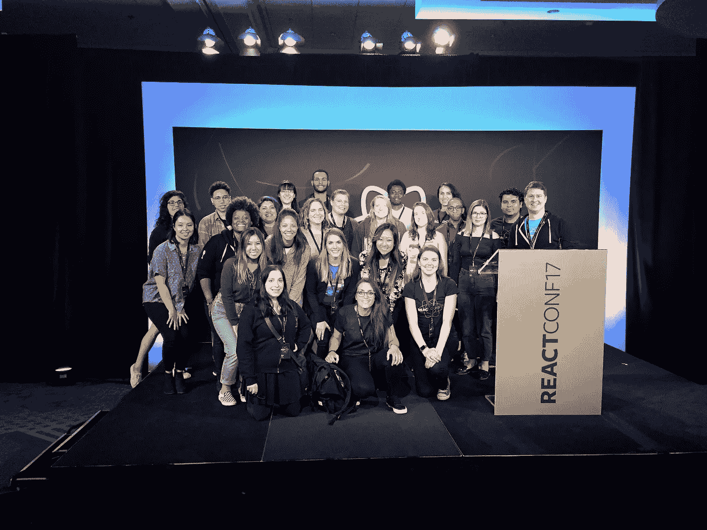

# 我❤反应 JS 社区

> 原文：<https://medium.com/hackernoon/i-react-js-community-6543e6b10040>

2017 年，我获得了参加 React JS 大会的多样性奖学金！我最疯狂的梦想实现了。然而，我也有点紧张，因为我不想发现这个社区没有我希望的那么热情。

我参加过其他与科技相关的会议，在发现我没有去麻省理工/伯克利/斯坦福/ *在此插入名校名称*或者我没有为[谷歌](https://hackernoon.com/tagged/google) / [脸书](https://hackernoon.com/tagged/facebook)/苹果/ *在此插入知名科技公司*后，人们不再和我说话。我参加过一些会议，当我试图向一家公司的首席技术官询问他的工作时，他向我搭讪。我也参加过科技会议，会上 90%的人问我的第一个问题是:

> "**你和技术人员一起工作吗？"**

像这样的时刻让我质疑我到底为什么要从事科技行业。我觉得我做的工作很宏大，但是社区对职业幸福同样重要。

当我在圣克拉拉着陆时，我在 Slack 上看到人们正聚集在酒店大厅里聊天和闲逛。我穿上裙子，鼓足勇气下楼，开始和完全陌生的人交谈。 ***这个*是大多数人问我的第一个问题**:

> “你在用 React 做什么样的项目？”

在整个会议中，我没有被搭讪。

每个人都以为我是搞技术的。

每个人都想向我学习，不管我本科学校的声望还是我现在的工作地点。

我❤反应社区。

[Troy](https://twitter.com/Troy0820) 在会议上谈到了让 React 社区多样化，我不仅想对当前的社区表示赞赏，还想就如何实现这一点阐述更多的建议。

1.  和你平时不会交谈的人交谈

对我来说，我遵循这些准则来和新朋友交谈:

*   不要和我的同事说话(我一年 363 天都见他们，等我开完会回来再和他们说话)
*   不要和我公司的人说话(道理同上)
*   不要只和看起来/听起来像我的人说话(推理如下)

作为代表不足的少数群体参加会议不足以使社区多样化。一般来说，如果只看到代表性不足的少数群体，就不是多样性。当人们知道我们是人时，刻板印象就被打破了；从事酷工作的人通常是很酷的人。我和整个社区都有责任相互交流。因此，我把和尽可能多的陌生人交谈作为我的使命，不管我有多不舒服。结果，我交了很多新朋友，s/o 到 [Gant Laborde](https://medium.com/u/6ca0fe37eac1?source=post_page-----6543e6b10040--------------------------------) ！

2.不要等到参加了 React 会议才加入这个社区

*   加入 React flux，超过 20，000 名 React.js/React 本地开发人员每天都在谈论 React 的发展，并随时准备回答您的任何问题
*   加入 Twitter，关注一些家喻户晓的名字，比如:[丹·阿布拉莫夫](https://medium.com/u/a3a8af6addc1?source=post_page-----6543e6b10040--------------------------------)，[利兰·理查森](https://medium.com/u/41a8b1601c59?source=post_page-----6543e6b10040--------------------------------)，[马克斯·斯托伊伯](https://medium.com/u/908fb8fea30c?source=post_page-----6543e6b10040--------------------------------)，[林·克拉克](https://medium.com/u/d3391efe481a?source=post_page-----6543e6b10040--------------------------------)，[阿塞马克](https://twitter.com/acemarke)
*   加入 Medium，跟随相同的人&更多！:)
*   参加你所在地区的 React 会议。如果没有，请创建一个！

*React JS Conf 2017 多样性奖学金获得者(减去一些错过照片的人，其中包括您的真实照片)*

感谢保罗·欧尚尼斯组织 React JS Conf 奖学金！这真的是一个惊人的机会，我希望在 React 社区继续成长！

> [黑客中午](http://bit.ly/Hackernoon)是黑客如何开始他们的下午。我们是 [@AMI](http://bit.ly/atAMIatAMI) 家庭的一员。我们现在[接受投稿](http://bit.ly/hackernoonsubmission)，并乐意[讨论广告&赞助](mailto:partners@amipublications.com)机会。
> 
> 如果你喜欢这个故事，我们推荐你阅读我们的[最新科技故事](http://bit.ly/hackernoonlatestt)和[趋势科技故事](https://hackernoon.com/trending)。直到下一次，不要把世界的现实想当然！

