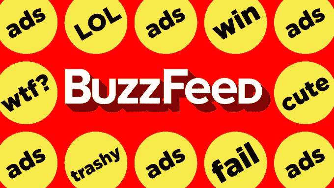
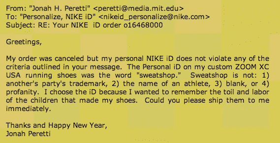
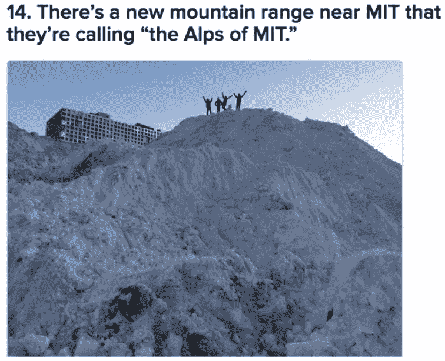

# 我对 Buzzfeed 上最具病毒性的帖子进行了逆向工程，事实令人震惊！

> 原文：<https://medium.com/hackernoon/i-reverse-engineered-buzzfeeds-most-viral-posts-and-the-truth-is-shocking-3bb9d0f76766>

任何曾经为网络制作内容的人都知道，让人们点击并阅读你的帖子是多么的艰难；忘掉病毒式传播吧，尤其是当你的内容中没有任何皮毛的时候。(阅读:猫和狗，他们似乎有天赐的互联网病毒式传播的权利)。

那么, [BuzzFeed](http://www.buzzfeed.com/?country=us) ,这个随机列表生成、猫图片聚合、永久的流行文化参照者是如何日复一日地制造病毒式内容的呢？它发现了哪些对人类基本心理的洞察或者对脸书算法的秘密([BuzzFeed 超过 60%的流量来自脸书](http://Dear Dharma))，这些是你我这样的普通凡人似乎很纠结的？我被深深地吸引住了，开始寻找答案。

2014 年， [BuzzFeed](https://hackernoon.com/tagged/buzzfeed) 上的流量翻了一番，达到每月 2 亿独立访客，而他们的帖子获得了超过 160 亿的页面浏览量。

*Mandatory cat pic to help this post go viral!*

## 抑制病毒传播的人！

不可否认，BuzzFeed 的迅速崛起使其最近筹集了 5000 万美元(T7)，估值达到惊人的 8.5 亿美元，要绘制这一图表，人们必须追溯其背后的创始人兼首席执行官乔纳·佩雷蒂(Jonah Peretti)的早期职业生涯。

故事要追溯到 2001 年，那时年轻的 Peretti 还是麻省理工学院的毕业生。耐克正在推广一个新的定制运动鞋系列，Peretti 在读到生产这种运动鞋的工人的非人条件后，想在他的运动鞋上印上“血汗工厂”的字样。耐克断然拒绝，导致了与耐克代表有趣的电子邮件往来。Peretti 觉得很有趣，就把这封邮件转发给了他的十个朋友。那应该是结束了。

***An excerpt from the series of mails Peretti sent to Nike, only to be repeatedly refused.***

但互联网是一头好奇的野兽，邮件的某些东西让它如此厌烦，以至于邮件数量激增，被一个收件箱转发到另一个收件箱，让佩雷蒂一下子成了名人。

虽然普通人可能会因成为病毒的一部分而兴奋不已，但 Peretti 对互联网病毒传播的方式和原因更感兴趣。

他和他的朋友 Cameron Marlow 聊了聊，Cameron Marlow 现在是脸书大学数据科学的负责人，当时他只是一名研究生，正在写一篇关于病毒现象的论文。马尔洛·桑德坚持认为病毒式传播几乎是不可能制造的，因为人类情感的复杂性确保了不可能有任何把握地预测某个人会分享什么。

> Peretti 不这么认为，两人都打了个赌，剩下的就像他们说的，都是历史了。

# 早期

Peretti 在 2006 年创办了 BuzzFeed，作为一个副业项目。他知道，如果他能可靠地生产出有感染力的内容，你每天都想分享的内容，在工业规模上，他就会开发出一条现代互联网巨龙，吞噬数百万的页面浏览量，让已经在数字时代消亡的古老新闻机构挨饿。

Jonah Peretti knows you’re crazy!

Peretti 基本上想在 Buzzfeed 上开发迷因，这个词最初是由进化生物学家 Richard Dawkins 创造的(迷因的定义特征是它们可以自我复制)。

最初，BuzzFeed 只是一种算法，从浩瀚的互联网中精选出哪怕是最轻微的病毒式传播的故事。BuzzFeed 说服合作伙伴网站在他们的网站上安装代码，允许它监控他们的流量。(该网络现在包括大约 200 个站点，为 3.55 亿用户提供服务。)

不过目前，BuzzFeed 雇佣了一些编辑，他们的全职工作是在网上发布内容，这些内容不断获得大量的分享，可以说是“病毒式”传播。

那么他们是怎么做到的呢？由于病毒式的文章和列表是一个至今未知的过程的最终产品，我决定我需要进入兔子洞回到一切开始的地方:内容创建阶段。

我发现的结果令人震惊，更重要的是，很容易重复。

## Buzzfeed 的幕后:

我去了 BuzzFeed.com，开始寻找一些有趣的东西。引起我注意的是一条特别引人入胜的内容，标题是:“在婚礼中途发现新郎身体不适后，这位新娘嫁给了一位婚礼宾客”。

这篇文章在几个小时内就产生了超过 40 万的点击量，并且出现在 BuzzFeed 印度网站的首页！它以下面一句话开始:“这就像印度的任何其他婚礼一样，25 岁的朱加尔·基肖尔要和 23 岁的英迪拉结婚。”

> 出于对 BuzzFeed 如何偶然发现这条新闻的好奇，我在谷歌上搜索了 Jugal Kishore 和 Indira。它立刻显示出《印度时报》上的一篇文章，内容完全相同，只是在几天前。不过，这对 BuzzFeed 来说很公平，因为他们勇敢地承认从“多家新闻媒体”转载了内容。

他们基本上只是添加了一些图片，展示了从印度婚礼到已经在各种新闻媒体上发布的故事的场景，附加了一个 clickbait 标题，让魔法展开！

A simple Twitter search throws up most of Buzzfeed’s list

震惊于我如此轻易地发现了源代码，我决定也对其他一些帖子进行逆向工程。主页上另一个 BuzzFeed 帖子的标题是:[“完美捕捉新英格兰雪有多疯狂的 24 张图片”](http://www.buzzfeed.com/mjs538/please-stop-snowing#.ji9mpJX4b)。在撰写本报告时，这已经产生了 300 多万次点击。

看到这些图片大多来自 Twitter，标签让搜索变得非常容易，我搜索了#Boston、#BostonBuried、#Snow、#BOSnow 和#BostonSnow。不足为奇的是，在搜索和使用这五个标签的短短 5 分钟内，我找到了 24 张图片中的 15 张。

这让我想到，在 BuzzFeed 上用一个独家新闻和一个简单的图片搜索就能发布一篇值得传播的帖子是多么容易！

虽然 BuzzFeed 现在已经聘请了资深记者和数十名记者来创建政治和技术内容，但仍然是这些轻松的新闻和点击诱饵新闻[策划了](https://hackernoon.com/tagged/engineered)的病毒式传播，产生了网站的大量流量，更重要的是每天有数千人被引入网站。

# 从网上迷因天堂中获得灵感:

在互联网上粗略搜索一下 BuzzFeed 可疑的采购政策，发现了一些有趣的链接。NedHardy.com——一个穷人的 BuzzFeed 网站——发布了一篇名为“7 张照片，让你重拾对人性的信心”的文章，作者法尔哈德·曼朱写了一篇有争议的文章接下来的一个月，NedHardy 发布了另一篇文章，“13 张照片帮助你恢复对人性的信心。”

BuzzFeed 的标志性帖子[“21 张照片将恢复你对人类的信心”](http://www.buzzfeed.com/expresident/pictures-that-will-restore-your-faith-in-humanity#.rv5VnDGAX)中的一半照片产生了 2000 万的巨大浏览量，首先出现在 NedHardy 的两个汇编中。在 BuzzFeed 的“21 张图片”帖子中，没有任何地方提到 NedHardy。

另一个例子是“ [14 个本不该发生的错误。](http://www.buzzfeed.com/samir/the-biggest-job-fails-ever#.uk5X43JoW)“这个帖子展示了工作场所的失败，例如，一个标有“西瓜”的大盒子里的菠萝。”在帖子中的每张图片下，BuzzFeed 都有一个指向图片托管网站 Imgur 的微小链接。

但 BuzzFeed 链接 Imgur 的方式有些偷偷摸摸。BuzzFeed 选择直接链接到 Imgur 图片的文件名。这意味着当你点击链接时，你只能看到照片。只有当你去掉了。jpg ",你可以看到该图像的完整 Imgur 页面。

如果你对“14 个错误”帖子中的所有图片都这样做，你会发现其中 13 张图片的标题中都有“一项工作”这个短语(比如，“你只有一项工作要做，但你失败了。”)并链接回一个名为“一份工作”的 Reddit 页面。

## BuzzFeed 即时病毒学派:

BuzzFeed 将他们最大的人群定义为厌倦工作的人群，根据 Perreti 的说法，这是世界上最大的人群。紧随其后的是无聊排队时段，人们在车站等地铁时浏览手机。

**讽刺的是，这些人没有时间去浪费，去浏览无数的网页，然后才能最终开怀大笑。**

进入 BuzzFeed，它(通过大量的编辑器和算法)为你完成繁重的工作，不像其他网站，如 Reddit、4Chan 和 Tumblr，尽管不断产生大量有趣的内容，但你必须费力地通过数小时的线程，破译大量的内部笑话和参考资料，才能找到可分享的黄金。

一旦你理解了 BuzzFeed 在幕后实际上是如何运作的，这有点像魔术师向你展示他的戏法。每当你看到一个热门的 BuzzFeed 帖子，搜索 Reddit、4Chan、Tumbler 或运行一个简单的谷歌图片搜索，真相就会揭晓。

魅力逐渐消失，你会看到 BuzzFeed 的真实面目:一个冷血的预警系统，一旦来自网络上相对模糊的部分的特定内容开始产生嗡嗡声，就会触发警报，用 clickbait 标题重新包装相同的内容，创造所谓的“好奇心差距”，并将其推向数百万人，以制造病毒。

> Peretti 本人承认，它的一些想法已经出现在网上的其他地方，但他认为，要找出网上内容的真正创造者是极其困难的。

我将让您来解读围绕 BuzzFeed 采购政策的道德问题，但我对 BuzzFeed 幕后的偶然一瞥让我确信，创造合适的环境来优化内容以使其具有传染性确实是可能的。

不是所有的事情都能以相同的前进动力起飞，但是无论如何，都不可避免地基于一个容易重复的公式。因为这显然不是魔术，这是科学。

请在评论中告诉我你对什么传播什么不传播的看法。

*注意:这篇文章最初是我在两年前，也就是 2015 年初发表的，现在在这里再次发表，因为我觉得关于病毒传播和内容的一些更广泛的观点在今天仍然有意义。然而，我想声明我是 Buzzfeed 的长期粉丝和崇拜者。*