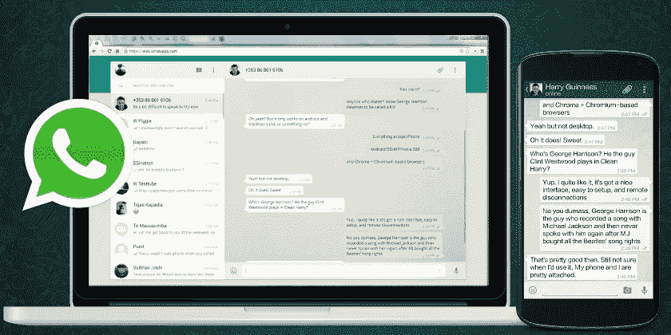
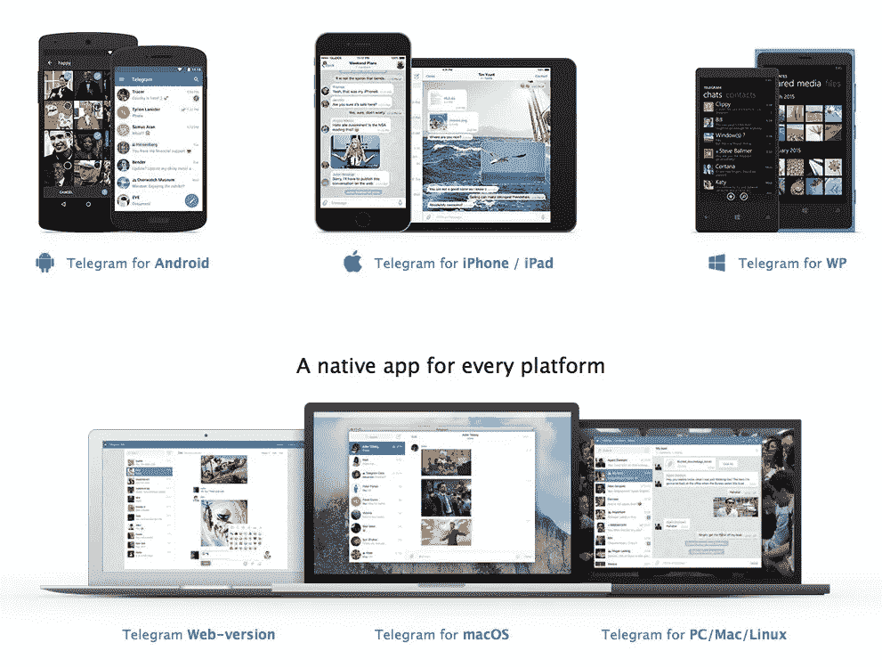

# 多设备是 WhatsApp 的致命弱点吗？

> 原文：<https://medium.com/hackernoon/i-s-multidevice-the-achilles-heel-for-whatsapp-1ac91c3edf07>

## 将通信服务引入多种设备的趋势凸显了 WhatsApp 应该尽快解决的一个局限

最近的一些声明/传言让我注意到了“多设备趋势”的加速。特别是:

*   [谷歌最近宣布了他们的 Android Wear 2.0 版本](http://www.theverge.com/circuitbreaker/2017/2/8/14552536/verizon-wear24-android-wear-2-0-smartwatch-wearable)，其中一个有趣的部分是支持 SIM 卡的版本支持常规电话和短信。事实上，[威瑞森正在推出一款特别的设备](http://www.verizon.com/about/news/verizon-your-destination-two-new-4g-lte-connected-smartwatches-android-wear-20),它强调了这一点

> “这些智能手表总是连接到你的智能手机的电话号码，所以即使智能手机不在你身边，手表上的短信和电话也会使用这个号码。这使得你可以把你的智能手机放在另一个房间，或者不带着它出去办事，也可以随时收到你的通知。**一个号码，多个设备。**

*   在谣言空间，预计亚马逊和谷歌都计划在他们的联网扬声器产品中启用常规电话支持。

这两项举措都与最近这一趋势的复苏非常吻合

> **“一号多器。”**

传统沟通方式。

# 电信公司押注于多种设备

[移动](https://hackernoon.com/tagged/mobile)运营商传统上将电话服务和身份视为与 SIM 卡紧密相关的东西，因此将电话号码带到多个设备的能力与 [MultiSIM 服务产品](http://www.movistar.es/particulares/movil/servicios/ficha/res-multisim)紧密相关，并且要求设备本身支持 SIM 卡。

这种限制已经被一些运营商克服，这些运营商已经开始(一些是最近开始的)在不需要 SIM 的情况下提供跨多个设备的通信服务接入

*   加拿大的罗杰斯在 2011 年推出了他们的 [OneNumber 服务，开创了这一领域。它们提供了在多种设备上拨打和接听电话和短信的能力，以及基于 VoIP 应用的连接能力。奇怪的是，现在许多其他运营商也在效仿，](http://www.iphoneincanada.ca/carriers/rogers/rogers-one-number-goes-live-this-morning/) [Rogers 已经决定关闭他们的服务](http://mobilesyrup.com/2016/12/06/rogers-is-putting-its-one-number-voip-service-out-of-commission-as-of-january-2017/)。理由是越来越多的设备上出现了原生 Wifi 通话支持，这使得这项服务不再适用。我个人不同意这种想法，因为——正如我几周前在 Medium 上写的那样——[拥有客户体验正变得越来越重要](/@jorge.serna/the-power-of-experience-b3971d7b563f#.l2sg6tgsc)。然而，我没有关于罗杰斯的产品表现如何的数据来做出适当的评估，他们肯定已经做了自己的分析来做出这个决定。
*   [西班牙电信的 TU/TU Go](http://www.tu.com) ，我个人也参与其中，是 O2 在 2013 年推出的[，并从那里扩展到其他运营商，如巴西的](http://www.gizmodo.co.uk/2013/03/o2s-tu-go-app/)[VIVO](http://appstore.vivo.com.br/utilidades/vivo-tu-go)或阿根廷的[movistar](http://www.movistar.com.ar/tu/)。TU Go 遵循与 OneNumber 类似的方法，但在这种情况下，不考虑设备中的本机功能作为替代，而是可以补充产品的[。](https://tu.com/weblog/2016/03/30/wi-fi-calling-tu-go-brazil)
*   [AT & T 在 2015 年推出了 number sync](http://www.theverge.com/2015/10/14/9529869/att-numbersync-connected-devices-shared-phone-number)，但他们的非 SIM 卡产品仅限于苹果设备，使用 iCloud 作为在它们之间传播手机身份的方式。对于其他设备，如一些 Android 平板电脑和智能手表，该解决方案使用基于 SIM 卡身份的 MultiSIM 方法。
*   [Digits 是 2016 年底宣布的 T-Mobile 产品](https://newsroom.t-mobile.com/news-and-blogs/digits.htm)，在这种情况下，他们遵循一种混合的方法——我认为这是正确的方法——基于提供应用程序和网络功能，以便在几乎任何可用的设备上实现这种功能，但[与一些合作伙伴合作，利用一些本地体验](https://explore.t-mobile.com/digits-landing):

> DIGITS 将在通过 T-Mobile 购买的三星 Galaxy S6、Galaxy S6 edge、Galaxy S6 edge+、Galaxy S7、Galaxy S7 edge 或 Note5 上原生运行。他们已经将数字直接集成到开箱即用的设备中。不需要下载软件

对大多数人来说，这些将通话功能扩展到电话之外的概念，特别是考虑在手表上接听电话，可能会带来美好但绝对不切实际的回忆:

I end up doing this much more than I originally expected

但对此我有两点考虑:

1.  不要考虑可穿戴设备:电脑、平板电脑或 Wifi 扬声器能够配合你的常规通话，这非常有用。为了方便、高效或备份，拥有这种能力有助于克服物理电话的一些限制。
2.  管它呢，让我们想想可穿戴设备吧！我也对手表中的通话功能持怀疑态度，但我必须承认，这是我在 Apple Watch 上经常使用的功能之一。我以为我永远都不需要那样做，但是在你正在做一些事情的时候接听来电，而你的电话就在身边但不在手边，这真的很方便。这就是目前 Apple Watch 的行为，它依赖于手机在附近才能工作，但正如我在以前的一篇文章中讨论的那样，[手机解体的趋势一直在发展](/@jorge.serna/apple-airpods-and-the-disintegration-of-the-smartphone-cb8e29efc8e3#.xslyygday)。如果对手机的依赖被打破，我们开始通过无线耳机而不是抬起手腕与手表交谈，可穿戴设备的通信将非常有意义。

# 大多数互联网通信服务都为此做好了准备

互联网通信服务的起源是与作为设备的计算机联系在一起的。当然，个人电脑不是电话，但最初在大多数情况下甚至不是真正的“个人”。许多人在家里共用一台电脑，或者在网吧使用电脑进行交流。

在这种背景下，像 Skype 或 MSN Messenger 这样的服务在设计时几乎无意识地考虑了多种设备。不幸的是，这种多设备方法只将 PC 视为设备，因此当他们试图过渡到移动设备时，他们无法提供最佳体验，其他应用程序击败了他们。

Facebook Messenger 也支持多设备，这在一定程度上证明了它们的网络起源。Messenger 并不是一项以手机为先的服务，但它已经成功地过渡到了手机。有趣的是，这一转变的一个关键方面是[允许用户使用电话号码而不是脸书账户](http://newsroom.fb.com/news/2015/06/sign-up-for-messenger-without-a-facebook-account/)注册，遵循 WhatsApp 的方法。

其他移动优先服务也从一开始就有很强的多设备设计，并允许你在几个设备上使用你的通信，如苹果的 iMessage(尽管只有苹果设备启用)或 Telegram。

Telegram platform support is actually multidevice oriented (source www.telegram.org)

但 WhatsApp 的情况并非如此。

# 心脏处的单一装置

WhatsApp“移动优先”的方式是提供简单而强大的沟通体验的绝佳方式。作为一个“短信 2.0”，它没有试图做一些不同于短信(这也是为单个设备设计的)，只是让它变得更好。

事实上，单设备焦点可以被视为一种安全功能，因为当你在新设备上安装 WhatsApp 并进行注册时，它将在旧设备上停止工作。如果你在注册新手机时丢失了手机，这可以防止有人使用你的通讯。如果有人能够复制你的 SIM 卡来取代你的号码，你会发现这一点，因为你的 WhatsApp 服务将停止工作。

随着时间的推移，WhatsApp [对安全的关注也在增加](https://www.whatsapp.com/security/)，他们将端到端加密带给大众的赌注就是一个证明，即使[他们在 UX 做出的一些决定招致了一些(在我看来毫无根据的)最近的批评](/@jorge.serna/the-whatsapp-backdoor-issue-is-really-about-customer-experience-and-trust-13bef776f530#.z0fkhmwxc)。但他们选择的实现方式使得他们更难考虑如何在不依赖手机的情况下将 WhatsApp 的体验带到其他设备上。这并非不可能，因为苹果在 iMessage 中支持端到端加密，并支持多设备加密，但这对 WhatsApp 来说将是一个重大变化。

他们目前的桌面版本实际上是对这一点的证明，因为他们已经实现(也许是被迫实现？)在某种程度上让他们也依赖于你运行 WhatsApp 的手机:

这给网络带来了立即利用移动设备通信历史存储、地址簿和 e2e 加密的优势。但它带来了低效数据和电池使用的代价，并使电话中可用的语音通话或视频通话等功能很难带到桌面上。

# 致命的弱点

因此，如果多设备趋势继续扩大([智能手表今天的销售可能看起来令人沮丧](http://www.businessinsider.com/smartwatch-and-wearables-research-forecasts-trends-market-use-cases-2016-9)，但随着电池寿命问题的解决，这将随着蜂窝连接而改变)并且智能手机的[解体成为现实，WhatsApp 可能会受到严重影响。人们会觉得把手机留在家里更舒服，因为他们通过其他可用的设备连接起来，只在单一设备上工作的通信服务将变得太有限。](https://www.linkedin.com/pulse/apple-airpods-disintegration-smartphone-jorge-serna)

WhatsApp 可以尝试遵循一种类似于他们在网络中为新设备所做的方法，仍然依赖于你的手机在“某个地方”连接和充电，但这似乎不是一种可扩展的方法。

**我认为 WhatsApp 应该开始重新设计它的解决方案，并通过考虑如何适当地扩展到多种设备来使它经得起未来的考验。**否则这可能成为他们的致命弱点，因为用户将他们的通信行为转向可穿戴设备、联网扬声器或其他设备，将不得不把 WhatsApp 留在他们的手机上。

> [黑客中午](http://bit.ly/Hackernoon)是黑客如何开始他们的下午。我们是 [@AMI](http://bit.ly/atAMIatAMI) 家庭的一员。我们现在[接受投稿](http://bit.ly/hackernoonsubmission)并乐意[讨论广告&赞助](mailto:partners@amipublications.com)机会。
> 
> 如果你喜欢这个故事，我们推荐你阅读我们的[最新科技故事](http://bit.ly/hackernoonlatestt)和[趋势科技故事](https://hackernoon.com/trending)。直到下一次，不要把世界的现实想当然！

