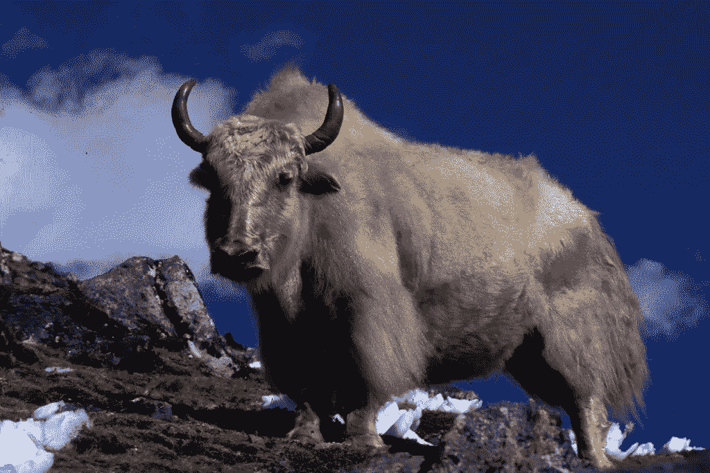

# 牦牛毛的细微差别

> 原文：<https://medium.com/hackernoon/i-spent-a-week-yak-shaving-instead-of-running-a-pricing-test-887477bd5fe1>

## “牦牛毛”是什么，它的微妙变化，以及如何识别它何时有助于或有损于你的生产力。

This fella could probably use a shave.

# “牦牛刮毛”是什么鬼东西？

牦牛毛是我最喜欢的术语之一。最初[是在我入学前一年在麻省理工学院](http://projects.csail.mit.edu/gsb/old-archive/gsb-archive/gsb2000-02-11.html)创造的，它已经被像[塞斯·戈丁](http://sethgodin.typepad.com/seths_blog/2005/03/dont_shave_that.html)和[斯科特·汉森曼](http://www.hanselman.com/blog/YakShavingDefinedIllGetThatDoneAsSoonAsIShaveThisYak.aspx)这样的传奇人物讨论过。最初的麻省理工学院线程总结得很好:

> 刮牦牛毛是你在做一些愚蠢的、繁琐的小任务，这些任务与你应该做的事情没有明显的关系，但一系列的 12 个因果关系将你正在做的事情与最初的元任务联系起来。

牦牛毛的有趣之处在于它有两种非常相似但又截然不同的用途。这是来自维基百科权威机构的消息。

1.  *任何明显无用的活动，通过允许你克服中间困难，允许你解决更大的问题。*
2.  *为了拖延一项更大但更有用的任务而有意识或无意识地做的一项不太有用的活动。*

在定义 1 中，牦牛剃毛*显然*没用，但实际上导致你目标的达成。另一方面，在定义 2 中，牦牛毛实际上是无用的——也是拖延的一种形式。

问题是要知道你实际上是在刮哪种牦牛的毛。它是必要的，有益的，快乐的牦牛还是危险的，诱饵，邪恶的牦牛？

Is this guy a helpful yak or a dangerous yak? Hard to tell, isn’t it.

上周，我认为我做得很好，但当然我错了。让我们看看那是什么样子。

# 牦牛刨毛在行动

以下是我刮牦牛毛的经历:

我需要运行这个定价测试，看看是否有人想购买我的产品。

我想这意味着我需要能够在网站上接受付款。

嗯，最好获得 SSL 证书，让人们知道它是安全的。

此外，要接受付款，我需要链接一个银行账户。

*我可能不应该用我的个人银行账户做这件事……*

我想我应该申请一个公司账户？

但是我还没有公司。

*我想我已经打算合并一个了…*

*C 公司？LLC？*

天哪，我必须选一个州吗？

我想知道税收会有什么影响。

*邮寄地址？呀，我住在南非……*

突然间，我发现自己在比较购物虚拟邮局服务，研究哪些州对小企业最友好(显然是特拉华州、内华达州和怀俄明州)，而我真正想做的是看看是否有人想买我的[座位卡](http://www.placecard.me/)！

尽管如此，在炎热的天气里，这些人仍然感觉像是 T4 的好牦牛。我不想做生意吗？我不需要接受付款吗？我最终不需要整理这些东西吗？

# 区分你的牦牛

区分必要的牦牛和拖延的牦牛的关键在于问一个简单的问题:

**有什么方法可以在不做这个任务的情况下实现我的首要目标？**

就是这样！如果答案是“是”，那么*不要执行任务*。如果答案是“不”，那就去做。*就这么简单。*

在我的案例中，有一种简单得多的方法让我不用做任何我认为重要的事情就能测试价格。很简单，假装。因此，现在我正在进行定价测试，我的 [place 制卡机](https://www.placecard.me/)上列出了价格，但我实际上不会拿任何人的钱。我有一个假设，用一个付费模板完成我的整个漏斗几乎和实际支付给我的一样好，这是我在网站上工作 10 分钟就可以进行的测试。

所以我就这么做了。该死的牦牛。

# 伪装的牦牛

你可能会这样想:“但是其他的东西呢？你不想创业吗？那不是*好*的作品吗？”

是的，是的，我做，是的，这是一个好工作。

那么是什么原因呢？我刚才不是说了那些都是坏主意吗？

不完全是。这种区别有点微妙，但希望有意义。

在我的定价测试中，它们是 T21 的坏主意。然而，从我可能的业务和生活的全球背景来看，它们并不是坏主意。这些任务实际上是一组完全独立的目标，它们伪装成我的定价验证目标的依赖项。

Sometimes your yaks are wearing disguises. Fortunately once you learn to spot them it’s pretty easy.

所以，只要原因很清楚，做这些事情是好的——甚至是好的——我知道我为这些原因投入了正确的时间和精力。对我来说，这个理由是*不是*测试定价，而是建立一项业务。

牦牛本身就是目的。

这是一个很重要的区别，因为我们经常为了方便而在主要任务上附加次要或第三目标。

与机会主义产品经理密切合作过的开发人员可能会认识到这样一句话:

> 当你在应用程序的这一部分时，也许你也可以添加这个小功能？

或者是来自一个不守纪律的工程主管的类似这样的话:

> 嘿，既然我们将再次在代码库的那个部分工作，也许我们应该做我们已经谈论了很久的模型重构…

这些都是棘手的情况，因为通常在一个领域利用势头来实现一些相关目标有很多好处。与此同时，使用优先目标作为强制功能来实现*非优先*目标是一件危险的事情，可能会在实际上并不优先的事情上花费大量的时间和精力。

如果第二个目标是伪装成一头牦牛，那就脱掉它的服装！让目标独立存在，然后——也只有那时——决定无论如何都要实现它。

【www.coryzue.com】最初发表于**。如果你喜欢这篇文章，我真的很感激你能帮助别人找到它！谢了。**

******

> *[黑客中午](http://bit.ly/Hackernoon)是黑客如何开始他们的下午。我们是 AMI 家庭的一员。我们现在[接受投稿](http://bit.ly/hackernoonsubmission)并乐意[讨论广告&赞助](mailto:partners@amipublications.com)机会。*
> 
> *如果你喜欢这个故事，我们推荐你阅读我们的[最新科技故事](http://bit.ly/hackernoonlatestt)和[趋势科技故事](https://hackernoon.com/trending)。直到下一次，不要把世界的现实想当然！*

**