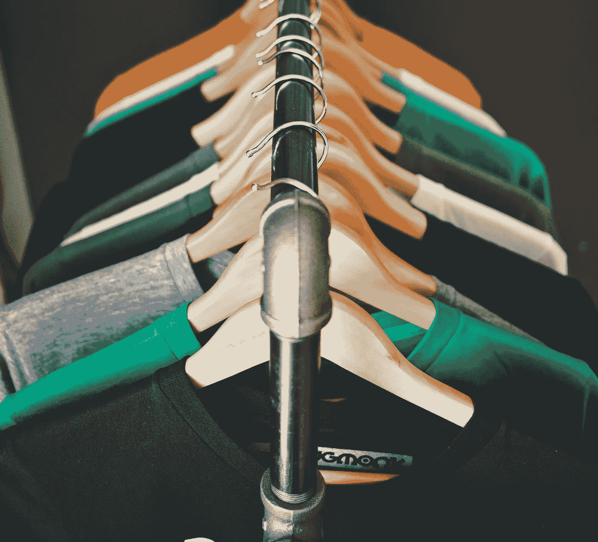

# 我在 24 小时内开办了自己的 t 恤公司，赚了 0 美元

> 原文：<https://medium.com/hackernoon/i-started-my-own-t-shirt-company-in-24-hours-and-made-0-1330b16e9470>

## 一个受网络传奇启发的异想天开的想法轰然倒塌

想赚点钱吗？你听到这个消息了吗？成为一名成熟的“企业家”最简单快捷的方法。开一家 t 恤公司！几周前，我偶然发现了一些文章:

*   [我如何用 24 美元在 24 小时内建立了一家在线 t 恤公司，第一天就赚了 347 美元](https://www.abetterlemonadestand.com/how-to-start-an-online-tshirt-business-24-hour-guide-challenge/)
*   [我如何在 3 周内建立了一家在线 t 恤公司并赚了 1248.90 美元](https://www.shopify.com/blog/50559813-how-i-built-an-online-t-shirt-business-and-made-1-248-90-in-3-weeks)
*   [如何在接下来的 24 小时内开始做 t 恤生意](http://www.tshirtriches.com/how-to-start-a-t-shirt-business-in-24-hours/)

当时，我已经在[设计一件衬衫来帮我和陌生人说话](https://hackernoon.com/hacking-social-interaction-with-a-me-shirt-6f57b6edcf37)。所以我想，见鬼，为什么不用我的一些设计来做一个 t 恤公司呢？看起来像是一个快速开始小生意和赚些外快的方法，对吗？

# 实验:精心制作网站

推出 t 恤网站非常简单，而且令人惊讶的是，非常有趣。

参照前面提到的文章的策略，我使用 Shopify 惊人的用户界面和网站设计来快速启动一个网站。Shopify 的第三方应用程序之一 [Printful](https://www.printful.com/) 让上传设计变得非常简单，可以按需向客户直接发货。

> 直运是指衬衫按需印刷，而不是在客户承诺购买之前就建立 t 恤库存。对店主来说价格更高，但对小规模经营来说更好。

现在，我只需要设计。我决定做一堆微妙的媒体参考，这样只有看节目的人才懂。我认为这是足够的利基，也很容易在各种在线论坛上销售。花了一天时间画草图后，我有了大约 20 个可用的设计。

我把价格定在一个极低的利润率——每件衬衫只有 2-3 美元，如果我卖出 20 件，就能收回启动网站的成本。对我来说，这个项目更像是一个实验，而不是真正的赚钱生意。

几天后，整个网站上线了！你现在仍然可以在 http://www.minimalshirt.com 看到它，直到我把它拿下来。

 [## 简约衬衫

### 设计简约的漂亮衬衫。受媒体启发，专为您打造。

www.minimalshirt.com](http://www.minimalshirt.com) 

# 营销…和失败

接下来，我必须告诉人们我做的这个很棒的网站！不幸的是，这是那些博客停止提供有用建议的地方。

其中一个博客提到了 subred dit[/r/shut up and take my money](http://reddit.com/r/shutupandtakemymoney)中的广告。这不仅在他看来是一个幸运的帖子，而且 subreddit 目前甚至不允许用户发布 t 恤产品(可能是在收到了太多像我这样的人的垃圾邮件之后)。

哦，妈的！我要把这些衬衫邮寄到哪里？

1.  我在我的社交媒体平台上发帖，比如脸书。
2.  我在每个节目的 subreddits 上发帖，最终在 Reddit 上有 7-10 个不同的帖子(这对社区来说有点失礼)。
3.  我在脸书张贴了各种演出的粉丝群，每组有几千人。
4.  我链接到了我在[的新博客。](https://hackernoon.com/hacking-social-interaction-with-a-me-shirt-6f57b6edcf37)
5.  我发了一份时事通讯更新。
6.  我测试了小型的 Google Adwords 活动。

积极的一面，我得到了很多喜欢和友好的评论！消极的一面是，只有两个访问过我的网站的人甚至试图在他们的网上购物车里放东西，他们中没有人完成交易。

# 我试了…但失败了

在这一点上，我用尽了营销网站的方法。

然后，我意识到:我真的期望卖出一吨这些吗？我所做的只是在一堆 t 恤上加上一些温和的创意设计。

博客帖子喜欢宣扬任何人都可以轻松简单地在网上做 t 恤生意。但没那么容易。博客没有告诉你的是，它们已经拥有成千上万的订阅者，与高流量网站的联系，或者在广告活动上花费大量资金。

不管怎样，我玩得很开心，也学到了一些有趣的东西。不管博客上怎么说，只要记住:成功不是你能在 24 小时内获得的。

喜欢这篇文章吗？请👏下面的文章，来表示你的欣赏😊。

更多像这样的内容在[https://www.stephencognetta.com](https://www.stephencognetta.com)。