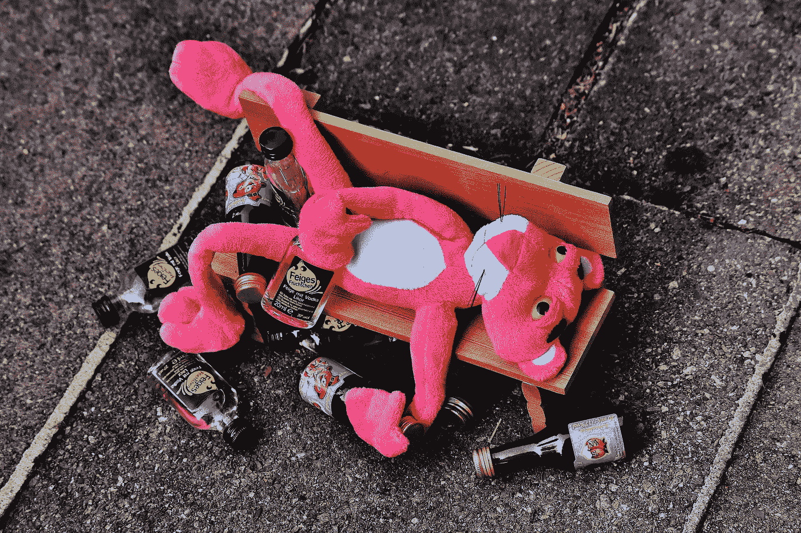
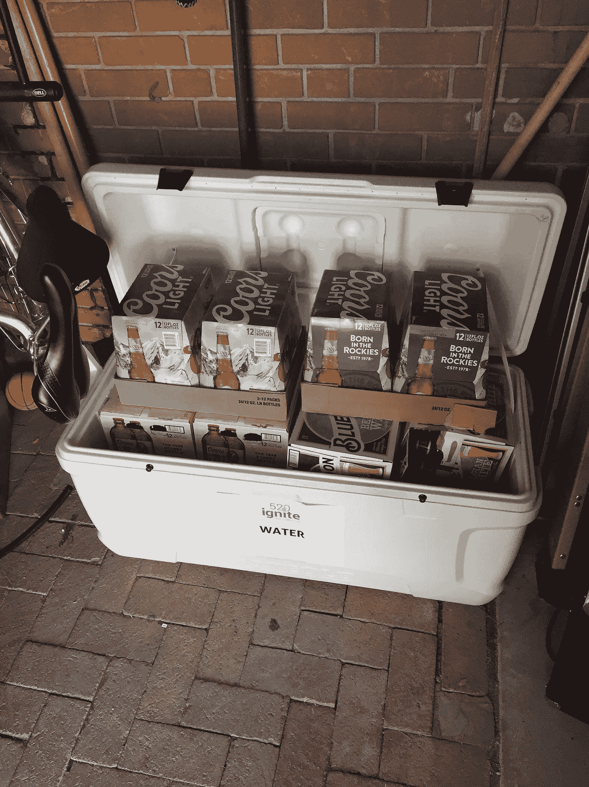

# 我戒酒 30 天了。事情是这样的。

> 原文：<https://medium.com/hackernoon/i-stopped-drinking-for-30-days-heres-what-happened-7e24135d42fe>

即时工作狂不能代替快乐时光。

从 4 月 10 日到 5 月 10 日，我完全戒酒了。在我可以开始喝酒的那天，我写了这篇文章的大部分，但是出于实验的兴趣，我决定等一等再发表。

你知道，以防万一出了什么大问题，我又回到啤酒上，毁了我的生活。原来，我还在这里。

我可以重新开始喝酒的那一天很有意思。因为我非常喜欢一杯又好又冷的精酿啤酒，我会以为自己会兴奋得头昏眼花，就像一个蹒跚学步的孩子在圣诞节醒来一样。

唉，我对这件事的漠不关心程度超出了我的想象。

但是让我们从头开始。

# 为什么我决定戒酒

我决定进行 30 天挑战的最大原因很简单:

> 我想知道我是否能做到。

作为一个午餐时经常喝啤酒的人，我喜欢在周末去酒吧和派对喝几杯来庆祝工作日，我想知道酒精对我的生活有多重要。

事实证明，我的“酗酒”对我的意志力没有任何影响。

我不会把这个挑战归类为“容易”，但它一点也不困难。从来没有一次我如此渴望完成挑战，以至于我把酒从房子里驱逐出去，或者在欢乐时光不和人见面，因为那是在酒吧。

为了演示，这个冷却器在整个挑战过程中一直坐在我的棚子里。

The “Water” sign wasn’t some weird psychological wizardry. It originally had water in it, I promise. I also understand that Coors Light is mostly water. It wasn’t mine. I also promise.

好奇心是尝试挑战的最大原因。我想看看如果我完全戒酒一个月会发生什么。

## 30 天后，我度过了职业生涯中最富有成效、财务上最成功的一个月。

然而，我不能说这两件事 100%正相关，但它确实有一个有趣的转折。

人们倾向于替代成瘾，而不是摆脱它们。对我来说，工作狂占据了上风。因为我没有参加社交活动，没有喝啤酒来让自己冷静下来，没有理由不在下午 5-10 点工作。

每天额外工作 3-5 个小时并不坏，但也不是积极的。作为 All-Fatheró-inn(是的，我是冰岛人。是的，我引用了挪威神)说的话，我是在转述，

> “凡事适可而止。”

适度和平衡是成为一个成功、全面发展的人的关键。因此，孤立的工作狂并不能解决你过去用来享受快乐时光的时间。

尽管我更有效率，但这并不一定有助于我的整体幸福。我只是为了提高工作效率而工作，而不是用这些时间去做其他的个人发展。那个月我在财务上的成功更多的是因为我挑战开始前的一个产品创造，而不是因为我的清醒。然而，该产品的发布发生在我的 30 天挑战期间，所以我不能排除某种程度的清醒头脑可能会增加它的成功。

以下是我在实验期间和之后的一些进一步的想法。

## 你有更多的精力

不出所料，宿醉会破坏你的能量，就像安娜“流氓”玛丽破坏你的变异能力一样。如果你喝得太多(尤其是在你 30 岁之后)，你会在之后的大部分时间里脾气暴躁，效率低下。清醒的早晨好处很大。你的睡眠质量更好，醒来时头脑清醒，工作日也更令人兴奋。

当然，我为自己工作，可以决定每天做什么，所以在这方面我很幸运。如果你讨厌你的工作，也许在僵尸状态下做更好。然而，如果快乐时光是你在工作日唯一期待的事情，也许问题不在于你喝酒，而在于你的职业选择？

没有宿醉，我的晨间生活会更加愉快。你可以在这里阅读所有相关内容，但不用说，当你想起床的时候更容易有一个好的开端。

## 平静

当我完全清醒的时候，我感到更加平静，并与我的情绪保持联系。此外，因为我从来没有宿醉，所以更容易坚持我的冥想程序。

冥想教你对外部问题做出反应，而不是反应。由于我完全清醒，而且比平时沉思得更多，我变得更加冷静，也更加意识到每一个需要我做出反应的情况。我会更有条理地回答问题，而不是不耐烦的下意识反应。

## 酒吧很无聊

如果你不喝酒，你不想去酒吧，但你仍然不想改变你的整个生活习惯，疏远你所有的朋友。

这是一个难题，因为当你不想要菜单上 99%的东西时，酒吧就失去了吸引力。一旦人群开始喝醉并大声喧哗，他们也会很快变老。

然而，你的朋友是你去酒吧的首要原因，而不是酒精。话虽如此，你还是会觉得尴尬，因为有一个不成文的社会契约，就是在你面前喝一杯。

> 解决方案？

*点一杯不含酒精的鸡尾酒。*图森的一些调酒师认真对待他们的无酒精鸡尾酒制作技巧，我为此感谢他们。

国会的卡梅伦甚至告诉我，

> "如果有人问你，你就告诉所有人，他叫汤姆·柯林斯。"

如果你说你不喝酒，人们往往会表现得很奇怪，但如果你告诉他们一种酒精饮料的名称，他们不会质疑你。

这里的要点是，你不应该仅仅因为你不喝酒就停止你的日常生活。你会因为手里没有饮料而感到难为情和怪异。这是一个心理问题，所以要确保你的双手有事可做。

在这次挑战中，我意识到我也只是喝得太快了，不管饮料的酒精含量如何。我以为我喝得很快，因为我想更快喝醉，但结果是我喝一杯苏打水也一样快。

我把这归因于我极度活跃的 A 型障碍，我想在谈话中的每一个停顿都喝一口我正在喝的东西，而不是一些潜在的酒精速度恶魔。

## 你很警觉

当你周围的人都是垃圾的时候，保持清醒是一种有趣的感觉。人们喝得越多，就越不会注意周围的环境。除了他们 3 英尺半径范围内发生的事情，他们与外界隔绝。这让人们看起来很滑稽，因为每个人似乎都忘记了他们在一个挤满了其他人的房间里。

因此，除非你专注地盯着某人并引起他们的注意，否则很容易把你无聊的夜晚变成人类学观察。

## 人们似乎对“想法”感兴趣，而不是“执行”

当我向人们提到我的挑战时，他们似乎很支持我，也很感兴趣。他们说“这样做很好”或“我应该找个时间试试”之类的话，但我听到的是，

> “这很酷，但我绝不会这么做。”

他们的声音中总有一种潜在的语气在暗示，是的，也许在一个完美的世界里，这将是有趣的，但他们不可能把这作为一个优先事项。我不怪他们。做完这个挑战后，我发现我也不想一直保持 100%清醒。

## 没人注意到你没喝酒

人们大多数时候都只顾自己，尤其是在喝酒的时候。我不是指卑鄙的方式。这只是一个非常诚实的观察。每个人都在为自己着想，他们应该这样做。这是他们生存本能的自然延伸。

因此，除非你告诉他们，否则人们不会注意到你没有喝酒。

我的朋友们习惯了我一直喝酒。他们甚至没有理由质疑我杯子里有什么，所以当我告诉他们我根本没喝酒时，他们会非常惊讶。不是那时，也不是在昨天我们一起出去的聚会上。

## 你存了这么多钱。

我大概每周出去 4-5 次。

这包括欢乐时光、周末郊游和早午餐。如果你也算上从杂货店买的酒，它就开始增加。

假设我每周去吃两次晚餐，晚餐时喝两杯。平均每次大约 12-15 美元(只算饮料)。我平均会去欢乐时光三次，通常一晚上会喝三杯啤酒。算上税金和小费，每次大概要 20 美元。

对于早午餐，我们很擅长寻找好的无底含羞草或便宜的饮料。然而，这仍然是每个星期天大约 10-15 美元。

然后，如果我在杂货店买一瓶 12 瓶的啤酒，我会花大约 20 美元。

这是一个估计，说实话，这可能是保守的。但结果是每周 125 美元或每年 6500 美元。这是一大笔钱，远远超过平均家庭收入的 10%。意识到你在酒上花了那么多钱会在很多方面造成伤害。

## 你更健康了

就像当你没有宿醉时更容易有效率一样，说服自己去锻炼也更容易。虽然总的来说我不需要太多的劝说去锻炼，但不管我是否喝酒，我去健身房的次数更多了。

我现在会去 3-5 次，而不是每周 2-3 次。30 天的时间可能不足以衡量任何可测量的身体结果，但我感觉更健康。没有每天 3-6 瓶啤酒带来的额外碳水化合物，我不觉得自己胖。我不能说我瘦了，但我确实感觉更强壮了。在那种情况下，我可能要感谢我的力量训练将我的脂肪转化为肌肉。

除了增加锻炼，我还会做更好的晚餐。我不再在欢乐时光喝几杯，然后懒得做饭，而是花更多时间在厨房，吃更健康的食物。

## 结果和想法

总的来说，这是一个有趣的挑战。现在我知道我可以很容易地做到这一点，并可以停止担心我是否会慢慢屈服于一些我没有的恶魔疾病。

挑战中最困难的部分是下午 5 点到 7 点的快乐时光。喝一杯干得漂亮的酒是如此的有意义，以至于很难放弃。

奇怪的是，晚饭后喝酒的欲望很快就消失了，因为那时我不想喝酒，因为早上可能会宿醉。这就是为什么下午 5 点至 7 点是一个非常好的时间段。你可以放松，享受一杯冷饮，而不会有任何巨大的职业后果。

最大的变化是我越来越工作狂。我意识到我工作太多了。挑战让我变得更有效率，但它并不一定让我的生活变得更好。

尽管作为企业家，我确实度过了最美好的几个月，但这都是不喝酒的结果吗？不，但是每天早上保持头脑清醒和周末工作很有帮助。

总的来说，我学到了很多关于意志力、生产力和替代习惯的知识。我不认为我适合戒酒，因为我太喜欢我的快乐时光了。但这让我意识到早起和高效也让我快乐。

对我来说，适度地平衡这两者似乎是成功的晴雨表。

或者像 inn 说的那样，

> “喝你的蜂蜜酒，但要适量，要么讲道理，要么保持沉默:
> 早睡的人不会被认为是失礼的

## 我帮助创意人员建立他们的网络形象，教他们如何在网上推广自己，这样他们就可以接触到更多的粉丝，做他们喜欢的事情，增加收入。如果这听起来像是你感兴趣的事情，[来打个招呼](http://www.bbenediktsson.com)。