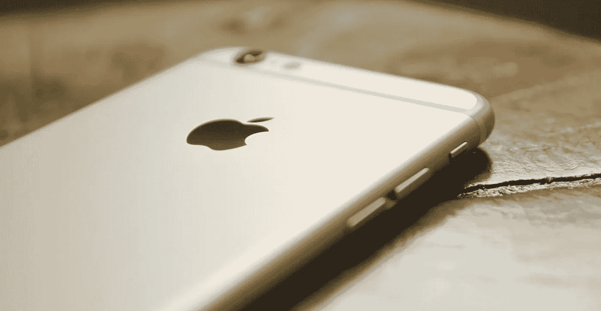

# 停止该死的压力，你的生存指南企业家的生活方式

> 原文：<https://medium.com/hackernoon/i-stopped-stressing-out-and-i-ve-never-worked-better-4f5eb1359979>

My head right now (photo via [James Douglas](https://unsplash.com/photos/P9G7dBP-7ZQ))

当你经营一家企业时，你需要过一种健康、轻松的生活。你不能把精力浪费在压力上。

当我开始我的公司——蓝宫(Blue House)时，一家在摩洛哥度假的 T2 初创公司，当时我还是一名科技记者，我意识到我必须做出一些改变。我的工作比以往任何时候都多，我无法增加时间。

## *所以我决定冷静下来。如果我摆脱了压力呢？我会更有效率、更有创造力、更快乐吗？*

现在，我和两个雇员经营一所房子，在一种陌生的文化中与摩洛哥会计师、银行家、房东和承包商打交道；在接待同事和创业公司、建立社区、寻找新客户、从事 SEO 和 PR 工作的同时，我感觉比以前在一家法国创业公司工作 40 个小时还要轻松。

如果像我这样压力大、爱发牢骚的巴黎人能够冷静下来，变得更有效率、更放松，那么任何人都可以。

我读了很多关于冥想如何对你有好处的文章，伟大的领导者如何在早上 4 点醒来并在睡觉前进行自省，日常锻炼如何帮助消除压力，人们应该如何度过整个周末。我做不到。我改变了一些小事情，它改变了很多。

## **花时间为一天做准备**

你一天的前 30 分钟决定了你一天的心情。如果你想度过充满积极能量的一天，那就投资你的早晨吧。

早上 6 点起床对我来说不是一个选择，但比正常时间提前半小时起床却是一个选择。

I don’t look quite as good when I do my morning stretching. Thank you iStock.

我在醒来后花 10 分钟逐渐苏醒过来，我呼气，在床上吸气，伸展身体，然后一旦我的脚着地，我就进行 7 分钟的锻炼，这要感谢一个应用程序，当我没有达到目标时，它会提醒我。

只有在例行公事之后，我才感到清醒，并准备好面对我的团队和我们的客人——是的，这就是我早上与人交往的感觉。和蛋糕上的樱桃，我为自己这么早就取得了这么多成就而感到自豪。

## **让自己放松一下**

如果你想在朝九晚九的时间里保持高效，你必须调整自己的节奏。

我知道我必须定期休息，以保护我的眼睛和恢复我的大脑，但我发现这很难，所以我下载了 T2 暂停，这是一个应用程序，它会每 40 分钟逐渐关闭我的电脑。

这也给了我一个很好的理由[给自己补充水分](https://zapier.com/blog/strengthen-willpower-productivity/?utm_campaign=Remotive%2B-%2BProductive%2BRemote%2BWorkers&utm_medium=email&utm_source=Remotive_-_Productive_Remote_Workers_30)，在房子周围走走，活动活动腿，让血液循环顺畅。

我也学会了不再为没有效率而感到内疚。当我觉得自己不能再工作时——通常是在三四点左右——我会休息一下。

喜欢写文章的人通常会说，你应该去散步或锻炼。我还没到那一步。我通常利用这些休息时间看电视节目。当然，我仍然在看屏幕，但我的大脑休息了一下，之后我感觉更开心了，所以我要说这已经是朝着正确方向迈出的一步，对吗？

## **划分区域**

当一次发生太多事情的时候，很容易被压垮，僵住。

保护自己免受不断涌入的信息，一次只做一件事会有所帮助。

我创造了清晰的时间段，在此期间我只专注于一项任务。我的手机进入睡眠模式，我不检查我的电子邮件，我警告我的团队，他们应该在那段时间自己处理事情。

我关掉了手机上的大部分 app 通知，强迫自己不再不停地查看手机。

Next step: intentionally forgetting your phone in another room (photo via [Marc-André Julien](https://unsplash.com/photos/vJ24hBps1qY))

我仍然花很多时间在脸书和 Instagram 上，回复我收到的所有消息，但我一次做所有的事情，一天几次，它不会从其他事情上偷走我的注意力。

习惯不总是查看手机，只专注于一项任务需要时间。但也很充实，很放松。

## **不再拖延**

阅读一封邮件，然后把它放在一边，这是让你不知所措的最好方法。

每隔几个小时，你就会想起你需要回复那封邮件，感觉你的待办事项清单长得让人无法忍受。你会想太多，在脑子里起草答案十几次，想象如果你写这个或那个会发生什么。

不要堵塞你的头脑。[如果不到两分钟](http://www.success.com/article/1-on-1-david-allens-two-minute-rule)，现在就回复你的邮件，然后就完事了。

推迟回复邮件或完成任务有两个主要原因。你要么不想做——等待不会改变这一点——要么你认为你需要更多的信息。也许你确实需要更多的信息，但这真的能让你的答案变得更好吗？额外的信息值得你花费所有的精力去完成这个任务吗？

艰难的讨论也是如此——赶紧结束吧！不要浪费你的精力去想它。

Celebrate, everyday (photo via [Morgan Sessions](https://unsplash.com/photos/YIN4xUBaqnk))

然而，我所做的最重要的改变是改变我的态度。

我决定开始欣赏我的努力工作。一整天，我记下我所完成的事情。在一天结束的时候，我会检查列表。

这还不是[自省](https://www.reboot.io/episode/8-introspection-changed-business-blaine-vess-jerry-colonna/)，但它帮助我以积极的方式结束一天，头脑清晰，感觉自己已经取得了很多成就。

> 如果你喜欢这篇文章，点击♥，这样其他人也可以欣赏。

# 如果你想要更多，[订阅蓝屋周刊](http://eepurl.com/bJzMTj)。

你将收到我们下一篇博文和一系列文章，了解你的身心需要什么，以及如何更好地工作和腾出时间。

**你可以在下面分享和评论这个帖子:**

> [黑客中午](http://bit.ly/Hackernoon)是黑客如何开始他们的下午。我们是阿妹家庭的一员。我们现在[接受投稿](http://bit.ly/hackernoonsubmission)并乐意[讨论广告&赞助](mailto:partners@amipublications.com)机会。
> 
> 如果你喜欢这个故事，我们推荐你阅读我们的[最新科技故事](http://bit.ly/hackernoonlatestt)和[趋势科技故事](https://hackernoon.com/trending)。直到下一次，不要把世界的现实想当然！

