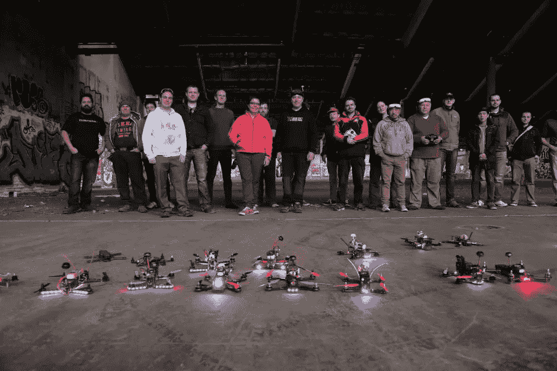
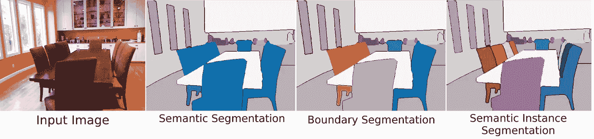
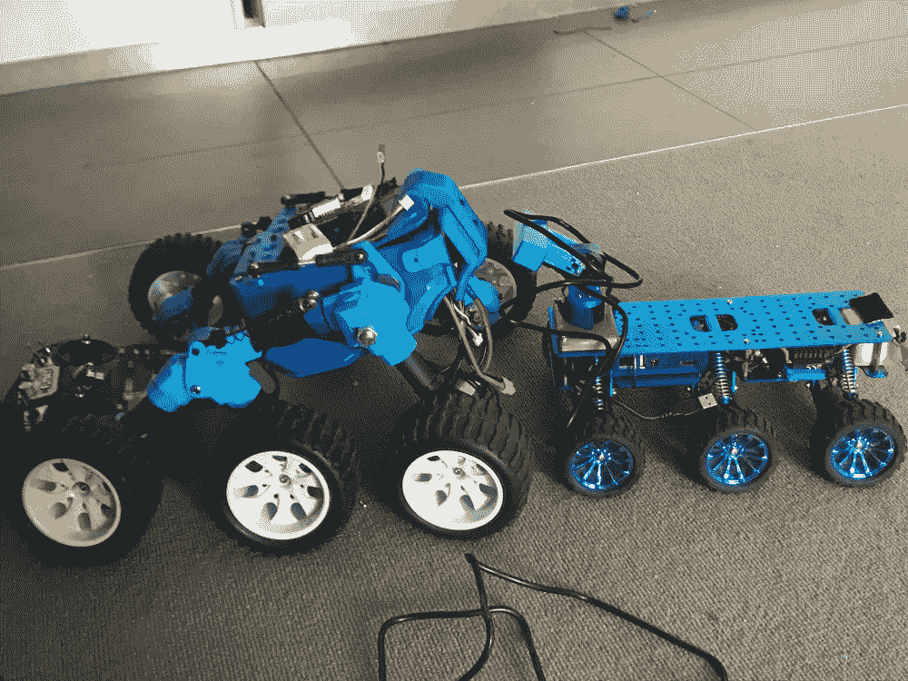
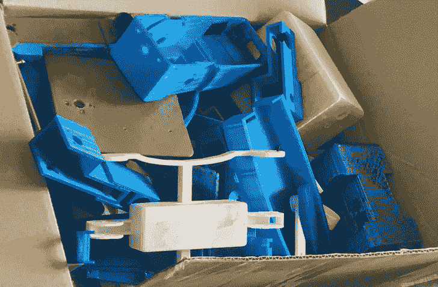
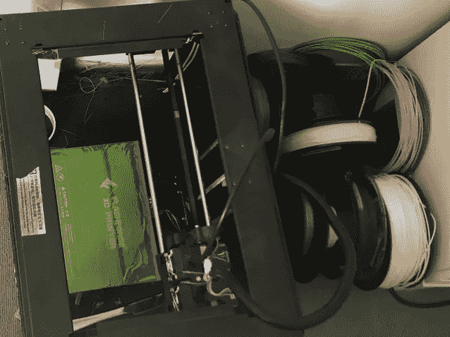
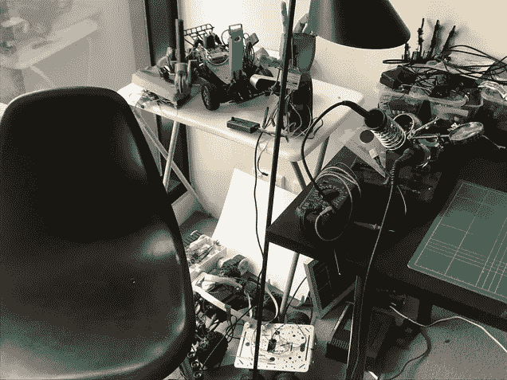
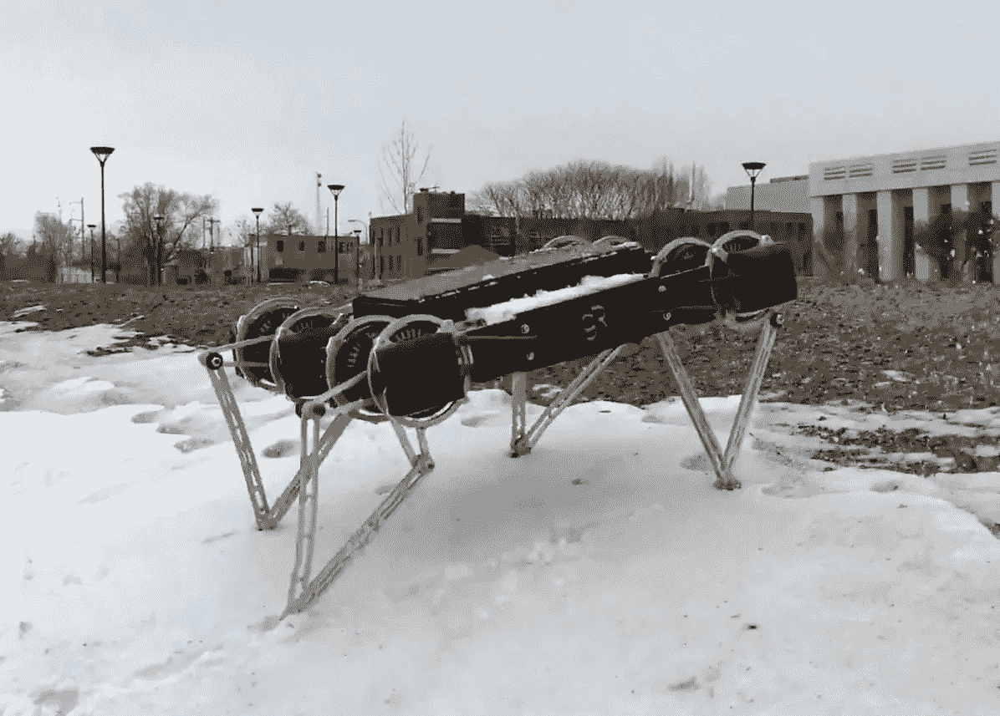
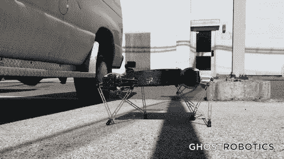

# 我努力学习了一年，现在我有了一份制造机器人的人工智能工作

> 原文：<https://medium.com/hackernoon/i-studied-hard-for-a-year-and-now-i-have-an-ai-job-building-robots-51acda72383c>

> 失业，漫无目的，晚饭吃面，我是怎么过来的？

我一直都是一个开发者:写代码让电脑吃掉再吐出来当有用的东西给人用。

但是在过去的几年里，我对软件开发的热情，每天坐下来写 8 个小时的代码，已经有所减退。我一直非常喜欢它，因为自从我小时候在我的 Commodore 64 上写了一个游戏，我就可以看到如果你能写代码，你就可以让屏幕世界里的任何事情发生。

因此，虽然建立网站和编写 iPhone 应用程序很有*乐趣*，但我发现，因为这些东西现在已经被很好地理解了，而且它们在桌面上和我们口袋里的屏幕上对世界的影响已经达到了极限，它们不再像过去那样*真正有趣了，*因为它们没有用代码扩展世界上可能发生的事情。

所以在 2015 年，在我工作的时候，我开始再次思考代码改变世界的潜力。从屏幕上的页面开始，网络、应用程序和手机现在已经以微小的方式进入了现实世界，并改变了许多人现在如何度过时间和谋生。从早期的网页来看，这是一个很好的进步，但是这一领域令人兴奋的新发展似乎开始触及 S 曲线的末端。

换句话说，代码已经尽可能地从它的屏幕和浏览器世界延伸到了现实世界。

我也是这么想的，直到我读到墨尔本的一小群人用零件组装无人机四处比赛。我记得在一个周五的深夜在办公室看了这篇文章，当时我正坐在那里更新一些网站文件，心想: [*我想去那里*](https://www.youtube.com/watch?v=2p1dS9hoptU) *。*

Code flies free.

这是代码有机会脱离屏幕，进入现实世界的地方。

于是接下来的两年，2016 年和 2017 年，我痴迷于[造](https://www.youtube.com/watch?v=zmHE9aB9EPc)和[飞](https://www.youtube.com/watch?v=KThrDFqO5wc) [无人机](https://www.instagram.com/p/BR2fij_huOD/?taken-by=tompjacobs)；有了这个想法，你可以买几个 10 美元的马达，把它们放在一个小框架上，再用[一些代码](https://github.com/betaflight/betaflight/blob/master/src/main/fc/fc_core.c)的魔力来平衡和控制空中的无人机，你可以创造一些东西，让你[变成一只鸟，打开人类从未见过的世界的新视角](https://www.youtube.com/watch?v=QnaGARBW3QQ)。在[本地](http://make-create.org/)制作者[空间](http://www.hackmelbourne.org/)的帮助下，看到永无止境的[恶作剧](https://www.youtube.com/watch?v=kuXkLwnx_ak)被报道，以及实际上有些有希望和有用的[报道](https://www.youtube.com/watch?v=cRTNvWcx9Oo)，似乎很清楚这里正在发生一些事情:代码有机会以一种它以前无法做到的方式与物理世界互动，让它扩展它运行的环境，从屏幕到天空。

与此同时，我不断听到这个疯狂的边缘开发小组谈论一些有着有趣名字的东西有多棒，比如 Torch、Caffe、CNN 和 AlexNet。他们似乎对这些技术非常感兴趣，认为这些技术似乎是解决问题的非常有效的方法，这些问题我早在大学学习人工智能课程时就研究过了，我们在那里解决了 [Wompus World](https://www.youtube.com/watch?v=FfPT2qlSkA0) ，这在当时似乎不是世界上最紧迫的问题，老实说，甚至现在也不是。这当然是在 TensorFlow、Keras、ResNet 和 YOLO(这两个都是你生活的文化理念，以及比人类表现更好的对象识别神经网络)之前。好吧，计算机现在比人类(记住，那是我们)更善于找到沃利在图像中的位置——这很有趣，有点可怕，但仍然，这如何改变事情？

Dining room. Understood.

随着这两个部分同时走到一起，是时候开始一个新的 S 曲线了。物理驱动遇到物理场景感知等于一个全新的、更大的代码运行屏幕:人类世界(以及超越的[)。](https://en.wikipedia.org/wiki/Mars_rover)

**所以我决定在 2017 年全年不工作，而是研究自动驾驶汽车、机器人、计算机视觉和机器学习。**

(在此期间，我也听说了很多关于比特币和虚拟现实的事情，但这些东西并没有真正帮助人们，除了一些有趣的游戏，以及在少数幸运的人之间重新分配金钱。)

2016 年底，我碰巧在谷歌园区附近的星巴克闲逛，在推特上看到[乔治·霍兹](https://www.bloomberg.com/features/2015-george-hotz-self-driving-car/)正在附近的一个活动上谈论自动驾驶汽车。于是我走过去，发现这是为了迎接第一学期入学的学生的 [Udacity 自动驾驶汽车纳米学位](https://www.udacity.com/course/self-driving-car-engineer-nanodegree--nd013)项目。很多人问我到目前为止是否喜欢这个项目，我以前看过，看起来很有趣，所以我决定报名。

完成[为期三年的 Udacity 自动驾驶汽车纳米学位](http://udacity.com/drive)令人大开眼界，也是重新开始享受编码的好方法。三个学期和许多项目之后，包括[学习](https://hackernoon.com/tagged/learning)如何控制转向和速度，使用模拟器，处理图像，检测车道线，以及理解传感器数据，我进入了最后一个小组项目，我们在加利福尼亚的一辆真实的汽车上运行我们的代码，希望它遵守交通灯，不要撞到任何东西。

Udacity 项目是这一年要完成的唯一明确定义的清单项目，但当然还有很多事情要做。因此，在 2017 年，我一年中的大部分时间都坐在墨尔本市的一所公寓里，从 1 月份开始，只有一间空公寓和一台笔记本电脑，到 12 月份，我的机器人实验室看起来像这样:

与此同时，看着 DIYRobocars 运动在美国的发展，我开始编写自动驾驶汽车的代码，并帮助组织墨尔本自己的[自动驾驶遥控汽车活动](https://www.instagram.com/p/BZ8HF9shTWd/?taken-by=australianroboticssociety)，让人们一起编写软件，让火星车和遥控汽车自己在轨道上行驶，绝对不要总是撞在一起:

The slow and steady rover on the left that gets wiped out at the end is the only autonomous vehicle in this video, the rest are old-fashioned human driven in this first event, clearly expert drivers all round

到 2017 年底，我已经探索了很多不同的获取代码的方法来探索它的新环境，有相机，激光雷达，深度相机，马达，手臂，手，轮子，腿，甚至麦克风。

但我确实开始觉得我只是在玩一年的玩具。10 月份我失业了，漫无目的，晚饭吃面。我是怎么到这里的？

大多数好事通常都有结束的时候，尤其是当钱用完的时候。所以到了 10 月份，我开始寻找可以测试我对自治和真实世界交互代码的兴趣的领域和公司。

当在网上看机器人时，[越来越大](https://www.youtube.com/watch?v=-7xvqQeoA8c)和能干的 Boston Dynamics 机器人当然会让[成为头条新闻](https://www.youtube.com/watch?v=fRj34o4hN4I)。Cassie 的能力很有趣，但仍然很大，很贵，而且看起来很精致。有很多的业余爱好者，很多有趣的轮式机器人制造商，机械臂有很多巧妙的用途，包括在咖啡馆端咖啡，用碳机器人制造电子产品，甚至有些人想到了无人驾驶飞机，并把它升级为有 T21 的交通工具。所有非常有趣的在现实世界中互动的代码的使用在人们的生活中是有用的。

但是最让我感兴趣的机器人是幽灵机器人公司的 Minitaur。

他们的[新一代机器人](https://twitter.com/Ghost_Robotics/status/929089811004186629)的静音直接驱动和低速齿轮电机以及简化的腿部设计看起来像是在做一些特殊的事情，他们有一种足够灵活的方法，最终消费者可以负担得起。它看起来很棒，所以我在 7 月份开发了自己的迷你版:

联系首席执行官，展示我建立的东西和我对公司的兴趣，我被邀请去面试，那里的小团队整理了一些关于电气和机械工程的问题，这很有趣，因为我的背景是计算机科学，而不是电气工程。我花了几天时间尽可能地收集答案，同时研究我以前没有深入研究过的领域。

随之而来的是一个挑战项目，它实际上直接涉及到我今年早些时候完成的两个 Udacity 无人驾驶汽车 Nanodegree 项目，所以这真的派上了用场。一个项目是获取相机图像流，并使用神经网络根据该图像驾驶汽车(这对自动驾驶汽车非常重要)，并改变这种情况以检测道路上的障碍并绕过它们(你必须时刻注意高速公路上阻挡你道路的[巨大立方体](https://www.youtube.com/watch?v=cEUJ4bplfg0))。结合使用神经网络来更新机器人规划路径的路点，使用 TensorFlow，Keras 和 Unity 模拟器，过去一年的学习都在一起。

我飞到费城去见他们，参观他们的办公室。在一起玩了几天并看到他们是如何工作的之后，这看起来非常合适，他们给了我一份工作。非常棒。

所以现在我已经飞回墨尔本，是时候申请我的工作签证了，通常需要一个月才能拿到，然后在一月份飞回来开始组装会走路的机器人，并用代码在现实世界中移动。

我迫不及待地想知道腿式机器人将首先部署在哪里，人们将如何与它们互动，以及它们最终将如何通过在真实的物理世界中与它们共存，而不是仅仅成为困在屏幕后面的软件机器人，来改善人们的日常生活。

Welcome to the real world.

他们说软件正在吞噬世界；我觉得还没开始呢。我想你会看到更多的例子，代码凭直觉理解人类的意图，并在我们从未想过它能达到的领域提供帮助。我们开始通过 Echo 和 Google Now 看到它；想象一下，如果你的 Google Home 可以像 Roomba 一样在你的房子里移动。

这是代码能做的一件神奇的事情。