# 我支持自由开放的互联网。我们让 SESTA 变得更难了。

> 原文：<https://medium.com/hackernoon/i-support-a-free-and-open-internet-and-were-making-sesta-harder-than-it-needs-to-be-a687bbabe52e>

Photo by [Daniel Huizinga](https://www.flickr.com/photos/dhuiz/14028728419/in/photolist-nnEUcV-p9KrD1-91Mfxj-YdobAw-ppKJi1-nUjuef-YhwGPx-WSKf3h-7iT3B6-Xf4ery-nDSJ8D-o6GJkm-e9dJRX-Ydobeu-5NXAyY-SCLbyg-TpwFWF-N9WU7d-6N6ff8-ntfHdK-5u3GKB-Sy5jCA-eSPUQx-9t5SdR-oyUfNb-TAGPPY-q6wEDX-RRLHNL-U5ew8V-6quZEq-6t9RRK-YeYEZh-97cr3b-TD5gd8-THENaQ-i4EbKo-bNocWx-saxAxd-bjT2iv-nDSxRJ-nW4NxH-bjT22g-qUe8wW-nDSy9s-i4EPvK-W69yzx-SFfZ65-i4ENE6-XUPWaY-8nxhJN)

周四上午，在参议院的一个办公室里，我们花了 15 分钟描述在线分销服务生态系统的怪诞细节，这种生态系统助长了员工家乡的性交易经济。通过几十张截图和图表，我们了解了它已经变得多么庞大和多样化，以及这种商业已经变得多么厚颜无耻和图形化。随着这些会议的进行，数据被睁大的、不相信的眼睛和深深的、近乎无声的吸气所接收。

我试图本着和解的精神重新开始讨论。“你看，我知道这是一个棘手的问题，”我开始说道。

恼怒的参议院职员打断了我，“不，罗伯。真的不是。”

这位员工的眼睛仍然盯着我笔记本电脑上的曲棍球杆生长图，喃喃自语道，“技术让这变得比它需要的更难。”

如果你关心一个自由开放的互联网，你会看到电子邮件、推特、博客、脸书线程、专栏和公开信，这些都是关于 T2 在参议院提议修改《通信体面法案》的。该法案的作者称之为《制止授权性贩运者法案》( [SESTA](https://hackernoon.com/tagged/sesta) )，该法案打算调整《CDA》第 230 条以终止其延伸至故意为性贩运提供便利的服务的责任限制。

该法案的出台紧随一个名为 [Backpage](http://backpage.com) 的网站的一系列成功的刑事辩护之后，该网站是目前美国卖淫广告的主要网站。在每一个案例中，Backpage 及其公司官员都成功地辩称，由于其运营的广告是由其用户创作的，该服务及其员工受到与从脸书到 YouTube 的任何用户生成内容网站相同的责任限制的保护。

在这些成功的防御之后，一个充满活力的在线服务生态系统如雨后春笋般涌现，使性交易经济中的分销成本低得惊人，达到了跨越市场的范围。这个生态系统变得如此庞大和无处不在，以至于我在去年 12 月离开了在软件初创公司工作了 13 年的职业生涯，全职致力于解决这个问题。

在创业恶作剧的过山车期间，我投入了大量的时间和适度的财富来维护一个自由开放的互联网。我们加入了来自数十家公司和组织的一群专注而有思想的技术专家，运用我们的智慧阻止了 SOPA 和 PIPA，拯救了网络中立性，维护了我们的网络隐私权。当我离开我的上一家公司时，我的一位金融同事开玩笑说，我们积累了可能是互联网宣传史上唯一的七位数电话账单。

自由开放的互联网不是我们被赋予的，而是我们通过深思熟虑的行动共同赢得的，这些行动是为了对抗比我们强大得多、资金充足得多的利益集团。

话虽如此，许多关于 SESTA 的争论已经变成了不必要的世界末日。如果你和我一样关心互联网，我想请你在决定如何处理这项法案的时候，考虑一下我学到的一些关于人口贩卖的知识。

这条路很长。

但这也是一个大问题。

# 问题是

虽然任何非法经济都难以量化，但即使是保守的估计也描绘了同样的画面:

**人口贩运是世界上发展最快的有组织犯罪活动。**

无论是查看[可观察到的资金流动](http://www.ilo.org/global/publications/ilo-bookstore/order-online/books/WCMS_243391/lang--en/index.htm)、[受害者报告](https://polarisproject.org/resources/2016-hotline-statistics)还是[起诉](https://www.state.gov/j/tip/rls/tiprpt/2017/)，事后数据都表明人口贩运的初始增长水平。这一趋势将在 2017 年继续加速，并可能达到历史峰值。

三个因素推动了这一增长。

## 金钱

第一个因素:一个比你想象的大得多的经济体。国际劳工组织提供了我所见过的最严格的经济利润估算。作为代表全球工人的联合国机构，他们 2003 年的报告估计全球人口贩卖经济每年产生 320 亿美元的利润。在他们 2014 年的报告中，年利润膨胀到 1500 亿美元。

举个你我都知道的全球消费品牌的例子，全球人口贩卖产生的年利润比苹果、微软、谷歌、IBM、思科、通用电气、迪士尼、波音、可口可乐和丰田的总和还要多。

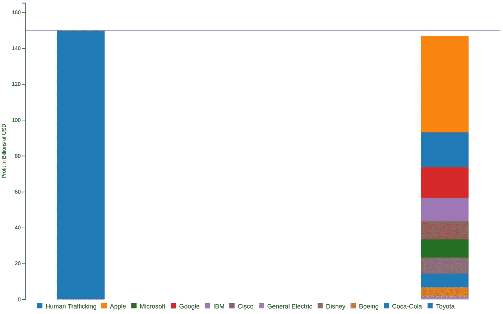

Sources: Profits and poverty: the economics of forced labour, International Labour Organization. — Geneva: ILO, 2014 and Wikipedia contributors, “[List of largest corporate profits and losses](https://en.wikipedia.org/w/index.php?title=List_of_largest_corporate_profits_and_losses&oldid=799793577),” *Wikipedia, The Free Encyclopedia, (accessed June 14, 2017).*

在这一总额中，强迫性剥削占全球 990 亿美元可观察资金流动的大部分，其中发达国家占了四分之一以上。这些估计表明，在美国，性交易比录制音乐更赚钱。

这种巨大的利润体现在地面上，即使是简单的小运营商也积累了惊人的财富。在 2013 年被捕时，[一名最终被定罪的纽约性交易者](http://www.nydailynews.com/news/crime/backpage-pimp-guilty-trafficking-teen-article-1.1438786)拥有几辆豪车和几十块现金，总计超过 20 万美元。

应该说，肖恩·布朗不是一流的罪犯。但是，通过他的三个，有时四个受害者的操作，一个免费的电子邮件帐户和几个一次性电话，他能够收集中等规模的毒品或武器贩运活动中看到的财富。

卖淫可能是一种低级的犯罪，但是大多数人都知道，性交易可以赚更多的钱。

## 风险

促成人口贩运经济高速增长的第二个因素是其监禁风险低。城市研究所在 2010 年进行的一项彻底的定性研究强调了 73 名被控或被判犯有强迫卖淫和人口贩运等罪行的个人对风险的看法。这一观点在采访一位皮条客的引文中得到了简明扼要的体现:

> 你不会因为拉皮条而被关起来。谁会因为拉皮条被关起来？

另一个答复者强调了从贩运毒品到性交易的转变:

> 游戏已经改变了。都是前毒贩子。每个曾经是毒贩的人都在这个游戏里。

流行的观点是因为它是真实的而发展起来的。美国国务院发布的 2017 年人口贩运报告列出了 2010 年至 2016 年在整个北美能够找到的起诉和定罪。

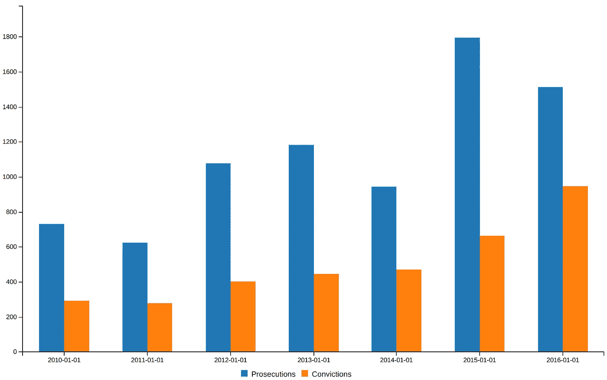

Source: “[Trafficking In Persons Report 2017](https://www.state.gov/j/tip/rls/tiprpt/2017/)," United States Department of State — Washington: USS 2017.

这些数据中令人震惊的部分是，大多数起诉和定罪来自美国联邦法院，美国助理检察官的定罪率约为 95%。即使是该国最挑剔的检察官也很难满足证明这些案件有罪的高额举证责任。对于地方检察官来说，尽管还没有人能够收集到大量的数据，但定罪率可能要低得多，因为地方检察官审理的此类案件要多得多。

如果我在布鲁克林被抓到携带一公斤可卡因，我十次有八次会被关进监狱。如果我被抓到贩卖人口，几率不会比抛硬币高多少。

## 便宜且容易分配

最后一个因素——也是 SESTA 打算解决的问题——是在线分销服务的激增所带来的进入和操作的便利性。虽然目前美国围绕性交易的大部分对话都集中在流行的广告网站 Backpage 上，但在这个经济体中，连接在线供需的生态系统增长非常快，很可能达到历史高点。

这个生态系统为性贩子提供了两个优于其他非法交易的主要优势。首先是低资本进入要求。如果我想在我的家乡布鲁克林区出售毒品，购买一磅产品的费用将在 10，000 美元到 34，000 美元之间:

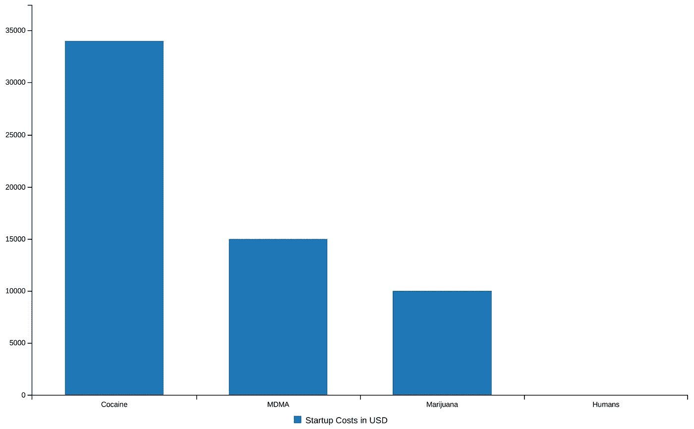

上图中几乎看不见的蓝色长条是 15 美元的一次性手机和 3 美元的封底广告，用来开始贩卖人口进行性剥削。

虽然性交易的收入潜力和毒品一样高，但启动成本几乎为零。

对于这 18 美元，广告客户几乎可以立即进入整个地理市场。我曾经共事过的一名侦探在曼哈顿发布了一则广告，其内容和照片暗示广告提供者是未成年人。

在一个小时内，这个广告收到了 450 个独特的回应。为了形象化这个频率，下面的每一个脉冲都是另一个有意购买未成年女孩性服务的买家。

发几个小时的短信，一整周的生意就可以从那个 3 美元的广告中预定下来。尽管用这样的术语来说是黑暗的，但没有任何其他非法贸易是如此高效。

总而言之，助长性交易的宏观经济力量，目前犯罪者:

*   赚的钱和毒品或枪支一样多
*   很少被抓到
*   起步比在曼哈顿吃一顿晚餐还便宜
*   几乎可以瞬间到达整个购买市场

钱是木头，风险是火。正如我们将看到的，廉价和容易的分配是喷气燃料。

## 增长

国家失踪和被剥削儿童中心(NCMEC)是最先意识到这种增长的机构之一。NCMEC 是向美国弱势青年提供服务的最大的全国性非营利组织。从 2010 年到 2015 年，[接到的拐卖儿童举报数量增长了 9.4 倍](http://www.missingkids.com/Testimony/11-19-15)。仅在一年之内，他们就看到被拐卖的受害者在他们服务的儿童中所占的比例从六分之一上升到五分之一。

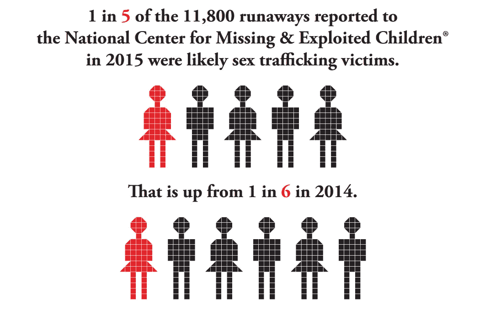

Source: [Child Sex Trafficking Inforgraphic, The Center for Missing and Exploited Children, 2016](http://www.missingkids.com/en_US/documents/CST-1in5_infographic2016.pdf)

性贩运受害者人数的增加预示着在线发布服务数量的增加，在这些服务中，性贩运受害者被刊登广告并接受审查。在 Backpage 开始赢得案件的时候，几乎美国每个市场的这个生态系统中的每个网站都开始增加内容量。

从 2010 年 9 月密苏里州第一起民事案件被驳回，到 2013 年他们成功反诉马里科帕县，推动这一经济的非 Backpage 网站开始繁荣。该图反映了美国一个主要市场中一个这样的网站的上升趋势。

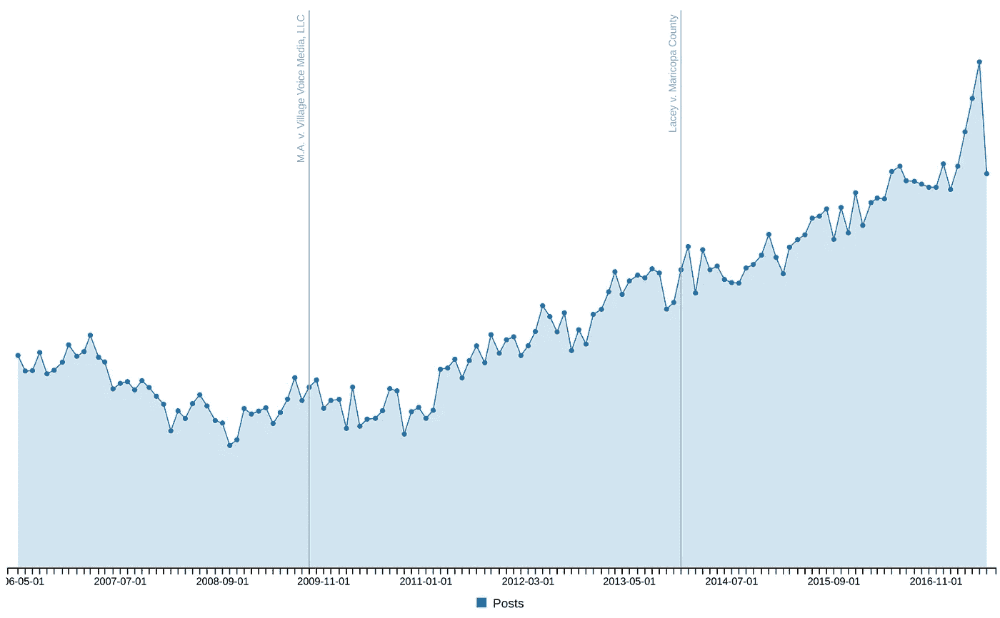

虽然 y 轴是隐藏的，以防止识别，但这一趋势可以在经济的这一时期存在的每个市场和每个网站中观察到。在这种经济环境下，一旦网站因提供内容而免于起诉变得显而易见，用户数量和内容总量就会加速增长。

一旦 Backpage 的法律浪潮开始上升，所有为这个经济提供在线分销的船只也随之上升。

# 分配

*【触发警告:以下内容变成图文。]*

Backpage 是目前围绕 SESTA 的政策讨论中使用的在线分发服务的主要例子，这是理所应当的。现在接近 12 起起诉，Backpage 还吸引了来自著名的《纽约时报》专栏作家纪思道的[讨伐](https://kristof.blogs.nytimes.com/2012/03/31/the-secret-owners-behind-a-prostitution-website/?_r=0)，[亚马逊上自行出版的电子书指南](https://www.amazon.com/Ultimate-Guide-Backpage-Ads-ebook/dp/B075HDY2YB/ref=sr_1_1?ie=UTF8&qid=1505605372&sr=8-1&keywords=The+ultimate+guide+to+backpage+ads)和似乎是广告商自己的市场[，正如一个受欢迎的比特币交易所](https://paxful.com/backpage)的营销所证明的。这也是 Mary Mazzio 的洞察力纪录片 [*【我是简·多伊*](https://www.iamjanedoefilm.com/) 的主题，记录了几位母亲的旅程，她们的孩子被非法贩卖。这部电影可以被公平地认为是围绕最近的立法活动的一股组织力量，目的是使该网站垮台。

但是，尽管 SESTA 的争论主要集中在一个网站上，Backpage 只是一个生态系统中的一员，这个生态系统已经变得比许多人所知道的更大、更多样化。这些网站分为几类。

## 广告

尽管很难描述，Backpage 和其他类似的广告网站服务于经济的供应方。提供者被贴上简短的，非结构化的描述，并附有 4-8 张照片，通常还有电话号码或免费的联系邮件地址。

生态系统的这一部分确实有相当数量的直接 Backpage/Craigslist 模仿者，但随着市场的这一方分层，一些趋势正在出现。

像 NSFW 这样的网站服务于高端市场。

像[三陪电话列表](http://www.escortphonelist.com/) (NSFW)这样的网站瞄准的是低端市场。

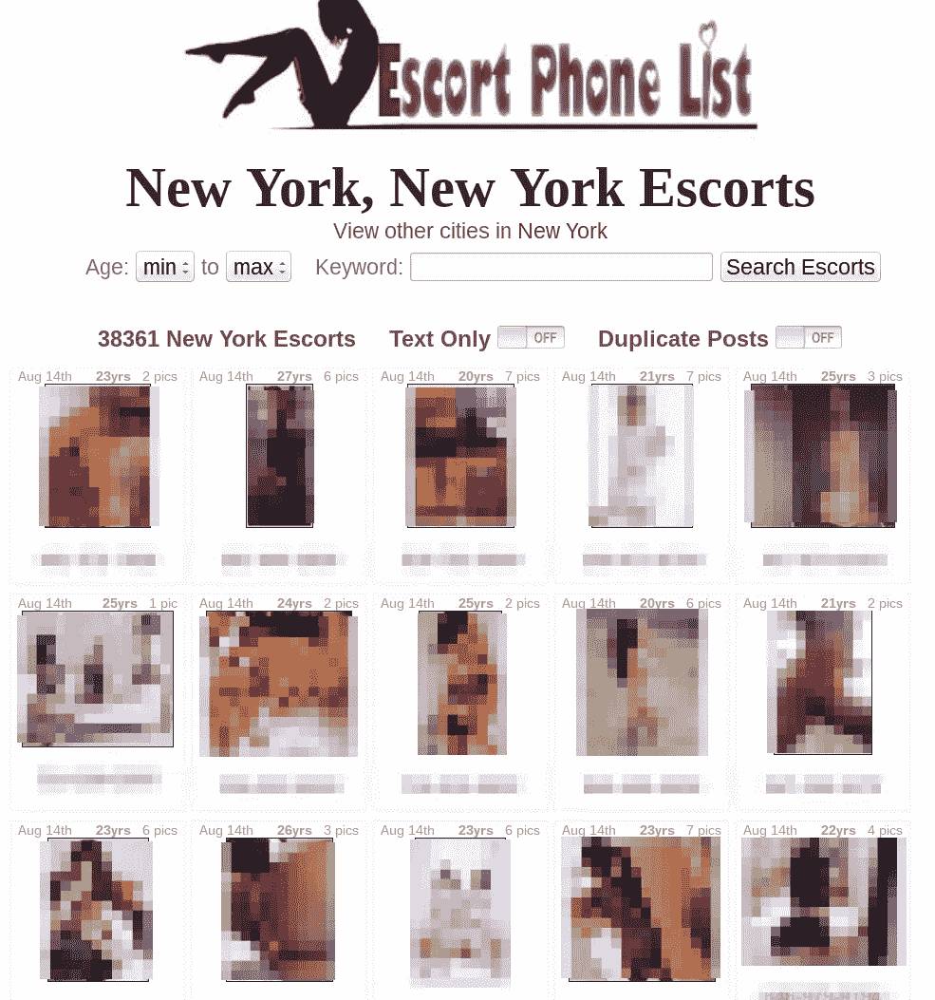

同一个所有者拥有同一个网站的其他皮肤，比如[大学里的护花使者](http://escortsincollege.com/) (NSFW)锁定接近法定年龄的目标提供者。

按摩巨魔 (NSFW)迎合了美国中部的需求，吸引了数量惊人的上市公司，甚至是小市场。

即使是 Backpage 的核心用户体验也在吸引激烈的竞争，像 [cityXguide](https://cityxguide.com/) (NSFW)这样的网站正在抢占市场份额，而 Backpage 的销量随着其持续的法律关注而下降。

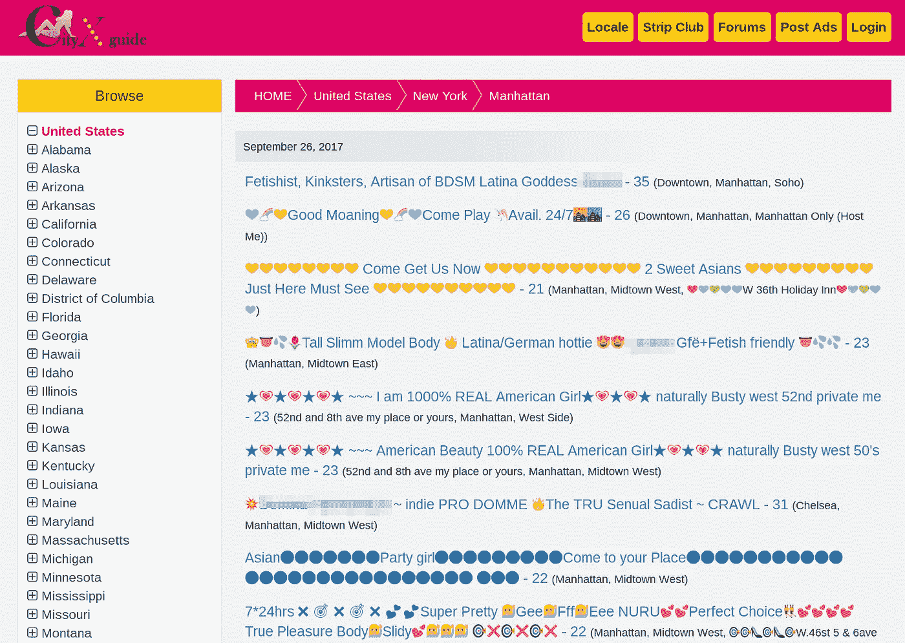

## 兴趣板

如果像 Backpage 这样的网站代表了经济的供给面，那么兴趣板就代表了需求。“爱好”是购买商业性服务的委婉说法，这些网站为“爱好者”(又名买家)提供类似 Yelp 的体验，以评价他们接受的服务。

像 Backpage 一样，用户可以搜索他们所在地区的提供商。在东海岸很受欢迎的是色情评论(NSFW)。

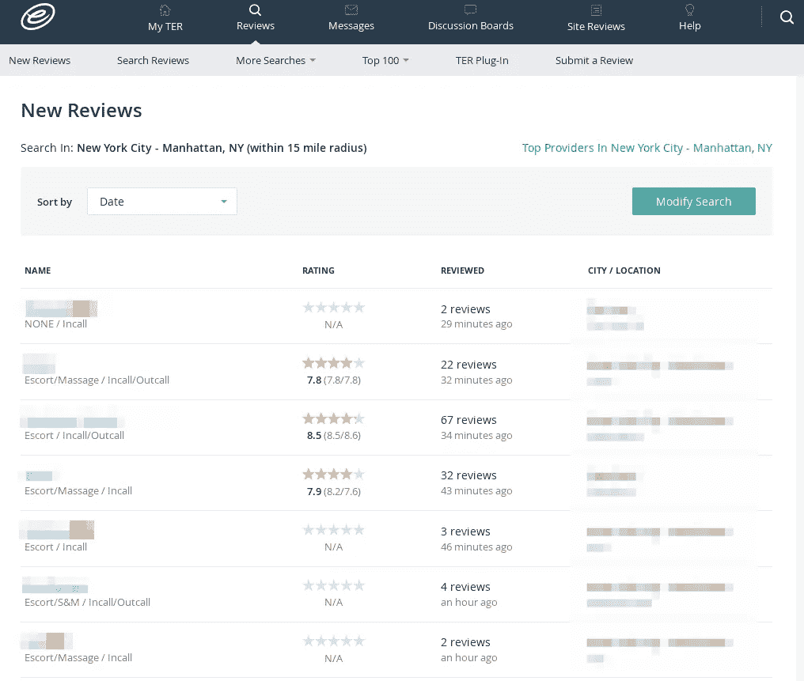

这些服务的列表比人们在封底看到的更加厚颜无耻和公开。

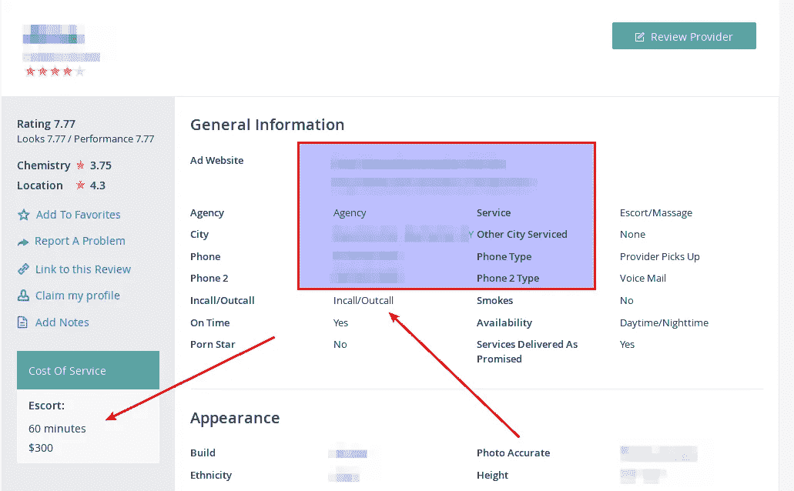

用户进入图形细节，对提供商的外观进行评级。在许多网站上，这些描述是无可争议的。

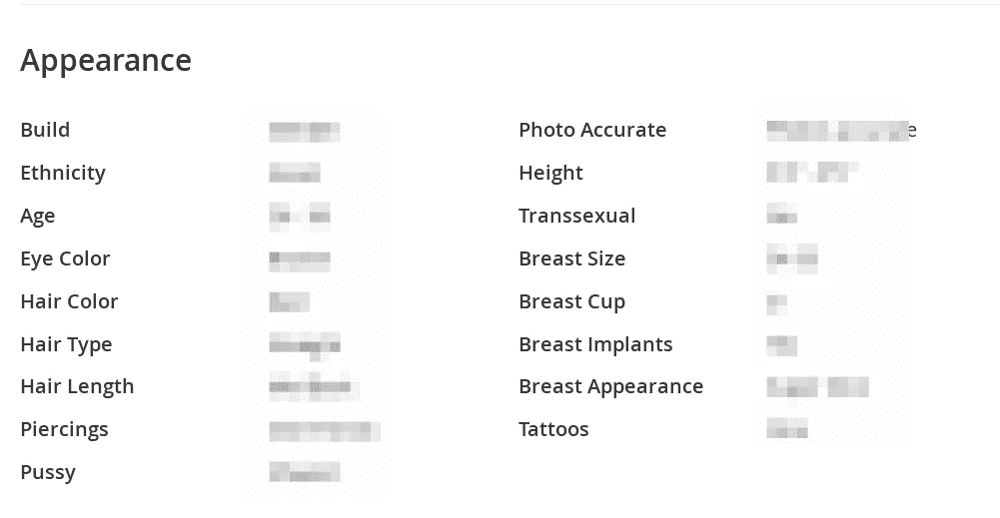

物理描述之后是用户提供的服务列表，感觉不像是 Yelp，更像是菜单。

色情评论远不是唯一的。RubMaps (NSFW)在西海岸很受欢迎。

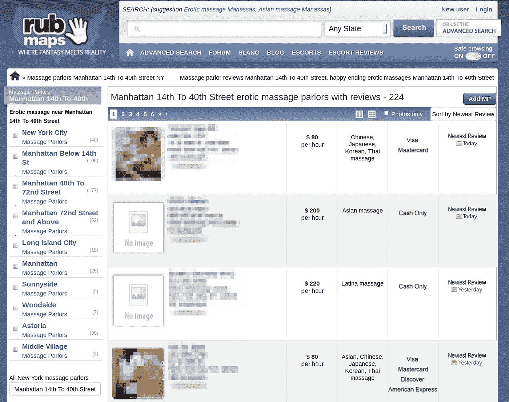

ECCIE(护送客户社区信息交换，NSFW)越来越受欢迎，尤其是在中西部地区。

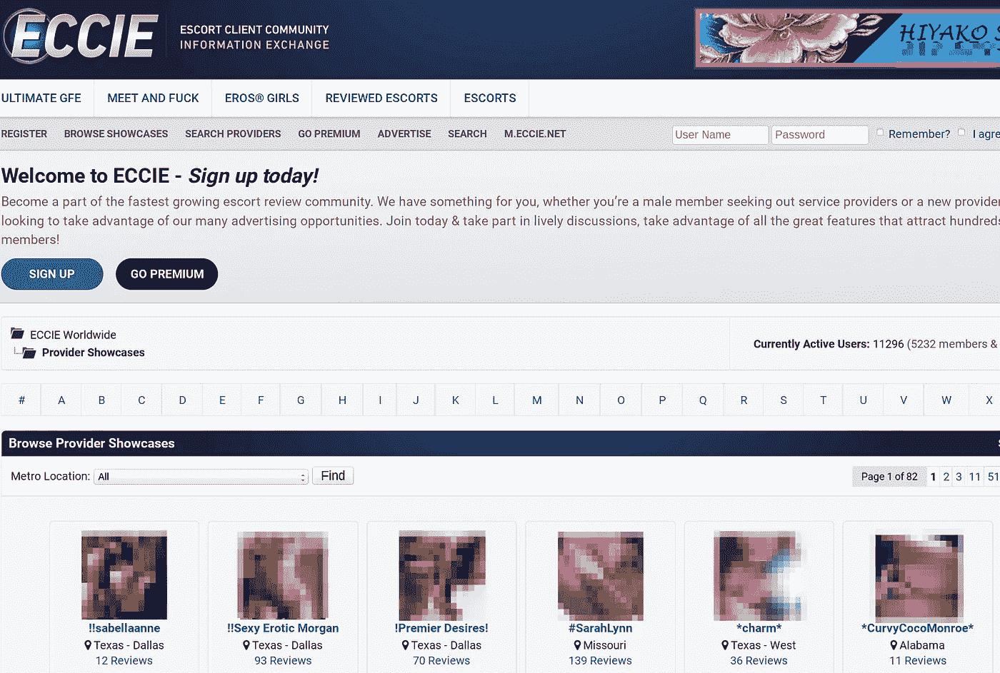

越来越多的兴趣板迎合特定的市场或机构类型。亚洲按摩院最受欢迎的是 SpaHunters。

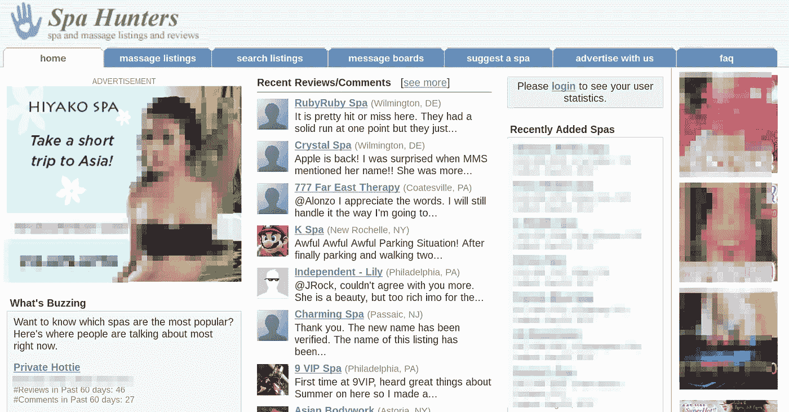

## 分销商生态系统

然后，越来越多的网站为分销商提供服务。这种不断增长的服务类别与其说是连接供应或需求，不如说是提供辅助服务来帮助配送。

这个经济体有自己的 SquareSpace 克隆版[护送设计](https://www.escortdesign.com/)，一个所见即所得的网站建设者，专注于高质量的设计。

[Paxful](https://paxful.com/) ，一个为 BTC 销售预付礼品卡和借记卡的比特币交易所，直接向广告客户推销。它甚至制作了一个 9 分钟的入门书，介绍如何交易和购买 Backpage 广告，并通过 Backpage 自己的界面提供了点击指南。

## 冰山一角

这些网站只是描述这个在线生态系统中的类型。几乎所有的城市都有四五个明显的模仿者，许多城市都有两三个特定的模仿者。对于这里列出的每一个，还有几十个可以被描述为类似的，都在一个强大、成熟和高度竞争的在线经济中活跃地上升和下降。

我选择了这些来分享，因为我已经看到至少有两个人口贩卖调查以某种方式涉及到他们。

# 为什么是 CDA？

所以我们知道贩卖经济是巨大的，并且以惊人的速度增长。我们也明白多样化和竞争性在线分销生态系统推动了经济发展。一个合理的问题是，这怎么会是《通信体面法案》的错。

这些网站和它们所服务的经济并没有因为 CDA 的信而增长，而是围绕 Backpage 的判决而增长的判例法。

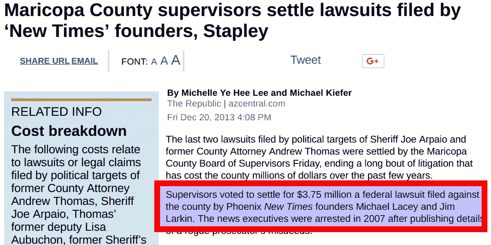

马里科帕县起诉 Backpage 的案件被法院以 CDA 为由驳回后，迈克尔·莱西(Michael Lacey)和吉姆·拉金(Jim Larkin)——网站背后的真正投资者——反诉该县非法逮捕。

经过一年的斗争，他们最终让县监事会同意了 375 万美元的解决方案。

近 400 万美元的反击有效地冷却了所有与任何看起来像后台的网站相关的执法活动。普通基金被这种诉讼击中的可能性，加上突破 CDA 防御的低概率，使得收购这些网站的风险太高，几乎任何机构都无法承受。

即使是少数有资源和莫邪试图起诉这些网站的人也被法院明确告知,《通信体面法》是铁定的。在仍在进行的由前加州司法部长、现任美国参议员卡玛拉·哈里斯提起的刑事诉讼中，针对 Backpage 的非法交易指控在一个月后被驳回。检察官带回了新的证据[，包括贩卖人口、拉皮条和金融诈骗指控](https://www.law360.com/articles/876738/backpage-execs-hit-with-new-pimping-laundering-charges)。

上个月，贩卖人口和拉皮条的指控[又被抛出](http://www.sacbee.com/news/local/crime/article168969032.html)。在那次裁决中，劳伦斯·布朗法官直言不讳:

> 如果国会认为有必要修改豁免法,《通信体面法》第 230 条的广泛适用范围甚至适用于那些被指控支持通过人口贩运剥削他人的人。

这份长达 18 页的裁决是经过几个月的审议和研究后做出的，试图用最清晰的司法语言表达出来:

起诉 Backpage 非法交易的唯一方法——以及任何类似的网站——是国会修订 CDA 的法案。

## 技术的合理关注

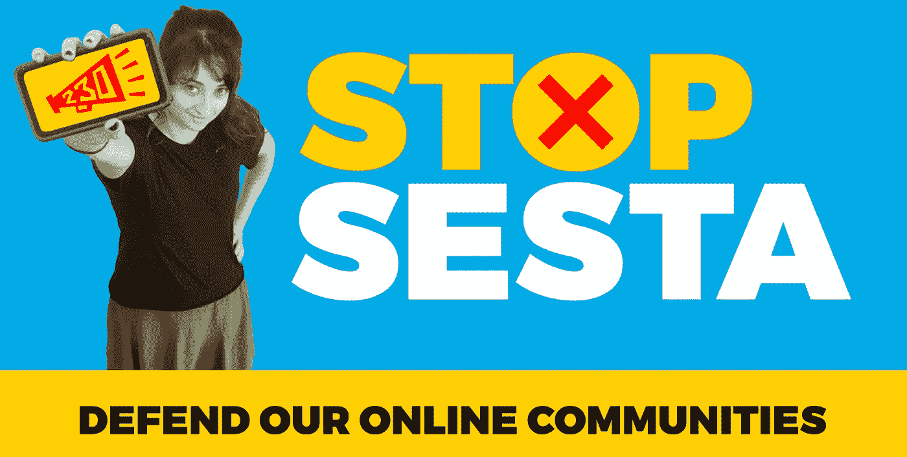

电子邮件活动的主题是“维基百科和 Reddit 关闭了？”“参议院正试图扼杀你的互联网”，呼吁行动链接到像 StopSESTA.org 这样的微型网站。如果它听起来像是科技界对抗 SOPA 和琵琶的成功运动，那么你的耳朵是真的。许多领导这场斗争的倡导组织强烈反对 SESTA。最大的科技公司本身不那么强势，但也在场[,它们站在反对的立场上，但与我们看到的 SOPA 和 PIPA 相比，它们之间的距离明显更远。](https://www.theguardian.com/law/2017/sep/07/online-sex-trafficking-backpage-bill-communications-decency-act)

对这一动态的一些报道是无益的愤世嫉俗。他们认为，脸书和谷歌资助中介机构的险恶用心是，现在花钱游说，以避免以后承担法律责任。他们进一步指出，唯一受欢迎的大型科技公司是第一代硅谷在职者[，他们希望对大型社交网站和大型搜索网站的独角兽群体](https://www.theverge.com/2017/9/14/16308066/sex-trafficking-bill-sesta-google-cda-230)实施报复。

我无法想象这种小阴谋会持续多久，当面对伴随这项立法而来的幸存者证词[。我敢肯定，这些大型科技公司的顶级律师最真实的担忧是，基本立法的微小变化可能会产生重大后果。](http://thehill.com/policy/technology/351364-senate-panel-takes-up-sex-trafficking-bill-opposed-by-silicon-valley)

CDA 杠杆的支点离力臂的边缘很远。现在的一个小动作会在以后引起很大的影响，因为我们现在正在学习 CDA 对促进性交易的网站的完全无意识的免疫。

## 范围问题的解决方案

考虑到这种合理的担忧，在试图将合法网站的责任范围最小化时，应该考虑对 CDA 进行修正时可以使用的一些刻度盘。真正推动经济增长的网站与你我使用的合法消费者互联网相去甚远。

需要的是手术刀，不是大刀。

首先，我们应该考虑“性交易”在法律上所代表的沉重的举证责任。性交易并不是卖淫的新同义词。美国的每一个州的法律都将卖淫定义为:1)受害者未成年，或者 2)受害者是在强迫、欺诈或胁迫下非自愿参与的。此外，它承担着与任何刑事指控相同的举证责任。武力、欺诈或胁迫必须被证明是无可置疑的。

仅仅在修正案中使用“性交易”这两个词就极大地限制了责任范围。

限制这项立法范围的第二个考虑因素是受害者的比例。NCMEC 报告说，在它现在每年收到的大约 10，000 份儿童贩运报告中， [73%涉及一个网站:Backpage](https://www.washingtonpost.com/local/public-safety/backpage-has-always-claimed-it-doesnt-control-sex-related-ads-new-documents-show-otherwise/2017/07/10/b3158ef6-553c-11e7-b38e-35fd8e0c288f_story.html?utm_term=.b661e5f0e390) 。证明一项服务中出现的受害模式需要大量的证据，并为合法网站提供许多机会来纠正其做法。

此外，在这种网络经济中，没有偶然的参与者。为了继续接受信用卡，这些操作需要执行的金融体操的数量吸收了这些操作的整个金融范围。将一个组织从卖淫相关广告、评论、营销或销售中获得的收入的很大一部分设定为起诉所需的比例，将有效地排除像谷歌或脸书这样的合法网站，同时将目标锁定在上述行为者身上。

最后，在围绕这个法案的前前后后中，操作者对犯罪的了解被用作主要杠杆。叫做*犯罪意图*，它设定了操作者在运行网站时展示的意志量。科技界提出的许多措辞表明，运营商必须知道一个人正在被贩运，才能根据这项新法律受到起诉。

以这样的标准对上述网站成功起诉的可能性很低。但是，如果对卖淫的了解与该组织总收入的一定比例相结合，该立法将成功地追踪这些网站。

一个典型的例子是在[的《波特曼/麦卡斯基尔报告》。在该报告中，参议院调查人员发现了 Backpage 高管通过任务管理票进行的通信，以对某些链接实施过滤，这些链接暗示了未成年贩运受害者，因为新闻媒体即将进行报道。](https://www.portman.senate.gov/public/index.cfm/files/serve?File_id=5D0C71AE-A090-4F30-A5F5-7CFFC08AFD48)

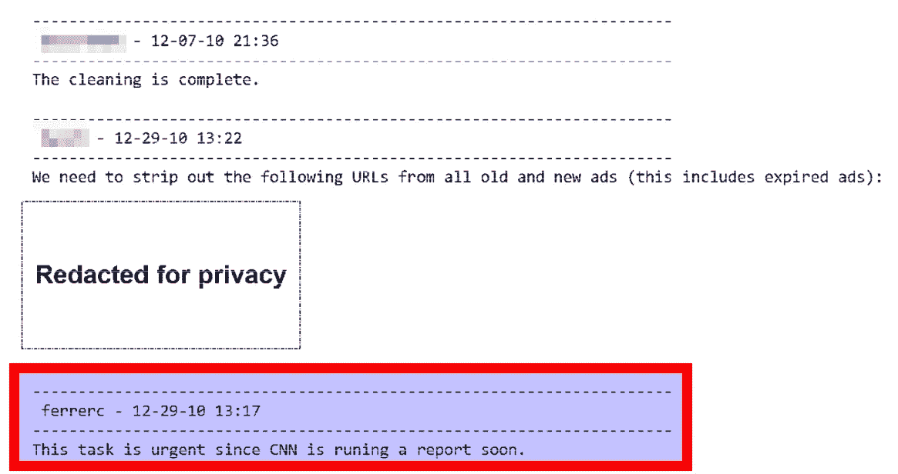

Backpage 开始剥离的网址和短语与更广泛的地下商业性经济有关。这种书面记录是任何合法在线服务运营商都不会担心留下的。

这些只是限制 CDA 变更范围的一些考虑因素。人们对这些网站及其运作方式看得越多，就越能清楚地看到犯罪意志和犯罪行为的明显模式，这些模式可以编入法律。

这个斜坡并不那么滑。

此外，每个涉及这项立法的委员会的每个参议员都渴望直接从科技公司那里获得反馈，特别是他们关注的问题。

这大概是你在新的华盛顿能找到的唯一能产生有意义的妥协的合理政策讨论。

# 你能帮上什么忙

嘿。你一路走到了最后。在互联网上，这意味着你非常关心这件事。

这个问题很大，而且还在增长。推波助澜的服务不受起诉的影响。国会需要出台一项法案来改变这种状况。它可以在不破坏你我如此关心的互联网的情况下发生。

你可以做很多事情来帮忙。

## 1)共享数据

该法案的决策者渴望了解这些网站的影响。分享这篇文章并写出你自己的文章将会把这些数据呈现在考虑这项立法的决策者面前。随着听证会的举行，标签#CDA230 在 Twitter 上很活跃。

## 2)询问工作中的 SESTA

唯一真正反对 SESTA 的是大型科技公司。如果你在一家大型科技公司工作，问问你的顾问和领导在这个问题上的立场和原因。分享你对这个问题的了解，为什么它对你很重要，为什么你认为妥协的语言可以解决他们的问题。

## 3)打电话，写信，拜访你的国会代表

考虑到政治气候，你有很多工具来帮助你打电话给在国会代表你的人。 [5 Calls](https://5calls.org/) 是由一些优秀的开发者开发的一个 rad 工具，用于给你的代表打电话——只需输入你的邮政编码就可以了。[resist bot](https://resistbot.io/)——也是由一些伟大的开发人员制造的——将带走你写代表的笔、邮资和痛苦。只需向 50409 发送“抵制”短信，它就会在几秒钟内帮你搞定一切。

最后，如果你这个月在华盛顿附近或经过华盛顿，考虑挤出一个小时亲自拜访。对你的代表来说，没有什么比你在他们代表你的办公室里的实际存在更重要的了。

不管用什么媒介，你将是今年唯一一个要求合理妥协的人，他们可能会和你交谈。

他们会非常高兴收到你的来信。

## 4)做一些香肠

最后，如果您以法律或政府关系的身份代表一个担心修订 CDA 影响的党派，请[联系我](mailto:rob@brooklynhacker.com)。关于网上贩卖经济的现状，我想你应该知道更多的信息。此外，有许多参议院办公室渴望听到你们对立法语言的具体关切。

一个自由开放的互联网和一个起诉宣扬性交易网站的框架并不矛盾。CDA 可以这样修改，我们的互联网仍然是自由的，而这些网站的所有者要去坐牢。

到目前为止，这些鮣鱼享受的免费搭乘应该会让任何关心互联网的人感到不快。经过几十年在线和离线的教育、宣传和抗议，一小撮不道德的经营者正在从他人的非自愿性奴役中赚取数百万美元。

结束这种免费搭车并不一定很难。只需要像您这样的技术专家来到谈判桌前。