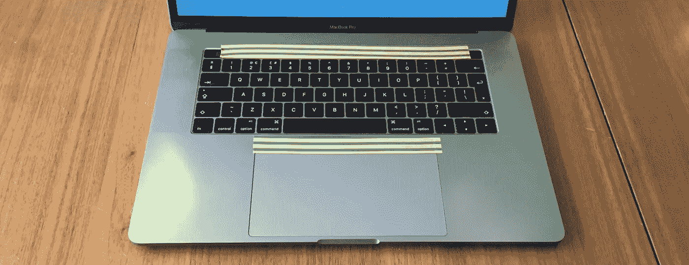
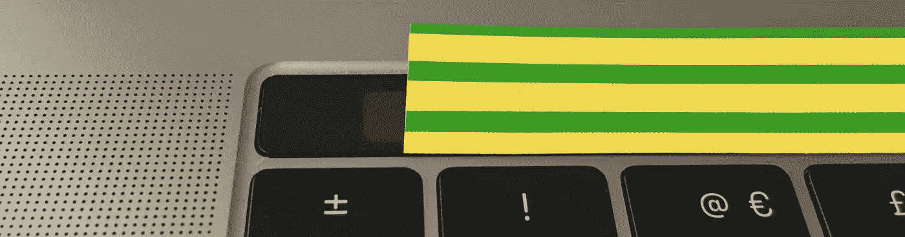

# 我试图修复我的 MacBook Pro 的 Touch Bar

> 原文：<https://medium.com/hackernoon/i-tried-to-fix-my-macbook-pros-touch-bar-43cc22fca932>

## 带绝缘胶带

£2000

如果你需要 15 英寸[MacBook Pro](https://hackernoon.com/tagged/macbook-pro)的大屏幕，你没有在键盘顶部设置实际按键的选项。相反，你会得到苹果公司所谓的[触摸条](https://hackernoon.com/tagged/touch-bar)。这是一个很糟糕的名字。如果你是一名触摸打字员，或者即使你刚刚使用 Mac 键盘很长时间，你也知道所有东西在哪里，不仅如此，你还可以通过触觉感受所有东西在哪里。利用触觉，你知道你的手指正在触摸哪个键，你知道如果你按下它会发生什么。你也可以选择不按下。

Touch Bar 从你身上移除了这些超能力，如果你想知道它要做什么，就强迫你低头看它。也没有不下压的选项。你手指表面的原子接触到它的神秘图标之一的那一纳秒，就完成了。没有第二次机会。它可能会更好地命名的外观，仔细思考，然后触摸吧。我叫它混账混沌猴。

它不仅能够通过意外触摸进行破坏性的操作，而且当您意外触摸到一些东西，发现您正在处理的内容发生了巨大变化，并且您不知道您触摸了什么，因为 Touch Bar 的整个布局也发生了变化，这可能会非常混乱。

所以我想，如果我能做到不小心碰到上面的任何东西，我就能回去工作，而不会有一只超级昂贵的混沌猴子坐在我的键盘上不顾一切地把我逼疯。

计划是:把绝缘胶带粘在 95%的混账混沌猴身上，只留下一条逃生键，因为你需要它。

我还想到，当我使用它时，我可以在触摸板的顶部贴一条带子，这样当我的左手拇指的一个原子停留在触摸板上时，它就不会在每次滚动时进入痛苦缓慢的 Exposé。

触摸板的改进似乎是成功的。尽管它仍然可以记录触摸和划过绝缘胶带，但在滚动过程中，它似乎已经不再将静止的拇指记录为第三个手指。

尽管 Touch Bar 隔着两层绝缘胶带，但它仍能把我的一天搞得一团糟，所以它开始了 b 计划。几周后再次收听，看看我如何用凿子把它凿出来，然后用锤子把它砸成碎片，然后在精心制作的驱魔仪式中烧掉它的残骸。