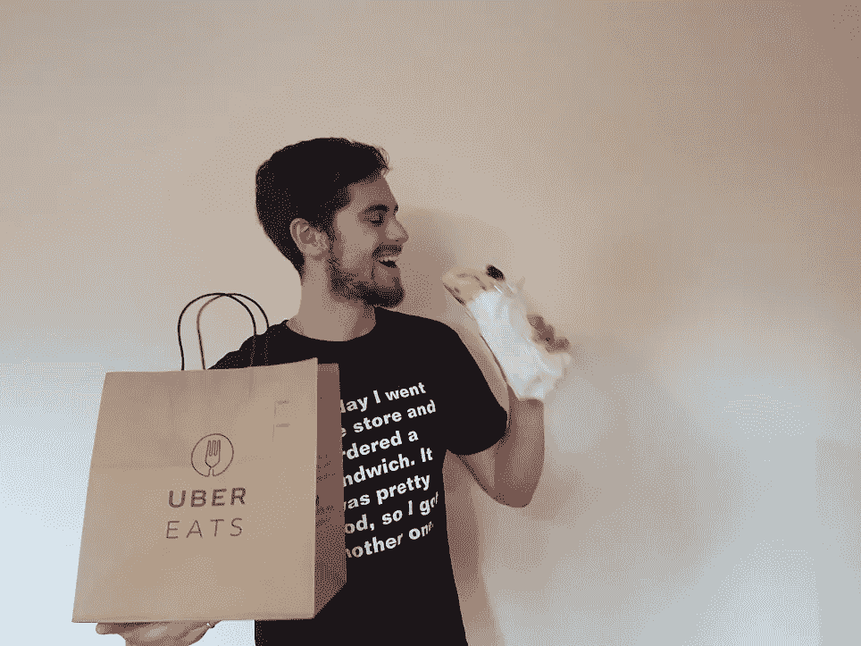
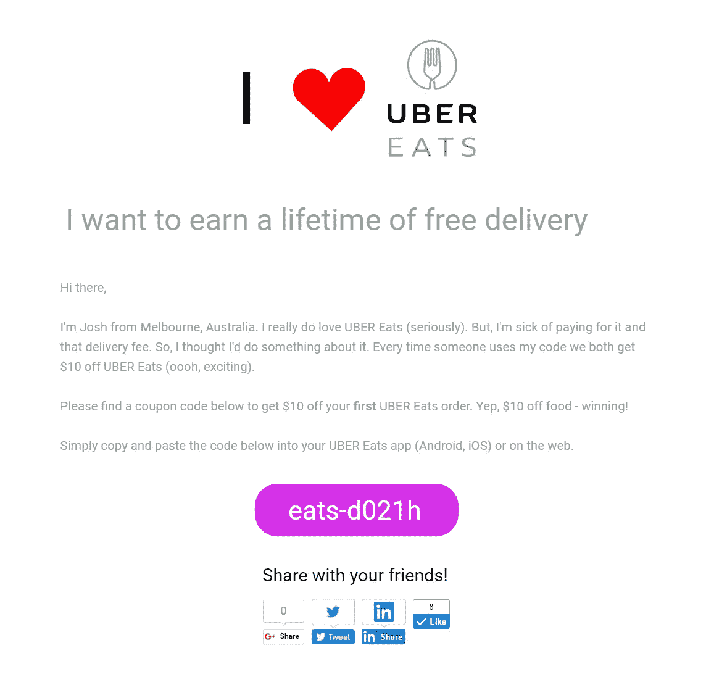
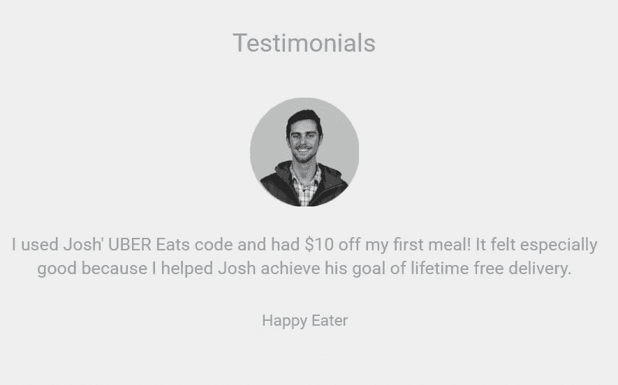
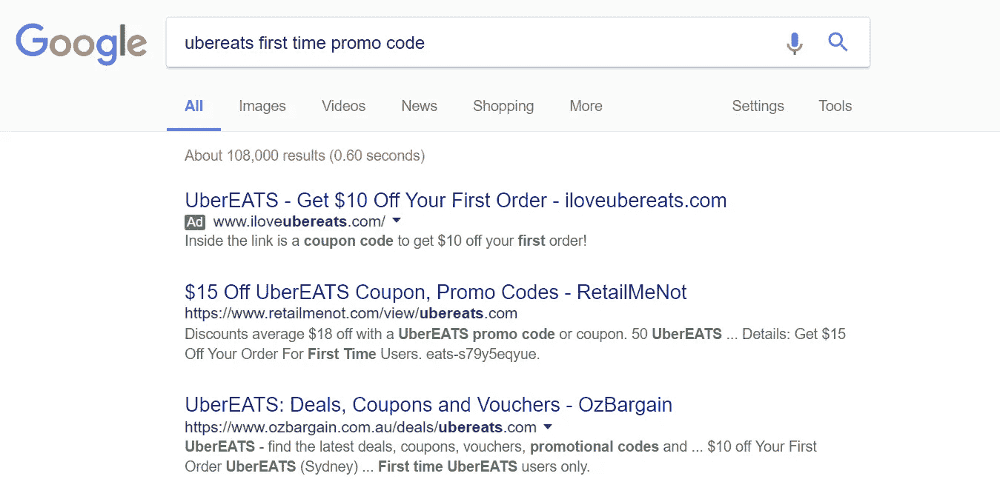

# 我把 1.24 美元变成了 1000 美元的 UberEATS 信用卡

> 原文：<https://medium.com/hackernoon/i-turned-1-24-into-1000-of-uber-eats-credit-a253df32a7d1>

我喜欢外卖。当 UberEATS 在我的家乡澳大利亚墨尔本推出时，他们提供免费送货服务。太棒了。

但是，有一天不可避免的事情发生了，无摩擦食品配送的乌托邦消失了——优步引入了 5 美元的配送费用。

所以，我想看看能不能再让自己免费送货。但这一次，我不会认为这是理所当然的，我要去赢得它。这就是为什么我创建了 www.iloveubereats.com[——这是我终身免费送货的通行证。](http://www.iloveubereats.com)

这个想法很简单。我创建了一个 URL，在那里我分享了我唯一的推荐代码。然后，我申请了一些免费的[广告](https://hackernoon.com/tagged/advertising)积分，并在我的网站上投放了一些广告，针对那些希望第一次使用优步 EATS 的人(这是我的推荐代码起作用的唯一方式)。

# 所以，我是这样做的

1.  **注册域名。**

通过使用 [Honey](http://joinhoney.com/ref/19h0xc) 我获得了显著的折扣，从 13 美元降到了 1.24 美元的域名注册费。这是我在这个项目上花的所有钱。如果蜜糖没有给你找到合适的折扣，也可以试试[小猪](https://www.joinpiggy.com/share?ref6=welcome&ov=390)。

2.**创建网站。**

如果你能直接制作一个网站，那对你有好处。这就是你需要做的。我选择使用一个名为 [Instapage](http://instapg.es/gzFhp) 的网站构建器(他们有 14 天的免费试用期)。你也可以使用 Wix，它在 14 天的试用期后会便宜一点。然后我写了一个小故事，并把我独特的 UberEATS 代码放在前面和中间，供任何人使用。

哦，当然，你需要一份证明:

Yes, I wrote my own testimonial.

**3。向 Google AdWords 注册，获得价值 75 美元的免费广告优惠券。**

你需要做的就是谷歌“谷歌广告词”，点击第一个链接。他们应该有免费获得你的第一笔 75 美元 Google AdWords 资金的步骤。这仅适用于澳大利亚，其他国家有不同的免费信用值。

注:你可以在其他平台(如 Bing)做同样的事情，我只是懒到饱了。

**4。为特定关键词设置在澳大利亚运行的在线搜索广告。**

每当有人搜索“优步吃优惠券”或“优步吃代码”或类似的东西，就会有一个小广告在旁边运行。它看起来像这样(它是你在搜索结果顶部看到的[广告])。

I probably could have refined and tested my copy, but side projects be side projects for a reason.

当你点击链接，你会被带到 www.iloveubereats.com，你会找到我唯一的推荐代码。

# 那么，效果如何呢？

嗯，超级有效。我花了大约 **66** **美分**的免费广告费来获得每个‘顾客’或**10 美元代金券**。然而，我实际上并没有支付这笔钱，因为它是免费的广告信贷。我为我的域名支付了 1.24 美元。这意味着我获得了 80，545%的投资回报。如果我们假设我真的支付了广告费用，我仍然会有 1，415%的投资回报。即使这些广告是付费的，我还是会杀了它。说到这里，每当我需要更多的钱来送货时，我会定期打开广告。

我的网站被浏览了 373 次。我的广告有超过 4000 次的展示，点击率为 9.29%。

我花在这件事上的时间比写这篇文章还少。这大约需要 3 个小时的工作。

Behold my glorious remaining credit.

# 我的信用额度在做什么？

嗯，每个代码只持续 3 个月。所以，就像任何一个梅尔伯恩人会做的那样，我已经安排了一个大豆白公寓，在接下来的三个月里，每天早上 7:30 送到我家门口。那就太好了，对吧？事实上，我一直在尽可能多的吃三明治和汉堡。

这就是你想要的。我这辈子从没吃过这么多外卖。

如果你想要网上任何地方的优惠券代码，请查看[小猪](https://www.joinpiggy.com/share?ref6=welcome&ov=390)或[蜂蜜](http://joinhoney.com/ref/19h0xc)。

如果你想建立一个像我一样的网站，请查看 Instapage 。你也可以使用其他网站构建器，如 [Wix](http://wixstats.com/?a=11555&c=124&s1=) 。

如果你在想，“这家伙是谁？”嗯，我在澳大利亚墨尔本经营一家数字营销咨询公司，是一名纯素食营销专家。我很乐意让你去看看。

如果你在想，“但是，Deliveroo 呢？”别担心，[我爱 Deliveroo](http://www.ilovedeliveroo.com) 活蹦乱跳的。

如果你是优步，你在想，“我们应该拿走他所有的荣誉吗？”—求你了，不，我真的很想要。 ***您现在拥有 100 名新的 UberEATS 顾客*** ，尽情享用吧！

如果你坐在那里想，“我能做同样的事情吗？但是，我不想费心去设置这一切。”请给我发邮件，邮箱:Berg Josh(at)Gmail . com——乐意效劳。

有什么问题吗？我很乐意在评论里聊天。:)

> [黑客中午](http://bit.ly/Hackernoon)是黑客如何开始他们的下午。我们是 [@AMI](http://bit.ly/atAMIatAMI) 家庭的一员。我们现在[接受投稿](http://bit.ly/hackernoonsubmission)并乐意[讨论广告&赞助](mailto:partners@amipublications.com)机会。
> 
> 如果你喜欢这个故事，我们推荐你阅读我们的[最新科技故事](http://bit.ly/hackernoonlatestt)和[趋势科技故事](https://hackernoon.com/trending)。直到下一次，不要把世界的现实想当然！

