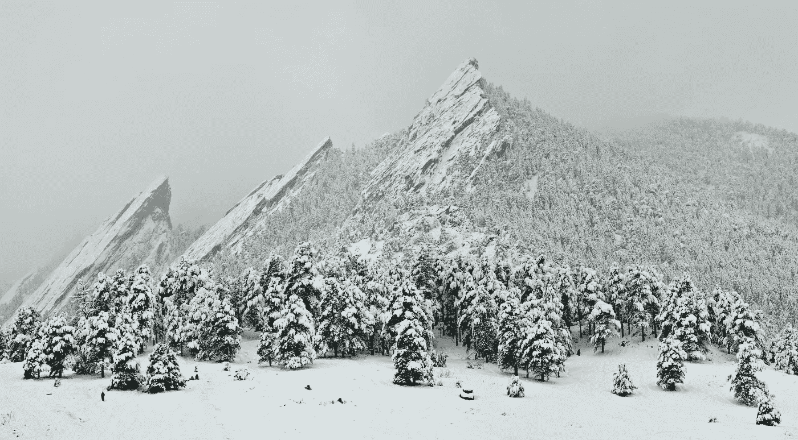

# 我曾经是一个怀疑论者，但 Techstars Boulder 的前两周让我大吃一惊。

> 原文：<https://medium.com/hackernoon/i-used-to-be-a-skeptic-but-the-first-two-weeks-of-techstars-boulder-have-blown-my-mind-d05c6fc55c91>

## 我以为我不需要任何帮助。我错了。

> “成熟情节——关于成长的情节——是非常乐观的情节之一。有一些教训需要学习，这些教训可能很难，但最终角色会因此成为(或将成为)一个更好的人。”
> 
> 罗纳德·托比亚斯

他的故事始于 2016 年的秋天，当时我正和我的一位投资人和最亲密的导师通电话。我们在谈论[精装版](https://medium.com/u/6b2dd8a24e2f?source=post_page-----d05c6fc55c91--------------------------------)的进展和资金情况，他提出了一个建议，我必须承认，当时我并不太喜欢:

> “你考虑过申请 Techstars 吗？”

我没有。

在我看来，[启动](https://hackernoon.com/tagged/startup)加速器并不是一个明智的选择。他们以最小的投资(2 万)获得你公司的大量股权(6%)，并通过给你大量的“建议”和把你塞进他们的“网络”来证明他们高昂的价格是合理的。

不用了，谢谢。

这并不是说我贪婪地尽可能地保留最大的所有权。这是我的第一家公司，我想和最优秀的人合作。我知道我们有很多东西要学，单靠自己是做不到的。如果这种关系是真正一致的，我希望他们拥有平等。

在我看来，问题在于我们得到了所有需要的建议。甚至可能*太多的*建议！我们有一大群投资者，他们在我们的种子期前投资了我们，现在我们只需要执行。我觉得参加某种加速器项目会让我分心。

但是还有其他的东西。

我有点像独行侠。我真的不是一个“群体”的人。每次我在一个创始人的推特简历上看到类似“YC·S12 的创始人”之类的东西，都会让我觉得他们在情感上需要属于某个群体。展示这个荣誉徽章来证明他们不为人知的创业确实很特别。

所以那天我和导师通电话的时候，他建议我们申请 Techstars，我没有认真考虑。

> 成熟情节的主角通常是一个富有同情心的年轻人，他的目标要么是困惑的，要么还没有完全成型。他漂浮在生活的海洋上，没有舵。”

我们的应用做得很好，但增长并不完全是爆炸性的。

苹果将我们评为“最佳新应用”，Fast Company 将我们评为 2016 年十大应用之一，因此我们获得了相当稳定的下载流，但这一切都完全超出了我们的控制。这就像我们依赖于来自天堂的闪电，当某个拥有大量观众的人决定他们喜欢我们的时候。

我们花了 90%的时间只是执行，并没有花太多时间去调查大问题。我们不相信任何一种结构化的工作流程会有那么大的不同，所以我们只是在其中一人觉得有话要说的时候进行临时对话。

That was us ^

我们的银行账户正在慢慢减少，我知道我们需要尽快采取行动。

因此，我安排了一系列与潜在种子期投资者的电话交流，以了解他们的情况。有些人喜欢我们，有些人认为我们的想法没有意义。我记得在一次会议上，一位风投毫不夸张地告诉我，“这不是一个令人兴奋的机会。”不得不给她的诚实加分！

起初，一些对话让我受到鼓舞，但我越深入了解，就越清楚我们还没有为种子期做好准备。他们支持我们，但甚至没有扣动扳机。

我们的计划不够清晰，不能在没有惊人增长的情况下进行投资。

我不知道该怎么办。

> “他经常摇摆不定，不确定该走哪条路，该做什么决定。这些无能通常是缺乏生活经验的结果——幼稚。

在这个过程中的某个时候，我不情愿地得出结论，我们很难筹集到种子资金。

有一天，我和乔(我的共同创始人)在工作中谈论这件事，Techstars 出现了。他们在尽可能早的阶段投资公司，所以我们认为这比筹集大量种子资金的机会要大得多(许多初创公司在通过加速器计划后*都会这么做)。*

我们上了 Techstars 网站，开始四处打探，试图了解更多。

申请两天后到期。妈的。

我们花了整整一个下午的时间收集他们所要求的数据，构思他们问题的答案，并录制了一个简短的视频。

我还是不确定我想不想做。

> “这给我们带来了考验。催化事件。突然有东西出现，重重地打在他的脸上。这个事件必须足够强大，才能引起主角的注意，并真正动摇(他的)信仰体系。”

几周过去了，我们得到了一些好消息:我们的前两名候选人(Techstars NY 和 Techstars Boulder) *都想采访我们。*

我们接到了电话，发现我们与 Techstars Boulder 的工作人员相处得非常好，但我们与 Techstars New York 的化学反应稍差。

这对我们来说有点糟糕，因为我们的公司位于纽约，乔和我都不愿意搬到博尔德 3 个月，远离我们的女朋友/生活。

又一周过去了，我们收到一封邮件:我们没有进入纽约 Techstars。妈的。

旁注:即使你不确定自己想要什么，当你得不到的时候还是会心痛，这不是很有趣吗？

然后，我们收到了另一封电子邮件:Techstars Boulder 希望有第二个电话。我仍然不确定我是否想做这件事，老实说，我有点反对这件事。所以我把这个电话看作是我们和他们讨论所有问题的机会。根据我们的第一次通话，我知道我很喜欢他们，我想给他们一个改变我们想法的机会。

基本上，我们说了心里话。我们说我们不确定要不要放弃 6%，我们不知道如何珍惜“建议”和“关系网”，我们也不是真的想离开纽约。他们给了我们一份可以交谈的校友名单。

我和以前团队的一些创始人通了电话，他们告诉我 Techstars 不仅对他们的公司，而且对他们的生活产生了多么大的影响。我追问细节。这似乎是合理的。

我被撕裂了。

*这真的会让我们成长得更快吗？
我们不是已经知道自己在做什么了吗？
我们只需要执行得更好一点！没有人比我们更了解我们面临的挑战。*

也许这是真的，但是为什么我们没有增长得更快呢？
为什么筹集一轮种子资金对我们来说如此困难？
也许我们不知道我们不知道的……

几天后，我们收到一封电子邮件。

“你进去了。”

> “事实上，可能你的主角正在努力做正确的事情，但不知道什么是正确的事情。这意味着反复试验。找出什么可行，什么不可行。那就是成长的过程，从天真到经历的旅程。”

那天晚上我回家和索尼娅(我的未婚妻)谈了这件事。我想也许我们应该这样做，但我不确定。我唯一确定的是分开三个月真的很糟糕。她告诉我，如果我认为精装是正确的事情，我们应该这样做。这对我意义重大。

第二天，我和乔去散步。

我很难向他承认我想做这件事。部分原因是因为我不想承认我错了。还因为我知道对他来说这是一个很大的要求，搬到博尔德三个月。

我很紧张，但我说我觉得这是个好主意。我想我们可以从他们身上学到很多东西。它甚至可能价值公司 6%的股份。也许吧。

“是啊，我想你说得对。我们应该这样做。”

老实说，我没想到会这样。但当我们继续穿过格林威治村，开始返回办公室时，我们都清楚地知道是时候升级了。

就这样决定了。

那是在 12 月份。

现在是 2 月 4 日，星期六，我坐在我们的 Airbnb 厨房餐桌旁，回想自 Techstars 成立以来已经过去的两周。

如果我对自己诚实的话，我不得不承认，我们在过去的两周里学到的东西比过去六个月学到的还多。但是大部分的学习并不针对我们的产品或市场。相反，我们一直在学习如何学习。

在经历了“基础”讲座和练习，进行了团队思维实验，并与数百名聪明、经验丰富的人谈论了我们的业务后，我想我意识到了之前是什么阻碍了我们。事实证明，我们犯的大错非常简单:

我们*太草率了。*

不是我们的产品，而是我们的学习。

在我的过去，我主要是凭直觉行事，很多次我都被证明是对的。这给了我一个错误的教训:只要把它组装起来，尽快发货，一切都会好的。如果需要，您可以随时从那里进行调整。通常我只是喜欢向前冲。

用史蒂芬·柯维的话说，我把所有的时间都投入到了*的生产*上，没有时间投入到*的产能*上。我不停地砍柴，但从未停下来磨利我的斧头。

我以前觉得用白板和便利贴的团队会议是“过家家”，对他们嗤之以鼻。我曾经认为不值得花时间去开每周一次的 OKR 会议，或者每天一次的站立会议。在我以前的工作经历中，我只见过这些东西被极度淡化的版本，所以我不知道如果做得好，它们会有多么强大。

事实证明，它们非常强大！

底线是:Techstars 教会了我们要自律和专注。不是因为他们说了我们以前没听过的话，而是因为他们向我们展示了如何做，并在我们的表格上给了我们非常诚实的反馈。

这就像读一本关于网球的书和参加一个全职计划之间的区别，在这个计划中，你将投入 100%的时间来提高你的网球比赛，并从多个具有各种专业知识的大师级教练那里获得不断的反馈。我不管你有多聪明，如果你把自己放在这种环境中，你会做得更好。

现在想起来，坦白地说，我有点不好意思我们没有早点申请！

但这就是生活，对吧？

如果你没有因为六个月前的幼稚而感到尴尬，说明你学得不够快。

*非常感谢 Techstars 的 Natty 和 Julie，是他们把我们带进了这个大家庭，给了我们和我们疯狂的想法一个机会。我们非常感谢你所做的一切！*🙏🏼

> [黑客中午](http://bit.ly/Hackernoon)是黑客如何开始他们的下午。我们是 [@AMI](http://bit.ly/atAMIatAMI) 家庭的一员。我们现在[接受投稿](http://bit.ly/hackernoonsubmission)，并乐意[讨论广告&赞助](mailto:partners@amipublications.com)机会。
> 
> 如果你喜欢这个故事，我们推荐你阅读我们的[最新科技故事](http://bit.ly/hackernoonlatestt)和[趋势科技故事](https://hackernoon.com/trending)。直到下一次，不要把世界的现实想当然！

