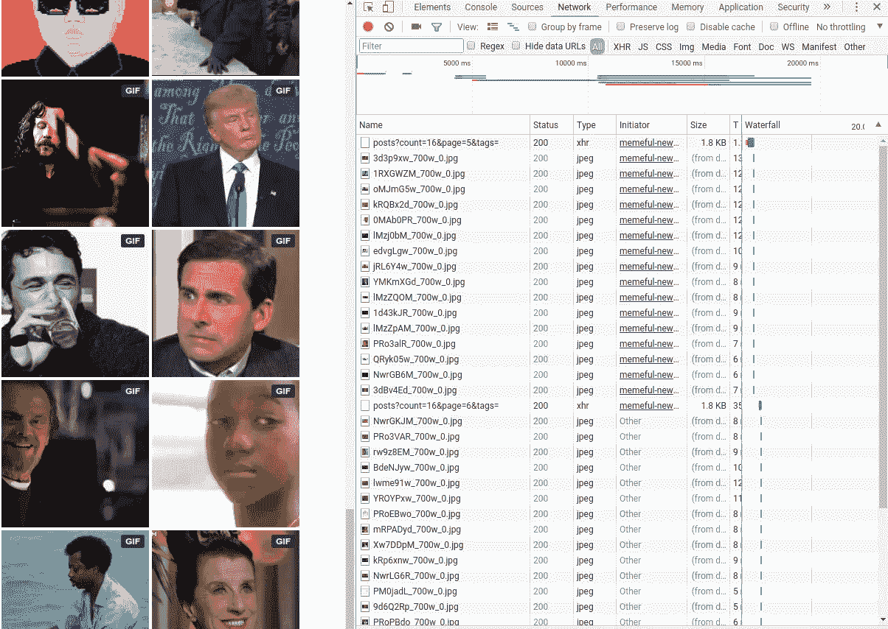
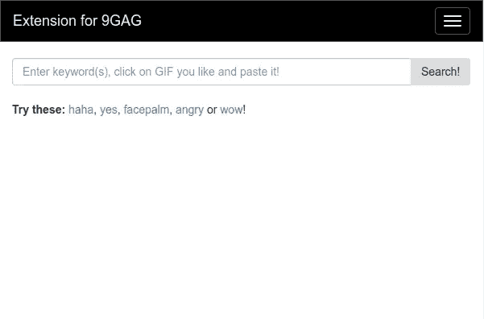
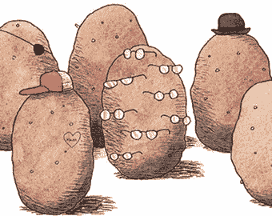

# 我想为 9GAG 找到一个快速复制和粘贴 gif 的方法。所以我做了一个 Chrome 扩展。

> 原文：<https://medium.com/hackernoon/i-wanted-a-quick-way-to-copy-and-paste-gifs-for-9gag-so-i-built-a-chrome-extension-ff87490f4824>

我访问 9GAG 已经两年多了，它是我每天的乐趣来源。我打开网站和 Android 应用程序。发布 gif 是我经历中很重要的一部分。当我看到一个帖子时，Memeful 提供正确的 gif 和 memes 来表达我的感受。


Source: [Memeful](http://i.memeful.com/media/post/4RZ4KBw_700wa_0.gif)

但是我是一个懒惰的人，所以我想要更多的东西(*，如果你知道我的意思。呃？*)。目前，9GAG 在一个新的标签页中打开了 memeful.com 的。你点击你选择的图片，链接就被复制了。你关闭标签，将复制的链接粘贴到评论区，然后点击“发布”按钮。此外，我应该在这里提到，Memeful 没有搜索选项。但是，他们确实提供了一个关键词列表，比如 *OMG* 、*处理它*、*失败*等等。才能得到具体的结果。我能做点什么吗？有什么方法能让这变得更简单吗？嗯。


Source: [Memeful](http://memeful.com)

作为一名开发人员，我决定亲自处理这件事。我熟悉 Chrome 扩展开发的基础知识，因为我以前为我的大学网络建立过一个自动化 LDAP 登录。所以我决定开发一个 Chrome 扩展，允许用户搜索 gif 和 memes，复制并粘贴评论区的链接。它在 Chrome 网络商店上可以作为 9GAG 搜索和复制 gif 的 [**扩展获得。**](https://chrome.google.com/webstore/detail/extension-for-9gag-search/bcjaeolpnpjdhdbdpdacjcjphocnmnde)

# 入门指南



Using Google Chrome Developer Tools

第一步是从网站上获取并存储图片链接。我查看了源代码，检查了页面，了解了用户滚动时 Javascript 是如何读取的。页面发出 GET 请求，服务器返回 JSON 对象。该响应在对象中有两个主键—“meta”和“data”。“数据”是 JSON 对象的列表。下面是一个例子:

```
 ...        
         {  
            **"id"**:"6248",
            **"key"**:"1RXEygd",
            **"status"**:"1",
            **"type"**:"ANIMATED",
            **"imageUrl"**:"http:\/\/i.memeful.com\/media\/post\/1RXEygd_700w_0.jpg",
            **"animatedUrl"**:"http:\/\/i.memeful.com\/media\/post\/1RXEygd_700wa_0.gif",
            **"imageFileSize"**:"918086",
            **"createdAt"**:"2016-02-26 06:53:22",
            **"imageHeight"**:200,
            **"imageWidth"**:200,
            **"tags"**:"yes, funny, totalall, oldspice"
        }
        ...
```

我用 Python3 的两行代码获取了 5863 个对象的列表。就这么简单！

```
import requests, json
json.dump(requests.get("[http://memeful.com/web/ajax/posts?count=10000](http://memeful.com/web/ajax/posts?count=10000)").json()['data'], open('js/memeful_data.json', 'w'))
```

我阅读了官方文档并观看了来自 T2 Youtube 播放列表的视频来提高我的知识。我创建了三个选项卡——*搜索*、*设置*和*关于*页面。“搜索”是你需要的一切，“设置”页面是我需要努力的东西。很快我就有东西可以在网上商店发布了。就是这样！现在，你所需要做的就是点击右上角的小图标，输入关键词，点击你想要的图片，然后发布链接。



Extension Frontend

再次，你可以从 [**谷歌 Chrome 网络商店**](https://chrome.google.com/webstore/detail/extension-for-9gag-search/bcjaeolpnpjdhdbdpdacjcjphocnmnde) 免费获得！我想提一下促使我写这篇文章的[这篇帖子](https://medium.freecodecamp.org/i-wanted-real-time-github-push-notifications-so-i-built-a-chrome-extension-7e6be0611e4)以及 Utkarsh 对我的帮助。如果你想玩代码或者想投稿，可以参考 [**GitHub 库**](https://github.com/swapsha96/Extension-for-9GAG) 。如果有进一步改进的建议或任何其他想法，您可以通过[](mailto:swap.sha96@gmail.com)**联系我。**

**当然，这是给你们的礼物！**

****

**Source: Google Image Search**

## **如果你喜欢这个故事，请点击👏按钮并分享，帮助其他人找到它！欢迎在下方留言评论。**