# proI 想学习计算机科学，所以我设立了自己的学位——这是我的课程表

> 原文：<https://medium.com/hackernoon/i-wanted-to-learn-computer-science-so-i-created-my-own-degree-heres-my-curriculum-bad56f28c278>

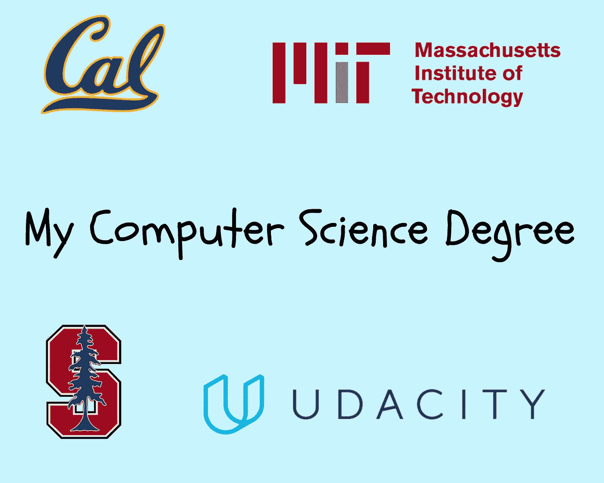

[Add me on LinkedIn](https://www.linkedin.com/in/SpencerCornelia)

2015 年 4 月，我在大会开始了 [Web 开发沉浸式项目，进入了计算机](https://generalassemb.ly/education/web-development-immersive?where=san-francisco)[编程](https://hackernoon.com/tagged/programming)的世界。

我那充满分析和技能获取的大脑沉迷于成为一名优秀软件开发人员的想法。我喜欢沉浸在程序中学习如何编程的每一分钟。

我于 2012 年从佐治亚州南方大学获得体育[管理](https://hackernoon.com/tagged/management)(辅修商科)学位，在加入大会的项目之前，我对计算机科学没有任何兴趣和实际知识。

我肯定挣扎过。计算机编程是非常困难的，尤其是当你没有任何计算机科学知识或者互联网实际上是如何工作的时候，你有 12 周的时间来构建完整的网络开发项目。

毕业后，我在内华达州的拉斯维加斯找到了一份软件质量保证分析师的工作，并在(现在)18 个月的工作中逐渐了解了软件开发过程。我喜欢它。

现在，我意识到我职业发展的下一个最佳步骤是更好地理解计算机科学基础、构建应用程序的实践经验，并更深入地学习新的编程语言，还有什么比回到学校开始下一阶段的软件开发更好的方法呢！？！？！？！？

等等…..我不想回大学。

College

等等…也许我真的想回学校…

感谢[数据科学硕士学位项目](https://medium.com/u/b3eb78490b02#.79nprditp)的想法，我决定创建自己的计算机科学学位。

为了创建自己的课程，我使用了斯坦福大学、加州大学伯克利分校、麻省理工学院和普林斯顿大学等知名 MOOC 的资源，以及 Udacity 的优秀资源、Udemy 的非常实惠的课程，甚至一位从麻省理工学院毕业并获得计算机科学学位的同事也提供了意见。

我还遇到一个开发者，他在 Github 上发布了一个很棒的模板，可以从开源材料中获得计算机科学学位。最后，[谷歌的技术开发指南](https://www.google.co.in/about/careers/students/guide-to-technical-development.html)也提供了一个有用的模板。

我的目标是创建一个旨在帮助我的学位。(如果这对其他人有利，那就更好了)。

我决定这个学位将有四个主要的领域，我将从中选择课程:计算机科学基础、实际应用、数学和选修课。

我的目标是不要在接下来的 4 年里坐在电脑前忽视我生活的其他方面，所以我的生活结构与别人推荐的略有不同。这个项目将帮助我继续我的软件开发生涯。

> 我的主要兴趣是提高我今天的实践技能和知识，并在整个项目过程中慢慢融入基础课程。

现在，请你开始称呼我为总统和财政大臣。这是课程表…

# **第一期**

## [Comptia a+](https://certification.comptia.org/certifications/a)

" CompTIA A+220–901 涵盖 PC 硬件和外围设备、移动设备硬件、计算机内存、网络和故障排除硬件以及网络连接问题."

“CompTIA A+220–902 包括安装和配置操作系统，包括 Windows、iOS、Android、苹果 OS X 和 Linux。它还涉及安全性、云计算的基础和操作程序。”

我很晚才开始学习说计算机，这门课程有助于建立计算方面的背景，填补我不知道但应该知道的关于计算机的一切空白。

## [康普蒂亚网络+](https://certification.comptia.org/certifications/network)

“CompTIA Network+是一项供应商中立的网络认证，受到全球的信赖。它验证了自信地设计、配置、管理和排除任何有线和无线网络故障所需的基本知识和技能。”

**推理:**与 a+课程类似，我需要通过学习互联网和我们的计算机系统如何在网络层面上工作来填补教育空白。这门课程有助于我在软件开发环境中工作，因为我需要知道的不仅仅是如何编程。

## [Head First HTML5 编程:用 JavaScript 构建 Web 应用](https://www.amazon.com/Head-First-HTML5-Programming-JavaScript/dp/1449390544)

*" Head First HTML5 Programming*是您使用 HTML5 和 JavaScript 创建 web 应用程序的终极指南，我们为您提供了构建这些应用程序所需的一切，包括:如何为页面添加交互性，如何与 Web 服务世界进行交流，以及如何使用为 html 5 开发的新 API。

以下是你将在 *Head First HTML5 编程*中学到的一些东西:

*   了解如何通过使用 DOM 的强大功能使您的页面真正具有交互性。
*   了解 JavaScript APIs 如何融入 HTML5 生态系统，以及如何在网页中使用任何 API。
*   使用地理定位 API 来了解用户的位置。
*   用画布，HTML5 的新 2D 绘图表面，激发你内在的艺术家气质。
*   不仅仅是将视频插入您的页面，还可以创建自定义的视频体验。
*   了解在每个用户的浏览器中获取 5 兆存储空间的秘密。
*   使用 Web workers 提高页面的响应能力和性能。"

**推理:**Head First 系列是我见过的最有帮助的编程资源。它牵着你的手，一步一步地引导你创建软件应用程序，真正帮助你一路学习。今天，这种类型的“课程”有助于学习实用技能。

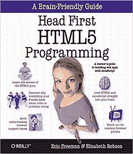

Term 1

# 术语 2

## [计算结构(MIT)](https://ocw.mit.edu/courses/electrical-engineering-and-computer-science/6-004-computation-structures-spring-2009/)

6.004 提供了数字系统工程的介绍。本课程从 MOS 晶体管开始，开发一系列构建模块——逻辑门、组合和时序电路、有限状态机、计算机以及最终的完整系统。通过一系列的设计实例来探讨硬件和软件机制。”

**推理:**我的同事提到了计算结构将如何帮助我理解非常低级的计算。他推荐我在 Comptia a+和 Network+之后选修这门课。

## [头一个 Ajax(本书)](https://www.amazon.com/Head-First-Ajax-Brain-Friendly-Guide/dp/0596515782/ref=sr_1_1?s=books&ie=UTF8&qid=1486959036&sr=1-1&keywords=head+first+ajax)

“这本书提供了一个介绍 Ajax 的总体概述，然后探索了各个 Ajax 组件的使用——包括 JavaScript 事件模型、DOM、XML、JSON 等等——随着它的发展。您将发现大量的示例应用程序来说明这些概念，还有练习、测验和其他交互式功能来帮助您记住所学的内容。

*Head First Ajax* 封面:

*   JavaScript 事件模型
*   用 XMLHTTPREQUEST 对象发出 Ajax 请求
*   异步应用程序模型
*   文档对象模型(DOM)
*   在 JavaScript 中操作 DOM
*   用浏览器对象模型控制浏览器
*   XHTML 表单
*   发布请求
*   XML 语法和 XML DOM 树
*   XML 请求和响应
*   JSON——XML 的替代品
*   Ajax 架构和模式
*   原型图书馆

该书还讨论了构建 Ajax 应用程序的服务器端含义，并对服务器端组件使用了“黑盒”方法。"

**推理:**一项至关重要的面向前端的技术的实际应用。

## [斯坦福计算机科学 106a (Java)](https://itunes.apple.com/us/itunes-u/programming-methodology/id384232896?mt=10)

本课程着重介绍计算机应用工程，强调现代软件工程原理:面向对象的设计、分解、封装、抽象和测试。编程方法教授广泛使用的 Java 编程语言以及良好的软件工程原则。重点在于良好的编程风格和 Java 语言的内置功能。这门课程显然是为了吸引人文学者、社会科学家以及核心技术人员而设计的。

**推理:**大课开始计算机科学基础部分的学位。开设了两门 106a 课程:JavaScript 和 Java。我有使用 JavaScript 的实践经验，但没有使用 Java 的经验，所以我决定选择 Java。

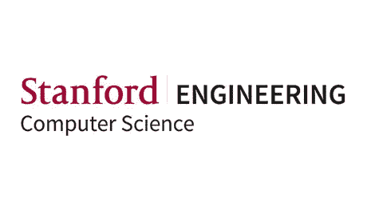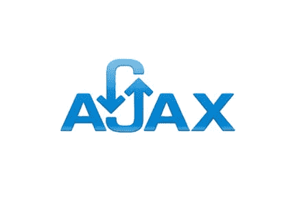

Term 2 classes

# 术语 3

## [CS61B 数据结构(加州伯克利)](https://people.eecs.berkeley.edu/~jrs/61b/)

在计算机科学中，数据结构是在计算机中组织数据的一种特殊方式，以便能有效地使用

数据结构提供了一种有效管理大量数据的方法，用于大型数据库和互联网索引服务。通常，高效的数据结构是设计高效算法的关键。”

作为获得计算机科学学位的基石之一，学习数据结构对于成为软件开发人员至关重要，因为几乎所有类型的编程都围绕着处理数据。

## [计算机科学导论(Udacity)](https://www.udacity.com/course/intro-to-computer-science--cs101)

在这门计算机编程入门课程中，您将通过构建自己版本的流行 web 应用程序来学习和实践关键的计算机科学概念。你将学习 Python，这是一种功能强大、简单易学、广泛使用的编程语言，在你构建自己的搜索引擎和社交网络时，你将探索计算机科学的基础知识。”

**推理:**本课程使用 Python 开发项目。我没有任何使用 Python 的经验，但我很想学习。此外，能够在完成课程的同时创建多个项目也是非常有吸引力的。

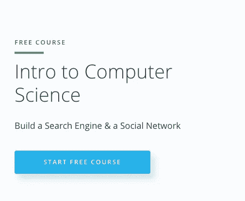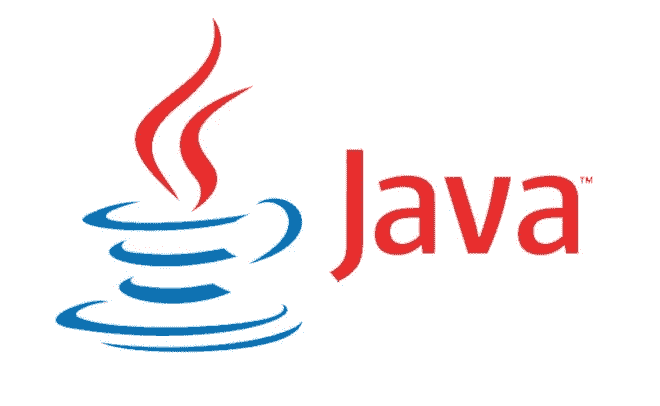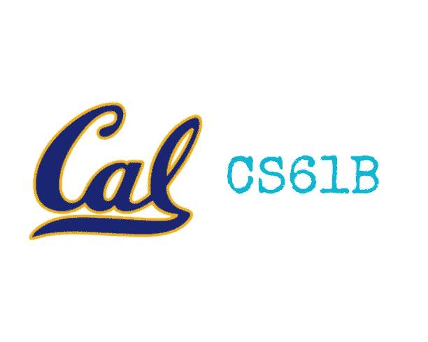

Term 3

# 术语 4

## [算法，第一部分:普林斯顿(Coursera)](https://www.coursera.org/learn/algorithms-part1)

“本课程涵盖了每个严肃的程序员需要了解的关于算法和数据结构的基本信息，重点是 Java 实现的应用和科学性能分析。第一部分介绍基本的数据结构、排序和搜索算法

## [算法，第二部分:普林斯顿(Coursera)](https://www.coursera.org/learn/algorithms-part2)

"第二部分着重于图形和字符串处理算法."

## [如何使用 Git 和 Github (Udacity)](https://www.udacity.com/course/how-to-use-git-and-github--ud775)

“对于任何从事长期(甚至中期)项目的开发人员来说，有效地使用版本控制都是一项重要而有用的技能，尤其是在涉及到不止一个开发人员的情况下。这门课程*是根据 GitHub* 的输入构建的，将通过关注一个名为 Git 的特定版本控制系统和一个名为 GitHub 的协作平台来介绍使用版本控制的基础知识。

本学期:包含两门有影响力的课程，用于处理面试、改善软件开发人员的思维过程，以及学习如何处理复杂的问题。此外，我还增加了一门对开发人员非常实用的选修课，因为版本控制将在(我假设的)所有软件开发团队中实施。

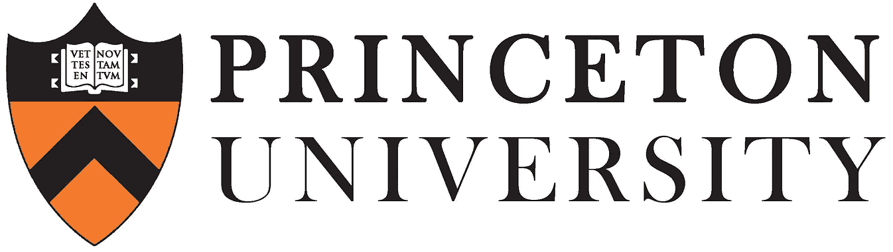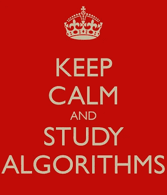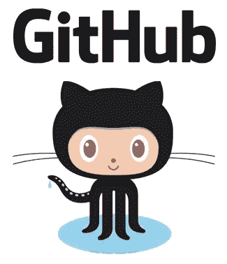

Term 4

# 期限 5

## [CS186 数据库系统简介(加州大学伯克利分校)](https://www.youtube.com/view_play_list?p=-XXv-cvA_iBVK2QzAV-R7NMA1ZkaiR2y)

“数据库系统介绍——便于数据访问的访问方法和文件系统。分层、网络、关系和面向对象的数据模型。模型的查询语言。在编程语言中嵌入查询语言。数据库服务，包括保护、完整性控制和数据的替代视图。高级接口，包括应用程序生成器、浏览器和报告编写器。交易处理介绍。数据库系统的实施将作为学期项目完成

## [计算机程序的结构和解释(麻省理工学院)](https://ocw.mit.edu/courses/electrical-engineering-and-computer-science/6-001-structure-and-interpretation-of-computer-programs-spring-2005/)

“这门课程向学生介绍了计算原理。完成 6.001 课程后，学生应该能够解释和应用程序语言的基本方法来分析计算系统，并产生抽象问题的计算解决方案。每周大量的编程作业是本课程不可或缺的一部分。这门课值 4 个工程设计分。”

## [计算机科学数学(麻省理工学院)](https://ocw.mit.edu/courses/electrical-engineering-and-computer-science/6-042j-mathematics-for-computer-science-fall-2005/index.htm)

这是一门面向计算机科学和工程的离散数学入门课程。课程大致分为三部分:

1.  数学的基本概念:定义，证明，集合，函数，关系
2.  离散结构:模运算、图形、状态机、计数
3.  离散概率论”

**第五条:**此时，我应该有前端和后端工作的经验，以及计算机科学的背景，并可以开始进入 CS 学位的数据库部分。我的同事强烈推荐结构和解释课程，认为这是他在麻省理工学院学习的最重要的课程之一。

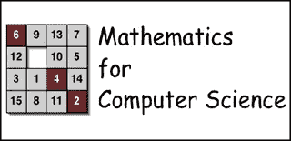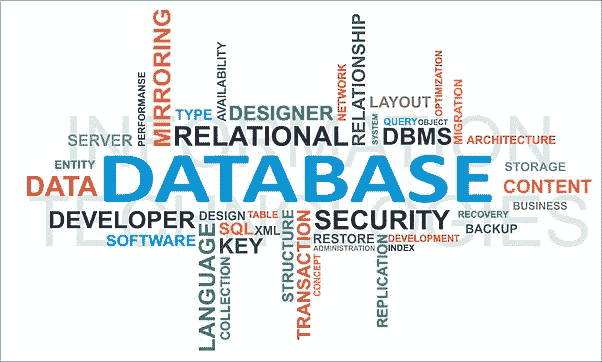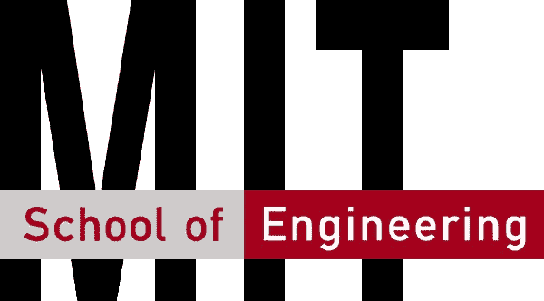

Term 5

# 期限 6

## [线性代数(Udemy)](https://www.udemy.com/linear-algebra-an-introduction/)

“在本课程中，我们将讲述核心概念，例如:

*   **高斯消去法**
*   **矢量**
*   **矩阵代数**
*   **决定因素**
*   **向量空间**
*   **子空间**

另外，我会用[这本书](http://joshua.smcvt.edu/linearalgebra/book.pdf)作为资源。

## [现代用 Redux 作出反应](https://www.udemy.com/react-redux/)

“我们将从掌握 React 的基础知识开始，包括 JSX、“道具”、“状态”和事件。每个讲座都提供了源代码，因此您可以随时了解最新的课程进度。在介绍了 React 之后，我们将直接进入 Redux，涵盖诸如 reducers、actions 和状态树等主题。

*   了解如何使用 React 的定制标记语言 JSX 来清理您的 Javascript 代码
*   掌握将一个复杂的组件分解成许多较小的、可互换的组件的过程
*   掌握“道具”和“状态”的区别以及何时使用它们
*   通过掌握 Redux 开发复杂的应用程序
*   通过使用中间件深入了解 Redux。不需要花里胡哨的条款！

**备注:**线性代数是在 CS 学位中发现的公共课程。我已经有一段时间没有学习任何类型的数学课了，这将有助于我需要做的任何学习。我的一位来自大会的导师推荐我学习 Redux 的 React。

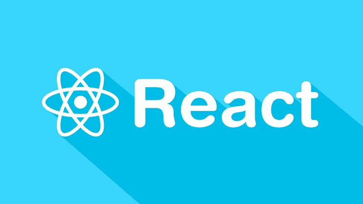

Term 6 classes

# 术语 7

## [计算机系统工程(麻省理工)](https://ocw.mit.edu/courses/electrical-engineering-and-computer-science/6-033-computer-system-engineering-spring-2009/)

本课程涵盖计算机软件和硬件系统工程的主题:控制复杂性的技术；使用客户机-服务器设计、虚拟内存和线程的强大模块性；网络；并行活动的原子性和协调性；恢复和可靠性；隐私、安全和加密；以及计算机系统对社会的影响。工作系统的案例研究和当前文献的阅读提供了比较和对比。

## [电路与电子(麻省理工)](https://ocw.mit.edu/courses/electrical-engineering-and-computer-science/6-002-circuits-and-electronics-spring-2007/)

本课程介绍了集总电路抽象的基本原理。主题包括:电阻元件和网络；独立和从属来源；开关和 MOS 晶体管；数字抽象；放大器；储能元件；一阶和二阶网络的动力学:时域和频域设计；模拟和数字电路及应用。”

注意:这些似乎是这个学位中最难的课程，类似于大学学位，它们将接近尾声。我的目标是希望在这一点上至少成为一名 web 开发人员，所以我的注意力将转向改进我操作的底层知识库。

## [头头 jQuery(书)](https://www.amazon.com/Head-First-jQuery-Brain-Friendly-Guides/dp/1449393217/ref=sr_1_1?s=books&ie=UTF8&qid=1486963144&sr=1-1&keywords=head+first+jquery)

“jQuery 可以帮助您用几行代码构建复杂的脚本功能。使用 *Head First jQuery* ，您将通过学习如何在处理事件、效果、回调和动画的同时导航 HTML 文档，快速掌握这个惊人的 JavaScript 库。当你完成这本书的时候，你将会整合 Ajax 应用程序，无缝地使用 HTML 和 CSS，并使用 PHP、MySQL 和 JSON 处理数据。

如果你想学习——并理解——如何创建交互式网页、不引人注目的脚本和不会破坏浏览器的酷动画，这本书就是为你准备的。

*   使用 jQuery 和 DOM 克服 HTML 和 CSS 的局限性
*   了解 jQuery 选择器和动作如何协同工作
*   编写函数并将它们连接到界面元素
*   使用 jQuery 效果在页面上创建操作
*   让您的页面生动活泼
*   用 jQuery 和 Ajax 构建交互式网页
*   在 web 应用程序中构建表单”

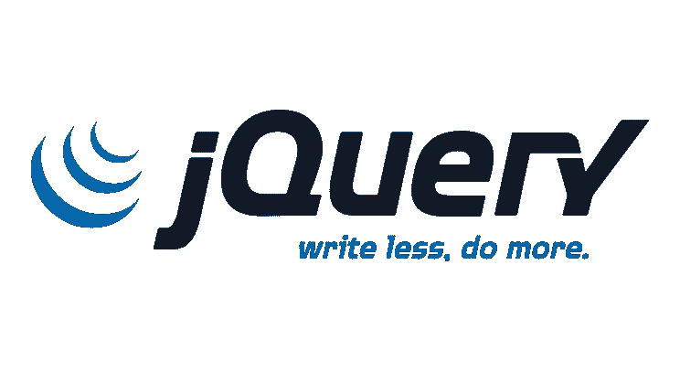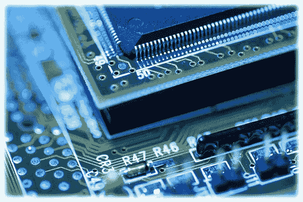

Term 7

# 术语 8

## [概率系统分析与应用概率(MIT)](https://ocw.mit.edu/courses/electrical-engineering-and-computer-science/6-041-probabilistic-systems-analysis-and-applied-probability-fall-2010/)

“欢迎来到 6.041/6.431，这是一门关于随机现象和过程的建模和分析的课程，包括统计推断的基础。如今，人们普遍认为概率思维能力是科学素养的一个基本组成部分。”

## [数据科学简介(Udacity)](https://www.udacity.com/course/intro-to-data-science--ud359)

“数据科学简介课程将调查数据科学中的基础主题，即:

*   数据操作
*   使用统计和机器学习进行数据分析
*   具有信息可视化的数据通信
*   大规模数据—使用大数据

本课程将集中在广度上，并简要介绍主题，而不是集中在单一主题的深度上。这将让你有机会尝试和应用数据科学的基本技术。"

**备注:**带上统计和数据宝贝！我从事体育统计已经有很长时间了，我很想把它变成一个副业或职业。为了好玩，我把数据科学课程作为选修课放在了最后。

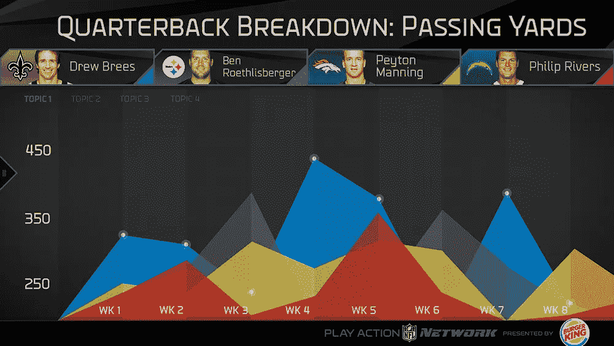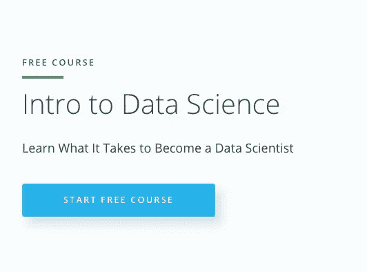

Term 8

# 最终注释

**更新* *

2017 年 10 月，我报名参加了 Hack Reactor 的远程兼职项目，以进一步学习。

2018 年 3 月我开始了我在 SaaS 的第一次创业。点击这里可以看到[第 1 部分。](https://www.youtube.com/watch?v=9lJYdeOZDuI)

这个学位是为了给自己一个模板，以便在软件开发领域继续学习，并最终实现我在自己身上看到的潜力，无论是成为一名软件开发人员还是围绕体育和大数据创办一家公司。

我的目标是遵循这个指导方针，直到我完成。我不知道要花多长时间，但我建立了这个项目，把快乐作为一种投入，因为我知道我需要对学习所有课程有极大的兴趣才能完成。

我心里没有“毕业日期”。我创建这个学位的目标是在一开始增加我的实际应用，并在我深入软件开发行业时帮助我建立对计算机科学的坚实基础的理解。

这将是主要的职位，我会尽我所能更新它，因为我继续前进。

请让我知道你的想法，然后点击“关注”，这样你就可以及时了解我的 [**疯狂而有趣的 30 天实验**](/@spencercornelia/my-30-day-experiments-2d0696d6b518#.4krxvmjxo) 。

如果你想和我联系，把我加到下面..

## [YouTube](https://www.youtube.com/channel/UCV0OPCa5_LS8SWp118FRHIA/featured?view_as=subscriber)

## [领英](https://www.linkedin.com/in/spencercornelia/)

> [黑客中午](http://bit.ly/Hackernoon)是黑客如何开始他们的下午。我们是 [@AMI](http://bit.ly/atAMIatAMI) 家庭的一员。我们现在[接受投稿](http://bit.ly/hackernoonsubmission)并乐意[讨论广告&赞助](mailto:partners@amipublications.com)机会。
> 
> 如果你喜欢这个故事，我们推荐你阅读我们的[最新科技故事](http://bit.ly/hackernoonlatestt)和[趋势科技故事](https://hackernoon.com/trending)。直到下一次，不要把世界的现实想当然！

