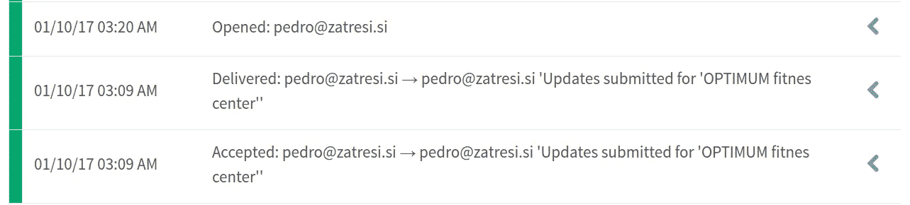
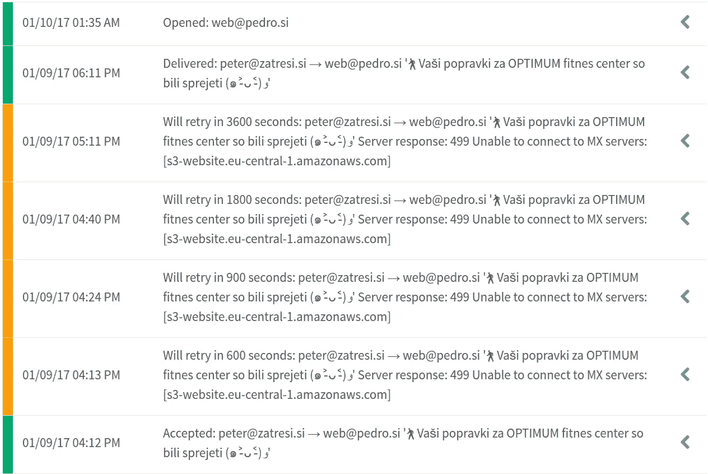
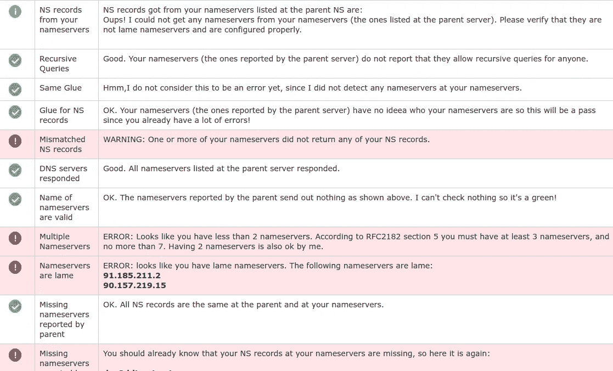
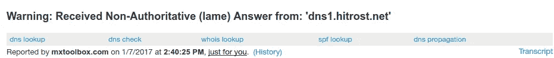

# 我不知不觉地丢失了好几年的电子邮件

> 原文：<https://medium.com/hackernoon/i-was-loosing-emails-for-years-without-knowing-424ed02c8d60>

昨天我意识到发送到我的@pedro.si 邮箱的邮件经常被延迟，有时甚至会丢失。在我意识到事情不对劲之前，我已经用我自己的域名发邮件两年多了。丢失传入邮件的原因是我的裸域名的 CNAME 记录。

那我是怎么发现的呢？我开发的一个应用程序 [zatresi.si](http://www.zatresi.si/) ，每当网站上的一些数据发生变化时，它就会给我发一封电子邮件。我使用 Mailgun 发送这些电子邮件，这是一种电子邮件跟踪服务。Mailgun 还显示电子邮件何时成功发送。

Mailgun allows me to monitor email deliveries and tracking.

上周，当我偷看 Mailgun 时，我看到一些电子邮件正在重试。

MailGun was reporting delays in delivering emails to my domain.

为什么他们被耽搁了这么多次？我给自己发了几次电子邮件，每次都没有延迟。然后有一次…延迟发生了。

我检查了 MX 记录，他们似乎很好。然而，我的 DNS 托管服务支持注意到一些问题。他们给我指了指 intodns.com/pedro.si 的 T2，那里挂着红色的警告旗。该工具报告说，域名服务器是蹩脚的。

intodns was telling that I had lame nameservers

到这个时候，我意识到有时 MX 设置显示正确，但其他时候，它们无法注册。我用 [MXToolbox](http://mxtoolbox.com/) 来检查我的 MX 设置。偶尔会出现以下警告:

我还注意到，当我在 MXToolbox 中看到这个警告时，intodns 报告说域名服务器是蹩脚的。

我请求 DNS 托管服务支持来帮助我找出为什么域名服务器被报告与我的 DNS 设置不匹配。他们没有回答问题，而是让我反转 MX 记录的*名称*和*值*字段。他们的建议一点帮助都没有，所以我在等待记录传播超过 24 小时后才解开。我最初的 MX 配置是有效的。

在这段时间里，我不断地给自己发电子邮件，检查延迟是否还在发生。有一次，我注意到在多次不成功的发送尝试后，邮件被完全丢弃了。我正在丢失电子邮件！我想知道在过去的两年里，我因为这个问题丢失了多少封邮件！

一位同事随后指出 pedro.si 上的 SOA 记录丢失了，他建议我调查一下。到目前为止，我忽略了这个错误，因为我不熟悉 SOA 记录，并将错误归咎于蹩脚的名称服务器。

然后，我向 DNS 托管服务支持提到了丢失的 SOA 记录。他们回答说 **SOA 记录有困难，因为根域 pedro.si 有一个到亚马逊 S3 服务器的 CNAME** 。我用亚马逊 S3 托管我的网站。他们建议我使用 A 记录来代替将根域转发到 www 标签。

删除提到的 CNAME 记录后，我的电子邮件开始正常工作。

intodns.com 不再报告域名服务器是蹩脚的，SOA 记录也不再丢失。

现在，虽然我很高兴我的电子邮件重新上线，但我会了解更多关于每种 DNS 记录类型的含义。我对我的 DNS 配置所犯的错误是因为我无知地遵循了教程和文档中的说明，而没有真正理解发生了什么。

总之，**避免了将根域名转发到 www 标签**的 CNAME 记录。使用 A 记录，或[更好的别名或一个名字记录](https://devcenter.heroku.com/articles/apex-domains)代替。如果您的 DNS 主机服务不支持它们，并且您不想使用另一个 DNS 主机，您可能想要查看一下 [wwwizer 的裸域重定向](http://wwwizer.com/naked-domain-redirect)。如果您将您的裸域 A 记录指向一个 IP，此服务会将访问者从您的根域重定向到您的 www 域。

> [黑客中午](http://bit.ly/Hackernoon)是黑客如何开始他们的下午。我们是 [@AMI](http://bit.ly/atAMIatAMI) 家庭的一员。我们现在[接受投稿](http://bit.ly/hackernoonsubmission)并乐意[讨论广告&赞助](mailto:partners@amipublications.com)机会。
> 
> 如果你喜欢这个故事，我们推荐你阅读我们的[最新科技故事](http://bit.ly/hackernoonlatestt)和[趋势科技故事](https://hackernoon.com/trending)。直到下一次，不要把世界的现实想当然！

