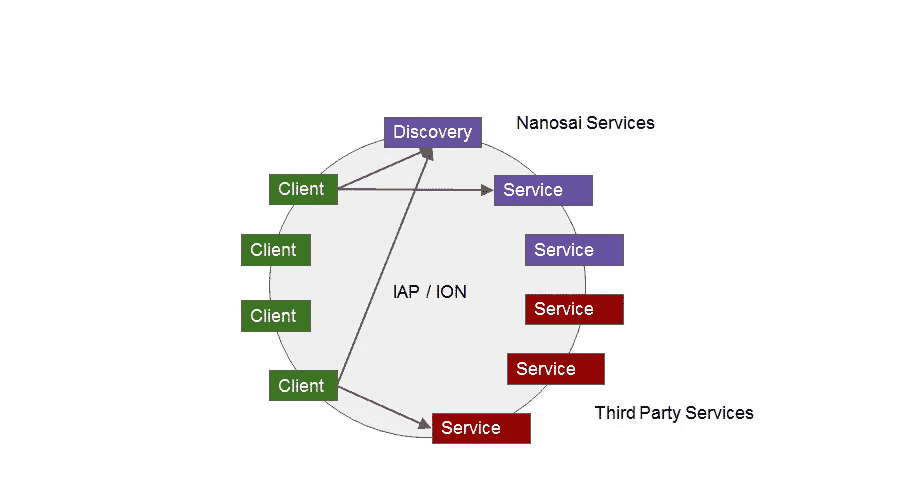
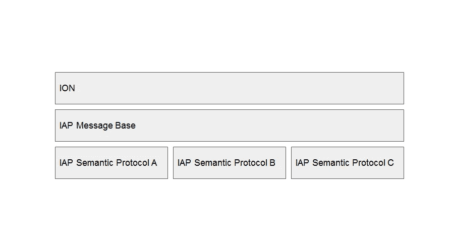
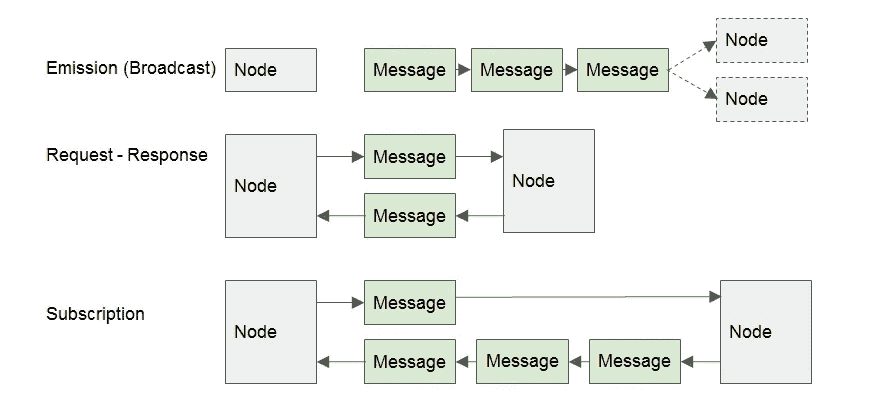
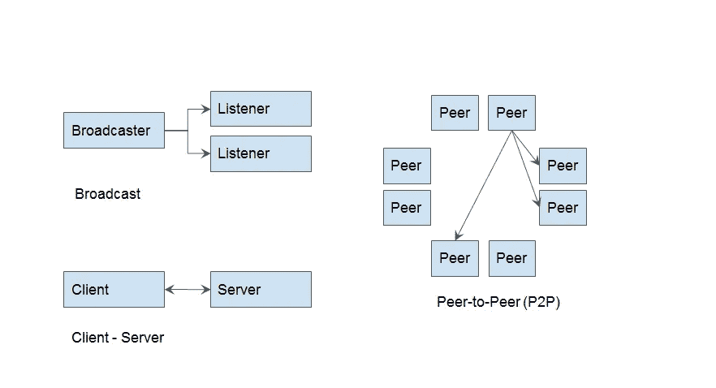

# IAP 消息交换模式和网络拓扑

> 原文：<https://medium.com/hackernoon/iap-message-exchange-patterns-network-topologies-1fbe57e011e7>

在之前的帖子[[1](https://hackernoon.com/our-ambitious-quest-to-democratize-distributed-systems-act-1-protocols-b6bec5297213)[[2](https://hackernoon.com/the-advantages-of-the-iap-protocol-54ba85bc62d3)]中，我们简要介绍了我们的面向消息的协议 IAP，它是 Nanosai.com 项目[的一个组成部分。在本帖中，我们将分享一些关于当前支持的 IAP 消息交换模式和网络拓扑的轻量级技术信息。](http://www.nanosai.com/)

在我们开始之前，重要的是要知道在[Nanosai.com](http://www.nanosai.com)我们都在帮助开发者通过我们正在开发的生态系统构建智能分布式系统。例如，这个生态系统将使开发者能够访问由 Nanosai.com 提供的高级分布式系统服务，或者插入到我们的分布式基础设施中的第三方服务，如下图所示。

**IAP 设计目标**

良好的通信是分布式系统顺利工作的关键，因为节点需要能够在内部彼此适当通信，并且通常还需要在外部通信，这取决于系统是否需要访问第三方或向第三方公开。我们从零开始设计 IAP，目的如下:

*   成为 HTTP、FTP、SNMP、ODBC、RPC 等的可行替代/补充。
*   比 HTTP/JSON 更快更紧凑。
*   支持比 HTTP 更多的消息流和用例。
*   比 HTTP 更即插即用。
*   能够位于 TCP 和 UDP 之上。
*   支持同步和异步通信。

**IAP 核心概念**

在讨论 IAP 消息模式之前，有必要修改 IAP 背后的核心概念。

IAP 带有一种基本的消息格式，这种格式在许多不同的用例中使用，所有 IAP 消息都使用我们的二进制数据格式 [ION](https://hackernoon.com/ion-the-data-format-designed-for-intelligent-real-time-distributed-systems-d41d68b5a7a4) 进行编码。

此外，IAP 被设计成多功能的，因此使开发人员能够在基本消息格式的基础上定义不同的语义协议。基本消息格式包含一组在网络通信中经常使用的字段。语义协议可以扩展这种消息格式，并添加特定用例所需的协议特定字段。

**支持的消息交换模式**

上面的消息交换模式是我们决定首先支持的模式，因为它们涵盖了许多用例。

**支持的网络拓扑**

上面的网络拓扑是我们决定首先支持的，因为它们涵盖了许多用例。

最后，请点击这里下载由我们的首席技术官[创作的免费电子书。我们的开源 Java 工具包 Grid Ops(包括 IAP)可以在](https://leanpub.com/the-grid-vision) [Github](https://github.com/nanosai/grid-ops-java) 上获得。如果您希望在我们推出托管基础设施服务时收到测试版邀请，请在此[订阅。](https://goo.gl/forms/zXQe9k2es9iombdD2)

*发布者*[*bambordébaldé*](https://medium.com/u/665359d135fa?source=post_page-----1fbe57e011e7--------------------------------)*，联合创始人。*

> [黑客中午](http://bit.ly/Hackernoon)是黑客如何开始他们的下午。我们是 AMI 家庭的一员。我们现在[接受投稿](http://bit.ly/hackernoonsubmission)并乐意[讨论广告&赞助](mailto:partners@amipublications.com)机会。
> 
> 如果你喜欢这个故事，我们推荐你阅读我们的[最新科技故事](http://bit.ly/hackernoonlatestt)和[趋势科技故事](https://hackernoon.com/trending)。直到下一次，不要把世界的现实想当然！

