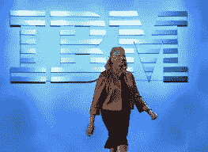

# IBM 创造出第一台可以欣赏艺术的机器

> 原文：<https://medium.com/hackernoon/ibm-creates-first-machine-that-can-appreciate-art-7ce59dcf8ca4>

在 CES 2016 的最后一天，IBM 出人意料地宣布了一个新的 AI 项目。为了进一步质疑我们的人性，这台被称为 IBM Frank 的新机器可能会观察艺术并提出自己的观点。当然，我们很多人都听说过 1996 年国际象棋计算机“深蓝”击败了世界人类冠军加里·卡斯帕罗夫的重大事件，以及最近 IBM Watson 在著名游戏节目《危险边缘》中的表现。2011 年击败肯·詹宁斯。

随着当前技术的进步，Frank 配备了两个模拟人类深度感知的高端百万像素摄像头。这使得机器可以判断 2D 艺术，如绘画、照片和素描，也可以判断 3D 艺术(尽管有点有限)，如雕塑和陶器。安装的软件允许弗兰克分析，交流，甚至评论他正在看的任何东西。然而，即使对于一台先进的机器来说，人类的想象力还是太丰富了。遗憾的是，弗兰克在欣赏电子和声学艺术以及大自然母亲方面受到了限制。然而，IBM 对未来持乐观态度，有一天会出现一台比人类更能欣赏艺术的机器。

一位艺术评论家欣然接受了这种创新:“终于，一台机器可以为我做我的工作，我将不得不寻找另一个真正对社会有贡献的职业！”但是当然不是每个人都会跟着进步。一些人认为这台机器是针对人类的令人憎恶的突变。一个人喊道:“把艺术欣赏留给人类吧！太不自然了。”另一名律师将很快提起诉讼，要求创造像弗兰克这样的机器是非法的，因为这将导致机器人统治的滑坡，“人类应该如何与计算机竞争？!"

IBM 稍后将向 Frank 发布一个附加部分。这一部分将允许弗兰克复制一件艺术品，并允许任何人将它握在手中。这个附加组件包含一个顶级的打印机，具有传统的激光墨水的摄影艺术，但还有更多。打印机还可以使用铅笔和画笔来创建图画和绘画，直到最后一笔。雕塑也不例外。3D 打印机可以让弗兰克打印出你最喜欢的雕塑，无论是*大卫*还是*自由女神像。*现在每个人都可以批量生产创意。正如萨尔瓦多·达利曾经说过的，“第一个把年轻女子的脸颊比作玫瑰的人显然是个诗人；第一个重复它的人可能是个天才。”

> [黑客中午](http://bit.ly/Hackernoon)是黑客如何开始他们的下午。我们是 [@AMI](http://bit.ly/atAMIatAMI) 家庭的一员。我们现在[接受投稿](http://bit.ly/hackernoonsubmission)，并乐意[讨论广告&赞助](mailto:partners@amipublications.com)机会。
> 
> 如果你喜欢这个故事，我们推荐你阅读我们的[最新科技故事](http://bit.ly/hackernoonlatestt)和[趋势科技故事](https://hackernoon.com/trending)。直到下一次，不要把世界的现实想当然！

