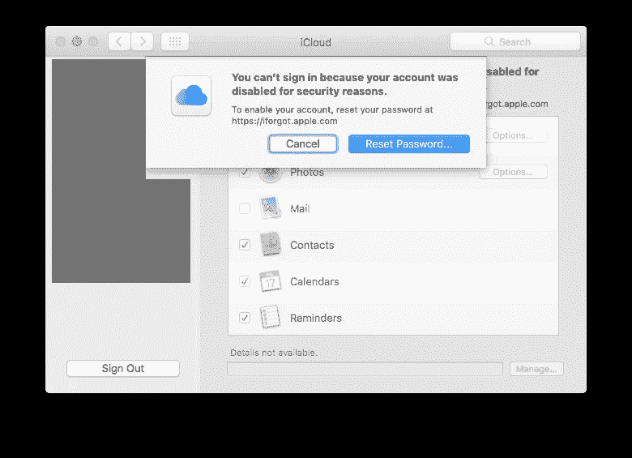
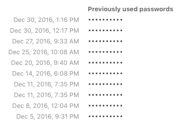
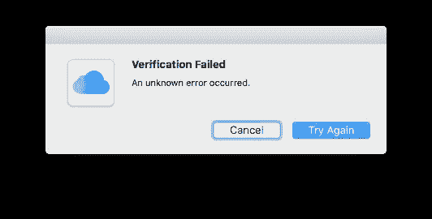
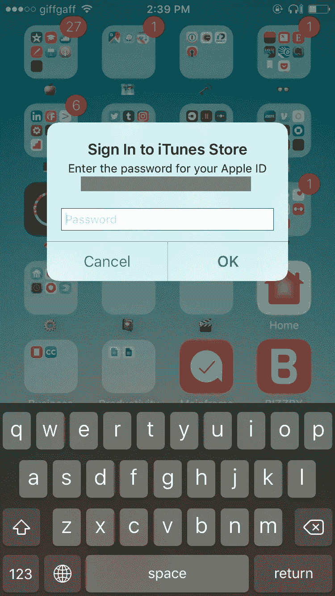

# iCloud 帐户锁定地狱

> 原文：<https://medium.com/hackernoon/icloud-account-locking-hell-bee8067b2c5b>

从早期开始，我就是一个快乐的 iCloud 用户。除了少数例外，它运行良好。这一切在上个月都改变了。

Apple new greeting screen.

这一切都始于 11 月下旬(大约是我安装 macOS Sierra 和 [iOS](https://hackernoon.com/tagged/ios) 10.2 的时候)。后来变得更糟了。仅在 12 月份，我的 iCloud 账户**就被锁定了 10 次**。是的，我正在使用双因素身份认证。

Screenshot from 1Password.

一旦你解锁了 iCloud 账户，你需要在使用该账户的所有 iOS 和 Mac 上更新*的密码。如果你认为只有一个地方需要更新密码，那你就错了。*

*   在每台 iOS 设备上，你需要在三个不同的地方更新密码(App Store、iCloud 和 iMessage)。
*   在 macOS 上，你需要在两个不同的地方更新密码(系统偏好设置中的 iCloud 和 iMessages)。我甚至不包括 iTunes，因为现在已经不是 2006 年了。

One of the many fun messages I’ve received.

这意味着在所有设备上修复这个问题至少需要 20-30 分钟。正因为如此，我甚至懒得解锁账户，让它锁定了好几天。这当然意味着我所有的 iMessages 都被搞砸了，我几乎无法在假期收发 iMessages。谢谢，[苹果](https://hackernoon.com/tagged/apple)。

等等，还有呢！如果您*不*解锁您的 iCloud 帐户，在您的 iOS 设备上更新您的密码，大约每五分钟就会提示您以下错误。

This is not annoying at all when you say are reading an article or book!

苹果公司在我发完微博后主动联系我，值得称赞。然而，到目前为止，他们在这个问题上没有取得任何进展(如果苹果公司的任何人正在阅读这篇文章，案件编号为 100088133735)。

我也知道这不是一个孤立的问题，因为它也发生在我的其他朋友身上。是时候振作起来了，苹果！我要疯了。

作为旁注，这仍然让我意识到把所有鸡蛋放在一个篮子里的危险。我和许多/大部分 iOS 用户一样，使用苹果来联系、发送信息和存储照片(以及许多其他服务)。直到这个打破，你才意识到你是多么依赖他们。这不是一件好事，我可能会开始将数据从中移走。

> [黑客中午](http://bit.ly/Hackernoon)是黑客如何开始他们的下午。我们是阿妹家庭的一员。我们现在[接受投稿](http://bit.ly/hackernoonsubmission)并乐意[讨论广告&赞助](mailto:partners@amipublications.com)机会。
> 
> 如果你喜欢这个故事，我们推荐你阅读我们的[最新科技故事](http://bit.ly/hackernoonlatestt)和[趋势科技故事](https://hackernoon.com/trending)。直到下一次，不要把世界的现实想当然！

