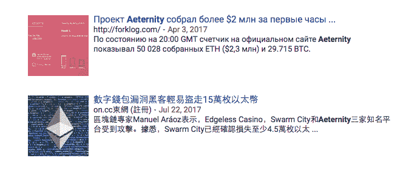
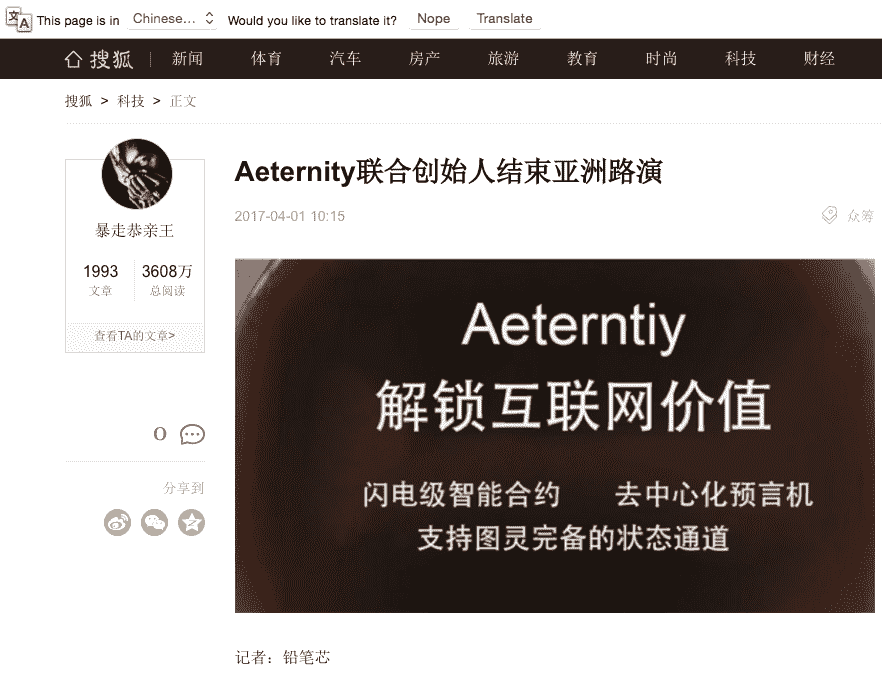
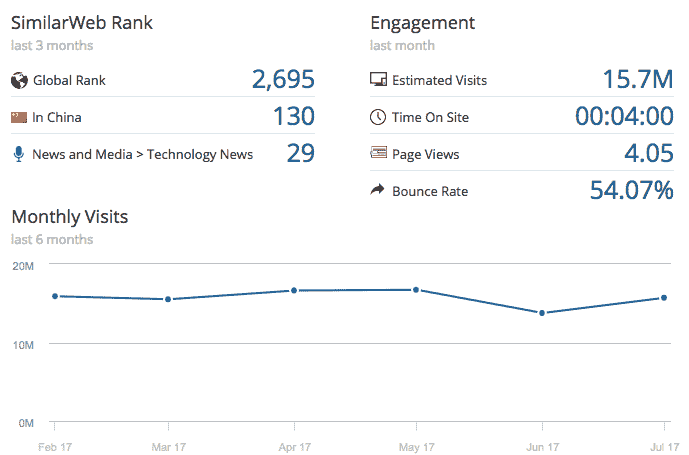

# ICO 活动提示接触中国和韩国记者的 6 个步骤

> 原文：<https://medium.com/hackernoon/ico-campaign-tip-6-steps-to-reach-out-to-chinese-and-korean-journalists-cb8aff492c68>

如果你正在读这篇文章，你很可能正在考虑通过一个 ICO 来众筹你的项目。资金很难，ICO 很快成为公司视为最后手段的资金来源。

ICO 推广的目标之一是瞄准全球范围内的潜在投资者，这可能会让事情变得有点困难，因为你需要建立一个由承包商和员工组成的多国籍团队，他们都拥有令人惊叹的技能。你如何与数千名愿意向你的产品投入 1000 美元的小型加密货币投资者沟通？要做到这一点，你必须用除英语以外的其他语言绘制加密货币和区块链媒体——这可不是一件小事。

就我个人而言，我会说英语、俄语、德语和法语，这使我在跨国活动中的工作更容易，但我仍然不得不处理世界上我不了解的部分:中国、越南、韩国等。

**如果我不会说任何亚洲语言，我如何创建一个记者、博客作者和专家的列表？**

我正在使用一个简单的 lifehack，它已经帮助我很多年了。

要做到这一点，你需要:[谷歌](https://hackernoon.com/tagged/google) Chrome，谷歌 Chrome 的 SimilarWeb 插件，谷歌电子表格，查找电子邮件的服务(如 Hunter.io 或 ClearBit)，以及 Twitter 和 LinkedIn 等社交网络。

首先，你需要搜索已关闭和正在进行的 ico 的品牌名称，确保坚持那些产生高度炒作的品牌，甚至那些最终导致钱包中的加密货币被盗的品牌。媒体倾向于写更多这样的故事——你也会找到更多的出口。

这里有一个绘制媒体分布图的小技巧:**使用有创意的关键词。**问自己:“我如何在其他国家找到对我的故事或产品感兴趣的人？”

在浏览谷歌新闻的时候，你会发现很多你不熟悉的语言的片段。

在那里，只需在一个新的标签页中打开链接，谷歌 Chrome 就会询问你是否希望这个页面从“韩语”或“俄语”翻译成英语。点击“翻译”，一切就绪！Chrome 的这一令人敬畏的功能经常被忽视，但它在翻译整个网站方面做得非常出色——包括菜单、文章文本，甚至广告。

现在是 SimilarWeb 的时候了。你不知道这个国家的媒体格局，SimilarWeb 可以帮助你评估你的目标网站，看看它是否值得你花时间。你所要做的就是点击浏览器栏中的 SimilarWeb 图标，该应用程序将获取各种网站数据——每月受众、跳出率、在网站上停留的时间等等。

这个数据对你来说好看吗？这是个好目标吗？始终注意网站的跳出率和停留时间，如果数据好得令人难以置信，那么网站很有可能会被自动抓取，这意味着低质量的观众。

现在是时候找到你想推销的记者了。多亏了谷歌的翻译服务，你可以很快找到作者的名字，从而找到他们的电子邮件地址、Twitter 账号和其他类型的联系信息。

最后一点，真正理解他们写的是什么很重要。这可能需要一点额外的时间，但是仔细查看他们的帖子和文章的历史记录——你的产品是一个好的匹配吗？

不要给人们发垃圾邮件，也不要把网撒得太宽，保持专注。坚持那些会发现你的信息有价值的人。要理解记者和记者们一直在寻找高质量的故事，但许多人每天都要看到无数的推介，因此尽早与他们接触非常重要。

用英语写作是可以的，Gmail 有翻译功能，但你真的可以通过雇用一名翻译来处理电子邮件和其他媒体相关的询问，从而更上一层楼。

关于如何让人们真正阅读你的邮件，你可以看看下面的视频。

最终，中国互联网是一个不同的世界，谷歌索引只是中国媒体的一小部分。你可以在百度搜索之前，通过使用百度和翻译你所有的关键词来真正地钻研。

我将继续挖掘这个非常大的问题，并喜欢听别人的建议。如果你知道任何寻找中国媒体渠道的好方法，请随时给我发电子邮件到[maria.podolyak@gmail.com](mailto:maria.podolyak@gmail.com)或者在 Twitter [@marysam](https://twitter.com/marysam) 上关注我。