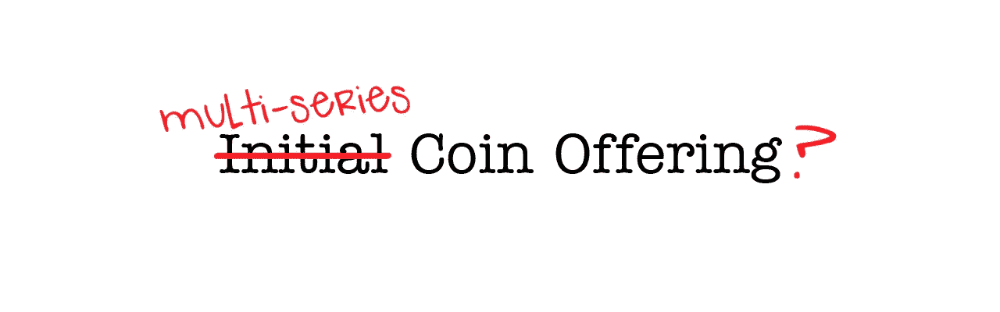

# ICOs，不要贪多嚼不烂

> 原文：<https://medium.com/hackernoon/icos-dont-bite-off-more-than-you-can-chew-d658aae9579e>

这篇博客文章概述了 ico 的一些关键问题，并提供了工具和研究数据，希望有助于 kickstart 更广泛地使用提议的多系列代币销售模式。 ***请在未来@blocksquare.io***

随着每天发生越来越多的代币众筹，行业开始评估替代代币销售模式，以反对目前广受好评的单阶段 ICO。问题不在于筹集大量的资金，而在于筹集超出自己能力范围的资金。

> “贪婪不是获得大量金钱，而是获得大量金钱却不努力表现出你有能力明智地花钱。”维塔利克·布特林

# ICOs 教父

我相信没有多少人看过 2013 年圣何塞比特币大会的视频，其中一名小组成员解释了用代币换取项目贡献的疯狂想法。

最初的硬币发行教父 J.R. Willett 早在 2012 年 1 月就在比特币对话论坛上首次提出了他的想法，当时他发表了一份名为“MasterCoin Specification(又名第二份比特币白皮书)”的白皮书[。他不知道这个想法将在五年后引发以太坊和当前的热潮，仅在 2017 年的前九个月就筹集了 20 亿美元，让风投和监管机构对未来感到担忧。](https://sites.google.com/site/2ndbtcwpaper/)

# 单轮销售模式

仍处于创业阶段的新企业需要资金来起步，但如果没有后期成长阶段的额外资金，它们很少会盈利。边建设边筹资一直是常态——只要你擅长创造有价值的东西，就应该有投资者对你的产品感兴趣，对吗？然而，随着 ICO 的出现，初创公司变得专注于这样一个想法，即他们需要通过单一的单一融资轮——ICO——一次性筹集资金。

一个只有概念性想法的初创公司如何知道他们需要多少才能实现这一切？不要误解我，我不反对筹集资金来创造一个更好的世界，但当项目不负责任地筹集资金时，似乎不太可能发生任何变化。

甚至 [**这里**](https://medium.com/u/587a00dbce51#gid=0) **找到。**

模拟的目的是更深入地了解采用提议的多系列代币销售模式对过去单阶段 ico 可能产生的财务结果的影响。请记住，可用的历史数据太短，无法运行更可靠的模拟。这只是一个简化的模型，并不确定任何提供的结果会成为现实。

## **假设**

为了进行模拟，必须做出某些假设和考虑:

*   总代币供应量的 10%在每轮代币销售中分发，
*   象征性的销售回合应该可以获得进一步发展初创公司所需的“合理”资金。采用了美国典型的投资轮次，并达到了以下平均值:
    **预售** →平均 100 万美元/项目
    **A 系列** →平均 500 万美元/项目
    **B 系列** →平均 1900 万美元/项目
    **C 系列** →平均 3500 万美元/项目
    未来系列代币销售目标尚未确定
*   出于模拟目的，代币销售周期间隔 6 个月，但也可能是 3-18 个月，这取决于初创企业的烧钱速度。
*   预售吸引了愿意承担更高风险以获得可能更高回报的投资者
*   在每一轮象征性销售中，需要给予市场价格的折扣

## 结果

值得注意的是，2017 年 ETH 的价格飙升，许多创业公司从这一事实中受益更多，而不是从他们创造的实际价值中受益。在一个 ETH 每年不会增长 30-35 倍的世界里，多系列代币销售模式更有可能为即将到来的创业公司带来更好的结果。

在我们的分析中，我们发现一个项目平均可以在 4 轮代币销售中筹集约 6000 万美元，这是这些公司使用单一代币销售方法平均筹集 1300 万美元的 4-5 倍。我们说可能，因为要实现这一目标，就要靠项目来兑现承诺。

支持这一预测的是我们对 ICOs 的模拟。只有那些在 ETH 超过 100 美元大关之前筹集资金的人从单阶段方法中受益，因为他们积累了足够多的 ETH。在此之后提高项目成本会更好地选择多系列模型。模拟显示，每个项目可以筹集更多的资金，同时仍然保持其总代币供应量的 60%，这在考虑未来的融资轮次时是一个巨大的潜力。

坚持把你自己的令牌作为价值储存手段，而不是 ETH，意味着你相信你所做的事情。如果一个项目团队更喜欢 ETH，那么也许他们不认为他们的令牌有价值？

# 多系列令牌销售机制

## 售前的

与传统融资相比，每个新项目都将寻找 10 至 100 名投资者进行预售，作为种子期。根据项目的不同，我们预计这里可以筹集到高达 100 万美元的资金。由于这些是鲜有吸引力的新项目，投资者需要做彻底的尽职调查，这可能需要与团队进行更直接的接触。从好的方面来看，对于在这个阶段投资的人来说，他们投资的折扣和预期利润的潜力将是最大的。为了保护参与这一轮的投资者免受市场波动的影响，需要设置一个令牌锁定期，直到下一次令牌众筹活动结束。

## 系列 A

在成功的售前后 3-6 个月，团队已经有东西要展示了，一个 MVP 或者可能是一个工作的 alpha 版本和某种牵引力。这将使感兴趣的公众放心，团队支持项目，满足最后期限并实现设定的目标。即使没有广告和横幅的积极营销活动，围绕该项目的所有好故事也有助于吸引更广泛的受众。投资者在预售阶段完成了他们的工作，证实了他们的评估，新一波投资者可能会将他们的资金投入到这一系列象征性的集体销售中。与目前的单阶段硬币发行相比，这些轮次将筹集 200 万至 1500 万美元的资金，出资者分布更合理。这一阶段的投资风险仍然很高，但比售前阶段低得多。在成功的 A 轮代币众筹销售之后，代币需要解锁并准备在公共交易所上市。

## B、C、D 系列…

根据初创公司的增长速度，新的代币销售可能会在 a 轮融资后 3-18 个月的某个时候进行。新注入的资本将用于发布官方版本，扩大团队，并开始赢得市场。必须提前计划 B 系列和任何后续代币众筹的发布，并咨询市场专家，以确定适当的时机并分析之前的代币价格波动。代币需要以比市场价稍低(3–7%)的价格出售。这一行动应该为新买家创造一个购买机会，而不是担心长期持有人。新的资本流入很可能会对已发行的代币产生更多需求，并提高品牌知名度。目标是让球继续滚动，让代币升值。最好的团队将通过提供有价值的产品，确保让长期代币持有者对稳定的代币价格升值感到满意。

# 多系列代币销售计算器(奖金)

该计算器适用于考虑多系列代币销售的团队。它还可以帮助您向团队成员分配令牌。

这是一个谷歌电子表格，你可以下载或保存在你的谷歌驱动器中，并根据你的喜好进行调整。而且是免费的！

# [**> >在这里得到计算器< <**](https://docs.google.com/spreadsheets/d/1zCDHpXoh4_ajehWgf2zx_X2D3Hl3cqGr74wcvBF_i9A/edit#gid=0)

# 结论

我坚信单一的 ICO 回合会扼杀大多数创业公司。一些人在耗尽跑道时需要求助于风投，另一些人将在太大的资金压力下倒下。只有最优秀的人才会成功，克服压力，并在他们的 ICO 中确定合适的资金数额。

在 [Blocksquare](http://blocksquare.io) 上，我们决定遵循我们提出的多系列模式，随着我们的成长而筹集资金，而不是一下子。我们的预售将在纽约 IBREA 年会(10 月 10 日)后不久推出。在 2018 年 Q1 奥运会宣布我们的 A 轮象征性销售之前，收益将用于进行一个适当的试点项目和开发一个工作 alpha。

*如果你从这篇文章中获得了至少 0.00000001 比特币的价值* ***请在下面“鼓掌”，这样其他人就会看到这篇文章。***