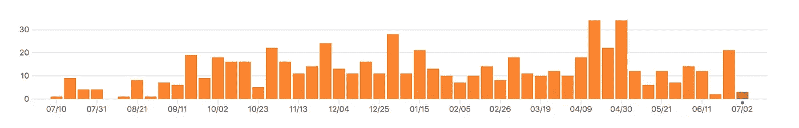

# ICOs:为什么光有想法是不够的。让我们看看你的 MVP

> 原文：<https://medium.com/hackernoon/icos-dudes-where-is-your-code-b3db20962b55>

## 为什么在没有开发人员和 MVP 的情况下投资 ICO 项目之前，您应该三思而行。

Photo by [Kevin](https://unsplash.com/photos/w7ZyuGYNpRQ?utm_source=unsplash&utm_medium=referral&utm_content=creditCopyText) on [Unsplash](https://unsplash.com/?utm_source=unsplash&utm_medium=referral&utm_content=creditCopyText)

科技界出现了一个新现象。几乎每周都有数百个新项目被开发出来，但是这些项目中的大部分都缺少一个关键元素。我说的是所有的 ICO。缺失的关键部分是..一个开发商…是的，你没听错！有些项目已经在没有区块链开发商和 MVP 或 PoC 的情况下筹集了 3000 万英镑

**为什么这是一件大事？**

每个团队都需要一个开发者。不管你的销售和营销团队有多棒，如果没有人真正创造产品，那就打包回家吧。拥有一个首席开发人员意味着拥有一个知道产品的[软件](https://hackernoon.com/tagged/software)如何工作的人。此外，这样的开发人员将会参与编码、协作开发原型和构建 MVP。

否则，团队将有一个寻找开发伙伴、自由职业者和所有随机加入团队的人的漫长过程，而没有明确的领导和架构愿景。这导致了缓慢的速度，糟糕的软件，安全问题和未来阶段的大量重构。

Photo by [Lee Campbell](https://unsplash.com/photos/6njoEbtarec?utm_source=unsplash&utm_medium=referral&utm_content=creditCopyText) on [Unsplash](https://unsplash.com/?utm_source=unsplash&utm_medium=referral&utm_content=creditCopyText)

## 在区块链之前，事情是如何运作的？

> “没有执行的愿景是幻觉”——托马斯·爱迪生

初创公司会有革命性的想法/商业模式。该团队将准备一个原型，展示持续的工作，甚至将他们的产品提供给真实的客户进行反馈，并以敏捷的方式进行改进。经过大量改进后，他们会寻求融资。

Source: [https://www.smashingmagazine.com/](https://www.smashingmagazine.com/)

因此，我们有一条非常健康和清晰的道路:拥有技术人才的强大团队->愿景-> MVP ->持续贡献->融资->成功(也可能没有)。

在区块链和国际奥委会的首次硬币发行开始发挥作用之前，情况就是这样。

## 密码世界

我猜想，最近在 ICO 公司筹集了 X 万美元的项目中，至少有一半甚至没有写一行代码，或者粗略地为他们令人惊叹的产品构建至少一些原型。所以*对*没有什么反馈，而且，看*有什么改进和动作*。

问题是区块链(包括所有的实现和应用)和加密货币都是由极客创建的，对吗？然而，大多数执行 ICO 的团队是由少数业务和营销人员组成的。他们可能有一个没有编写和发布过任何代码的工程师。他们所拥有的只是写在白皮书中的想法。

一些团队声称他们正在私有库中开发。例如， [Patientory 在没有任何原型甚至 github 存储库的情况下筹集了超过 700 万美元](https://patientory.com/2017/06/04/patientory-raises-7-2-million-usd-to-transform-healthcare/)。什么？为什么？整个区块链的想法都是开源的，因此，你的 MVP 或者至少是它的一部分肯定是开源的，并向公众展示。除非你没什么可展示的。

Status.im 就是一个很好的例子，它不断地提交给他们的存储库。

status-react repository commits graph

## 结论

不要根据封面来判断一本书，在这种情况下——白皮书。我的观点是，ICO 投资者应该更密切地关注团队的开发进度和步伐，而不仅仅是一些承包商可能准备的白皮书中的漂亮方案。这将表明项目团队能够交付成果，不会带着你的钱跑掉。

**最安全的**加密货币硬件**钱包**是[账本纳米](https://www.ledger.com/collections/all-products?r=397c335e147c)。它只为€59 的每个用户提供硬件安全。了解更多 [**在这里**](https://www.ledger.com/collections/all-products?r=397c335e147c) **。**

**喜欢这篇文章吗？请点击下面的绿色按钮让我知道，或者给朋友发封推荐信。谢谢大家！**