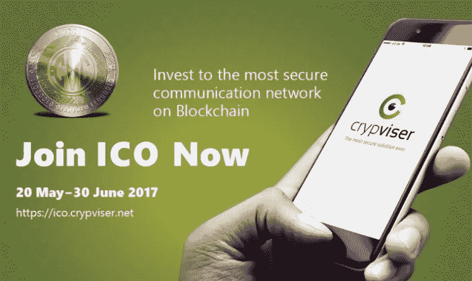
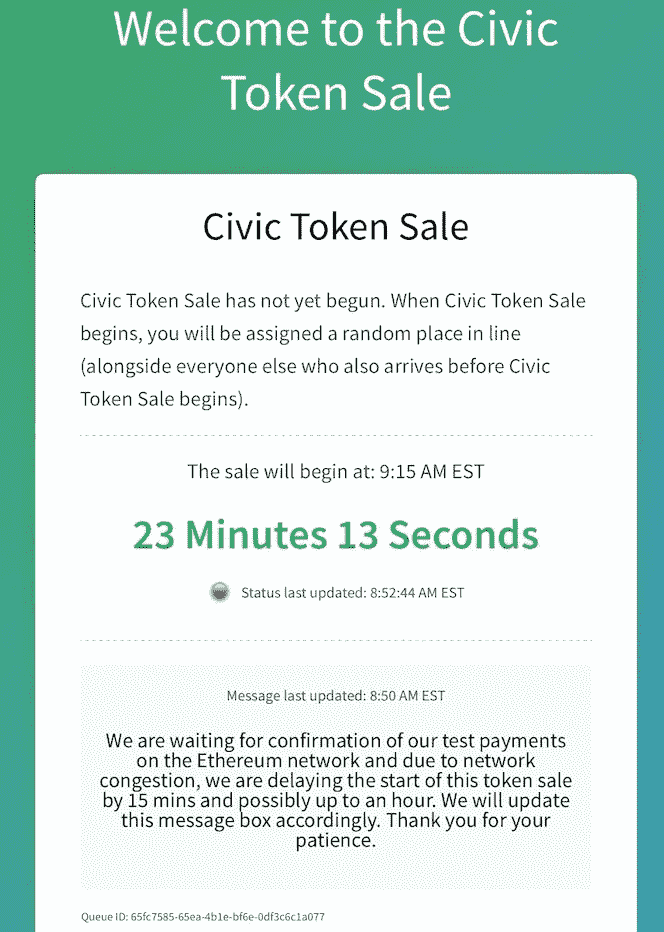
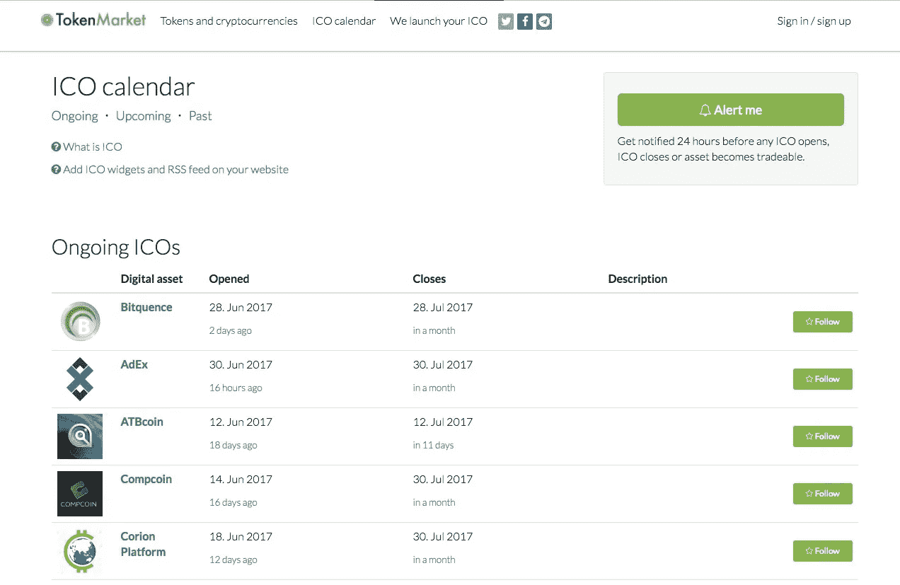
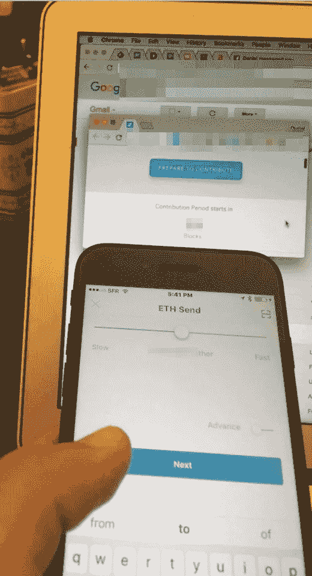
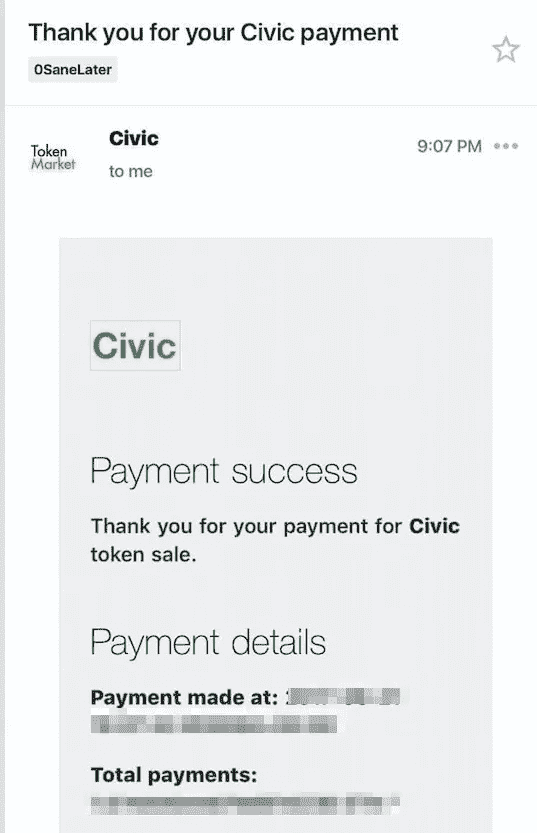
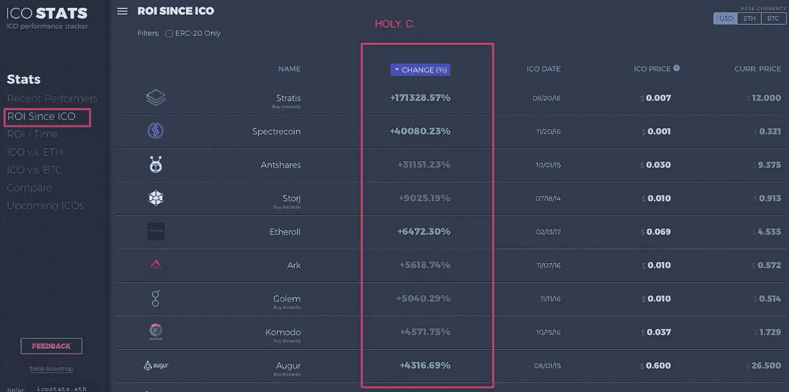
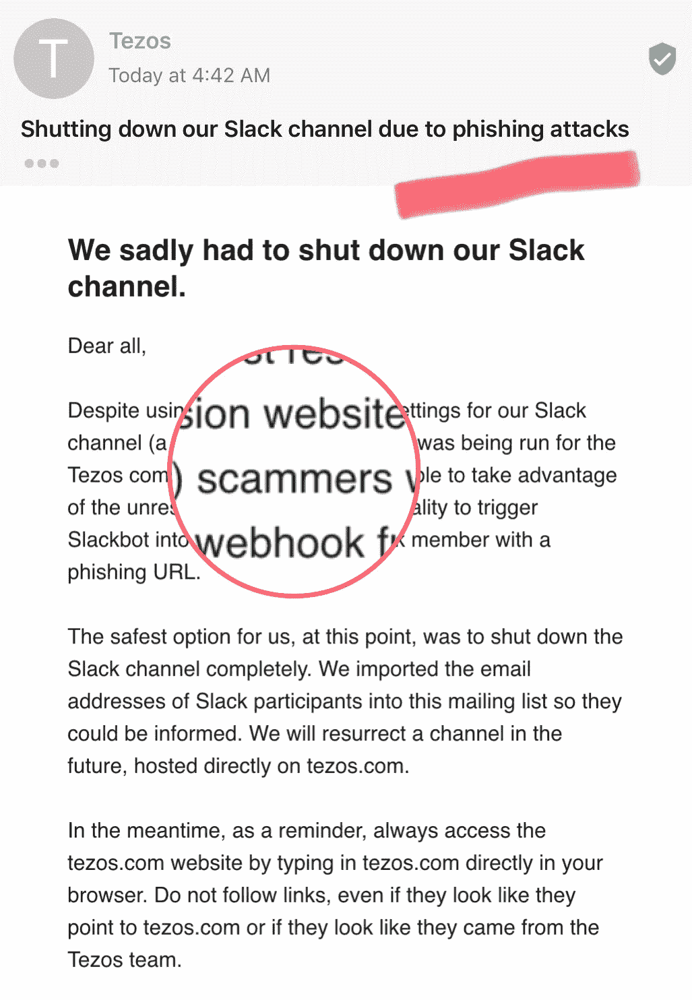

# 傻瓜的 ICOs(像我一样)

> 原文：<https://medium.com/hackernoon/icos-for-dummies-like-me-1e82a8bc27f4>

披露:我在这个领域是个新手，但我觉得我学到了足够多的东西，可以避免让像我这样的新手头疼。我会试着用简单的英语解释 ICOs 是怎么回事。像往常一样，这不是投资 ico 的建议。仅仅是尝试解释一下(同时也是一个练习，让我澄清我认为我理解的东西)

我不得不承认。区块链是一个迷人的世界。自从 iPhone 和 App Store 诞生 10 年以来，我想不出还有什么比这更令人兴奋的了(从技术上讲，App Store 是 9 年)。但是规模要大得多。感觉好像 TCP/IP 或 Http 协议正在被重新发明。随之而来的是整个数字生态系统。

几年前我就开始听说这个空间了。但总是用怀疑的眼光看待它。只是最近一些点开始连接起来，我决定投入大量的时间(和金钱)在这个空间学习。我不认为你可以学习这个空间，否则。太多了。

一旦你进入其中，你理解了本质上有两个主要的区块链协议(比特币和以太坊),你理解了 BTC 联邦理工学院交易的基础，你会很快接触到 ico 的概念。

ICO 代表**首次发行硬币**。它模仿了众所周知的 IPO，即所有成功的科技公司都要经历的融资和公开估值的过程。回到 ICOs。在基本术语中，据我所知，这是 Dapps(去中心化的应用程序——称之为区块链服务或实用程序——建立在以太坊区块链或任何其他可编程区块链上)用来筹集资金和评估他们将在其服务/应用程序中使用的令牌(或硬币)的过程。这相当于筹集资金，而不是股票，你获得了建立在区块链上的代币，利益相关者也是资金的贡献者。这些代币一旦归属，就会在私人交易所上市(相当于纳斯达克的代币)，在那里进行实际的价值交易。

ICO =类固醇上的 Kickstarter 区块链+(后来一度上市)纳斯达克

## **硬币和代币有区别吗？**

是的，有一个。代币是可编程的代码，而硬币只为一些简单类型的交易存储特定的值。例如，比特币是一种硬币，而不是代币，你不能用它做很多事情:例如，你不能在比特币上建立赌博服务(尽管你可以接受它作为一种支付方式)。

Dapps(例如建立在区块链上的博彩服务或建立在区块链上的广告验证系统)发行自己从以太坊区块链(明天的 TEZOS 区块链等)生成的令牌来运营自己的服务，同时对自己的公司进行估值。你可以在这里阅读更多关于差异的信息

准确地说，ico 应该是 ITO(初始代币发行)或甚至更多的 ITGO(初始代币生成发行)，但从营销角度来看，这很糟糕。你想要一个和 IPO 押韵的表达。让我们称之为最初的**贡献**提供让每个人都开心

## **但是这到底是怎么回事呢？那是怎么组织的？**

ico 由建造 **Dapps** 的公司组织。他们提前精心组织代币预售、营销和在私人交易所上市。但是 ICO 在固定的日期和准确的时间开始，提前很长时间(有时可能在最后一分钟改变…)进行沟通，在有限的时间内向利益相关者出售一定数量的令牌。

有时一些会在 ICO 日期前预售给特权投资者，通常会有折扣。一部分将分配给早期员工(就像 ESOP 一样)，最后一部分将分配给项目的其他贡献者。通常情况下，公司会就如何处理象征性诉讼以及如何分配这些诉讼给出透明的可见性。理解这一点非常重要(稍后将详细介绍)

## **如何参与 ICO？**

如果你想参加，你首先要确定你

1.首先拥有 BTC/联邦理工学院(有时他们只会接受 BTC)。您不能使用法定货币(法定=普通货币)购买硬币/代币

2.将您的 BTC/ETH 放在与操作兼容的钱包上(说明通常由代币第一所有者提供)

3.在 ICO 的准确时间可用。

4.发送您的投稿

5.当 ICO 关闭时，您将收到一份归属通知，您获得的代币将被发送回您用于捐款的钱包

在这里要小心。ico 发生在几分钟内。这些公司在比你打开电脑还短的时间内就筹集了数千万美元。我没开玩笑。

在 4/和 5/之间，你可能会有一些停滞时间，坦率地说，这有点压力。你不确定你的贡献是否真的被发送和收到，但是你也不知道你是否会得到回报。在这一点上，你必须相信这个系统(直到有更好的东西出现)。

**更新**:实际上我刚刚发现，你可以通过像 **BitcoinSuisse** 这样的组织购买 ICO，该组织将为你支付一些费用，你甚至可以用法定货币购买，如果你不拥有 BTC 或瑞士联邦理工学院。只有一个坏消息:他们不接受美国顾客(我猜是规定)。我确信我们将来会看到更多这种类型的 ICO“银行”

**它们应该被重新命名为疯狂的硬币发行**。不要哭了:这些不是 SEC 监管或监督的。如果你错过了他们，只能怪你自己。

一旦在私人交易所进行交易，你随时可以获得代币。但通常它们的价值会大增，你会在不确定它们价值的情况下以高价购买它们。

一些 ico 比其他的更有组织性。例如，思域创建了一个相当好的等待线。但是其他人把你蒙在鼓里。你一直试图购买他们的令牌，但失败了。不料操作已被劫持的巨大矿工把大量的天然气(联邦理工学院/BTC 分数..)和资源，比你买得快。

因为毫无疑问:这些公司还没有实现 ICO 之外的东西。他们有很多工作要做，风险非常高。当然，他们得到很多现金…但是你知道吗？记得 2000 年…

他们有很多 ico。也许一天一个。很快 ICOs 将绕过 VC 募集资金。说不定还会扰乱风投。你可以轻松拿到钱。

## 谁可以参加 ICO？

任何拥有像 BTC 或瑞士联邦理工学院这样的数字硬币的人。最近你开始看到像 **Polychain** 或**潘迪拉** Capital 这样的“基金”在 ico 上大举投资。虽然没有人吹嘘，但很可能有一些公司会参与进来

## 如何知道即将发布的 ico 有哪些？

Reddit 是个好地方。准备 ico 的公司通常会在早期公开它。TokenMarket 也是一个好地方

## **那么如何挑选最好的 ico 呢？**

没有明确的配方。在 ICO 时代你所知甚少。

1.  阅读他们的白皮书。它应该能引起你的共鸣。它应该被很好地阐明，他们的计划应该有意义。不要因为觉得很酷就参与一个 ICO。明白你把脚放在哪里
2.  最好的 ico 营销得很好。有时候太顺利了。去 Reddit 和 Github 看看社区是否兴奋。看看创始人在社交媒体上是否活跃。
3.  试着找一些对你所关注的 ICO 同样感兴趣的同行。不要认为自己是天才就独自投资。你不是。
4.  如果他们有产品，找到一个演示或尝试它(例如，我尝试公民之前做的 ICO)
5.  学习:尝试寻找关于团队的播客，让他们对自己的项目感到兴奋。了解团队。你需要确信他们对他们所捍卫的理念是有益的。

最近发生的一些最著名的 ico:**Bancor**(在不到一天的时间里筹集了 1.5 亿美元) **Status** 。im(分钟筹集了 3300 万美元)**TenX**(9 分钟收了几千万)**Adtoken**(10 分钟没了) **Civic** (一个我好不容易进的)。最令人期待的代币销售之一是 [**Tezos**](https://www.tezos.com/faq) ，这是一个内置更好“治理”的新区块链协议(目前不像比特币和 ETH)。看这个。它将是巨大的(不像大多数有上限的 ico 那样没有上限——也是为了创造稀缺性和价值。)

**根据我有限的经验提供一些参与的技巧**

1.  准备好多个钱包。有些 ico 会喜欢这个或那个钱包
2.  在 ICOS 开始前 1 小时完全可用，并记录时间。ico 需要充分的关注，而且进展很快
3.  不要只依赖手机。靠近第二个屏幕，可能是电脑或 iPad
4.  提前了解 ICOS 技术细节，为您的 BTC/以太网布线。确保获得准确的发送地址。通常会有一个 QR 码，但仔细检查长字符串是否与屏幕上的对应。如果你把你的 ETH/BTC 发送到错误的地址，你将错过你的 ICO 和失去你所有的钱！
5.  不要羞于谈论汽油的价值(你将为完成手术支付的 ETH/BTC 费用)。通常情况下，你从上市后的 ico 中获得的倍数将很大程度上涵盖这笔费用。

me trying to send ETH to CIVIC ICO

## **你怎么知道自己成功获得了令牌？**

只有在您收到官方分配确认(通常通过电子邮件)并将令牌放回钱包后，您才会知道您从 ICO 处获得了令牌。在那之前，你什么也没有得到，而且有一个紧张的时期，在此期间你不知道发生了什么。这是当前 ico 需要改进的薄弱环节。

注意:当你发送你的硬币从你的钱包里购买代币时，你必须确保你的交易通过。由于大量的需求和有限的时间，很可能您的交易会失败、超时或被拒绝，即使您注入了大量的气体(例如，最近我错过了一个 ICO，我的一群朋友注入了大量的气体来保证交易，即使这样也不够)

A confirmation email acknowledging the operation. Relief.

提示:按下发送按钮后，注意你的钱包反馈信息。有时需要 30 个安民小时才能知道你交易是否通过。

## **您可以用最近获得的 ICO 令牌做什么？**

一旦你有了它，你可以留着它，希望它会增值。但为此，你需要真正相信公司会兑现承诺。在这个阶段，我们都是盲目的。但是你知道，那个 20 年前买苹果的家伙…

如果你没有耐心，就去私人交易所交易，然后把它扔给某个瑞士联邦理工学院/BTC 大学。该公司将在 ICO 结束后宣布代币上市地点。然后你可以创建你的账户，列出你的代币，等待以市场价格被收购。一些 ico 非常成功地为幸运的早期代币所有者提供了超高的倍数。查看 [**Icostats**](https://icostats.com/) 来了解那些正在上升的数据。这太令人兴奋了(同时也很可怕)

bubbles. bubbles. Bubbles.

你也可以保留它，以便能够使用它。一些 dapp 会赋予代币交易价值，因此你可以以某种方式使用 dapp(例如，如果对于电子竞技，你可以用代币下注)。

## 我们是在 ICO 泡沫中吗？

我讨厌这个词。泡泡。当人们不明白发生了什么时，就用这个词。然而这里有些东西感觉太强烈了。

大多数公司没有证明任何事情，他们的估值是惊人的。许多人不会成功，少数人会成为庞然大物。没有人知道是谁和什么时候。最恼人的是，这些公司没有第三方验证系统，也没有 SEC 来控制正在发生的事情。在采用方面没有特别的公开数据(目前还没有针对 Dapps 的谷歌分析..).我们只知道公司愿意告诉我们什么。我们不得不相信。这令人不安。但我预计这种情况会很快改变。市场会需要它。像往常一样，只投资你愿意损失的钱。

## **上个总评**

参加 ICO 是相当令人兴奋的(我无法想象在组织者方面是什么感觉)。但并不是所有的都是成功的。

我觉得这是一个弱肉强食的世界，ico 的方法需要标准化和更加公平。目前，进入 ICO 几乎是不可能的。有太多的利益，却没有任何监管(实际上对分散的组织来说是合理的)。但这是极端的。

外面好像热得要命。你被告知有一个能容纳 100 人的淡水池，但有 10 万人在门口等着进去。

访问和令牌归属和分配的过程必须更简单、更清晰，在何时可以获得方面应该更透明，参与说明应该更简单、更清晰(抱歉，伙计们，但大多数人无法用简单的英语书写..)

我毫不怀疑 ICOs 会成熟和变形。也许我们甚至会看到公司购买 build 来帮助建立 ico(就像一些公司帮助建立 Kickstarter 活动一样)。也许最终会出现一些标准。但我毫不怀疑这个过程会持续下去。我认为，随着时间的推移，我们会看到这种趋势加速发展，有一天，这可能会成为启动数字业务的标准方式。

# 最后一件事

当心诈骗和网络钓鱼。轻松赚钱和惊人的增长会吸引坏男孩。绝对确保你使用的网站、论坛或账户是真实的。他们可能会引诱你将硬币送到错误的地址，并以提前进入的虚假承诺来欺骗你。避免这种情况的最好方法是:三重检查一切，并运用你的常识。今天，由于网络钓鱼的企图，TEZOS 不得不关闭他们的 slack 频道，Twitter 上充斥着虚假的 TEZOS 账户

**边注:**最新一季的《纸牌屋》已经更名为 ISIS 的对等物 ICO。挺搞笑的。当然这与话题的爆炸性无关。