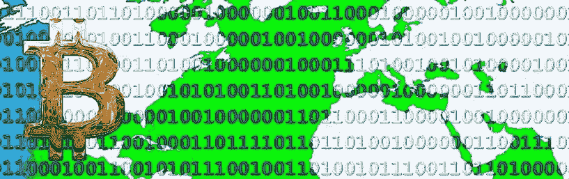
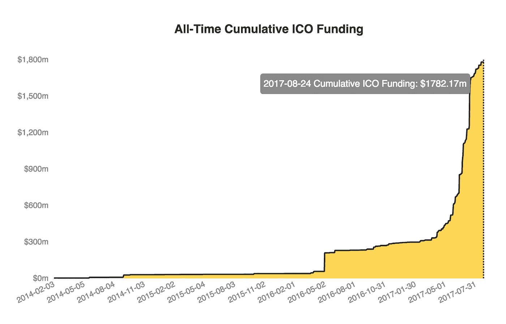

# 假人的 ICOs 不在中国

> 原文：<https://medium.com/hackernoon/icos-for-dummies-not-in-china-6407f6e441df>

**ICOs(首次发行硬币)已经席卷了创业融资界——高达 17.8 亿美元——但并不是所有政府都热衷于允许这么多的商业活动在其核心货币之外运作。最引人注目的是，中国央行在其网站上宣布[ico 现在是非法的](https://www.bloomberg.com/news/articles/2017-09-04/china-central-bank-says-initial-coin-offerings-are-illegal)。**

****

**Graph via [Coindesk ICO Tracker](https://www.coindesk.com/ico-tracker/)**

**在[黑客正午](http://hackernoon.com)上，Ananas 的联合创始人[艾玛德·莫斯塔克](https://medium.com/u/ab805da33824?source=post_page-----6407f6e441df--------------------------------)认为[中国取缔 ico](https://hackernoon.com/china-was-right-to-clamp-down-on-icos-af2075723260)是正确的，因为道德和法规没有跟上 ico 的高速增长，最终他认为，“我们可以期待禁令很快被取消，指导方针到位。”**

**但是我们将会看到…在一篇“[对中国禁止 ico](https://hackernoon.com/analysis-of-chinas-ban-on-icos-486c31768b97)的简要分析”中，Lightyear.io 法律顾问&项目经理 [Lindsay X. Lin](https://medium.com/u/2b7ec5b2490e?source=post_page-----6407f6e441df--------------------------------) 详述了这一决定的短期和长期影响。她总结道，“中国关于 ICOs 的声明是朝着更大的消费者保护、更大的货币控制和更有效的反洗钱过程迈出的强有力的决定性一步。”**

**香港证券及期货事务监察委员会(证监会)中介人执行董事梁凤仪女士今日(T16)发表声明说:「参与 ICO 的人士必须注意，部分 ICO 结构可能受香港证券法的规管。」**

**想了解更多关于美国 ICO 和安全关系的信息，请阅读 Andrew J. Chapin 的 [benjaCoin 的现场 ICO 之旅](https://hackernoon.com/@andrewjchapin)，以及他迄今为止最著名的故事:“[SEC 打电话询问我们的 ICO，我回答了。](https://hackernoon.com/the-sec-called-about-our-ico-i-answered-8cbbd31568ec)**

**[美国消费者新闻与商业频道报道](https://www.cnbc.com/2017/08/09/initial-coin-offerings-surpass-early-stage-venture-capital-funding.html)，“过去两个月，加密货币和区块链初创企业通过所谓的首次公开募股(ico)筹集的资金金额已经超过了互联网公司的早期风险投资(VC)。”**

**最近，Ouriel Ohayon 从一个早期风险投资家的角度写了一篇关于 ico 的很棒的初级读本:“[像我这样的傻瓜的 ico](https://hackernoon.com/icos-for-dummies-like-me-1e82a8bc27f4)”这是一个巩固你的 ICO 基础知识和了解风险资本家如何处理这种新的融资现象的好读物。**

**在决定是否应该参与 ICO 时，考虑 SkillShare CEO[Michael Karnjanaprakorn](https://medium.com/u/38fc1f8c593f?source=post_page-----6407f6e441df--------------------------------)的 [**7 Ts 框架**](https://hackernoon.com/evaluating-tokens-and-icos-e6c22c1885bb) **:** 论题、令牌网络效应、团队&领导力、技术&开发者生态系统、透明度&信任、牵引力&路线图以及条款&法律。**

*****欲了解更多关于互联网对货币*** *的影响，请查看我们姐妹刊物上的* [*最新报道*](https://keepingstock.net/latest) *，以及我们收藏的关于* [*比特币*](https://hackernoon.com/tagged/bitcoin)*[*加密货币*](https://hackernoon.com/tagged/cryptocurrency)*[*货币*](http://hackernoon.com/tagged/money) *和*****

****有时当我听到“ICO，ICO，ICO”时，我会想，“Iko Iko un-day
Jock-a-mo fee-no 艾纳-né。这是一个口语提醒，当某件事真正开始在科技行业流行时，最好退一步听听音乐...****

# ****5 本周必读与 ico 无关的科技故事:****

*   ****[**《看在上帝的份上，请告诉我你的公司是做什么的》**](https://hackernoon.com/for-the-love-of-god-please-tell-me-what-your-company-does-c2f0b835ab92)Carpe look 联合创始人 [Kasper Kubica](https://medium.com/u/bab270608bcd?source=post_page-----6407f6e441df--------------------------------) 。在你的网站上发布有抱负的大话，并清楚地说明如何直接介绍你的公司。****
*   ****[**【为什么超智能 AI 会踢屁股】**](https://hackernoon.com/why-superintelligent-ai-will-kick-ass-38f8b25978c0) 作者[丹尼尔·杰弗里斯](https://medium.com/u/618a7c78c957?source=post_page-----6407f6e441df--------------------------------)。一个强有力的论点是, [AI](https://hackernoon.com/artificial-intelligence/home) 将成为一股比邪恶更强大的向善力量，作为对这种思维定势的回应:“人类喜欢巨大的、华而不实的威胁。我们真的很擅长忽略真正的问题，而去关注大的、疯狂的问题。越大越疯狂越好！现在我们有了超级人工智能，所有问题之母。”****
*   ****[**“为什么我拥有一台 Macbook Pro 一天——它对我来说意味着苹果的未来”**](https://hackernoon.com/why-i-owned-a-macbook-pro-for-a-day-and-what-it-says-to-me-about-the-future-of-apple-75b84458d86c) 作者无酒精商店的 MD[约翰·里斯比](https://medium.com/u/78f00d02e962?source=post_page-----6407f6e441df--------------------------------)。这个故事触及了苹果客户“体验”和退货政策的核心。开头是“周六我买了一台新的 Macbook Pro，带 touch bar。周日我把它还回去了。唯一令人惊讶的是，我这么快就归还了。”****
*   ****[**《不用纱线也可以》**](https://hackernoon.com/its-ok-to-not-use-yarn-f28dc766ef32) 作者[大卫·吉尔伯特](https://medium.com/u/f735d3b0f2f3?source=post_page-----6407f6e441df--------------------------------)。用他自己睿智的话来说，“就像朝鲜蓟一样，这篇文章并不适合所有人。是给使用[节点 8](https://hackernoon.com/upgrading-from-node-6-to-node-8-a-real-world-performance-comparison-3dfe1fbc92a3?source=false---------0)(NPM 5 自带)的开发者用的。没有读过 Yarn 和 npm 文档的开发人员(你们这些‘社交生活’的傻瓜)。听说过 Yarn，看到它在越来越多的地方出现，并开始认为他们‘应该’使用它的开发人员。”****
*   ****[**《作为自由开发者如何给自己定价》**](https://hackernoon.com/how-to-price-yourself-as-a-freelance-developer-3453dfd59d91) 自由开发者&墨滴制作人[松山拓也](https://medium.com/u/3c763a5f46cc?source=post_page-----6407f6e441df--------------------------------)。这是一个很好的指南，可以帮助你了解如何在高速发展的初创公司和顶尖自由开发者之间达成交易。****

****直到下一次，不要把世界的现实想当然。****

****亲切的问候，****

****[大卫·斯穆克](http://davidsmooke.net)， [@阿米](http://twitter.com/ami)****

*******p . s .***ICYMI—[查看我们公司的起源故事。](https://hackernoon.com/the-ami-origin-story-f386ef84c79c)****