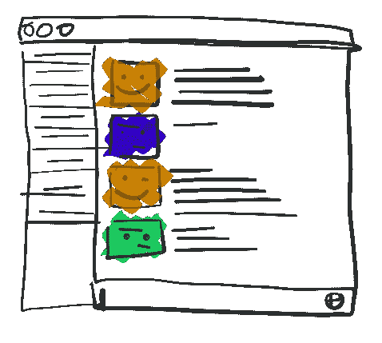
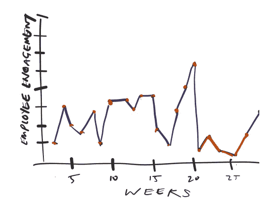

# 想法:Slack/Github 活动监控

> 原文：<https://medium.com/hackernoon/idea-slack-github-activity-monitoring-1dd555e9b715>

Slack interactions are fully of interpretable events

在一家分布式公司工作让我意识到一个问题:员工太容易“消失”，没有人会注意到。当员工有问题时，没有预先确定的见面时间来防患于未然。人力资源拜访、员工聚会和一对一的约会更容易避免。分布式团队自然会将注意力集中在工作完成的地方，而忽略员工满意度不理想的潜在领域。

Poor employee engagement could be pegged to a metric based on the interactions a person has per week.

## 我认为你可以不令人毛骨悚然地解决这个问题。

看似合理的是，对用户在公共场所如何互动的基本观察是员工参与度的一个重要信号。以一个基于 Slack 的公司为例，如果用户从不活跃于任何 Slack 频道，那么他们很可能不会参与小组讨论。这可能是多种原因造成的，但首先，这可能是一个人感觉不再被他们的同事社区所吸引。

Employee engagement viewed over time.

值得注意的是，一个人的订婚可以有多种解释。一个高度参与的用户可能会感到非常不参与。非参与型用户可能会非常积极地与渠道活动同步，因此会有参与感。基于这些例子，公众参与并不是万无一失的。

随着时间的推移，当用户与自己比较时，公众参与可能是一个强有力的衡量标准。例如，当用户开始在一家公司工作时，由于大量的介绍性约定，他们的活动可能高于正常水平。随着时间的推移，员工可能会转变为一种参与趋势，这种趋势与他们的整体行为更加相似。基于修正后的平均值，任何显著的偏离都是值得注意的事件。

Commit history mapped against a user’s commit trend could surface potential employee-project connections.

同样的分析可以在具有共享代码库的以工程为中心的组织上运行。无论是 Github 还是一些当地的 Mercurial 等价物，个人贡献者的趋势都可以被解释为员工-项目匹配。例如，潜在契合度可以基于员工在某些项目中的贡献率来衡量。

从管理和人力资源的角度来看，这可能令人毛骨悚然。

User activity could signify user happiness.

为了做到这一点，观察到的结果永远不应该用于相应的结果。基于分析的惩罚或奖励会适得其反。认为自己的整体行为受到监控和跟踪的员工可能会感到不被信任。这种形式的分析可能是员工真正感到不满的原因。

这样做的总体目标是捕捉那些未被捕捉到的信号。目标不是监控你的员工。如果发生了重大变化，应该建立一些结构来确保一个努力奋斗的员工不会因为不再在舞台上而消失。

感谢 [Edlyn Yuen](https://medium.com/u/933c260cac0?source=post_page-----1dd555e9b715--------------------------------) 、 [Gary Tsai](https://medium.com/u/ea091f526b7b?source=post_page-----1dd555e9b715--------------------------------) 和 [Pippin Lee](https://medium.com/u/28ff78fed88e?source=post_page-----1dd555e9b715--------------------------------) 的创意。

> [黑客中午](http://bit.ly/Hackernoon)是黑客如何开始他们的下午。我们是 [@AMI](http://bit.ly/atAMIatAMI) 家庭的一员。我们现在[接受投稿](http://bit.ly/hackernoonsubmission)并乐意[讨论广告&赞助](mailto:partners@amipublications.com)机会。
> 
> 如果你喜欢这个故事，我们推荐你阅读我们的[最新科技故事](http://bit.ly/hackernoonlatestt)和[趋势科技故事](https://hackernoon.com/trending)。直到下一次，不要把世界的现实想当然！

