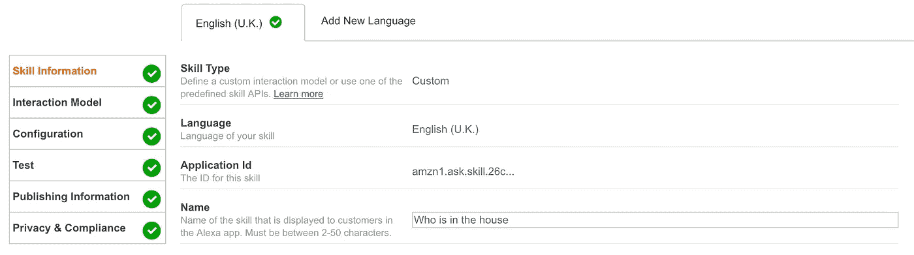
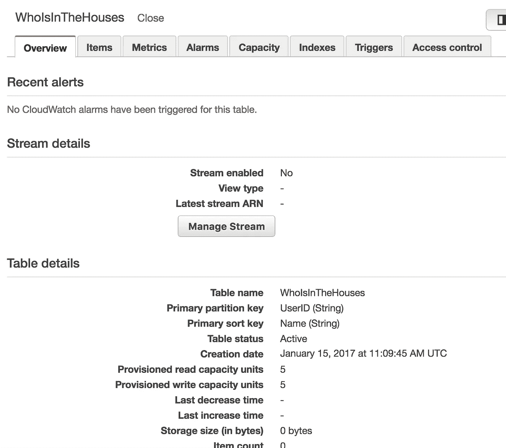
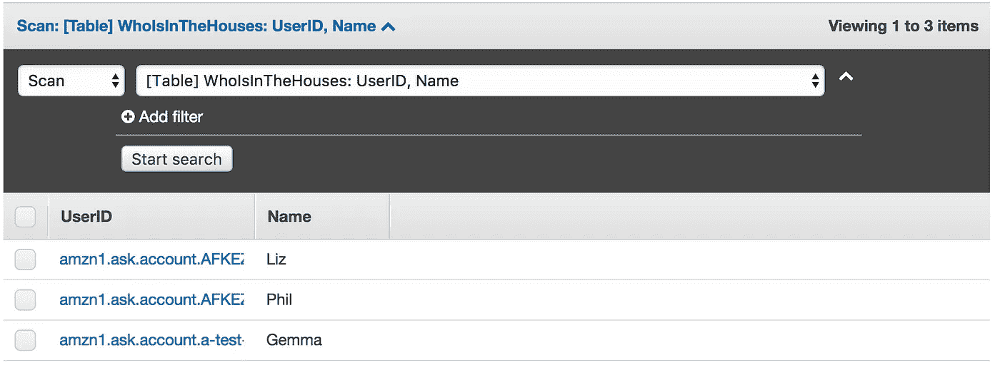

# 在 Alexa 技能中识别用户

> 原文：<https://medium.com/hackernoon/identifying-users-in-alexa-skills-ff189d03ed1d>

从新年前夜开始，我就一直在开发一个定制的 Alexa 技能，作为我的“周末项目”。这是一个非常简单的应用程序，可以跟踪房子里的人的名单。

目前，我有一个非常简单的名字列表[存储在 DynamoDB](https://hackernoon.com/my-alexa-skill-with-storage-5adb1d097b88) 中，但如果我要让这个应用程序对其他任何人可用，我需要为每个用户维护一个单独的列表。

# 这是哪个用户？

每次我的 Lambda 函数被调用时，它都会传递一些描述请求的[JSON](https://developer.amazon.com/public/solutions/alexa/alexa-skills-kit/docs/alexa-skills-kit-interface-reference)。这包括一个会话对象，其中包含三个有用的标识符



Get the Application ID for your skill from the developer console

**应用 ID** 标识发出请求的 Alexa 技能。Lambda 函数应该检查它是否发送了它期望的应用程序 ID，以确保它没有被某种意外的东西调用。您可以从 Amazon 开发人员控制台的技能信息中获得应用程序 ID。

当你调用一个 Alexa 技能时，你开始一个会话，由…你猜对了，一个**会话 ID** 标识。如果你愿意，你可以在 Lambda 函数的响应中包含会话属性形式的信息，当它在同一个会话中被再次调用时，你将得到相同的会话 ID 和包含在请求 JSON 中的属性。

最后还有一个**用户 ID** 。我将使用用户 ID 作为一个键来标识每个用户家中不同的人员列表。

## 一个新的 DynamoDB 表

我将使用用户 ID 作为我的 Dynamo 表中的[分区键，使用房子里的人的名字作为排序键。](http://docs.aws.amazon.com/amazondynamodb/latest/developerguide/WorkingWithTables.html#WorkingWithTables.primary.key)

至少现在，它不会支持两个同名同姓的人住在同一个房子里，但我认为现在这样就可以了。最小可行的产品等等。

您不能修改现有 Dynamo 表的键，所以我创建了一个新表，名为“WhoIsInTheHouses”。



## 读取和写入新表

我需要在我的 Lambda 函数中引用这个新表。(如果你是第一次接触这个系列的文章——是的，亲爱的读者，我在 Lambda 代码中使用的是 Python 而不是 Node.js。是允许的！)

```
table = dynamodb.Table('WhoIsInTheHouses')
```

我的添加和删除名字的函数应该接受用户 ID 和名字。

```
def add_name(userID, name):
    try:
        response = table.put_item(
           Item={
                'UserID': userID,
                'Name': name
            }
        ) 
    except ClientError as e:
        print(e.response)
        return e.response['Error']['Code']        

    return Nonedef delete_name(userID, name):
    try:
        response = table.delete_item(
           Key={
                'UserID': userID,
                'Name': name
            }
        )    
    except ClientError as e:
        print(e.response)
        return e.response['Error']['Code']return None
```

当我们得到一个名字列表时，我们只想得到这个特定用户的名字。以前我通过扫描来获取整个表，但是现在我希望查询只选择具有匹配用户 ID 的项目。

```
response = table.query(
        KeyConditionExpression=Key('UserID').eq(userID)
    )
```

## 调用时获取用户 ID

如前所述，每次调用 Lambda 函数时，用户 ID 都在传递的 JSON 中，所以很容易得到它。

```
userID = event['session']['user']['userId']
```

还有一些额外的简单的改变，我现在不会让你厌烦，把 userID 传递到任何需要它的地方。

# 多用户测试

我可以简单地通过调用我的 Alexa 技能来检查代码是否正常工作，但这总是会传入我自己的用户 ID。为了检查它在公开给其他人时是否工作，我可以使用 Lambda 函数的测试事件，创建一个用户 ID 来传入。以下是添加姓名的测试事件的有趣部分:

```
{
  "session": {
    ...
    "user": {
      "userId": "amzn1.ask.account.a-test-user-ID"
    },
    "application": {
      "applicationId": "amzn1.ask.skill.26c...
    }
  },
  "version": "1.0",
  "request": {
    "locale": "en-UK",
    "timestamp": "2016-10-27T21:06:28Z",
    "type": "IntentRequest",
    "requestId": "amzn1.echo-api.request.[unique-value-here]",
    "intent": {
      "name": "ArrivedInTheHouse",
      "slots": {
        "Name": {
          "name": "Name",
          "value": "Gemma"
        }
      }
    }
  },
  "context": {
      ...
  }
}
```

检查 DynamoDB 表，我可以看到它已经成功地为带有测试用户 ID 的 Gemma 添加了一个条目。



如果我问 Alexa 谁在房子里，她会告诉我

> 莉兹和菲尔在房子里

但是正确的说没有提到 Gemma。因此，我们成功地为每个 Alexa 用户建立了单独的列表！

如果其他人对开发 Alexa 自定义技能感兴趣，请点击那个可爱的绿色心形来帮助他们找到这个帖子！

*我正在认真考虑写一本关于编写 Alexa 应用程序的书。如果你认为这是个好主意，* [*你的鼓励*](https://leanpub.com/adventureswithalexa) *将意味深长。*

[](http://bit.ly/HackernoonFB)[](https://goo.gl/k7XYbx)[](https://goo.gl/4ofytp)

> [黑客中午](http://bit.ly/Hackernoon)是黑客如何开始他们的下午。我们是阿妹家庭的一员。我们现在[接受投稿](http://bit.ly/hackernoonsubmission)并乐意[讨论广告&赞助](mailto:partners@amipublications.com)机会。
> 
> 如果你喜欢这个故事，我们推荐你阅读我们的[最新科技故事](http://bit.ly/hackernoonlatestt)和[趋势科技故事](https://hackernoon.com/trending)。直到下一次，不要把世界的现实想当然！

