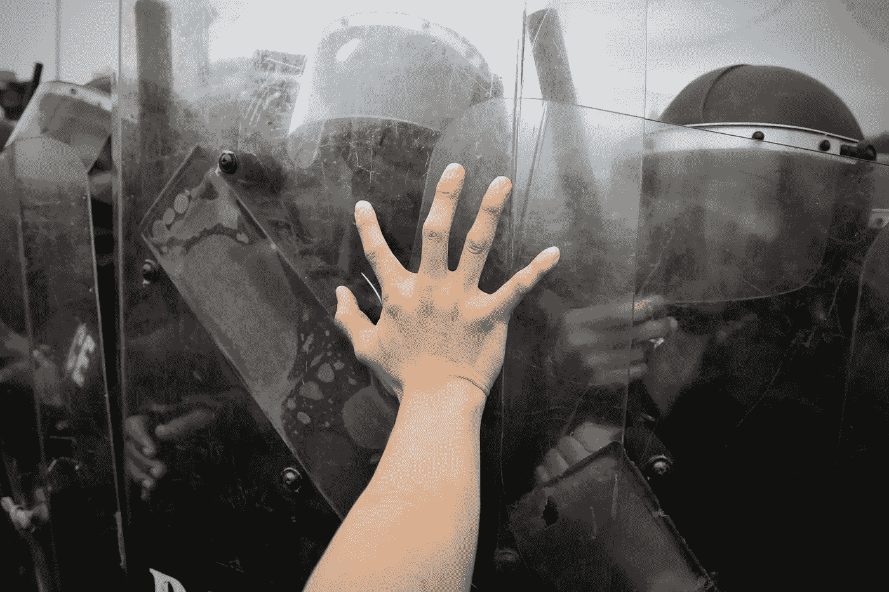

# 没有权威的身份:一个适用于整个世界的分散式身份系统

> 原文：<https://medium.com/hackernoon/identity-without-authority-a-decentralized-id-system-for-the-whole-world-bf9aad1a096b>

这个星球上超过 15 亿人没有身份证或者没有办法获得身份证。获得身份证明是一个棘手的问题。你需要一个身份证才能得到一个身份证。

即使在像美国[这样的复杂经济体中，数百万美国人也没有任何形式的身份证明。这就是为什么](http://www.npr.org/2012/02/01/146204308/why-millions-of-americans-have-no-government-id)[选民压制法](https://www.thenation.com/article/voter-suppression-is-a-much-bigger-problem-than-voter-fraud/)以无情的效率针对穷人和心怀不满的人。政客们知道第 22 条军规的存在，并故意利用它。

停下来想一想这到底有多疯狂:

你必须有一张证明你存在的纸，然后才能拿到另一张证明你存在的纸。

仅仅存在是不够的。

五十年前，你有没有出生证明并不重要。世界是模拟的。社区变小了。但是今天的世界越来越数字化。没有出生证明，就别想拿到身份证了。这就是为什么联合国创建了他们的 ID2020 项目。任何人都不应该说你不能参与系统中最基本的层面。但这正是今天发生的事情。

但是 ID2020 项目还不足以保护隐私和滥用。**这就是为什么我们创建了一个分散的、保护隐私的、生物特征 ID 系统作为** [**the 蝉分布式应用平台**](http://iamcicada.com/) **的基础。对于地球上的每个人来说，这是一个完全开放的人类唯一标识符。**

它使用**生物特征标记作为公钥/私钥**的输入，以及**一个全面的声誉分层系统，与今天的声誉系统概念**有很大不同。我们在最初的蝉白皮书中详细描述了这个平台，但是它仍然是系统中最有争议和最不被理解的部分，我们收到的关于 IDs 的问题中有 90%都是这样。问题主要围绕着是否有可能建立一个强大的 ID 系统，在没有任何中央机构的情况下抵御 Sybil 攻击。

一个常见的说法是，这是“不可能的”,主要是因为它从未被做过，因此人们没有参照系来与之比较。

我们同意一个分散的 ID 系统是非常困难的，但我们不同意这是不可能的。不可能和非常困难之间有很大的区别。

**这就是为什么今天我们要发布** [**一篇新论文，更好地详述了蝉通用 ID 系统**](https://github.com/the-laughing-monkey/cicada-platform/blob/master/Identity-Without-Authority-2017.21.3.BETA.pdf) **。**

我们意识到，问题在于我们未能准确概述声誉系统将如何防止攻击，因为人们对声誉系统的想象(作为 Yelp ratings 的一个大版本)与我们实际设计的方式之间存在脱节。

别担心，这不是一个[黑镜风格系统](http://www.theverge.com/2016/10/24/13379204/black-mirror-season-3-episode-1-nosedive-recap)，每个人都因微笑而得分，每个人都根据头发、微笑和衣服对其他人进行评级。

相反，蝉信誉银行是由强大的信任算法层组成的，它自动地从上到下在系统的所有层次上工作。它保护和捍卫系统，防止欺诈，并允许特殊功能，如[我们在关于蝉的第一篇文章](https://artplusmarketing.com/how-we-can-deliver-a-universal-basic-income-right-now-and-save-ourselves-from-the-robots-without-e1972e22e8eb)中描述的内置普遍基本收入。

我们也不是孤军奋战。我们与 [Fermat 物联网](http://www.fermat.org/)背后的编码人员团结一致，在接下来的几个月里合作创建他们的 ID 框架。

那么这一切是如何运作的呢？

首先，设想一个内置于 TCP/IP 协议本身的信誉系统。它寻找异常，并为网络上的所有节点提供通用的健全性检查。它的规则是自动的，是从区块链拉下来的。可以把它想象成一个区块链版本控制系统，结合了入侵检测、防火墙规则和健全性检查。

这些规则管理网络上的交易。网络上没有一个节点相信规则得到了遵守。系统期待攻击者。我们信任但核实。这是蝉平台的指导思想之一:

要建立一个系统，你首先要想象出摧毁它的所有方法。

每个节点自己进行验证，以确保不正确的事务不会在网络上传播。

想要旋转一个流氓节点并忽略所有规则吗？祝你好运。系统的其他部分会忽略你。

做坏事的节点要付出代价。无论是蓄意攻击还是恶意软件感染的节点，它们都会通过网络信誉系统自动评级。例如，一个节点可能会询问另一个节点是否可以用密码证明它正在运行最新的具有正确签名的区块链分布式网络规则集。如果该节点不能，它的信誉分数会立即受到影响。

如果该节点继续表现不佳，如发送格式错误的数据包，它的声誉将继续受到打击。最终，受攻击的节点可能会通过其防火墙规则制定临时本地阻止，阻止来自攻击节点的所有流量。然后，它将向更广泛的网络投票，攻击节点正在违反共享信任。如果从网络获得了足够的投票，则该节点可以被列入黑名单，持续不断地升级时间段。

起初可能是五分钟，然后是七分钟，然后是十分钟，然后是十五分钟。最终，某个节点可能会被自动列入黑名单数天，甚至永久列入黑名单，直到它能够通过针对另一个区块链的自动验证过程再次证明其网络堆栈的正确性。

这只是声誉问题的一部分。[查看论文](https://github.com/the-laughing-monkey/cicada-platform/blob/master/Identity-Without-Authority-2017.21.3.BETA.pdf)了解其余细节。

当然，也许你想知道为什么我们不创建一个中央机构并发布 id？那不是更容易吗？

当然，但这并不起作用，因为**信任是*而不是*永久的。信任是一个令人感动的概念。**

尽管如今中央控制力度据称很大，但身份欺诈仍然猖獗。集中信任是一种错觉。大公司的违规事件每天都在发生。目前，其他人拥有你的社会安全号码的几率是七分之一。集中信任甚至不是灵丹妙药。

更糟糕的是，中央政府可能会变坏，即使是出于好意的政府。一个你今天了解并热爱的中央权威可能明天就会背叛你，背叛你的信任，让你无路可逃。

信任很容易从积极变成消极或者再变回来。如果一个男人对他的妻子忠诚了 15 年，然后欺骗了她，他所有的信任会在一夜之间燃烧殆尽。

蝉项目认为需要一个强大的、保护隐私的、开放的、分散的、没有中心瓶颈的 ID，原因很简单:

它提供了防止欺诈、滥用、越权和独裁的最佳保护。

在不久的将来，地球上每个人都拥有某种形式的数字身份证几乎是不可避免的。所以要么我们自己创造，要么有人替我们做，我们会讨厌结果。就这么简单。

不相信我？

如果我告诉你努力已经开始了会怎么样？

银行和外国政府正在我们无法控制的集中式数据库中创建庞大、安全性差、不可撤销的生物识别系统。像 [GenKey](http://www.securitydocumentworld.com/article-details/i/10551/) 这样的公司正在与印度政府合作，为 10 亿人创建通用身份证，使用一种专有的、受版权保护的算法，除了公司选择分享的内容之外，人们对任何东西都没有洞察力，因为打开和服意味着失去竞争优势。

如果我们允许私营公司继续创造这种技术，你将不会知道你的信息存储在哪里或如何存储，访问它的专有算法是否有好的或坏的目的，或者甚至它是否真的安全。直到它不可避免地遭到黑客攻击，你的所有个人数据都泄露到网络上，包括你的虹膜或指纹模板或你的 DNA 散列，你才会知道其中的大部分内容。现在，作为一个 ID，这些数据已经没有用了，因为你无法收回或更改它们。

没有秘密的目的，集中式组织不会创建大量的信息存储。无论是一个目标是根据你的个人好恶从广告中赚钱的社交媒体平台，还是一个希望跟踪、控制和监视其公民的政府，这些平台从一开始就会被那些消极的哲学所腐蚀。

这些理念将会在最终的系统中被烤成*，并且不可避免。*

*   你不能在一个建立在封闭思想基础上的系统中建立开放性。
*   你不能在一个为了破坏隐私和安全而构建的系统上改造隐私或安全。

隐私、开放和安全必须从一开始就是系统设计的基础。

**我们强烈认为，这些系统应该被经过普遍审查、安全且公开设计的系统所取代。**

我们不能让这成为一个远离公众监督的私人封闭系统。我们也不能让一个中心阻塞点来控制它。原因也很简单。

说到政府，它们可以在一瞬间从自由民主变成专制噩梦。

将如此强大的系统的控制权留给任何一个团体都是一场迟早会发生的灾难。如果这个群体从受信任变成不受信任，那么这个游戏对所有人来说都结束了。

这就是为什么创造一个去中心化的身份不仅是一个有用的想法，也是一个道德上的要求。

我们需要在为时已晚之前创造它。

我们还有时间。但是很快就用完了。

我们仍在寻找一些优秀的程序员和更多的 alpha 测试人员，你可以在这里注册成为其中之一。

加入这个项目。

编码未来。拯救世界。

############################################

**如果你喜欢这篇文章，我希望你能鼓掌推荐给其他人。之后，请随时将文章通过电子邮件发送给朋友！非常感谢。**

############################################

如果你喜欢我的作品**，请** [**赏光访问我的作品页面**](https://www.patreon.com/danjeffries) **，因为这是我们一起改变未来的方式。**帮我脱离母体**我会百倍地回报你的慷慨，把我所有的时间和精力集中在写作、研究和为你和世界提供令人惊叹的内容上**。

###########################################

关于我:我是一名作家、工程师和连续创业者。在过去的二十年中，我涉及了从 Linux 到虚拟化和容器的广泛技术。

*你可以看看我的最新小说，* [***一部史诗般的中国科幻内战传奇***](http://amzn.to/2gAg249) *在这部小说中，中国挣脱了共产主义的枷锁，成为世界上第一个直接民主国家，运行着一个高度先进、人工智能的去中心化应用平台，没有领导人。*

## 当你加入我的读者群，你可以免费得到一本我的第一部小说《蝎子游戏》。读者称之为“神经癌的第一次严重竞争”和“黑色侦探会见约翰尼记忆术。”

## 你也可以根据书中的想法查看一下[蝉开源项目](http://iamcicada.com/)，这本书概述了如何立即将这项技术变成现实，你也可以参与其中。

## 最后，你可以[加入我的私人脸书小组，Nanopunk Posthuman 刺客](https://www.facebook.com/groups/1736763229929363/)，在这里我们讨论所有的科技、科幻、幻想等等。

############################################

感谢阅读！

> [黑客中午](http://bit.ly/Hackernoon)是黑客如何开始他们的下午。我们是 [@AMI](http://bit.ly/atAMIatAMI) 家庭的一员。我们现在[接受投稿](http://bit.ly/hackernoonsubmission)，并乐意[讨论广告&赞助](mailto:partners@amipublications.com)机会。
> 
> 如果你喜欢这个故事，我们推荐你阅读我们的[最新科技故事](http://bit.ly/hackernoonlatestt)和[趋势科技故事](https://hackernoon.com/trending)。直到下一次，不要把世界的现实想当然！

