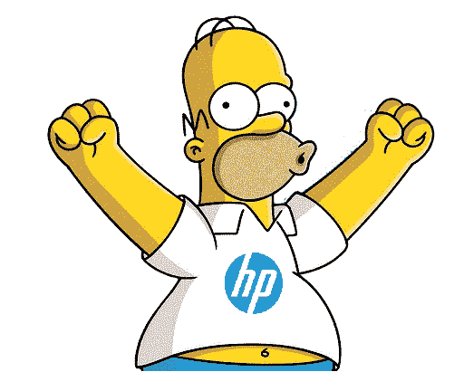
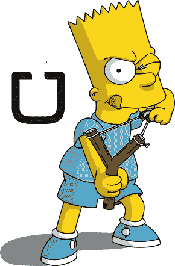
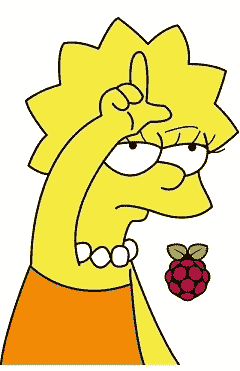
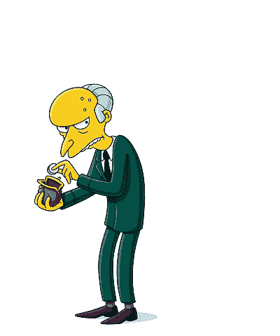
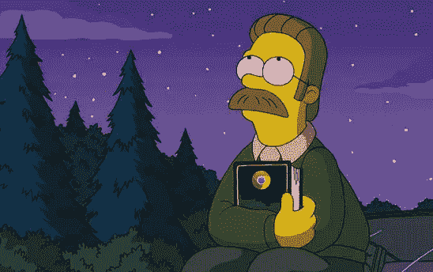
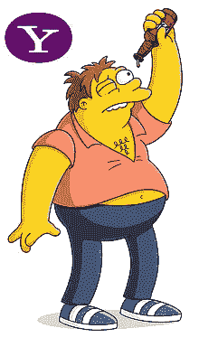
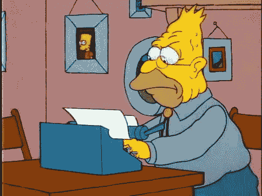

# 如果大型科技公司是辛普森一家的角色

> 原文：<https://medium.com/hackernoon/if-big-tech-companies-were-simpsons-characters-ea1b55101986>

# **荷马(HP)**

家里的一个老成员，可爱的傻瓜。谁能忘记那些几乎导致核电站熔毁的经典案例，或者 110 亿美元收购一家没人听说过的公司 Autonomy？

我们永远不会厌倦他滑稽的陈述和古怪的动作。

# **巴特(优步)**

巴特曾经调皮捣蛋，而且(通常)惹上了当局的麻烦，他是[当权派](https://hackernoon.com/tagged/establishment)的中指。

总是引起某种[的兴奋](https://hackernoon.com/tagged/excitement)并且总是坚持“男人”。你可以想象一下口号“吃我的短裤！”在公司总部。

扰乱出租车行业？别大惊小怪，伙计。

# **丽莎(树莓派)**

早熟而聪明，然而天真而可爱，丽莎总是在那里纠正每个人。例如，一台电脑不需要比你的手大，价格也不需要超过 5 美元。拿那台 3500 美元的苹果机来说吧！(翻白眼)

# **伯恩斯先生(苹果)**

提示死亡之星音乐——斯普林菲尔德最富有和最有权势的居民在行业中赫然耸现。什么商业天才把用户无休止地锁定在一个生态系统中，拒绝开放 iMessage，对耳塞收费 159 美元。无情和不断挫败他的敌人，伯恩斯在这个镇上运行的东西。

# 奈德(谷歌)

内德是个书呆子，但总是出类拔萃，他有着旧时的信仰。像“不要作恶”或“少花点时间在你的背上，多花点时间在你的膝盖上”这样的口号，内德是我们希望拥有的永远存在的良知。

# **巴尼(雅虎)**

你能说什么？巴尼一团糟。作为一个年轻的小伙子，充满潜力，但在某个地方出了问题。大错特错。

仍然是春田市的一个固定的场景，但是一个警示的故事，巴尼..良好的..只是喝醉了。

# **爷爷(IBM)**

老爷爷虽然年纪大了，但仍然爱唠叨，他会向所有愿意倾听的居民提出他几乎连贯的建议。

然而，如果你顶嘴，他可能听不到你，所以你需要大声说。

> [黑客中午](http://bit.ly/Hackernoon)是黑客如何开始他们的下午。我们是 T21 家庭的一员。我们现在[接受投稿](http://bit.ly/hackernoonsubmission)并乐意[讨论广告&赞助](mailto:partners@amipublications.com)机会。
> 
> 如果你喜欢这个故事，我们推荐你阅读我们的[最新科技故事](http://bit.ly/hackernoonlatestt)和[趋势科技故事](https://hackernoon.com/trending)。直到下一次，不要把世界的现实想当然！

