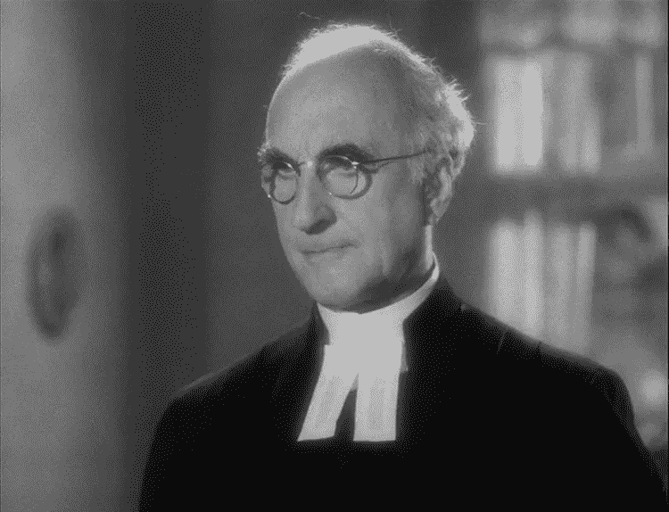
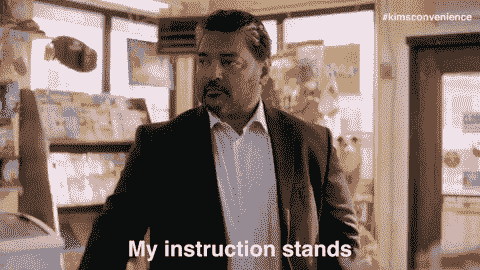

# 如果区块链是一个人

> 原文：<https://medium.com/hackernoon/if-blockchain-was-a-person-8ba03c23e8f1>

这个故事将帮助你了解[区块链](http://amzn.to/2BS2JaH)，而不进入技术层面。

想象一个 52 岁的智者。他的名字是威廉·笨蛋。

## **他照章办事**

威廉对物质财富不感兴趣。他的快乐在于遵守规则。说服他是不可能的。他根据书面规则做出合乎逻辑的决定。

## 他是最终的决策者

他不对任何人负责。没人能解雇他。他的裁决是最终的。

## 他是不可阻挡的

他不仅做出合乎逻辑的决定。他不会停止，直到他看到他们实施。

## 他是不可毁灭的

他是不可毁灭的。他有金刚狼般的治愈功能。即使你伤害了他，他有一个生物系统可以立刻治愈他。

## 他很快

即使你用任务轰炸他。他在给定的时间内完成了它。

## 他的收费是象征性的

尽管他有坚强的品质。你不必付出高昂的代价。

## 他没有什么可隐瞒的

如果你怀疑他的决定。你可以要求记录。他很乐意为你提供。

想象一下，你正与雇主发生纠纷，而雇主不愿意按约定支付工资。你去法院，请个律师，打一场官司。想想你要付出的代价，要等待的时间。有时这一费用可能会超过你的付款。所以很可能你连打架的钱都付不起。

但如果它通过威廉·布洛克海德。你的工作一完成，钱就到了你的账户上。

现在任何人都不可能拥有这些品质。然而，它是可编程的。[区块链](http://amzn.to/2BS2JaH)就是这样一个具有这些特性的程序。全世界数以百万计的计算机合作执行它。

*我在写一本关于区块链的书。如果您希望获得预发布版本* [*，请在此*](https://goo.gl/forms/jhkzLnsYm3yrLMlD2) *处注册。你可以提出你想涉及的话题。我还推荐一本书，里面有我写的每一个故事。由于* [*阅读*](https://mentorbox.com/partners?affiliate_id=898086) *是非常宝贵的。对于这个故事，是 Tapscott brothers* *的* [*区块链革命。感谢您的阅读。我可以通过电子邮件回复你在区块链的问题。让我们*](http://amzn.to/2BS2JaH) [*谈谈*](mailto:febinjohnjames@gmail.com) *。*

 [## 区块链——黑客正午

### 区块链是所有加密货币交易的数字化、去中心化的公共分类账。区块链已经…

hackernoon.com](https://hackernoon.com/blockchain)