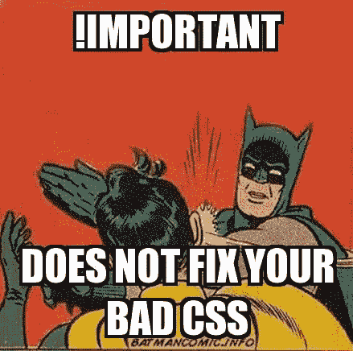
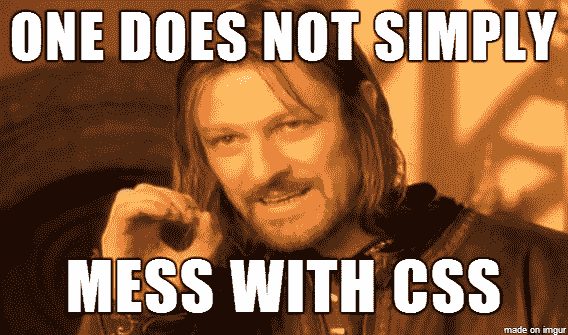
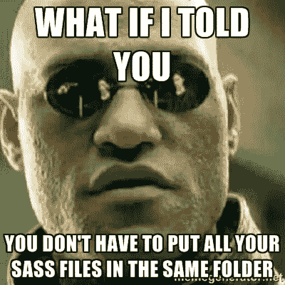
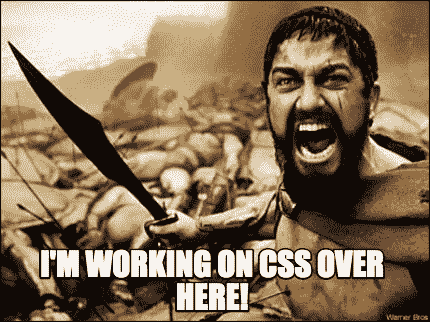

# 如果 CSS 这么容易为什么大家都很烂？

> 原文：<https://medium.com/hackernoon/if-css-is-so-easy-why-does-everyone-suck-e4442cc9428a>

在你开始这篇文章之前，90%的人对前端[开发人员](https://hackernoon.com/tagged/developer)不满，最后可能有 10%的好的实践技巧。你已经被警告了。



如果你是一名前端开发人员，并且在你职业生涯的某个阶段觉得你做的事情很容易，你给团队增加的价值很小，你做的事情任何人都可以做，请举手。如果是这样，那么你就是大多数人的一部分。

公平地说 [CSS](https://hackernoon.com/tagged/css) 很简单，对吧，我的意思是任何笨蛋都能做到:

```
p {
    color: red;
}
```

那么我有什么权利抱怨呢？CSS 不需要任何技能来编码。这是绝对正确的，设计**一个**元素在**全局**级别，没有**其他** CSS 要担心是很容易的。

# 那么什么时候会变得困难呢？



**后端开发人员:** *我已经实现了一个新功能，但我打破了前端，我修复了它的大部分只是一些简单的调整给你做，应该不超过 30 分钟的工作…*

**Me** *深呼吸*他们写的 CSS 肯定会更好。*打开 CSS 文件*固定位置，清除左右，和！处处重要。*慢慢将鼠标绕在脖子上*

好吧，也许并不总是那么糟糕，但是我只见过很少的后端开发者编写可用的前端代码。这很好，这不是他们的责任，但请不要做一个半吊子的尝试，然后期望前端开发人员来清理你的烂摊子。

# 那么什么是好的 CSS 呢？



**结构**，项目结构真的很重要，尤其是在处理大型项目的时候，这是帮助你维护代码的[目录结构的一个很好的例子](http://vanseodesign.com/css/sass-directory-structures/)作者 Steven Bradley，这篇文章是针对 SCSS 的，但也可以应用于普通的 CSS 项目，它把重点放在将你的 CSS 调整成更易维护的文件上。

**特异性**，这可能是我日常面临的最大问题。不幸的是，大多数开发者对 [CSS 特异性](https://developer.mozilla.org/en/docs/Web/CSS/Specificity)的理解很松散，这导致了最糟糕的 CSS…!到处都是重要人物。那么我们如何补救呢？有许多命名约定(见下文)关注于最小化对高度特定的 CSS 选择器的需求，但是如果这不是你的事情，我建议避免深度超过 3 个元素/类的选择器，除非绝对必要。

**命名约定**，对于任何大规模的 CSS 项目来说，命名约定都是必须的 **IMHO。没有它们，CSS 变得不可维护和不可信，命名约定允许我们在项目中轻松重用 CSS，并在必要时删除未使用的 CSS。一些流行的命名约定有: [BEM](http://getbem.com/introduction/) ， [OOCSS](http://oocss.org/) ， [SMACSS](https://smacss.com/) ，还有我自己的[嗝嗝](https://github.com/CrashyBang/hiccup)等等。**

**测试**，这是大多数其他开发人员似乎*忽略的一点*你知道作为一名后端开发人员有什么好处吗？你可以在一个环境下开发(你的站点将要安装的服务器)。你知道做前端开发人员有什么不好吗？5 个以上的浏览器和 1000 多种移动设备…良好的前端测试是一项艰巨的任务，需要大量的时间。我看到许多项目超时，因为测试没有被考虑在内，并且通常比大多数人预期的要长。

# 那么我们如何修正这种不切实际的 CSS 观呢？



不要让他们得逞，作为前端开发人员，我们不能为后端开发人员编写一半没有响应的 CSS，所以他们为什么要提供蹩脚的无用标记，并试图修补我们的 CSS，使其无法工作？我不是说让他们写，告诉他们不要写，如果这样更容易的话。请不要让其他开发人员认为你做的事情很容易，事实并非如此，你和其他人一样努力工作，不要让任何人告诉你不同。

[](http://bit.ly/HackernoonFB)[](https://goo.gl/k7XYbx)[](https://goo.gl/4ofytp)

> [黑客中午](http://bit.ly/Hackernoon)是黑客如何开始他们的下午。我们是 [@AMI](http://bit.ly/atAMIatAMI) 家庭的一员。我们现在[接受投稿](http://bit.ly/hackernoonsubmission)，并乐意[讨论广告&赞助](mailto:partners@amipublications.com)机会。
> 
> 如果你喜欢这个故事，我们推荐你阅读我们的[最新科技故事](http://bit.ly/hackernoonlatestt)和[趋势科技故事](https://hackernoon.com/trending)。直到下一次，不要把世界的现实想当然！

[](https://goo.gl/Ahtev1)