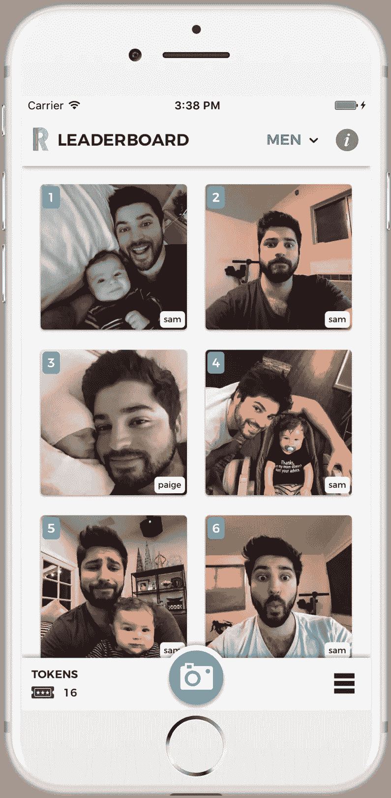

# 如果不是苹果，混合应用程序开发将会是本地应用程序开发的明显赢家

> 原文：<https://medium.com/hackernoon/if-it-werent-for-apple-hybrid-app-development-would-be-the-clear-winner-over-native-ae64fa37ad48>

在过去的 6 个月里，我一直在开发一款手机应用 [Rizer](https://www.rizerapp.com) ，它允许用户从多个类别(目前是动物、婴儿、食物、搞笑、男人、自然和女人)来评判照片大战，并提交他们自己的照片给这些类别进行评判。照片使用 ELO 算法进行排名(爱德华多·萨维林在*《社交网络* 》中那个令人敬畏的 [FaceMash 场景中在窗户上画的)，最高评级显示在 Rizer 的排行榜上。](https://www.youtube.com/watch?v=OLnd6-thEHM)

Rizer 是一个混合应用程序，它使用 [Apache Cordova](https://cordova.apache.org/) 及其[过多的本机插件](https://www.npmjs.com/browse/keyword/ecosystem:cordova)来访问用户设备上的重要本机功能，例如:接收推送通知、用相机拍照以及处理应用内购买。



I currently dominate the Men’s Leaderboard 😎

从一开始，对我来说至关重要的是，普通用户不知道 Rizer 是一个混合应用程序。这意味着它需要设计良好，高性能([嘿，这不是一个词！](http://stackoverflow.com/questions/2112743/what-does-performant-software-actually-mean))，并不缺乏用户期望从这种应用程序中获得的任何原生功能，也不会在设备失去网络连接时变得无用。谢天谢地，根据我的 40 个家人和朋友的 beta 测试人员的说法，我达到了这个目标(我甚至可能同意他们的观点)。

如果你不相信我，或者如果你已经有一段时间没有玩你知道肯定是一个混合应用程序了，那么我鼓励你[下载 Rizer](https://www.rizerapp.com) ，判断一些战斗，检查排行榜上的几个类别，如果你觉得勇敢，提交一些你自己的照片。你可能会对混合应用程序的能力留下深刻印象，如果没有，至少你可以看到一些可爱的动物和婴儿。

# **毫无疑问，对于绝大多数应用来说，混合是正确的选择**

## 理解以下三个要点很重要:

*   一个应用程序的混合版本永远不会像相同应用程序的原生版本那样快，但只要混合版本足够快*就没关系。简单地说，如果你的用户从不抱怨你的应用程序的性能，那么它就足够快*。作为一个性能爱好者，我理解知道我的应用程序尽可能快地运行的吸引力，但我们必须小心避免过早和过度优化。知道我的原生应用程序在页面上渲染 100 张照片的速度比混合版本快 8 毫秒，这可能会让我内心感到温暖和模糊，但我的用户会注意到或关心吗？号码**
*   **资源饥渴的 3D 游戏或类似游戏不符合我对“应用”的定义。在这些情况下，原生应用几乎肯定是你的最佳选择，因为混合应用*将努力成为足够快的**。近年来，Canvas 的性能有了很大的提高，但旧设备仍然很可能运行一个资源密集型应用程序太慢。***
*   *****运行在现代 JavaScript UI 框架之上的设计良好的混合应用程序绝对*足够快*** 。糟糕的表现不能再被用作放弃混合方法的借口。如果你最近尝试制作一个混合应用，并且对性能不满意，那么你需要认真地重新评估你选择的设计模式和/或你[不需要](http://youmightnotneedjquery.com/)的 jQuery 等大型库的使用。如果您还没有，请学习现代 DOM API。我们应用的所有目标设备都支持它。***

## **混合方法有一些主要的优势:**

*   ****你可以利用现有的 JS、HTML 和 CSS 技能来开发一个既能在 iOS 上运行又能在 Android 上运行的*单一代码库*。这是混合应用程序显而易见的关键优势，但它真的不能被夸大。在我的项目中，不到 10 次，我需要根据应用程序运行的平台来分支代码(这只是在修复 iOS bug 时需要的，稍后会有更多)。代码中的一个分支如下所示:****

```
**if (device.platform === "iOS") {
  doRidiculousWorkaround();
} else {
  doThingThatWorksAsExpected();
}**
```

*   ****在开发过程中，在您的设备上查看更改几乎是即时的。**在整个开发过程中，我在 Galaxy S7 Edge 上测试了我所有的代码更改。这款手机连接到我的电脑上，启用了 USB 调试功能，运行的是 Rizer 的“调试”版本。如果你在 Chrome 的地址栏中输入`chrome://inspect/#devices`，你会看到一个列表，里面列出了所有连接到你电脑的设备上运行的 Chrome 标签。通过点击列表中的 Rizer，一个新的 DevTools 窗口打开，我可以像分析一个普通网站一样全面地分析这个应用程序。将这一功能与我的构建系统中的实时重新加载工具相结合，我能够对我的代码进行更改，并在几秒钟内在我的设备屏幕上看到更新的结果。*漂亮的*。**
*   ****您可以将更新的 JS、CSS、HTML、字体和图像直接推送给所有用户*，而无需重新编译应用的二进制文件并获得应用商店的批准*** 。Rizer 使用[微软的 CodePush](https://microsoft.github.io/code-push/) 服务(目前是免费的)和它的 [Cordova 插件](https://github.com/Microsoft/cordova-plugin-code-push)在每次启动时检查更新，老实说，我不知道没有它我会做什么。或者， [Ionic 的 Deploy](http://ionicframework.com/products/#updates) 也可以用同样的方式使用，但是由于它不是免费的，而且我也没有使用 Ionic，所以使用它没有意义。**
*   ****你可以选择你最喜欢的 UI 框架和工具**。Rizer 运行在我自己的前端框架 [Samson.js](https://github.com/SamDelgado/samson.js) 之上(不用麻烦使用它，它是没有文档记录的，并且不断发展以适应我的个人需求)，但是我可以在 React、Vue 或 Ionic/Angular 之上成功地构建它。**

> **“哇，山姆，这些优势听起来太棒了！有什么坏处吗？”**

## **混合方法有一个主要缺点:**

*   ****我们作为开发者还是要关心 iOS，也就是说要忍受苹果的 BS。** *嘿，押韵。***

**你可能会感到困惑。即使我们采用原生方法，我们仍然会关心 iOS，因此仍然需要忍受苹果的 BS，对吗？**

**算是吧。**

## ****这里有一些无论我们用什么方法都无法避免的苹果错误:****

*   ****Xcode****
*   ****配置文件****
*   ****需要一台 Mac 来编译应用****
*   ****测试版需要使用 test flight****
*   ****app 审核流程。**不可否认，应用审查时间已经下降到平均约 [2 天](http://appreviewtimes.com/)，但是当你的应用像 Rizer 一样被拒绝 7 次(出于合理的愚蠢原因)，你的耐心真的开始变得稀薄。**

## ****除了以上，混合 app 还得处理这个 BS:****

*   ****iOS 网络视图****

**等等，什么？iOS 的 WebView 真的有那么差吗？*是*。**

# **两个网络浏览量的故事**

**我们的混合应用程序中包含的 [JavaScript](https://hackernoon.com/tagged/javascript) 代码在 WebView 中运行，WebView 本质上是一个与应用程序捆绑在一起的原生浏览器。在 Android 上，我们的代码运行在一个现代的基于 Chromium 的 WebView 中，在很大程度上完全按照它应该的那样工作。在 iOS 上，我们可以选择在两种网络视图中运行我们的代码:UIWebView 或 WKWebView。**

****在这两个网页浏览量中选择*很烂*。****

**UIWebView 是在 iOS 2 中引入的，在 iOS 8 中加入 WKWebView 之前是唯一的选择。UIWebView 与大多数现有的 Cordova 插件有很好的兼容性，但总体上臃肿而缓慢。这两种 WebView 在 HTML 5 支持上[几乎没有区别](http://blog.initlabs.com/post/100113463211/wkwebview-vs-uiwebview)，但是由于 WKWebView 使用了 Nitro JavaScript 引擎，所以在性能上有显著差异。**

**根据 [Nitishkumar Singh](https://www.linkedin.com/pulse/boost-cordova-ios-performance-wkwebview-nitishkumar-singh) ，WKWebView 提供:**

> **RAM 使用的大量减少，更快的启动，JIT JavaScript 编译，进程外渲染，内存使用的减少，稳定性的提高，更好的安全性，最新的 web 标准等等。**

**在 2014 年 iOS 8 发布之前，许多吹捧【WKWebView 对混合应用有多重要的文章开始涌现。混合应用程序开发人员非常兴奋能够利用 WKWebView 提供的上述优化。**

****不幸的是，当 iOS 8 最终推出时，由于缺乏一些** [**必备的功能**](http://www.openradar.me/radar?id=5839348817723392) **，WKWebView 无法被放入现有的混合应用中。整整 3 年后，情况才略有好转。****

# **WKWebView 的当前状态**

**多亏了 Ionic 团队的出色工作，一些自虐的开发者(包括我自己)正在他们的混合应用中使用 WKWebView。我会第一个说当 WKWebvView 工作的时候，*真的工作*。 **Rizer 在我妻子的 iPhone 7 上冷启动和安装 CodePush 更新的速度比在我的 Galaxy S7 Edge 上快得多。**但是不起作用的时候呢？让我们开始吃吧。**

## **WKWebView 问题需要黑客解决方法或完全放弃功能:**

*   ****无法访问应用程序根“www”文件夹中不存在的文件。****
*   ****众多 CORS(跨源资源共享)问题，包括无法从使用本地图像绘制的画布中提取图像数据**。这对于 Rizer 来说几乎是一个阻碍，因为我需要允许用户对他们的照片进行裁剪和添加滤镜，这两者都需要在画布中操作图像，然后从中提取像素数据。我说*几乎是一个阻碍*，因为我实际上能够通过在 iOS 上分支我的代码并做以下可笑的事情来解决这个问题:**

```
**1\. Pass the fileURL of the photo we just took on the device to the FileReader API's "readAsArrayBuffer" function.2\. Convert the arrayBuffer returned from the "readAsArrayBuffer" function into a base64 string using the following function:function arrayBufferToBase64(arrayBuffer) {
  var binary = '';
  var bytes = new Uint8Array(arrayBuffer);
  var len = bytes.byteLength;
  for (var i = 0; i < len; i++) {
    binary += String.fromCharCode(bytes[i]);
  }
  return window.btoa(binary);
}3\. Finish creating our DOM-readable "imageDataURL" by prepending "data:image/jpeg;base64," to our returned base64 string4\. Create a new Image, load our imageDataURL as its "src", and once the image is done loading, create a new canvas element and draw the image into it. It looks something like this:var image = new Image();
image.onload = function() {
  var canvas = document.createElement("canvas");
  canvas.width = image.width;
  canvas.height = image.height;
  canvas.getContext("2d").drawImage(image, 0, 0);
  callback(canvas); // No CORS issues
};
image.src = imageDataURL;5\. Throw your computer out the window :)**
```

*   ****不可预测的垂直滚动行为，而且以我的经验来看，完全破水平滚动**。有时候，我妻子会加载 Rizer 的排行榜页面，如果不返回上一页，然后重新加载排行榜页面，就无法滚动浏览照片。这个问题如此严重，以至于我最终需要实现 [iScroll](https://github.com/cubiq/iscroll) 。*唉*。**
*   ****完全缺乏 getUserMedia 支持**。对于 Rizer 来说，这并不是一个精彩的表演，但它阻止了我开始另一个项目。这在 2017 年是完全不可接受的，并进一步证明了 [Safari 是新的互联网浏览器](https://nolanlawson.com/2015/06/30/safari-is-the-new-ie/)。**
*   ****对显示和隐藏键盘没有编程控制****
*   ****App-breaking 与 Cordova SplashScreen 插件的稳定版本冲突****
*   ****应用破解与 Cordova 应用内浏览器插件的稳定版本冲突****

## **你必须明白，在 Android 上运行的混合应用程序不存在上述问题。**

**说真的，我对谷歌建立的应用程序从开发到发布的过程没有任何抱怨。Google Play 开发者控制台令人难以置信，具有强大的发布管理、A/B 测试、应用内产品创建、订单管理、应用安装和使用分析、用户反馈收集，并且缺少一个[荒谬的审核流程](https://www.techdirt.com/articles/20140317/08084426593/apple-rejecting-tank-battle-1942-then-approving-shows-how-stupid-approval-process-is-ios-apps.shtml)。锦上添花的是，由于 Android 基于 Chromium 的 WebView，我们知道我们的混合应用程序将完全按照我们的预期呈现和运行。**苹果在这方面落后太多，以至于我甚至不能在不听起来像个粉丝的情况下谈论谷歌的产品。****

## **毫无疑问，创建 Rizer 是一个比我预期的更漫长和更令人沮丧的经历…感谢苹果。**

**我的家人可以证明，当他们问我 Rizer 的开发进展如何时，我经常抱怨苹果和 iOS。世界上最有价值的公司***创造了如此糟糕的开发经历，这一事实不断让我震惊。*****

*****我试图弄清楚为什么苹果没有动力简化他们的混合开发流程，让 Safari 的功能与其他现代浏览器平起平坐(他们并不是没有资源这么做)，或者只是像其他平台(包括 Windows)一样允许使用第三方浏览器。他们是否试图让开发人员在 Android 应用程序之前开发自己的原生 iOS 应用程序，从而降低 iPhone/iPad 用户转向 Android 设备的吸引力，因为他们日常使用的应用程序不在 Google Play 中？*真希望不是*。*****

# ****好吧，那么…混血儿还是本地人？****

****根据我的经验，使用混合方法导致的所有潜在问题都有解决方法。发现和实现它们令人沮丧，但它们确实有效。出于这个原因，我很高兴地说**混合方法是你下一个应用**的正确选择。开发一个混合应用程序绝对会比你应该做的花费更多的时间，但是它仍然比开发两个独立的原生应用程序花费更少的时间，如果设计得当，你的用户会感觉和你一样快。****

****嘿，也许在未来的某一天，苹果会修正我们的路线，为我们提供我们应得的开发经验。在那一天到来之前，我完全期待这场“混血儿对本地人”的辩论能够继续下去。****

****[](http://bit.ly/HackernoonFB)********[](https://goo.gl/k7XYbx)********[](https://goo.gl/4ofytp)****

> ****[黑客中午](http://bit.ly/Hackernoon)是黑客如何开始他们的下午。我们是 [@AMI](http://bit.ly/atAMIatAMI) 家庭的一员。我们现在[接受投稿](http://bit.ly/hackernoonsubmission)，并乐意[讨论广告&赞助](mailto:partners@amipublications.com)机会。****
> 
> ****如果你喜欢这个故事，我们推荐你阅读我们的[最新科技故事](http://bit.ly/hackernoonlatestt)和[趋势科技故事](https://hackernoon.com/trending)。直到下一次，不要把世界的现实想当然！****

********