# 如果科技公司是标志性的汽车…

> 原文：<https://medium.com/hackernoon/if-tech-companies-were-iconic-cars-d2a9409cfcbb>

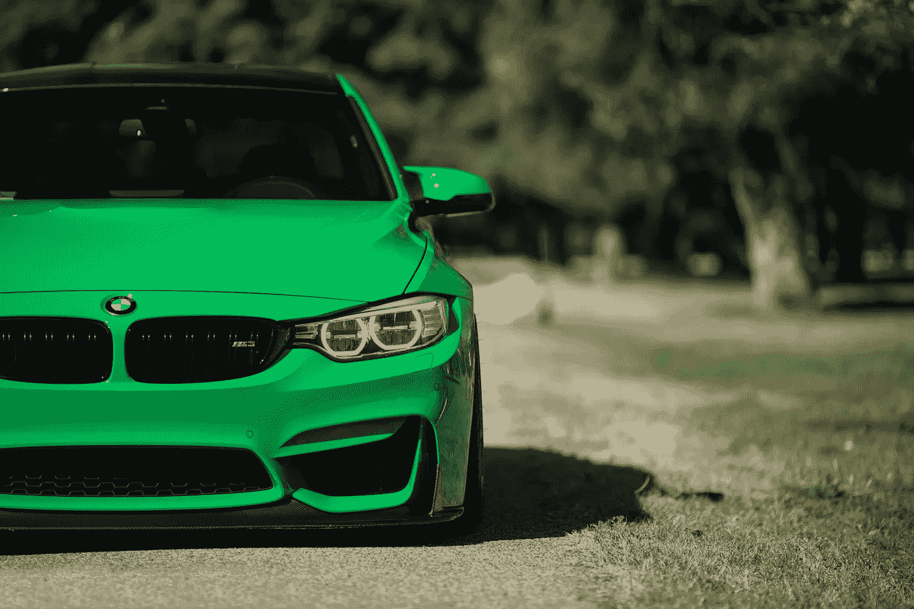

我喜欢汽车，我在科技行业工作，这有点不幸，因为硅谷是独一无二的汽车死亡的地方。灰色普锐斯统治着硅谷的道路。优步希望用自动驾驶的克隆军队取代一切。谷歌的目标是让数百万个这样的小家伙走上街头。

Those faces are what nightmares are made of.

为了给这个行业注入一些自动化的天赋，我认为将 14 家顶级科技公司重新想象为当今最具标志性的游乐设施是合适的。

# 1.Airbnb 就是吉普牧马人

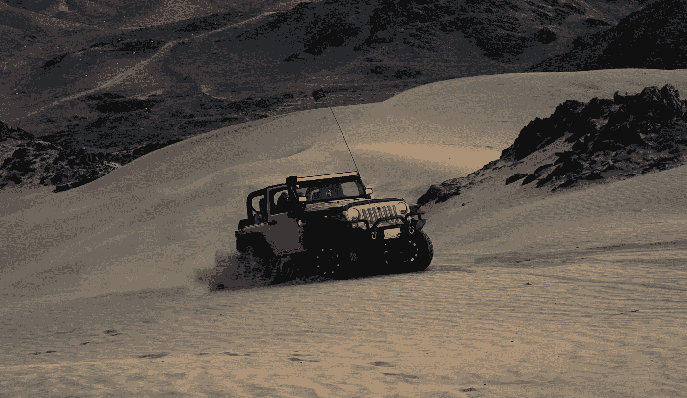

有没有人会认不出牧马人熟悉却又令人兴奋的外形？在其 30 年的生命历程中，四四方方的吉普已经成为冒险的化身。无论我的 Airbnb 是阿尔卑斯山小屋还是撒哈拉大牧场，我都会选择牧马人作为我的首选汽车。

其永恒的设计和无处不在的能力吸引了狂热的追随者。Jeep 比赛在世界各地举行，吸引了成千上万的牧马人爱好者。同样，Airbnb 也因其社区而闻名。当首席执行官写了一篇名为[不要搞砸文化](/@bchesky/dont-fuck-up-the-culture-597cde9ee9d4#.hd1d8rw7t)的文章时，你知道这是真的。

# 2.苹果是保时捷 911

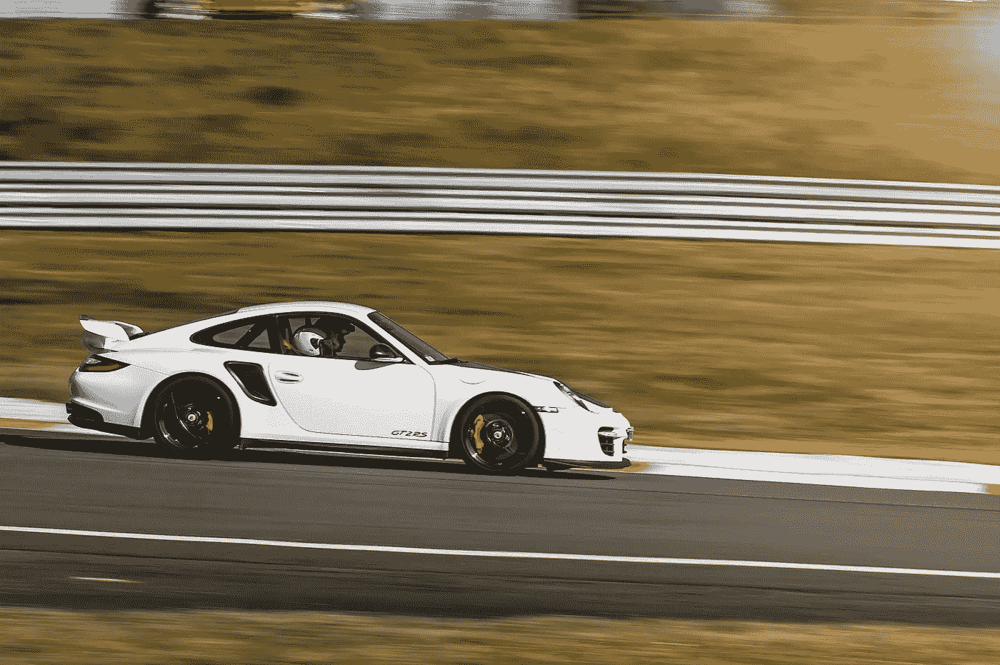

非常光滑。一眼就能认出来。无可挑剔的工程设计。是的，我是保时捷的粉丝，我承认。

这些年来，保时捷的卓越丝毫没有减弱。他们把这句话*“如果它没坏，就不要修理它”*铭记在他们所有工程师的脑海里。第一辆 911 和现在的 911 看起来像是兄弟姐妹。考虑到保时捷 50 多年的历史，这确实是一件大事。

人们说一旦你开了保时捷，你就再也开不了别的车了。这辆车会毁了你。人们也会对特定科技公司的产品说同样的话。

哪家科技公司年复一年地制造漂亮而一致的产品？你猜对了，苹果。

寻找 iPhone v1 和 iPhone v5 之间的相似之处的游戏可能是不可能的。但也许这就是苹果产品如此具有标志性的原因。苹果产品的另一个常见主题是其无可挑剔的工艺。他们是科技界的保时捷。

# 3.Dropbox 是凯迪拉克 CTS-V

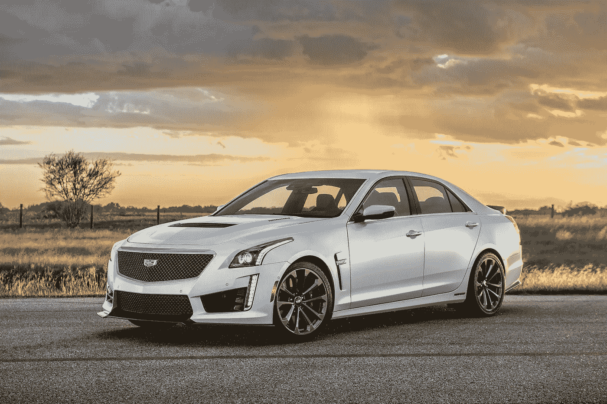

CTS-V 线条清晰，角度锐利，可能是由大理石板雕刻而成。无论是谁想到了它简洁的轮廓，都可能会从 Dropbox 宣扬极简主义和简约主义的剧本中吸取经验。

但是不要把轮廓鲜明误认为裸露。CTS-V 是一台不可忽视的机器。其积极的引擎盖勺，时髦的扰流板，和 640 雷鸣般的马，确保你不会忘记这一事实。Dropbox 在高端领域也不落后，其总部装饰着一座价值 10 万美元的熊猫铬合金雕像。

Someone got a little overenthusiastic with blinging out the crib.

尽管 CTS 的定位令人信服，但它面临着宝马 3 系等车型的激烈竞争，宝马 3 系恰好代表了 Dropbox 最强劲的竞争对手之一谷歌。只有时间才能证明 CTS/Dropbox 能否在拥挤的市场中保持竞争力。

# 4.脸书是奥迪 A4

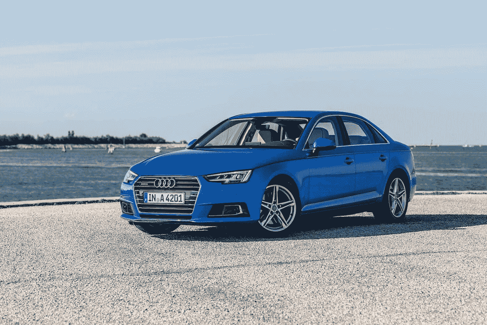

A4 曾经是运动轿车领域的后起之秀。现在，它作为一个主要的参与者在市场上占据了永久的份额。虽然它仍然缺乏宝马的全球品牌声望，但它正在迅速赶上。

驾驶奥迪的每个人都喜欢它——它经常在消费者满意度排行榜上名列前茅。它的增长轨迹看起来与脸书惊人地相似，后者直到最近才巩固了其在科技公司高层的地位。可怕的是，它的增长仍然超出了所有人的预期。

# 5.谷歌是宝马 3 系

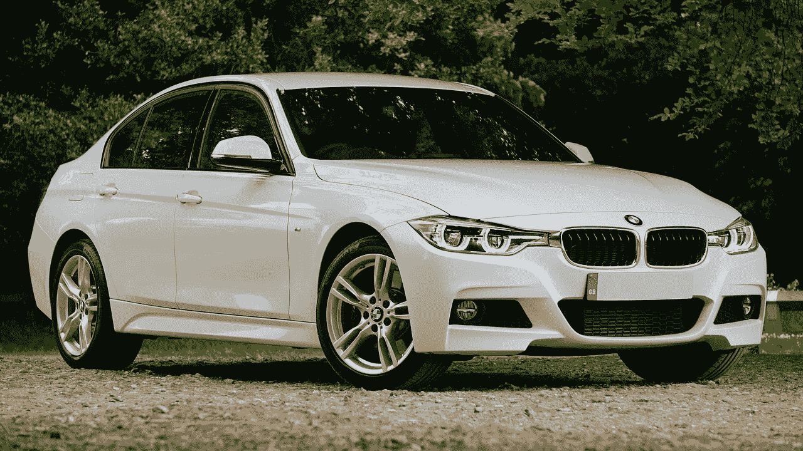

宝马 3 系是运动轿车之王。尽管最近竞争更加激烈，但它仍然是同级别中最畅销和最知名的汽车。科技行业的杰出人物谷歌也是如此。

在生命的开始，宝马和谷歌都曾专注于一件事:宝马专注于终极驾驶体验，谷歌专注于搜索。但随着时间的推移，他们扩大了自己的王国。

宝马推出了数量惊人的 3 系车型，包括节油混合动力车、大功率 M3 以及介于两者之间的所有车型。同样，谷歌已经发展成为 Alphabet，一个拥有 20 多家子公司的伞式公司。

但他们没有忘记自己的根。宝马仍然制造以驾驶者为中心的赛车，尽管为现代买家提供了足够的填充物。谷歌继续每年花费数百万美元来捍卫其搜索之王的地位。

# 6.Magic Leap 是宝马 i8

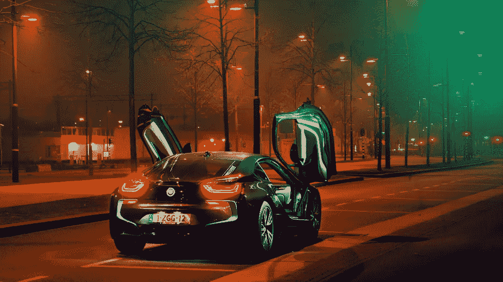

i8 和 Magic Leap 有什么共同点？他们看起来都属于电影《创》。

带激光头灯的电子动力超级汽车？合成现实全息图？好的好的好的。

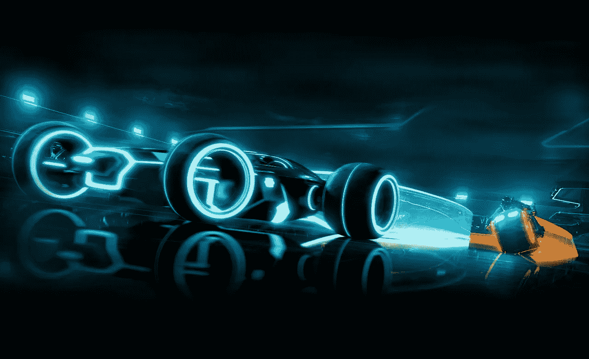

If this is the future, please hurry up already.

# 7.Pinterest 是马自达 Miata

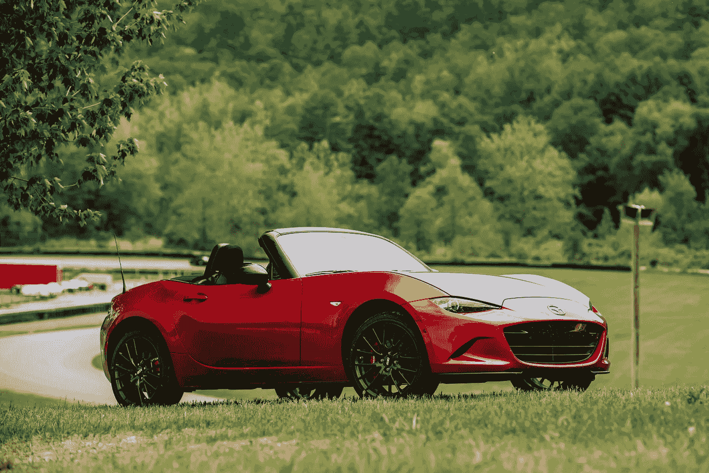

可爱、有趣和漂亮的 Miata 在各方面都非常适合 Pinterest。其活泼的性格和卓越的操作吸引了男孩和女孩，男人和女人。

Miata 散发着非凡的魅力。即使你认为它不太实用，但我保证如果你带它出去兜风，你会爱上它的。

像 Pinterest 一样，你不会每天都使用 Miata 它不像奥迪 A4 或宝马 3 系那样每天都有人驾驶。取而代之的是，周末在乡村公路上无忧无虑地兜风。在那里你会真正发现 Miata 的灵魂。

# 8.Slack 是捷豹 F-TYPE

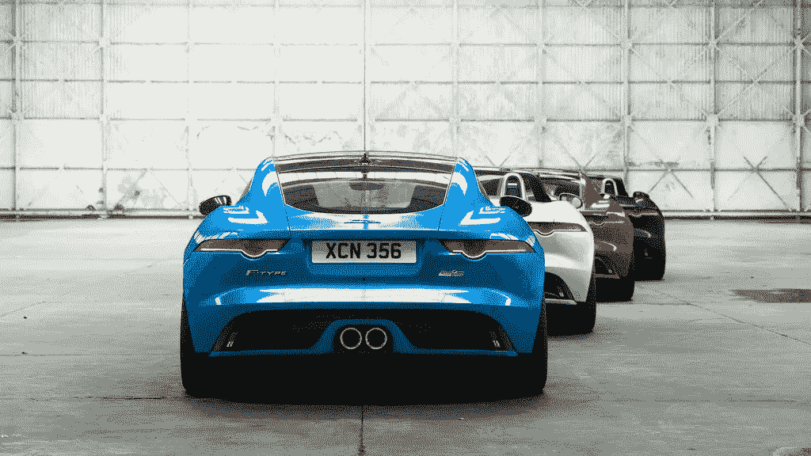

F-TYPE 是拥挤的跑车领域的热门新人。它以欢快乐观的外表引人注目，但它的内部都是生意。在最大功率下，流体加速被强劲的发动机轰鸣声打断。你会开始在上班的路上寻找弯路，这样你就可以在开阔的道路上放松了。

捷豹代表了 Slack，这家初创公司凭借令人愉悦的设计和强劲的性能，一击即中，消灭了所有竞争对手。

# 9.SpaceX 就是布加迪威龙

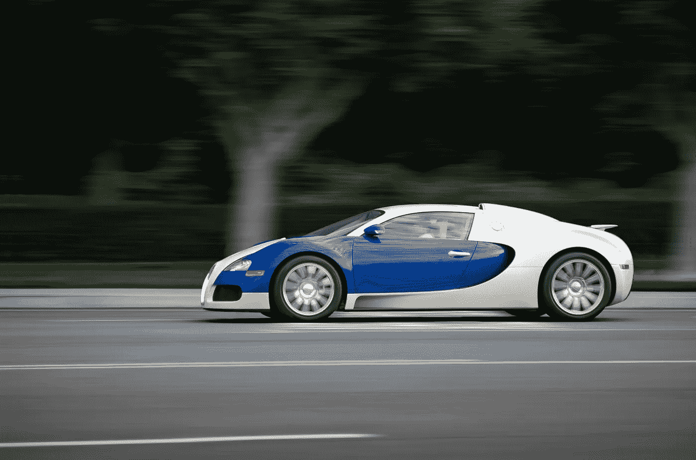

当重力像无形的砖墙一样撞击你时，你周围的一切都变得模糊不清。你被逼到了意识的边缘。我是晕过去了还是在真空的空间里？“你能听到的只有千军万马在你身边狂奔的吼声。

这就是踩布加迪威龙油门的感觉。威龙速度惊人，但毕竟，如果你想达到逃逸速度，你需要一辆快车。

有趣的事实#1:威龙有扰流器，以高速展开，以防止它飞离地面。

有趣的事实 2:威龙从 0 到 60 的加速比重力快。

# 10.Spotify 是一辆货车

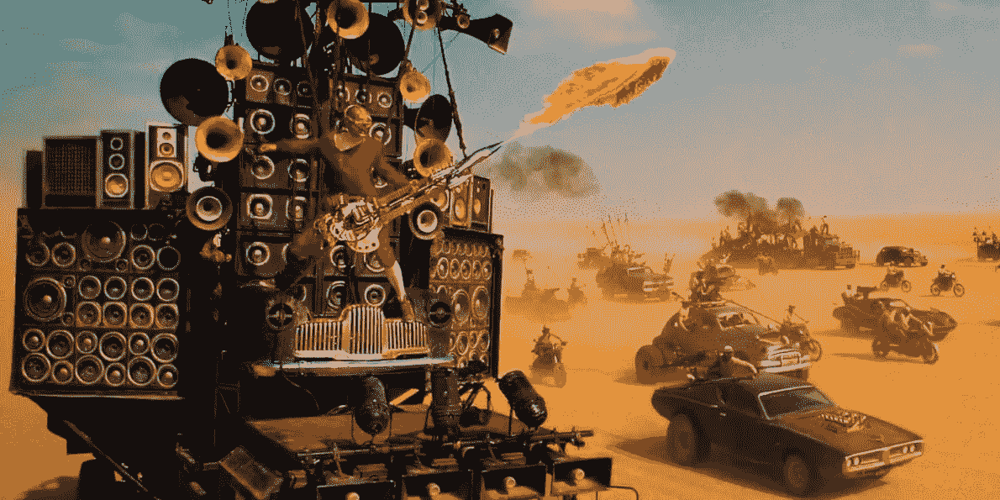

我对汽车的定义相当宽泛。如果你没有看过《疯狂的麦克斯》，请帮你自己一个忙，立即观看。

# 11.Snap 是丰田 86/斯巴鲁 BRZ/Scion FR-S

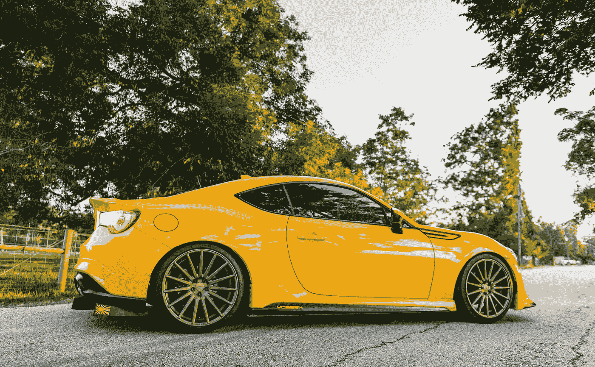

这个小暴发户比所有人预测的都要好。凭借轻便的车身、年轻的设计和灵敏的后端，丰田 86 体现了*的乐趣*。

它和任何一辆超跑一样敏捷，却不把自己看得那么重。这是一辆任何人都能享受的负担得起的汽车。Snap 也是如此——一家价值数十亿美元的公司仍然设法保持年轻和活力。

丰田 86 和 Snap 有着相同的目标:为寻求美好时光的人提供大量的享受。

# 12.条纹是大众高尔夫

高尔夫不是这个列表中最华丽的车，这很好。它擅长的是提供灵感的灵活性和防弹可靠性，而不会引起任何大惊小怪。

低调的高尔夫是支付初创公司 Stripe 的最佳对应，该公司继续提供直观可靠的服务，同时设法避开雷达。

# 13.特斯拉是…等等…型号 S

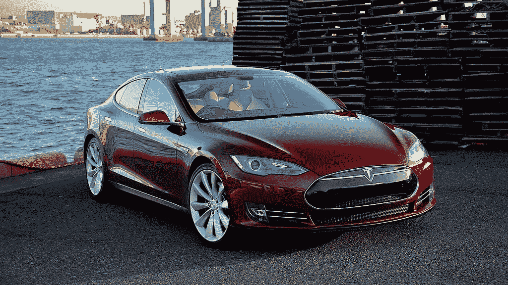

你没看到剧情的转折吗？吹毛求疵特斯拉的内部，可靠性和延迟问题，所有你想要的。但你不得不承认，S 型是一个快速和华丽的钣金。

# 14.优步是路虎揽胜

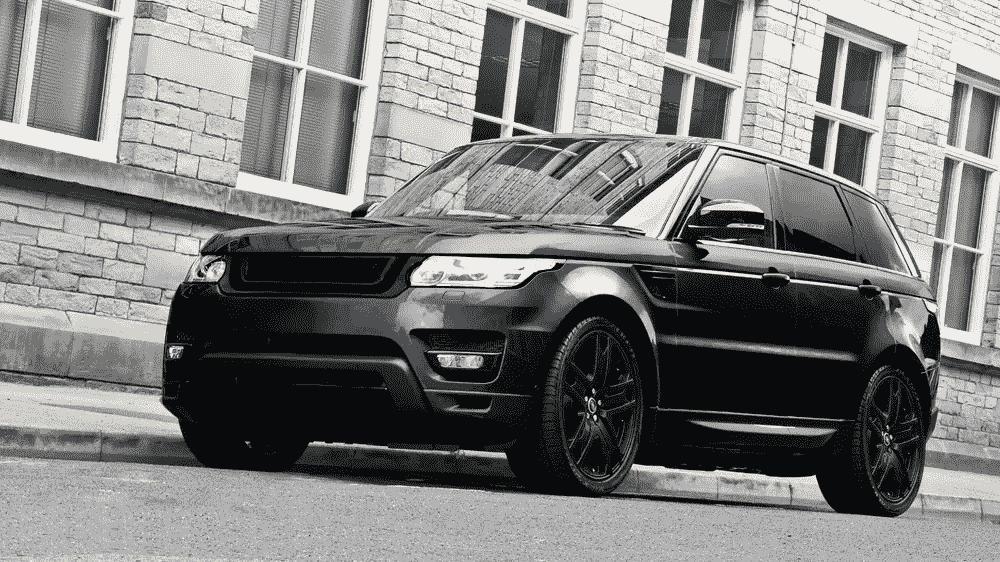

我无法比特拉维斯简洁的推特解释得更好了。

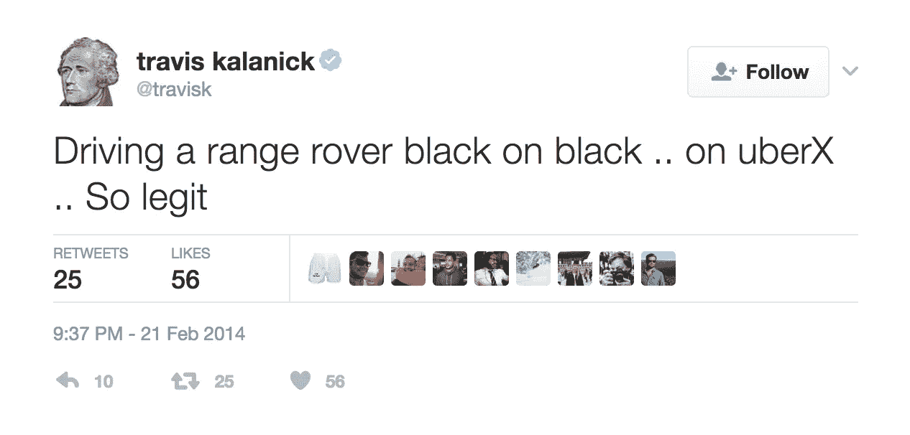

如此合法。

> *感谢阅读！如果你喜欢这个故事，请点击❤按钮推荐它，并在社交媒体上分享。这样，其他人也可以看到它！*

*感谢金桂红和索菲·何对《❤》的剪辑*

> [黑客中午](http://bit.ly/Hackernoon)是黑客如何开始他们的下午。我们是 [@AMI](http://bit.ly/atAMIatAMI) 家庭的一员。我们现在[接受投稿](http://bit.ly/hackernoonsubmission)，并乐意[讨论广告&赞助](mailto:partners@amipublications.com)机会。
> 
> 如果你喜欢这个故事，我们推荐你阅读我们的[最新科技故事](http://bit.ly/hackernoonlatestt)和[趋势科技故事](https://hackernoon.com/trending)。直到下一次，不要把世界的现实想当然！

