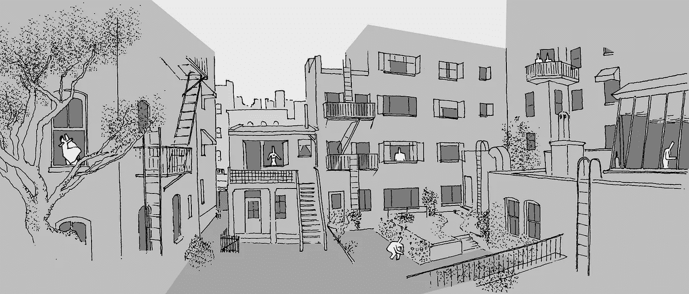
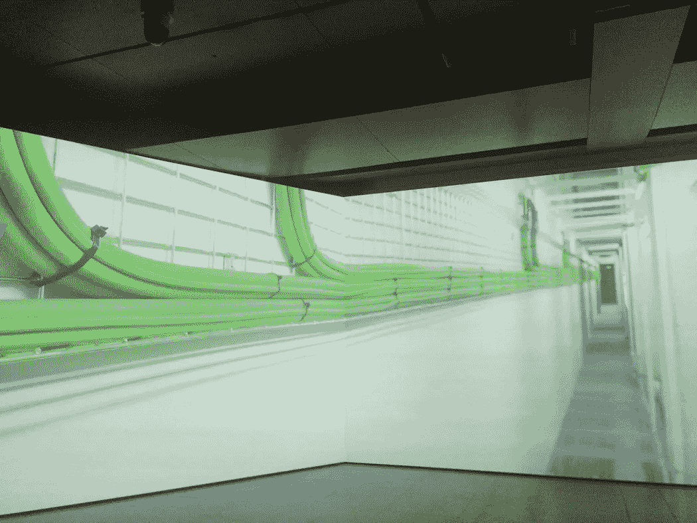
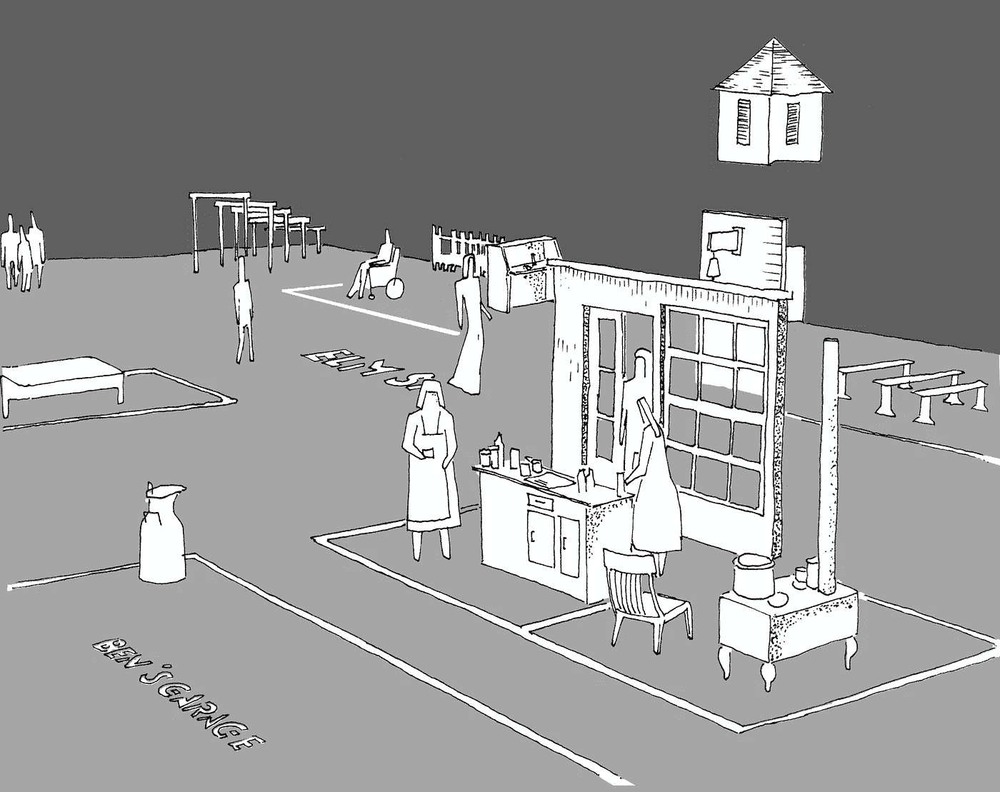
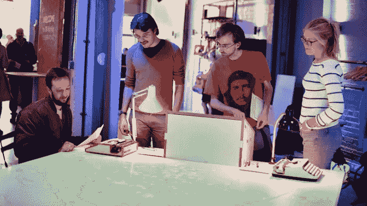

# 如果互联网是一栋公寓楼，你会想搬进去吗？

> 原文：<https://medium.com/hackernoon/if-the-internet-was-a-block-of-flats-would-you-want-to-move-in-5256c4cf34ad>

## 我们应该使用建筑语言和绘画来帮助我们讨论数字空间的政治。

Benjamin Koslowski’s drawing of the iconic view from the film Rear Window. Whose apartment does your Facebook feed overlook?

在许多其他例子中，“假新闻”的抗议表明，我们对其他人如何体验网络知之甚少，我认为这个问题因谈论我们的数字体验有多困难而加剧。隐私显然是一个关键问题，但公开性也是——例如，谁决定在脸书上推广哪些故事？

这篇帖子是对[本杰明·科斯洛夫斯基](http://benjaminkoslowski.com)的书章节*调解城市*的回应，是对一本名为 [*拍摄城市*](http://press.uchicago.edu/ucp/books/book/distributed/F/bo23353017.html) 的书的贡献。本杰明和我都在做一个关于“数字公共空间”的项目的博士研究。本杰明研究隐私和建筑表现的概念，一方面比较建筑和建筑环境，另一方面比较数字体验和社交媒体。

我在网上搜索了一下，发现了一些令人愉快的超现实的尝试，试图将物理属性归因于互联网:它使用全球 10%的电力为一艘油轮那么大、一颗草莓那么重的东西供电。有更清楚的吗？无论我们看多少次地图，地图上显示了为互联网供电的海底电缆的地理路线，我们都无法更好地表达我们的在线体验。

From the Big Bang Data exhibition: explaining the Internet by telling you where the wires go — interesting, but perhaps also missing the point? ([Credit](https://www.electronicsweekly.com/blogs/gadget-master/general/big-bang-data-throws-transparency-grenade-2015-12/))

出于这些原因，我们倾向于称互联网为“虚拟”世界，并将其与现实世界进行对比。但是，把我们的宇宙分成真实和虚拟，我们无法获得理解。“虚拟”世界没有国家、城市或城镇，我们面临着未知领域，就像我们将其命名为“虚拟”之前一样棘手。

Timo Arnall’s silent, spooky video portrait of a data centre, also from the Big Bang Data exhibition at Somerset House. It’s beautiful, but ultimately it’s just a very clean warehouse full of computers. ([Credit](https://dannikolov.wordpress.com/2016/01/21/big-bang-data/))

因此，虽然我们对互联网的心理影响有过多的研究，但我们很难区分我们通过互联网经历的各种心理状况。也许这就是为什么关于互联网对我们福祉的影响的说法有时在媒体上出现时显得如此愚蠢，我们的词汇经常无法区分发色情短信和写维基百科文章。

城市和其中的建筑也是一种技术——但这种技术已经存在了很长时间，我们已经有了一个广泛的词汇来描述它。我们有建筑制图的视觉语言来表现它。我们如此自然地使用的隐私和表现的心理学概念，都与它们发生的建筑空间有着深刻的联系。遇到任何空间，它会立即提供一种直观的感觉，你是如何被观察的，环境是如何宽容的，你是如何安全的。无论从本能上还是学术上，建筑都是一个被充分探索的领域。

本杰明的作品可能主要面向学术受众，显然，人们对我们日益数字化的生活中的理论工作有着浓厚的兴趣。但是，也许从这种方法发展而来的词汇也有可能逃脱体制，加入到网络的公共讨论中，这正是因为我们对物理空间的本能理解。

本雅明将电影的建筑讨论作为一座桥梁，连接到在线体验的建筑讨论，电影是文化建构操纵视角的范例。希区柯克的*后窗*是一部在城市空间反复上演的电影的一个特别明显的例子，情节完全依赖于它展开的庭院的物理特征。这部电影只能用我们的直觉来理解，用我们对角色所看到的来理解他们的行为。

Benjamin’s drawing of the Dogville set

拉斯·冯·特里尔的*道格维尔*是*T5 的另一个例子。这部电影的背景是一个小镇，但场景故意不完整，大多只有地板上的标记。因此，在表面上是室内的场景背景中，我们可以透过墙壁看到镇上的居民在忙着他们的事情。与*后窗*不同，我们被期望理解电影中的角色与我们有着不同的视线——他们就像看不见“墙”一样前进。这部电影符合我们对电影背景的正常预期。*

拉斯·冯·特里尔这样评价这部电影:“我们正在与观众建立一种协议，在这种协议下，这些情况是可以接受的。如果协议足够明确，那么我认为你可以做的事情没有任何界限。”

我们的承诺是，通过将这一理论工具应用于社交媒体，我们将能够“兑现”它。冯·特里尔对我的引用提出了一个问题，即是否已经与脸书或 Twitter 的观众达成了适当的协议，因为在这些情况下，每个人都既是观众的一员，也是表演者。当然，脸书的算法选择像希区柯克的电影一样巧妙地操纵了你的视角，正如他们对我们的情感进行的实验所展示的那样。本雅明认为，社交媒体被“统一的、本质上非透视性的展示机制”所主导，比如时间线，旨在隐藏这些[设计](https://hackernoon.com/tagged/design)的选择。

这可能是硅谷方面的一个恶意阴谋，目的是让用户顺从和串通一气，迷惑我们，让我们屈服，不让我们知道自己有多显眼。也许这就是为什么他们如此热衷于让我们用最不有形的物理类比——“云”来概念化互联网。

我怀疑，这与其说是阴谋，不如说是对屏幕显示内容的限制，尤其是小巧的智能手机屏幕。Twitter 向我发送提醒，告诉我有多少人看过我的推文，不顾一切地向我保证观众的存在，即使我没有意识到这一点。脸书允许你查看自己的个人资料，就像你是另一个用户一样，试图减轻隐私设置的复杂性带来的焦虑。

如果我们想象一个界面，在那里我们可以感觉到观众在看着我们，也许是一个投影，在那里我们可以看到我们的潜在观众的脸在我们敲一条推特时回头看着我们，我们可以立即看到交流信息所需的视觉空间必须非常大——也许是一个专门的房间。这暗示了直觉的社会理解发生在建筑尺度，而不是屏幕尺度。

StoryMap, a project that I collaborated on with Benjamin, exploring the spatial and the digital. StoryMap combined [social media, mapping, projection and typewriters to elicit local stories](http://jimmytidey.co.uk/blog/storymap-participatory-mapping/).

这种引入特定的空间建筑概念的想法给了我们一种构建其他一些关于网络的普通想法的方法。你可以把“过滤气泡”理解为试图找到一个有利位置，在那里你几乎看不到你不同意的人。当然它会不成功，偶尔一个难看的每日邮报痈会破坏你的看法。就像你不能说出你为什么喜欢某个特定的街区，你可以在不知道你已经选择了它的情况下，停留在这样一个干净的有利位置上。

如果我们担心脸书朋友不是真正的朋友，那是因为他们本质上与我们没有任何社会关系，相反，我们可以简单地把他们视为其他脸书用户，我们授予他们一定程度的可见性。YouTube 上的评论是一个处于破窗综合症晚期的小镇上无人看管的街道，在这里，任何程度的反社会行为都已正常化。为什么是迪克的照片？因为选择性地暴露你的勃起是灵长类动物做的事情。(或者这个类比的应用范围可能太广了...)

这里提供的是劳伦斯·莱斯格类比的一个扩展和更微妙的版本，他用购物中心的类比来描述像脸书这样的网站。在脸书，我们觉得自己处于一个言论自由的环境，可以发表自己选择的政治言论。事实上我们在脸书没有权利，所有的活动都是马克·扎克伯格的心血来潮。同样的，购物中心感觉就像一个公共场所，但是任何政治异议的企图都会被私人保安带走。

本杰明的工作更进一步，将社交媒体和互联网更广泛地纳入了联系建筑、电影、心理学和城市化的成熟文献的范围，并表明各种建筑形式——计划和模型——可能非常适合表达基于屏幕的网络做得如此糟糕的社会关系。

如果你想建立互联网，你会得到规划许可吗？你会挡住谁的光，你能看到谁的浴室？我们是生活在一个具有社会意识的花园城市，还是生活在一个同质的破坏隐私的高层公寓的噩梦中，这些公寓的建造仅仅是因为开发商贿赂了规划当局？

【感谢@sarahbhayward 和@samgraysonsam 对本文的建议。]

> [黑客中午](http://bit.ly/Hackernoon)是黑客如何开始他们的下午。我们是 [@AMI](http://bit.ly/atAMIatAMI) 家庭的一员。我们现在[接受投稿](http://bit.ly/hackernoonsubmission)并乐意[讨论广告&赞助](mailto:partners@amipublications.com)机会。
> 
> 如果你喜欢这个故事，我们推荐你阅读我们的[最新科技故事](http://bit.ly/hackernoonlatestt)和[趋势科技故事](https://hackernoon.com/trending)。直到下一次，不要把世界的现实想当然！

