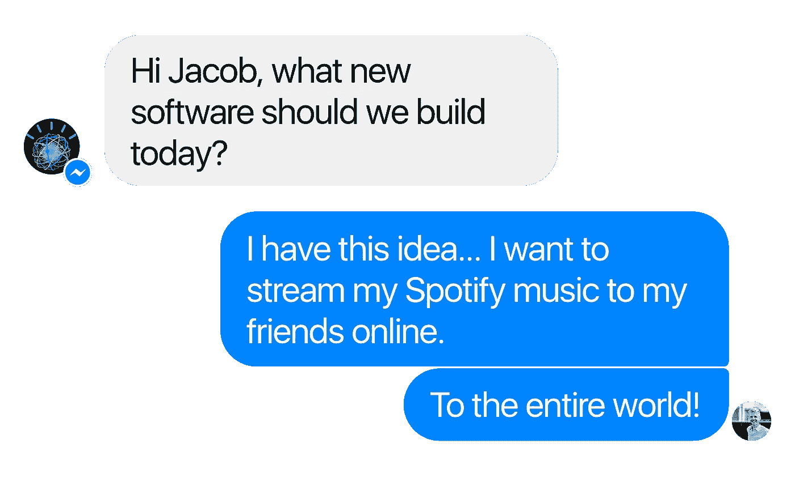
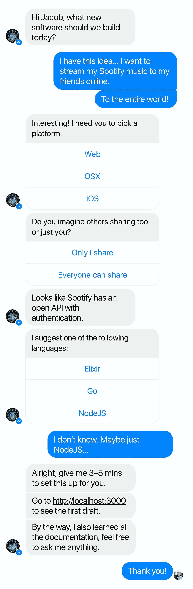

# 如果 Watson 这么聪明，为什么它不写我的软件？

> 原文：<https://medium.com/hackernoon/if-watson-is-so-smart-why-does-it-not-write-my-software-8e7d6e796310>

## 嗨，华生，你能帮我建立一个网络应用程序，让我的朋友可以出售他们的手工制作的衣服。就像市场一样。我不要钱，只是每笔销售的费用。我们还需要一个管理仪表板来编辑产品，改变价格等。

你是否曾经有过一个新产品的想法，但却没有足够的技能去制造它？几周前，我向几个同事展示了一些现代 web 开发工具。

我发现有些项目把我的同事作为受众。但是对于新手或者以前做前端的人来说还是很麻烦的。他们做编程是为了给世界增加一个想法，而不是为了获得计算机科学学位。有些框架会带您完成设置，如果您理解诸如“Sass 还是 PostCSS？”这样的问题，这就很有意义了以及“ES6 还是 Coffeescript？”

这让我想知道，当我只想测试一个简单的高保真原型时，为什么我们必须处理大量的焦虑？我遇到过许多想快速验证他们想法的创业公司和公司。发展可能是昂贵的，所以另一种选择是伪造一切，这可以给你一个很好的图片，但也可能是…嗯…假的。

# 谁需要服务器？

开发整个基础设施非常耗时。可伸缩性需要时间，这就是为什么像 Firebase 或 Heroku 和 Azure 这样的即插即用服务器这样的概念如此受欢迎。AWS 过去主要面向工程师，但现在随着[无服务器框架](https://serverless.com)的出现，这种情况也在改变。一个让 Amazon 服务器更容易运转的项目。这是我希望在未来看到更多的东西:像熟练的工程师那样更容易地构建你的产品。

这很好，但我认为我们可以更雄心勃勃。我不想自己写所有的软件。有了无服务器，我可以不用设置服务器的麻烦就能发布产品。但是，我们还是要自己写后端代码。这就是我认为沃森非常适合的地方。

> IBM Watson 是一个技术平台，它使用自然语言处理和机器[学习](https://hackernoon.com/tagged/learning)来揭示大量非结构化数据的洞察力。[……]一个认知系统使人和计算机之间建立了新的伙伴关系。([http://www.ibm.com/watson](http://www.ibm.com/watson/)/)

IBM 在这里想说的是，沃森不像你的计算机那样理解特定类型的数据。它更像是一个聪明的朋友，记忆和存储各种信息，做出聪明的决定。沃森能够区分不同类型的信息，这与典型的计算机相比是不寻常的。通过从许多来源抓取相关数据，它能够形成假设并不断测试这些假设，以缩小到最可靠的结果——由人类生产供其他人消费的数据。沃森阅读类似于人类，它从自然语言中分析和学习，并根据上下文做出明智的决定。这些都可以通过他们的 SDK 获得。

# 嗨，华生，我有个想法…

很多产品都很简单:用户注册，可能通过谷歌或脸书注册。他们开始创造、阅读、更新和删除信息。分享给朋友等。很多概念的良好基础。为了推出这种概念，我们需要一种登录方式、安全性和包含用户创建的信息的数据库。WebSockets 将交付数据，当然还有一些定制的后端逻辑。然后，整个包可以无服务器地运送到 AWS。

通常你会选择你喜欢的语言(如果你是开发人员)，阅读所有的提供者和框架特定的文档(*只是开玩笑*)，然后你就准备好了。但是如果这个过程更简单——或者甚至没有你的参与呢？我们刚刚证实沃森能够阅读网页，就像人类一样。所以想象一下…

大多数服务和产品都提供外部 API 和精心制作的文档——至少那些[酷的提供](https://stripe.com)。想象一下，如果 Watson 找到了最适合你的栈，一个伟大的库、服务和编程语言的包，适合你和你的目的。Github 上有大量几乎任何语言的例子。将这些与对可用外部服务、工具的良好了解以及对架构的共同理解结合在一起，那么您就为任何人的工作打下了良好的基础。

我们的目标是拥有自己的开发者，在制作新的数字产品时，可以帮助你做任何事情。给出建议，编写让你的产品与众不同的代码，构建基础设施、架构等。，但是 MVP 比这简单。长此以往，就像有一个好朋友在编码，而不是吃饭睡觉。但在不久的将来，它可能只是一个朋友，为你的产品打理基础，在某处帮助你。一个可以用你自己的非技术语言回答普通愚蠢问题的朋友。

这到底是怎么回事？关于我爸爸，关于我的朋友和家人。我无数次听到他们谈论伟大的想法。有些人甚至测试并验证了他们的想法。但是他们不知道如何把产品推出去。他们请不起开发人员，甚至不知道从哪里开始。他们是各自领域的专家，深谙如何改善业务。

然而现实地说，短期内让沃森做这些事情是相当困难的。如果你给机器提供完整详细的规范，让它写代码是可能的。华生不理解我们创作规范的推导。它没有做任何事情的动机或内在欲望。它以类似人类的方式阅读和理解世界，但那是在你向它提供非常精确的指令的时候。要求沃森有创造性要复杂得多。沃森可以帮助医生做出更好的决定，提高效率，但目前它本身并没有提供答案，而是给出了方向。

你可能会说这个想法比[教沃森治疗癌症](http://www.ibm.com/watson/health/oncology/)更难做到。也许这是对的。但是沃森可以同时做无限的事情。所以想象一下。想象一下我们未来可能体验到的所有疯狂、酷、聪明和有创意的新产品。由于技术障碍，现在已经不存在的产品。甚至可能是治疗癌症的产品。

爷爷和公交车司机也应该开发应用程序。每个人都有一个杀手级应用，但不是每个人都是计算机科学家。这也包括你，下一个创业者。

> [黑客中午](http://bit.ly/Hackernoon)是黑客如何开始他们的下午。我们是 [@AMI](http://bit.ly/atAMIatAMI) 家庭的一员。我们现在[接受投稿](http://bit.ly/hackernoonsubmission)并乐意[讨论广告&赞助](mailto:partners@amipublications.com)机会。
> 
> 如果你喜欢这个故事，我们推荐你阅读我们的[最新科技故事](http://bit.ly/hackernoonlatestt)和[趋势科技故事](https://hackernoon.com/trending)。直到下一次，不要把世界的现实想当然！

