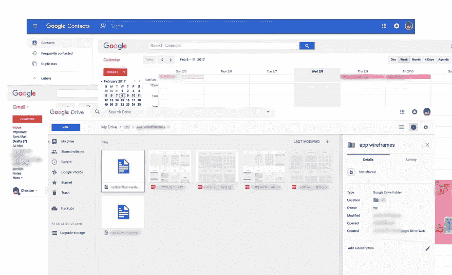
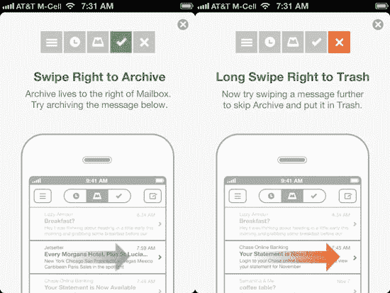

# 如果我们建造了它，为什么会有人关心呢？

> 原文：<https://medium.com/hackernoon/if-we-build-it-why-would-anyone-care-a278393accd8>

Photo courtesy of [pixabay.com](http://pixabay.com)

一个准创始人一定会问:我的想法可行吗？但是这个问题也必须在创业公司的整个生命周期中解决。这个故事是我评估创业公司生存能力和战略的备忘单。

我在 Pivotal Labs(现在的 Pivotal)工作了 10 年，与数百家初创公司合作。有些像 TrueCar，TaskRabbbit 和 Twitter 成熟了，成功了。其他人没有。现在，我是一家天使基金的运营合伙人，领导两家创业公司，并为其他人提供建议。这些经历揭示了一些见解和模式，帮助我理清创业中常见的困惑和分心。

# 他们当然会来

我坐在 [Verve Coffee](https://www.vervecoffee.com/pages/locations-pacific-avenue) ，听一位创始人向我讲述她的创业故事。我以前有过这样的对话，它们可能很有挑战性。创始人求教，我想帮忙。但是可能很难理解她的想法，它的障碍和机会，所以我可以发现关键问题，这将导致富有成效的讨论。

有一天，在与一位初出茅庐的企业家的另一次谈话中，我有了一个想法。这个想法成了我写小抄的基础。

我应邀在当地一所大学的企业家俱乐部发表演讲。在我演讲后的社交活动中，一个年轻人如此自信地描述了他的创业想法，这让我想起了 1989 年电影《T4》中的一句关键台词。“你建了，他们就来了。”这个年轻人，尽管他的前提有一些明显的漏洞，但一旦他建立了自己的愿景，他似乎就认为自己成功了。

我不会因为这样的信念而指责一个创始人；如果你不相信自己的想法，为什么其他人会相信呢？

但最好是持怀疑态度，问自己:“如果我们建造了它，为什么会有人关心？”正是这个问题导致了我所谓的****梦境测试**。**

# **梦境测试**

**梦的领域测试是一个诊断工具，帮助我组织关于创业的关键问题和考虑。我主要关注这三个方面:**

*   **用户痛苦**
*   **用户体验**
*   **经济学**

## **用户痛苦**

**我没有仅仅描述主要的用例或者用户的问题，而是把它框定为“用户的痛苦”。与用例相比，人们更有可能寻求和接受对疼痛的帮助。**

*   **疼痛的频率和严重程度如何？**
*   **用户能接受吗？这是不方便还是他们需要解决的问题？**
*   **根本原因是什么？有什么症状？**

**诊断根本原因可能很困难，但仅仅解决症状是有问题的。用户将放弃解决症状的“解决方案”。**棘手的经历解决了根本原因**。**

**例如， [Snap(Chat)](https://www.snapchat.com/) 理解了数码照片的一个根痛是它们的持久性；用户不希望每张照片都永远存在。如果 Snap 只是解决了症状，他们可能会提供更好的共享权限和安全性，而不是他们因其而闻名的过期照片。**

## **用户体验**

**我建议考虑一下*用户体验*，而不是定义一个*解决方案*。当设计一个解决方案时，脱离用户的需求去梦想未来是很诱人的。**

**除了应用程序的用户界面(UI)之外，看看用户与初创公司产品的任何交互。想一想优步和他们打车和支付出租车费用的方式。**

**用户体验是克服惰性的主要因素。人们带着许多不便和痛苦生活，采用和依赖变通办法。你有没有因为遥控器够不着而看烂电视的经历？请记住，**用户体验需要引人注目**。**

*   **创业公司如何解决用户的痛点？**
*   **体验是否足以取代替代品？有什么不同？**
*   **这是一次愉快的经历吗？**

**对于这个练习，我会避免详细的设计。关注用户旅程的简明摘要，以及这如何解决用户的“痛苦”。**

## **经济学**

**一个创业公司应该有一个合理的经济可行性假设。在担心详细的商业计划之前，初创公司需要评估基本要素:成本、增长和成功标准。**

****成本****

*   **你的成本可行吗？是什么让它们变得可行？**
*   **用户转向该产品需要付出多大的努力？什么是学习曲线？打破现有习惯、导入数据或构建新网络的开销是多少？**
*   **竞争对手的成本是什么？竞争对手很容易抄袭创业公司的想法吗？**

****成长****

*   **用户采用率会如何增长？有天然的病毒式传播还是网络效益？(示例:照片共享)**

****成功****

*   **对用户来说，成功的定义是什么？为了创业？这些相互冲突还是相互支持？**

**梦境测试并不能决定成败。这是组织讨论或计划的起点。**

> **这些不是新想法，也不是唯一要考虑的想法。但是关注用户痛苦、用户体验和经济可以理清你的思路。**

# **运用梦境测试**

**我有多个谷歌账户。我用谷歌 Gmail，Drive，Calendar 等。有时我记不起一条信息在哪里。或者我想找到我关于某个主题的所有数据。我想在所有谷歌产品上搜索我的数据(最好是在我所有的谷歌账户上)。**

****

**用户的痛苦很明显:为什么我必须在 20 个不同的地方搜索完全属于我的数据？(我有很多谷歌账号。)我可以想象一个精彩的**用户体验**，我有一个搜索框，我可以过滤结果，快速定位来自多个不同来源的信息。**

**但是**经济学**，明确地说是成本，**扼杀**这个想法。这不是我构建或运行这样一个应用程序的成本，但这是谷歌增加这一功能的低成本。**

**也许谷歌有很好的理由省略这个功能。也许这对他们来说不是优先考虑的事情。但是，我的服务所获得的任何成功都是市场验证，告诉谷歌添加该功能，并结束我的创业。**

## **邮箱:混合的例子**

**[邮箱](https://en.wikipedia.org/wiki/Mailbox_(application))于 2013 年 2 月推出，Dropbox [于 2013 年 3 月收购](https://techcrunch.com/2013/03/15/mailbox-cost-dropbox-around-100-million/)它们。我将重点介绍邮箱梦分析的几个方面。**

****用户痛点:**邮箱观察到，人们疲于应付邮件。此外，他们经常使用电子邮件作为待办事项列表，尽管对于这样的用例来说，这是一个蹩脚的工具。**

****用户体验:**用户喜爱邮箱的 UX/UI。(截至收购时，等候名单上有[130 万用户。)这款应用不仅仅是一个电子邮件客户端，还是一个经过优化的工具，可以将电子邮件转化为待办事项，并帮助清理用户的收件箱。](https://techcrunch.com/2013/03/15/dropbox-buys-mailbox-all-13-employees-joining-and-app-will-remain-separate/)**

****

**MailBox UI, from [Slashgear article](https://www.slashgear.com/google-inbox-is-great-here-are-two-more-awesome-email-apps-22352019/)**

**对电子邮件之痛的洞察，结合邮箱方法，**改变了**用户对电子邮件的情绪。他们从感觉**不知所措**到**被授权**并组织起来。**

****经济学:**邮箱经济学**尔虞我诈**。邮箱不是电子邮件主机服务，但允许用户使用他们的谷歌 Gmail。这降低了用户采用的摩擦，但如果谷歌克隆了邮箱体验，将会有**的小激励**让用户**坚持**使用邮箱。**

**在我看来，谷歌就是这么做的。[收件箱通过 Gmail](https://www.google.com/inbox/) 实现了邮箱的许多想法。我想知道如果邮箱没有这么快被收购，它会变成什么样。**

**邮箱的例子表明，梦的领域测试是一个集合评估标准的启发；它不是一个提供结论的算法。**

# **你将如何使用这个工具？**

**梦的领域测试是一种在创业背景下评估问题、解决方案和努力的方法。它在我听取推介时为我提供了指导，并帮助我为创始人提供建议。**

**它可用于评估竞争对手或用户可能拥有的备选方案。如果你遵循[跨越鸿沟](https://en.wikipedia.org/wiki/Crossing_the_Chasm)的滩头阵地指南(细分方法)，你可以将梦想领域测试应用于滩头阵地/细分市场。**

**梦境测试不是一次性的练习。它可以(我认为应该)迭代使用。它可以帮助创始人解决是否创办公司的拉锯战。如果她真的投身于疯狂之旅，追逐用户和投资者，用永恒的危机玩打地鼠游戏，这可以帮助她理清头绪。**

**我鼓励你让我知道你的想法，故事和任何提示。**

**请♡这篇文章并关注我的更新——通过媒体或推特( [csepulv](http://twitter.com/csepulv) )。**

************

> **[黑客中午](http://bit.ly/Hackernoon)是黑客如何开始他们的下午。我们是 [@AMI](http://bit.ly/atAMIatAMI) 家庭的一员。我们现在[接受投稿](http://bit.ly/hackernoonsubmission)并乐意[讨论广告&赞助](mailto:partners@amipublications.com)机会。**
> 
> **如果你喜欢这个故事，我们推荐你阅读我们的[最新科技故事](http://bit.ly/hackernoonlatestt)和[趋势科技故事](https://hackernoon.com/trending)。直到下一次，不要把世界的现实想当然！**

****