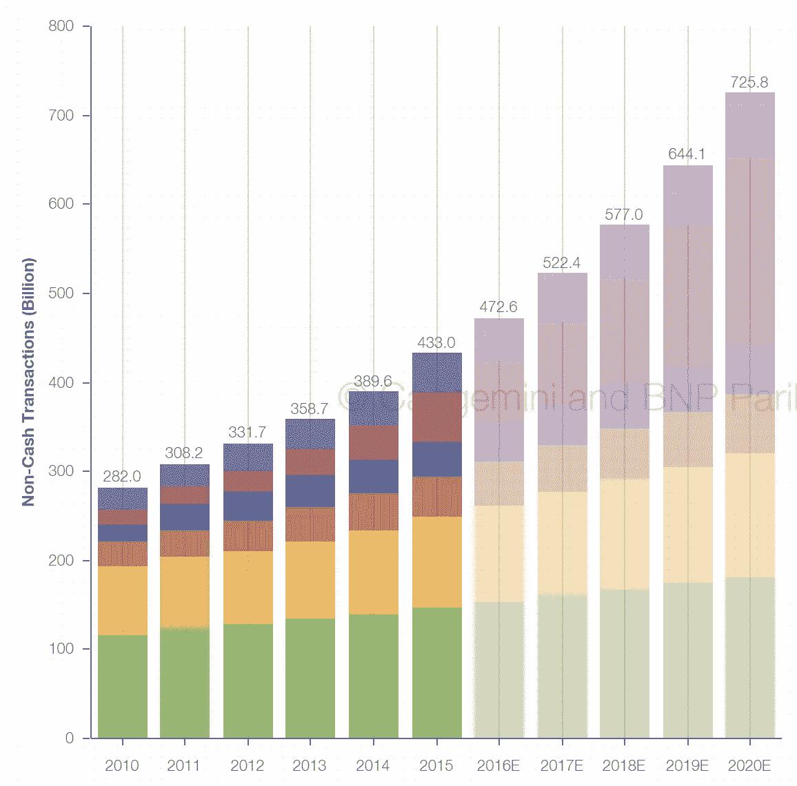
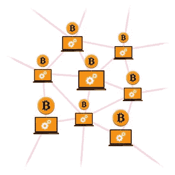
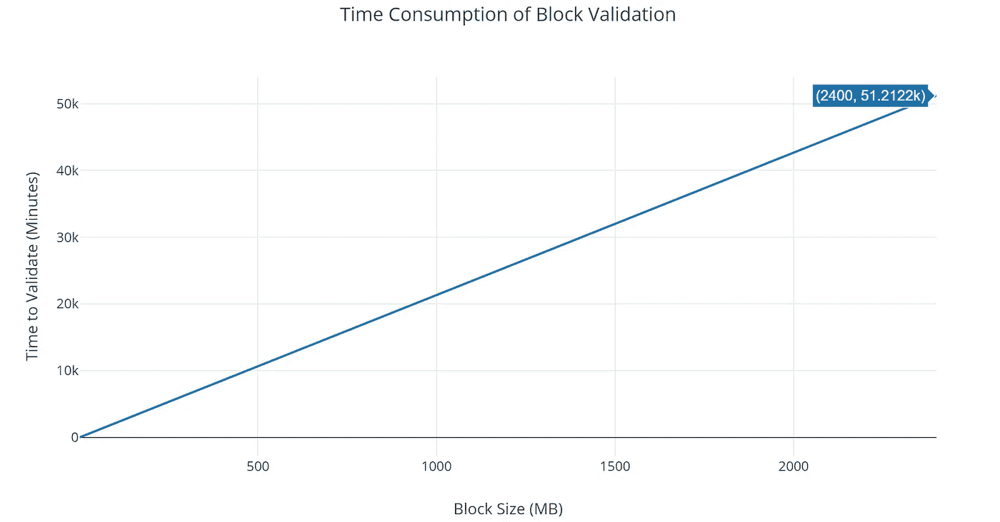
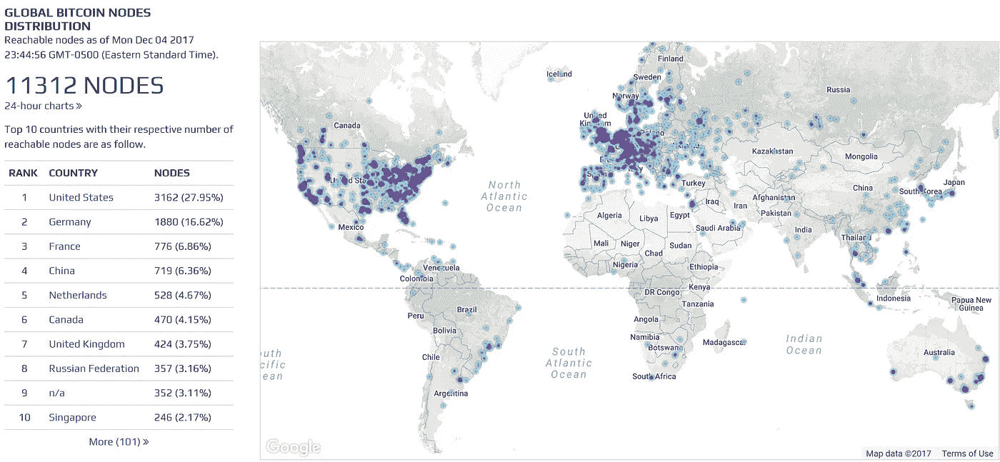
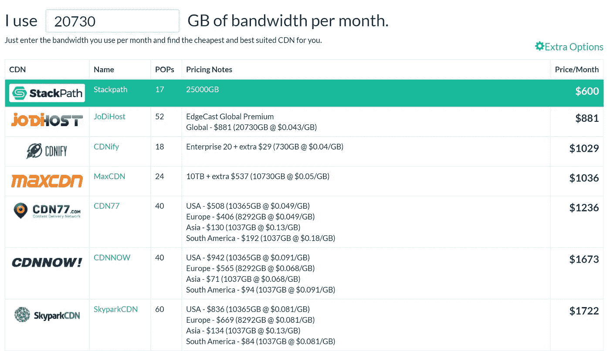
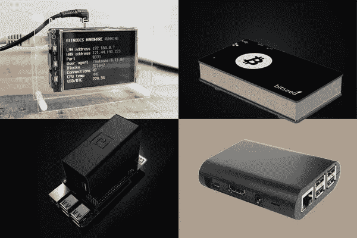

# 如果我们生活在比特币的未来，区块链会有多大？

> 原文：<https://medium.com/hackernoon/if-we-lived-in-a-bitcoin-future-how-big-would-the-blockchain-have-to-be-bd07b282416f>

## 提示:不好看…

让我们想象一下，比特币已经完成了不可思议的事情——它成为了一种真正的用于全球点对点支付的货币。

在这个比特币瓦尔哈拉里，我们想象一下，所有的非现金支付都是用比特币进行的。世界各地的咖啡店和发廊里，人们不再使用信用卡，而是拿出他们最喜欢的比特币硬件或移动钱包。在这个完美的世界里，会有多少这样的非现金支付呢？

今天，非现金支付占全球每年约 5220 亿笔交易，这个数字似乎在以二次方的方式增长，这意味着当我们到达比特币大厅时，它将会大得多。无法预测我们什么时候会到达那里，所以让我们想象比特币已经成为今天**的主导货币*。***

Where we stand in terms of non-cash transactions across the world , source: [worldpaymentsreport.com](https://www.worldpaymentsreport.com/reports/noncash)

当然，现在比特币必须确保其系统能够容纳这里的大量交易，而不会出现瓶颈。因此，让我们深入源代码，打开似乎一直存在的可伸缩性开关— **让我们将块的大小增加到足以处理我们的 5220 亿个事务。**

# 我们的街区应该有多大？

让我们做一些餐巾数学来看看我们的新街区有多大。

一年 5220 亿笔交易相当于每天 14 亿笔交易。

这相当于**每 10 分钟**就有 9，722，220 笔交易，这与区块发布到比特币[区块链](https://hackernoon.com/tagged/blockchain)的频率相吻合。

假设事务大小保持在大约相同的大小，在 [250 字节](https://tradeblock.com/blog/analysis-of-bitcoin-transaction-size-trends)，这意味着每个块将保存大约 **2.4 千兆字节**的数据*。*

这一交易量将在区块链上每天产生大约 **350 千兆字节**，每年产生或 **127 千兆字节**。

对于那些不知道的人来说，区块链账本由**节点、**维护和传播，这些节点是持有当前有效的比特币区块链账本副本的用户机器。这些节点共同努力来维护我们已经爱上的去中心化的区块链。节点从用户的钱包中接收新的交易，让矿工验证它们，然后从矿工那里接收挖掘出的块以添加到其分类帐中。然后，节点还会立即将这些经过验证的块传播到比特币网络中的其他节点。

A visualization of how Bitcoin nodes work in harmony

今天，节点验证并向世界各地的其他节点传播大约 1 兆字节的数据块。根据[关于块验证对内存使用的影响的分析](https://diyhpl.us/wiki/transcripts/scalingbitcoin/alternatives-to-block-size-as-aggregate-resource-limits/)，在一个节点上验证单个块的过程(即序列化和散列化)消耗大约 **1.25 千兆字节的内存**并花费大约**三十秒**。该分析还声称，数据块验证时间与平方成正比，一个 8mb 的数据块大约需要 *150 分钟*来验证。然而，由于只有两个数据点，为了简单起见，让我们假设验证时间和内存消耗只是线性的。

This is what the scale of block validation might look like if Bitcoin took over the world today, with 2.4GB blocks

为了适应我们新发现的巨型块，我们预计每个块的验证时间将超过 **51，000 分钟**，即大约 **35.4 天！**运行当前消费级硬件的节点将花费*一个多月的时间*来验证它接收到的任何块。最重要的是，每块验证的内存消耗在**3tb 的范围内**。似乎唯一接近这一内存水平的机器(除了服务器机架之外)是尚未发布的 HP Z8，其发布时的价格将远远超过 10，000 美元。

可能会进行优化(例如，块验证不是并行完成的),我们可以预计 CPU 能力将继续增长，因此 30 天以上的验证时间可能是不切实际的假设。但是处理能力够大吗？

这台机器还需要存储每年生成的 127 数据。随着存储成本[徘徊在每千兆字节 1.9 美分](https://www.statisticbrain.com/average-cost-of-hard-drive-storage/)，这台机器的运营商将需要每年花费大约**2413 美元**在存储成本上，以跟上区块链的增长！

相比之下，今天的区块链每年产生约 50GB 的数据，这相当于每年约 0.95 美元的成本。

现在，这整件事开始看起来非常荒谬，但是请再忍耐一会儿。

# 我们区块的带宽

因此，我们的节点还需要能够从节点下载这些数据块，然后将它们传输到其他节点。让我们来看看目前全球的节点分布情况。

source: [https://bitnodes.earn.com/](https://bitnodes.earn.com/)

应该注意的是，根据[比特币维基](https://en.bitcoin.it/wiki/Clearing_Up_Misconceptions_About_Full_Nodes)的说法，有多达 15 倍的节点(150，000+)没有显示在如上图所示的分布图中，这主要是由于端口配置，但同样，让我们保持简单，并假设给定的分布是准确的。让我们假设我们的节点必须每 10 分钟下载一个块，并且每天上传比特币节点指南推荐的最少 144 个块[。这相当于每天超过 **691 GB** 的带宽，或者说**每月 20.73 TB**。](https://bitcoin.org/en/full-node#reduce-storage)

让我们来看看美国的带宽成本，那里有最大的节点分布。由于没有消费级网络能够提供这样的带宽，我不得不求助于一个[便利的 CDN 聚合器](http://www.cdncalc.com/)来看看我们的连接选项是什么。

source: [www.cdncalc.com](http://www.cdncalc.com)

我们假设光纤网络足够普及，速度不成问题。美国单个节点运营商传播比特币区块的最低价格是每月 600 美元。

让我们回顾一下。如果今天比特币接管了世界，美国的单个比特币节点运营商:

*   将不得不购买一台能够提供 **3TB 内存的机器，**这可能会花费超过**10，000 美元**
*   每年需要**2，413** 美元**才能在机器上存储区块链**
*   将不得不通过 CDN 运营商路由数据块，每月花费超过 600 美元。谷歌光纤和美国电话电报公司的日子已经一去不复返了！
*   将面临每个区块长达**一个月的区块验证时间。所以我们的节点可能什么都不做。**

所有这些，只是为了运行一个比特币节点。

看起来今天运行的 150，000+节点将无法停留足够长的时间来看到我们的比特币瓦尔哈拉。相反，它们将被垄断和集中的实体所取代，这些实体拥有足够的财力来维护每年可以处理数千亿次消费者交易的服务器机架。等一下，这听起来很像维萨卡、万事达卡和现代银行系统！

我写这篇文章主要是为了我自己，为了想象和理解一个满足我们社会需求的大规模区块链将会产生多么剧烈的影响。这不是一个正式的分析，也不应该这样对待。然而，这种极端的比特币结局确实凸显了为什么我们不应该让区块大小失控。

如果除了大型企业之外，什么都没有留下来维护我们社会中的几个完整的比特币节点，[比特币共识规则将被抛弃](https://en.bitcoin.it/wiki/Consensus)，网络的安全几乎完全掌握在他们手中。在这种情况下，比特币将不再是它原本的不可信的点对点网络，你还不如回去支付每月的信用卡账单。

我的餐巾数学也有一些漏洞。例如，当比特币达到这种接受水平时，[技术](https://hackernoon.com/tagged/technology)的成本将会下降，不会像我之前概述的那样疯狂。区块链技术也可能会出现不可预见的进步，抵消区块规模增加的影响。

请注意，我只考虑了非现金支付——现金支付仍然占据了世界上大多数的交易，并开辟了不可伸缩性的另一个维度。还要注意，如果一个节点受到恶意无效块的攻击，它将会浪费越来越多的时间来验证它。

非现金支付每年也在快速增加，因此一旦我们接近比特币的使用水平，硬件的使用无疑也会更高。

越过我那众所周知的餐巾上的这些洞，这里是所有这些想要传达的中心信息:

归根结底，运行比特币节点的美妙之处在于它的简单性。你或我现在就可以在我们的电脑上运行一个比特币节点，只要我们有足够的硬盘空间。一个比特币节点可以运行在一个 [$90 的 Raspberry Pi 或者一个$ 20/月的 EC2 实例](https://news.bitcoin.com/cost-full-bitcoin-node/)上。这种简单性是为什么世界上可能有超过 150，000 个节点的原因，也是为什么比特币继续作为一个不可信的点对点网络无缝运行的原因。

Palm-sized Bitcoin nodes — they exist! source: bitseed.org

如果比特币的使用量开始接近我概述的数字，维护比特币网络的能力将很快从用户手中转移到中央实体手中。

所有这些也不是说比特币无法规模化。比特币能够也将会满足数十亿人的需求。它可以做到这一点，而不必膨胀区块链！有几个创新的解决方案正在工作中，旨在长期内优雅地扩展比特币网络，而不必增加块大小，其中最重要的一个我已经在我最近的深度文章[这里](https://medium.freecodecamp.org/future-of-bitcoin-cc6936ba0b99)中概述了。

这些解决方案错综复杂，需要时间来开发，这就是为什么我们没有看到立竿见影的效果，但正如古老的玩具总动员谚语所说，*“你不能急于求成”。*

我鼓励读者[今天](https://www.google.ca/url?sa=t&rct=j&q=&esrc=s&source=web&cd=3&cad=rja&uact=8&ved=0ahUKEwjtreOFnfLXAhUJ5IMKHRbHDDQQFggxMAI&url=https%3A%2F%2Fbitcoin.org%2Fen%2Ffull-node&usg=AOvVaw13K2x8Ay5QiStc2vnrieD6)尝试建立一个比特币节点。去吧，看看有多简单！

确保你记得它有多简单，因为这正是比特币保持活力的原因。

**更新:**我收到了很多关于技术价格将会下降的反馈(这真是太棒了),所以这些数字并不是什么大问题。这是一个有效的观点，我在结论中也强调了这一点。

然而，比特币正在被迅速采用，如果你押注比特币会尽快被主流采用，你也在押注技术成本会下降得更快。我个人不想打这个赌。

我并不主张将硬件消耗限制到节点仍然需要在 Raspberry Pis 上运行的地步。但是，在什么时间点上，期望用户(甚至矿工)拥有与上述数字非常接近的机器是合理的呢？存储价格停滞不前。[摩尔定律挣扎求生](https://www.technologyreview.com/s/601441/moores-law-is-dead-now-what/)。

我也没有提到这种程度的连锁反应对矿工的影响。即使您认为非采矿节点不是必需的，在给定所需硬件规模的情况下，许多采矿者将被类似地定价，采矿集中化可能会得到促进。信任为数不多的近十亿美元的矿池来保护网络和 VISA 的服务器机架有什么区别？

*如果你将来对这些更深入、更丰富的文章感兴趣，我推荐你在 Medium 和* [*Twitter*](https://twitter.com/SubhanNadeem19) *上关注我！*

如果您有任何反馈，或者您发现了我犯的任何错误，请不要犹豫，在评论或私信中告诉我！

*如果你想了解更多关于比特币节点的知识，* [*比特币 wiki 是一个很好的起点*](https://en.bitcoin.it/wiki/Full_node) *。*

*BTC 地址:3 mggujhw 1 BM 95 tdqjz 3 b 8 ysbwzlj 77 CGG 1*

*我也意识到*[*SPV*](https://www.google.ca/url?sa=t&rct=j&q=&esrc=s&source=web&cd=1&cad=rja&uact=8&ved=0ahUKEwiWsbTem_LXAhVo9YMKHbk1A1UQFggpMAA&url=https%3A%2F%2Fbitcoin.org%2Fen%2Fglossary%2Fsimplified-payment-verification&usg=AOvVaw009OVVTAuK_heA9Sw6vxW-)*对于大多数用户来说已经足够了——这是真的！但完整的节点仍然是确保权力下放和共识的必要条件。我们应该鼓励使用它们，而不是劝阻它们。*

*进一步解释比特币设计重要性的伟大作品:*

[*区块链、货币和社会可扩展性作者 Nick Szabo*](http://unenumerated.blogspot.ca/2017/02/money-blockchains-and-social-scalability.html)