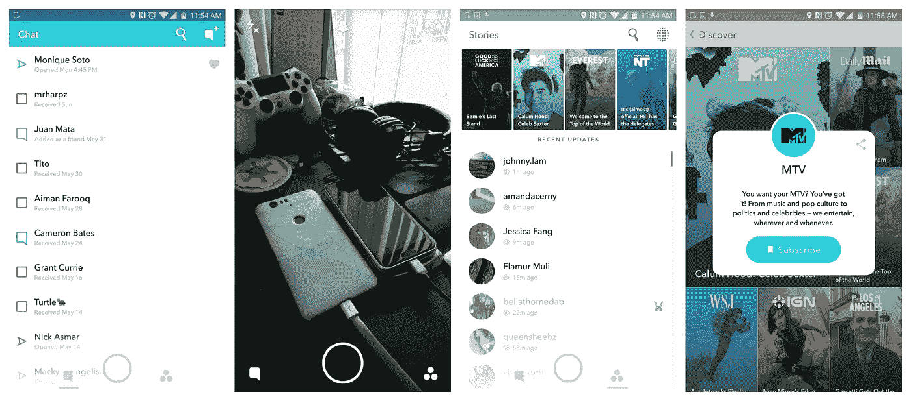

# 如果你是为年轻人创业，不要关注产品

> 原文：<https://medium.com/hackernoon/if-you-are-making-a-startup-for-young-people-dont-pay-attention-to-the-product-fbeebb9059ce>

## Snapchat 赢得我们所有千禧一代的特殊方式

Snapchat 可以说是年轻人最常用的应用之一——从青少年到 20 岁出头的人(我知道，我 15 岁)

人们痴迷于这款应用。这是一种事实上的沟通方式，让人们知道正在发生的事情，无论是你刚刚去的音乐会还是你正在大吃大喝的最新电视节目。

**1.58 亿人**每天使用 Snapchat，平均每天打开应用 18 次。

那么，是什么导致了如此巨大的成功呢？

当然我不是专家，只能推测。然而，当我思考这个问题时，我确实注意到了一个关键因素——**应用程序本身可能是最不重要的贡献者。**

我来详细说明一下。

在过去的一年里，我读了几十篇由受人尊敬的作家写的关于在媒介上制作产品的文章，这些作家包括 [Bram Kanstein](https://medium.com/u/a2fc51212652?source=post_page-----fbeebb9059ce--------------------------------) 、 [Ali Mese](https://medium.com/u/d43c46db5b92?source=post_page-----fbeebb9059ce--------------------------------) 、 [Josiah Humphrey](https://medium.com/u/f576c9fe8447?source=post_page-----fbeebb9059ce--------------------------------) 和[Jon westen Berg——↗️增长营销](https://medium.com/u/5ce28105ffbc?source=post_page-----fbeebb9059ce--------------------------------)，我意识到，尽管它打破了所有的规则，但它还是取得了成功。

先说 UI 和 [UX](https://hackernoon.com/tagged/ux) ，

传统观点认为设计要易于使用，所有的用户交互都应该非常明显。但是 Snapchat 显然不是这样。

> 怎么会有人知道**三个圆圈代表故事**，或者**向下滑动会显示快照**，或者**向上滑动会显示你保存的照片**，或者**按住故事图标会自动播放所有故事？**

让我们转到特性。

Snapchat 是第一个提出消失的照片和故事概念的应用程序，但这些功能已经被复制并放置在几乎所有脸书的产品中。

公司似乎被鼓励建立某种病毒循环来获取更多的用户。我想到的第一个例子是 Dropbox，它为每个新邀请提供了额外的空间。

Snapchat 没有内置病毒式用户获取功能。snapchat 应用程序中没有发现用户的部分，如果必须，必须手动搜索。

最后，看看像脸书和优步这样的公司是如何积极尝试并主导市场的。Snapchat 没有做到这些。

因此，如果用户界面令人困惑，UX 需要时间来适应，功能很有趣，但在所有脸书产品中重复，并且不遵循获取新用户的常规策略，它怎么会如此受欢迎？

**我会说除了应用程序本身以外的一切。**

对于使用这款应用的人来说，它会自动给人带来有趣、吸引人的**形象。由于它没有积极推销自己，**它感觉很真实**。与因囤积用户数据而臭名昭著的脸书不同，Snapchat 不会存储或与广告商共享任何数据。**

毫无疑问，脸书可以，而且已经复制了大量 Snapchat 的功能。但这没什么区别。**我认识的人中没有人把 Instagram 当做新的 Snapchat** 。因为 Snapchat 拥有脸书产品所没有的那种乐趣。

> 据我所知，是使用产品的人群和他们使用产品的方式决定了产品的好坏。

如果仅仅是功能的话，脸书现在应该已经轻松赢得了 Snapchat 的用户。

*当然，功能确实很重要，但似乎除非有其他东西支持，否则它们没有多大意义。*

因此，如果你在为年轻人制作一个产品，不要只是让它有用，要让它有趣，要创造一个很酷的社区。

现在，当我写这篇文章的时候，Snapchat 的收益已经发出来了，这不是一个愉快的场景。他们正计划重新设计应用程序以方便使用。但我可以说，如果专门针对年轻人，Snapchat 正在胜出。

它引起了我们的注意，并将继续这样做。

**感谢阅读，**

萨尔瓦什

查看我的其他故事！

 [## 会秒杀 VR 的 AR 的特殊品质

### 让 AR 领先于 VR 的独特秘密优势

hackernoon.com](https://hackernoon.com/the-special-quality-of-ar-that-will-kill-vr-335d1d8a5f9f)  [## 萨尔瓦夫·库尔帕蒂-黑客正午

### 阅读《黑客正午》中萨尔瓦夫·库尔帕蒂的文章。只是另一个 15 岁的孩子。发表在《创业与走向数据…

hackernoon.com](https://hackernoon.com/@sarvasvkulpati)